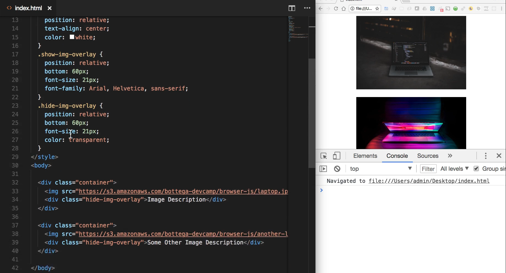
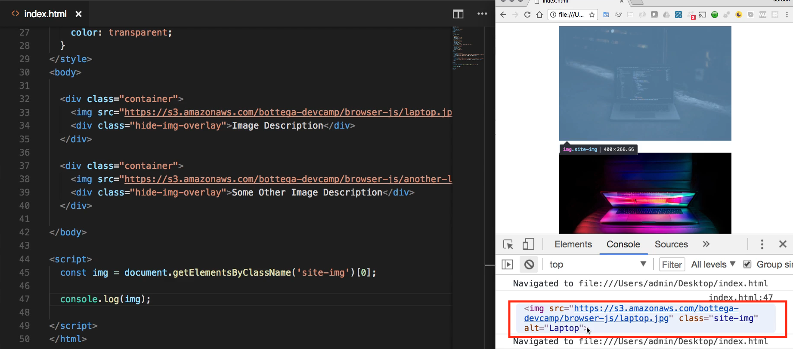

# Module 06 - 115:     DOM Fundamentals

## Inline `onclick` VS `addEventListener`

---

1. Core Concepts

2. Inline `onclick` Approach

3. `addEventListener` Approach

4. Key Differences

5. When to Use Each

****

## 1.     Core Concepts

Event handling in JavaScript can be done through:

  

- **Inline event handlers**: HTML attribute-based (`onclick`, `onmouseover`, etc.)

- **DOM event listeners**: Programmatic attachment (`addEventListener`)


While both methods achieve the same end result, `addEventListener` provides a more robust and maintainable approach to event handling in modern web applications.

 The separation of concerns it enables makes code easier to debug, test, and extend as applications grow in complexity.

****

## 2.    Inline `onclick` Approach

### Implementation

```html
<button onclick="handleClick()">Click Me</button>

<script>
function handleClick() {
  console.log('Button clicked!');
}
</script>
```

****

## 3.     `addEventListener` Approach

### Implementation

```js
<button id="myButton">Click Me</button>

<script>
document.getElementById('myButton').addEventListener('click', function() {

    console.log('Button clicked!');

});
</script>
```

### Characteristics

- Separates behavior from structure

- Allows multiple handlers per event

- More flexible event control

- Better for maintainable code

****

## 4.     Differences

| Feature                | Inline onclick       | addEventListener             |
| ---------------------- | -------------------- | ---------------------------- |
| Separation of concerns | Poor (mixes HTML/JS) | Excellent                    |
| Multiple handlers      | No                   | Yes                          |
| Event phases           | Only bubbling        | Can use capturing/bubbling   |
| Removal                | Difficult            | Easy (`removeEventListener`) |
| Dynamic elements       | Works                | Requires delegation          |
| Best practice          | Generally avoided    | Preferred                    |

## 5.    When to Use Each

### Use Inline onclick When:

- Quickly prototyping

- Working with simple, one-off events

- Needing to pass specific parameters directly

- Working with frameworks that recommend it (like Vue.js)

### Use addEventListener When:

- Building production applications

- Needing multiple event handlers

- Requiring event propagation control

- Maintaining clean separation of concerns

- Working with dynamically created elements
  
  ****

## Best Practices

- **Prefer addEventListener** for most production scenarios

- **Use event delegation** for dynamic content
  
  ```js
  document.body.addEventListener('click', function(e) {
  
      if (e.target.matches('.dynamic-element')) {
  
          // Handle click
  
      }
  });
  ```

- **Clean up listeners** when no longer needed
  
  ```js
  function handleClick() { /* ... */ }
  
  // Add listener
  button.addEventListener('click', handleClick);
  
  // Later remove it
  button.removeEventListener('click', handleClick);
  ```

- **Avoid inline JS** in large applications

- **Consider framework approaches** (React's synthetic events, Angular's event binding)

****

## Performance Considerations

1. **Inline handlers** have slightly faster initial setup

2. **addEventListener** scales better with multiple handlers

3. **Event delegation** reduces memory usage for many elements

4. **Throttle/debounce** expensive handlers
   
   ```js
   window.addEventListener('resize', debounce(handleResize, 200));
   ```

****

## References

* [Event reference | MDN](https://developer.mozilla.org/en-US/docs/Web/Events)

* https://javascript.info/introduction-browser-events

* [Document Object Model Events](https://www.w3.org/TR/DOM-Level-2-Events/events.html)

* [Optimize JavaScript execution &nbsp;|&nbsp; Articles &nbsp;|&nbsp; web.dev](https://web.dev/articles/optimize-javascript-execution)

* [Event Delegation](https://davidwalsh.name/event-delegate)

---

## Video Lesson Speech

What we're going to build is a little program that is going to allow us to press a button and then whenever we do the current date and time stamp is going to appear on the page and it's going to appear right inside of this div with the id of dateComponent. 

So if I come down into the script there are going to be a few ways that we can do this. The first is by creating a function and then calling the function inline and so that is what is called inline javascript and there are certain times where that will work. But I'm going to show you how you can use both the inline version and then we're also going to walk through a little bit more what is considered the best practice approach which is to add the event listener directly. And so what we are going to start with though is the basic one. So here I am going to create a function called renderDate and I'm going to make it an arrow function that takes no arguments. And inside of here, I'm going to take that data element so that dateComponent that we have right up there. I'm going to take that and I'm going to change its values I'm going to set the value of the date inside of there so if you've been following along throughout the last few guides then you probably know the very first thing that we have to do is we have to select it. 

So let's come up top here and I'm going to create a variable and we can just call this dateElement and then we can find it. So I'm gonna say document and in this case, I'm going to getElementById because we do have an ID to work with. So I can say dateComponent and then that is going to give me my date component element. I don't think we have to console log this out this should bring us back what we're looking for. 

And so now I can say dateElement. and now we have access because this is a div we have access to what is called the inner HTML which means that this is going to be the HTML inside of this div element and so I'm going to set this inner HTML equal to the current date. So if I save this and I also need to call it so if I come back up here and create a button we can just call this click for date and then in order to use the inline function I'm going to say onclick. 

```js
renderDate = () => {
  dateElement.innerHTML = Date();
}
```

So this is going to be listening for anything inside. So right here it's going to be listening for an on click event specifically on this button so we're not setting up a click listener. The way that we have before where we add an event listener and it listens for a click we're going to do that next. 

But right now and when it comes to working with inline event listeners I can just say I want to find the on Click event for this button and whenever that occurs I want to call our render date function so if i save this and refreshed the page you can see that I have a button here called Click for date and if I click on it you can see that this works perfectly. 



It tells me that it's Thursday, March 1st and if I click it again it will just keep on refreshing so that is working very nicely. So this is how you can use an onclick event handler but place it in the line. 

Now I'm going to comment this out and now we're going to walk through the way we can do this where we add an event listener and the second way that I'm doing it is really considered more of the industry standard and the best practice and so there will be plenty of times where you need to call an onclick handler and you want to pass it directly in line. But for the most part you're going to be using the second approach and that's the reason why I wanted to show you both. 

I'm gonna comment out our render date function here and now you come down and we already have our date element so I know that I have access to the date and that's how we're going to set it. But now I need to first find the button and that's what the key difference is and that's one of the key elements I want you to take away from this guide is that whenever you're using an onclick handler like we're doing right here.



What this is going to do as it's going to make it possible for us to simply pass in the name of the function and call it. Whenever you're using an event listener you need to first find the button and then you can go and grab the elements that you want to work with. So let's come up to the top just so we keep our variables in the same spot and I'll say const and then dateBtn set this equal to document.getElementById and then we need to pass in an ID and we can call this anything that we want so I'm going to create a button go up top and pass in an ID and I'll just call it the same name it's perfectly fine to do that. 

Now I can create a button here that says click for date. And then pass it in the ID of dateBtn so now we can have access to this button in the same way that we had access to this div and with all of that in place I can come down and the listener is going to be placed on the button. So I have access to that in a variable and now I can add the event listener we're listening for the click and then after that, the second argument is going to be the function.

So I'll pass in event and then we'll use an arrow function and now inside of it we're going to do exactly like what we did above. So I can say a dateElement.inner HTML and then set that equal to date. So if I hit save here and refresh we should have the exact same behavior as before. And if I run it again you can see that that is working perfectly. 


So those are two different ways of performing the same task. In our first approach, we set up an onclick listener directly on the element which means that we didn't have to query that element whatsoever we were simply able to say on click and then call a function. In the second option, we had a couple more steps so we had to first create and add a button here that had an ID. Then we had to go and find it and you don't have to use an ID you could use a class and then you simply would have to iterate over that class. But in this case, we only had a single button so it is fine to use an ID, and then we had to query it, and then we sent the addEventListener so we set our click handler on top of that. 

It requires a few more steps but the main reason why this is considered a little bit more of a best practice is because we're able to contain all of the logic and all of our event listener processes right in one location instead of placing it inline in the HTML and if you ask 10 different javascript developers of this question which is the better way of doing it you'll find plenty of them that still will say that this way is perfectly fine and in certain circumstances, it works perfectly. 

However, usually you'll see that I'm going to use the addEventListener just because I personally prefer to have all of my listening logic and everything all in one spot. I think it's a lot easier to organize and then later on when I come back and look at the code. It is also easier to maintain and then extend.

## Starter Code

```html
<!DOCTYPE html>
<html lang='en'>
<head>
  <meta charset='UTF-8'>
  <title></title>
</head>

<body>
  <div id="dateComponent"></div>
</body>

<script>

</script>
</html>
```

## Code

```html
<!DOCTYPE html>
<html lang='en'>
<head>
  <meta charset='UTF-8'>
  <title></title>
</head>

<body>
  <div id="dateComponent"></div>
  <button id="dateBtn">Click for Date</button>
  <!-- <button onclick="renderDate()">Click for Date</button> -->
</body>

<script>
  const dateElement = document.getElementById('dateComponent');
  const dateBtn = document.getElementById('dateBtn');
  // renderDate = () => {
  //   dateElement.innerHTML = Date();
  // }
  dateBtn.addEventListener('click', (event) => {
    dateElement.innerHTML = Date();
  });
</script>
</html>
```

****

## Coding Exercise

Make a variable named `dom` and select the below div by it's id and insert the phrase "Hello world" into the innerHTML

```html
<div id="getMe"></div>
```

```js
// Write your code here
```
