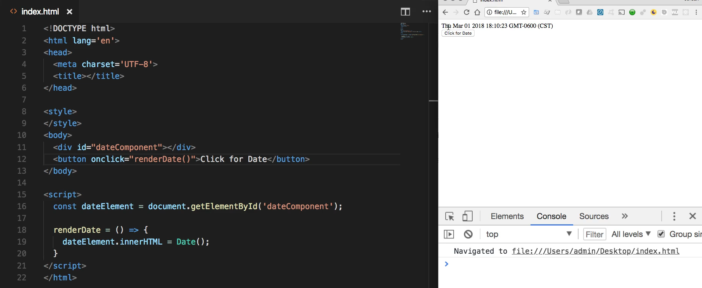
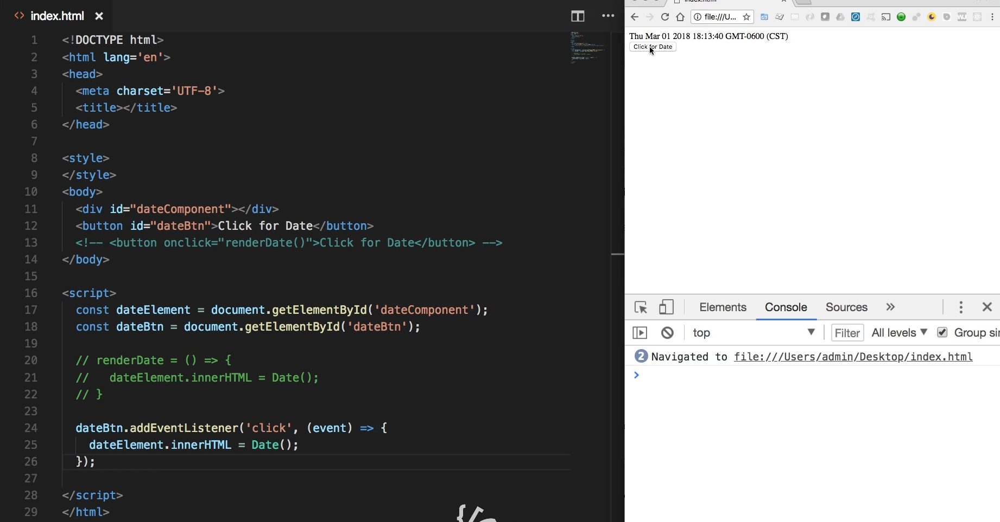

# Module 06 - 116:     DOM Fundamentals

## Editing CSS styles in VanillaJS

****

1. Accessing DOM Elements

2. Modifying Styles

3. Dynamic Style Changes with Events

****

## 1.     Accessing DOM Elements

To modify styles, we first need to select elements:

```js
// By ID (returns single element)
const header = document.getElementById('header');


// By class (returns HTMLCollection)
const buttons = document.getElementsByClassName('btn');


// By tag (returns HTMLCollection)
const images = document.getElementsByTagName('img');


// Modern selectors (returns NodeList)
const cards = document.querySelectorAll('.card');
```

## 2.     Modifying Styles

There are two main approaches to change styles:

### A. Inline Styles (style property)

```js
const element = document.querySelector('.site-img');

// Single property
element.style.backgroundColor = 'blue';

// Multiple properties
Object.assign(element.style, {
    border: '2px solid red',
    borderRadius: '8px',
    padding: '20px'
});

// CamelCase for CSS properties
element.style.fontSize = '24px'; // Not 'font-size' and WITHOUT closing ;
```

### B. CSS Class Manipulation

```js
// Add/remove classes
element.classList.add('active');
element.classList.remove('hidden');
element.classList.toggle('visible');

// Replace classes
element.classList.replace('old-class', 'new-class');
```

****

## 3.    Dynamic Style Changes with Events

Example with mouse events

```js
const laptop = document.querySelector('.site-img');

// Mouse enter event
laptop.addEventListener('mouseenter', (e) => {

    e.target.style.borderRight = '40px solid red';
     e.target.style.transition = 'border-color 0.3s ease';

});


// Mouse leave event
laptop.addEventListener('mouseleave', (e) => {

    e.target.style.borderRight = '40px solid transparent';

});
```

****

## Best Practices

1. **Prefer classes over inline styles** for maintainability

2. **Use CSS transitions** for smooth animations

3. **Cache selectors** when reusing elements

4. **Consider performance** with frequent style changes

5. **Use CSS custom properties** for dynamic values
   
   ```js
   // Set variable
   document.documentElement.style.setProperty('--main-color', '#ff0000');
   
   // Use in CSS: var(--main-color)
   ```

****

## References

* [HTMLElement: style property - Web APIs | MDN](https://developer.mozilla.org/en-US/docs/Web/API/HTMLElement/style)

* [CSSStyleDeclaration - Web APIs | MDN](https://developer.mozilla.org/en-US/docs/Web/API/CSSStyleDeclaration)

* https://javascript.info/styles-and-classes

* [CSS versus JavaScript animations  |  Articles  |  web.dev](https://web.dev/articles/css-vs-javascript)

****

## Video Lesson Speech

And so if you want to come and look right now I have an image here and you can access this in the show notes as well. And this image, because it's part of the DOM, is a traditional element as you can see right here it's just a div. And so if I inspect this and look at the HTML code right here in the browser and I'll stretch this out it's a little bit easier to see. You can see it's just the same code that we hand right there. 



Now because of that, we have access to add other elements so we have the ability to add other kinds of attributes such as styles. So if I come in here and add an inline style so if I say style equals border-right. Because that's what I'm going to show you how to do here in a second and say border-right ten pixels solid and red. If I run that you can see that we now have a border here on the right-hand side that is red. 


And so because we have access to this element to this image element that means that we can apply these styles. And so because of that, that means that we can leverage javascript to do that. So what we're going to do is essentially just automatically do what I showed you manually right here. 

Now let's start actually writing the code very first thing I'm going to do is I'm going to grab this laptop image. Now there are a number of ways to do it. This image has a site image class and so for the sake of this one example I'm going to show you that we can grab this using the querySelector so I'm gonna say const laptop and then set this equal to document dot query selector and then inside of the query selector I'm going to pass in the just the regular class Look-Up so I know that it is named site image and that's going to give me access to it. 

```js
const laptop = document.querySelector('.site-img');
```

Now I can get away with this because there is only one site image on the page. If there were more of them so if I had a set of thumbnails that I wanted to do this to, I would have to use querySelectorAll and then iterate through them like we've done before. But right now I am 100 percent certain there's only one image so we are perfectly fine to do this. Now that we have that set up, let's actually add our event listener so say `laptop.addEventListener` and I want to use the mouse over listener because what I want to happen is whenever I hover over this image I want the border to pop up here on the right-hand side. 

So I'm going to pass in the first argument which is mouseover and then I'm going to pass an e and our function remember any time we use an event listener the second argument is always a function which is the process we want to run. And here we have access to e and then e.target. Remember target is the element that the event is occurring on it's that HTML element so we can test this out if we want to with console logs so say `console.log(e.target);` and hit save.

Now if I come and hit refresh here and hover over you can see that it returns that image so that is giving us exactly what we're looking for. 



But instead of just console logging it, we actually want to add our styles. So I'm gonna say e.target.style and then dot and this part may look a little bit tricky if you've never used this before. We can't use the same exact type of style calls so I can't do something like say border-bottom that wouldn't be syntactically accurate because function calls in JavaScript can't have a dash. And so there is an entire set of mappings between the style names and those properties and what you can do in JavaScript. 

And right it is going to be borderRight and it uses camel case just like this. And so now I can put in my styles so I'll do something pretty big. So 40 pixels solid red and then the semicolon goes at the very end. 

```js
e.target.style.borderRight = '40px solid red';
```

So assuming that I don't have any typos at all, this should work. So hit clear here, come back hit refresh and now when I hover over that you can see our red border appears just like we want it to so that is perfect. 


And as you may have guessed and as if you're following along as you may have already done we can add a pair to this so we can say because we have a mouseover we also want a mouseout and then everything here is going to be the same except I want to change the red to transparent hit save and I'm going explain in one second why I'm doing this.

So if I hit refresh hover over the red borders there hover out and it's gone. And so that is working very well. 


The reason why I am doing this instead of me just clearing out the border's style on the right-hand side it's because any time that I'm adding a border and so it's going to be potentially affecting other elements. So imagine that on the right-hand side here you had a body of text. If I just added this 40 pixels out of the blue then it would look very jagged because I would hover over and all the text would just slide to the right and it would not look very good or professional but by having it be transparent what that means is that it's going to just be completely invisible so those 40 pixels are there. 

And to do this properly and anyone following along who is a big CSS fan knows that technically this is wrong because we would need to add a style up here and it wouldn't be very hard. In fact, I'll just do it right now so I'm following best practices and so you don't come yell at me later on when you found out I did it wrong. And from here I can add a border with 0 pixels on the top 40 pixels on the right 0 pixels down below and 0 pixels to the left and will go the same solid and transparent.

And so if I hit save here and come and hit refresh now if I hover over this is all working properly. 


Now technically nothing looks different but if you had this inside of a blog or some type of web site then you will be very happy that you did it this way because what we're essentially doing is we are reserving the space right here. So all of this space on the right-hand side we're reserving this and then as soon as it gets hovered over all that's happening is it's not popping out even though that's what it looks like to the user it is simply changing the color from transparent to red. And so if you had content over on the right-hand side it wouldn't be pushed and it wouldn't be animated in an ugly jagged way. 

But instead, it would stay exactly the same and you just have that nice hover effect and so that that gets a little bit more into CSS but because this entire guide is focused on how we can add and update CSS I wanted to include that and that's the reason why I even showed you how to start off with this here and to have this border. It's really because you need to be very cognizant whenever you're making style changes with javascript. You really have to understand how the CSS is working because you may run into some very confusing bugs.

I have personally seen a number of websites that had that exact bug right there where I would hover over something on the page and it would make something right next to it move and that just means that it wasn't set up properly and if they would have done something like we did it would have worked perfectly. 

In review in this guide what we walked through is the ability to connect our event listening in JavaScript and we are able to see how we could add and update classes and update CSS classes throughout the web page.

## Starter Code

```html
<!DOCTYPE html>
<html lang='en'>
<head>
  <meta charset='UTF-8'>
  <title></title>

  <style>
    img {
      width: 400px;
    }
  </style>
</head>
<body>
  <div class='container'>
    
  </div>
</body>

<script>

</script>
</html>
```

## Code

```html
<!DOCTYPE html>
<html lang='en'>
<head>
  <meta charset='UTF-8'>
  <title></title>

  <style>
    img {
      width: 400px;
    }
    .site-img {
      border: 0px 40px 0px 0px solid transparent;
    }
  </style>
</head>
<body>
  <div class='container'>
    
  </div>
</body>

<script>
  const laptop = document.querySelector('.site-img');

  laptop.addEventListener('mouseover', (e) => {
    e.target.style.borderRight = '40px solid red';
  });

  laptop.addEventListener('mouseout', (e) => {
    e.target.style.borderRight = '40px solid transparent';
  });
</script>
</html>
```

****

## Coding Exercise

We need to add a margin of `20px` to the div below but some of the code is missing. Fix the JavaScript to properly select the div and add `20px`.

```html
<div id="target">Add 20px to my margin</div>
```

```js
let card = document.getElementById('');
card.style.margin = ""
```
