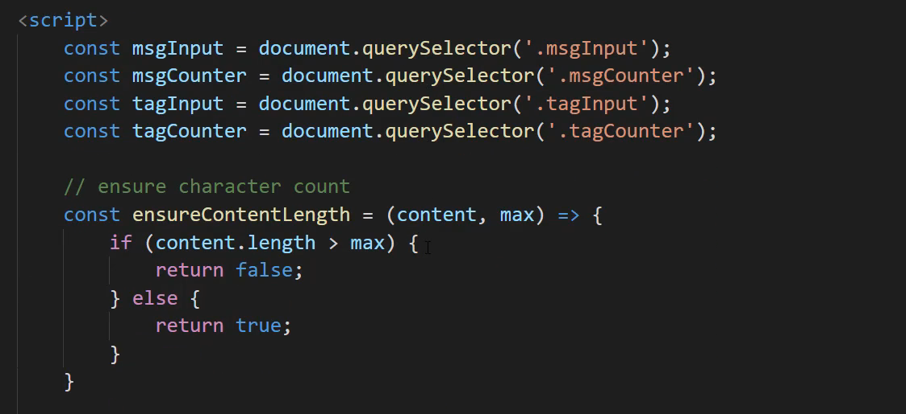
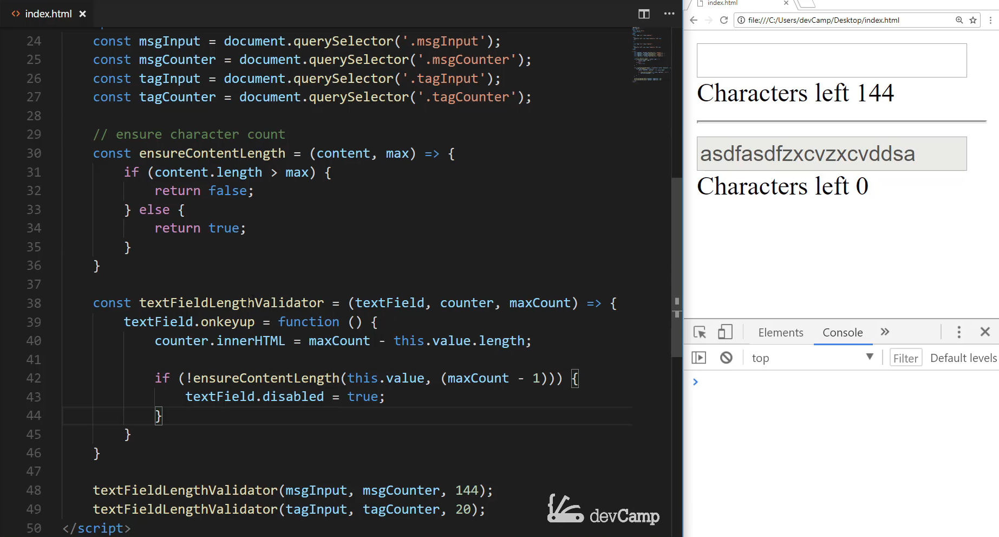

# Module 06 - 120:    JS Applied Exercises

## Building Shared Behaviors using JS Functions

****

1. Core Concepts

2. Objectives

3. Implementation Strategy

4. Key Techniques

5. Advanced Enhancements

****

## 1.     Core Concepts

This exercise demonstrates how to transform a single-use feature into a reusable 
component by encapsulating functionality in a JavaScript function.  

 We'll extend our character counter to work with multiple fields while maintaining clean, DRY (Don't Repeat Yourself) code.

## 2.     Objectives

- Create reusable utility functions

- Understand function parameterization

- Implement shared behavior patterns

- Apply software design principles to frontend code

- Build scalable DOM manipulation logic

****

## 3.     Implementation Strategy

### Original Single-Use Implementation

```js
msgInput.onkeyup = function () {

    console.log(this.value)

    msgCounter.innerHTML = maxValue -this.value.length

    if ( !getCurrentContentLength( this.value, ( maxValue -1) )) {

        msgInput.disabled = true;

    }
}
```

### Reusable Function Implementation

```js
const allInputsFieldLengthValidator = ( textField, counter, maxCount ) => {

    textField.onkeyup = function () {

        console.log(this.value)

        counter.innerHTML = maxCount - this.value.length;

        if ( !getCurrentContentLength ( this.value, (maxCount - 1) )) {

            textField.disabled = true;

        }
    }     

}


allInputsFieldLengthValidator(msgInputOne, msgCounterOne, 144);
allInputsFieldLengthValidator(msgInputTwo, msgCounterTwo, 20)
```

****

## 4.     Key Techniques

### 1. Function Parameterization

- **textField**: The input element to monitor

- **counter**: The element displaying remaining characters

- **maxCount**: Maximum allowed characters for this field

### 2. Event Handler Scope Management

- Using regular function declaration to maintain proper `this` binding

- Closure preserves access to parameters within event handler

### 3. Validation Logic Reuse

- Shared `getCurrentContentLength` function

- Consistent behavior across all instances

### 4. Instance Configuration

- Different max lengths per field (144 vs 20)

- Shared functionality with custom configurations

****

## 5.     Advanced Enhancements

### 1. Configuration Object

```js
const createCharacterCounter = (config) => {

    const { input, counter, max, warningAt } = config;

    input.addEventListener('input', function() {

        const remaining = max - this.value.length;
        counter.textContent = remaining;

        if (remaining <= 0) {
            input.disabled = true;
            counter.classList.add('limit-reached');

        } else if (warningAt && remaining <= warningAt) {

            counter.classList.add('warning');

        } else {

            counter.classList.remove('limit-reached', 'warning');

        }
    });
}
```

### 2. Dynamic Field Registration

```js
function registerCharacterCounters() {

    document.querySelectorAll('[data-character-counter]').forEach(container => {

        const input = container.querySelector('input, textarea');
        const counter = container.querySelector('.counter');
        const max = parseInt(container.dataset.max) || 144;

        textFieldLengthValidator(input, counter, max);
    });
}
```

### 3. Custom Events

```js
// Inside validator function
if ( !getCurrentContentLength( this.value, (maxCount - 1) )) {

    textField.dispatchEvent(new CustomEvent('limitReached', {
        bubbles: true,
        detail: { max: maxCount }
  }));
}
```

****

## Performance Considerations

1. **Event Delegation**: Consider using a single event listener at a higher level

2. **Debouncing**: For high-frequency events like `input`

3. **DOM Reads**: Cache element references when possible

4. **Memory Management**: Clean up event listeners when elements are removed

## Best Practices

1. **Single Responsibility Principle**: Each function should do one thing well

2. **Configurable Behavior**: Allow customization through parameters

3. **Clear Naming**: Use descriptive function and parameter names

4. **Documentation**: Comment public interfaces

5. **Error Handling**: Validate parameters and handle edge cases

## Common Pitfalls

1. **Scope Issues**: Accidental `this` binding problems

2. **Memory Leaks**: Forgotten event listeners

3. **Over-Abstraction**: Creating unnecessary complexity

4. **Parameter Bloat**: Too many configuration options

5. **Naming Collisions**: In global namespace

****

## References

* [GitHub - ryanmcdermott/clean-code-javascript: Clean Code concepts adapted for JavaScript](https://github.com/ryanmcdermott/clean-code-javascript)

* [Creating and triggering events - Event reference | MDN](https://developer.mozilla.org/en-US/docs/Web/Events/Creating_and_triggering_events)

* https://javascript.info/event-delegation

****

Now I want you to imagine what would happen if your boss or your client comes in and they absolutely love what you did right here with the counter and they ask for you to repeat it on the same page. 

So imagine that you are working and this is something that's like a social media application or something like that. And now you are asked to build the same type of functionality into a tag's component. So I'm going to say this is going to be our tag input and then this is going to be a tag counter and now this is going to be a different value. So say that you're only allowed to have 20 characters here but you can have 144 for the top message counter. 

So you may think that the way to do that would be to come down here and to simply copy all of this functionality and then add an event listener to another element to that new tags element and that would work but we can definitely do better. And so the way that we can do better is by wrapping this entire feature up into its own function and then we can call that function from anywhere on this page or even anywhere else in the application or any other applications that we work with. 

So this goes and speaks directly to best practices as we are developing so that we can create scalable modules that can be used and reuse without you having to duplicate code.

So now that we have these HTML elements let me save here and come over to the page. So we have character count and says 144, this one says 20. And let me add an hr just so we have some separation here hit save. And so now we have these two elements on the page. 


So first let's come and let's create some more query selectors and I'm also going to get rid of this max value because we no longer have a global max value we're going to make this part of the function itself part of the function call. So here I'm going to grab message and instead of this one being message counter this one is going to be tag encounter and tag counter on the selector and then let's also add our tag input so tag inputs on both of these. 



OK so now we have selected our items now if I come down here how can we wrap this up in a function and I highly recommend right now for you to pause the video because this is a very important skill to learn and try to build this out yourself and then come back and then watch me go through the solution. So I'm going to walk through right now exactly how I would personally wrap up this entire event listener and all of its conditional logic into its own functions. 

So I would start off by creating a variable's so I'm gonna say const and then say textFieldLengthValidator you can call it whatever you want that's just the name I would go with. And I would require three arguments I'm going to require a TextField, then a counter, and then a max count. And so that is going to be the element that has been queried itself then it's going to be the counter so what we're going to be updating on the page. And then wherever that Max count is and I'm going to make this be an arrow function. 

And so inside of this, I'm going to come and I'm going to grab all of this code and place it inside of our new wrapper function instead of msgInput this is going to be textField everything else here is the same. Instead of message counter this is just going to be counter instead of max this is going to be maxCount, this.value.length will be exactly the same. And then if I come down here this value is going to be the same I just have to change maxCount over here and then instead of msgInput. This is where we are going to say textField and hit save. 


Now instead of having to duplicate all of that code. Now all I have to do is say textFieldLengthValidator pass in the values so I'll pass in my msgInput then my message counter and then whatever the max value I want so for this one I'm guessing 144 and on the tags I'm going to say that will make it 20. So for this one, its tag inputs and then tag it counter, and then the max here is going to be 20. So if I save this let's see if this is now working so hit refresh here on the page. Character count here is working perfectly. Come down to the tags this one's working perfectly as well and if you see when I come down and when I hit 0 then it's going to disable the field just like we're looking for. 



This is such a better implementation because now as you can see we do not simply have a feature. Now we actually have a true program you could wrap this up in its own NPM module and then you could call it from any other program pass in whatever the message input or the text field is where you want to have your countdown updated on the page and what the max value is and all the other users so it could be you in another program or it could be some other developer that's using your code. 

All they're going to have to do is use this one line of code pass in their inputs and they are going to have all of this functionality and so that is really speaking directly to how we want to think about building our programs we want to build our programs with scalability in mind with the ability of knowing that we're not just building a single one-off feature but we're building something that can be used later on. 

I can tell you from experience there have been so many times where there I could have wasted a ton of time having to rebuild something from scratch. But instead, I'll go back and look at different functions and classes and methods that I built in the past for other programs and then I'll just reuse those and it saves me a very significant portion of development time and it allows me to go and work on other features so I highly recommend it. 

If this looked weird to you if you are not used to building your programs like this where you're wrapping your features in your functionality into functions like this I highly recommend for you to explore it because it's going to be something that you're going to want to do in your production applications and it's going to make you a more efficient developer.

## Code

```html
<!DOCTYPE html>
<html lang='en'>
<head>
  <meta charset='UTF-8'>
  <title></title>
</head>
<body>
  <input type="text" class="msgInput">

  <div>
    Characters left <span class="msgCounter"></span>
  </div>

  <hr>

  <input type="text" class="tags" />

  <div>
    Characters left <span class="tagsCounter"></span>
  </div>
</body>

<script>
  const getCurrentContentLength = (content, max) => {
    const maxLength = max;
    if (content.length > maxLength) {
      return false;
    } else {
      return true;
    }
  }
  const msgInput = document.querySelector('.msgInput');
  const msgCounter = document.querySelector('.msgCounter');
  const tagsInput = document.querySelector('.tags');
  const tagsCounter = document.querySelector('.tagsCounter');

  // Nope
  // msgInput.addEventListener('keyup', (e) => {
  //   console.log(e);
  // });

  const textFieldLengthValidator = (textField, counter, maxCount) => {
    textField.onkeyup = function() {
        counter.innerHTML = maxCount - this.value.length;

        if(!getCurrentContentLength(this.value, (maxCount - 1))) {
            textField.disabled = true;
        }
    }
  }

  textFieldLengthValidator(msgInput, msgCounter, 144);
  textFieldLengthValidator(tagsInput, tagsCounter, 42);
</script>
</html>
```
