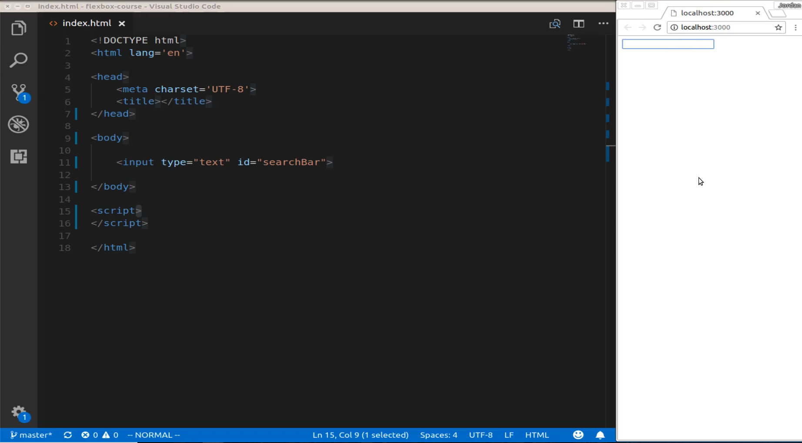
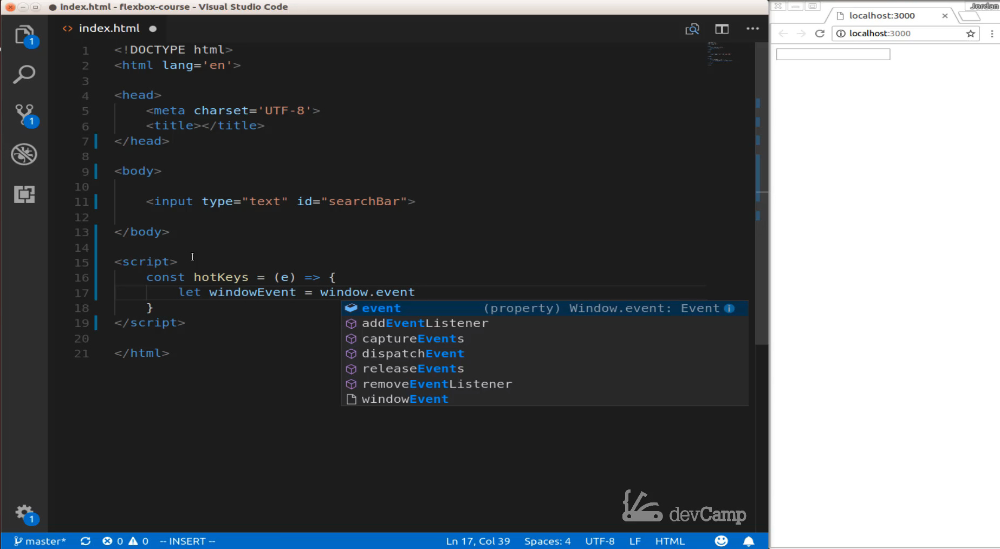
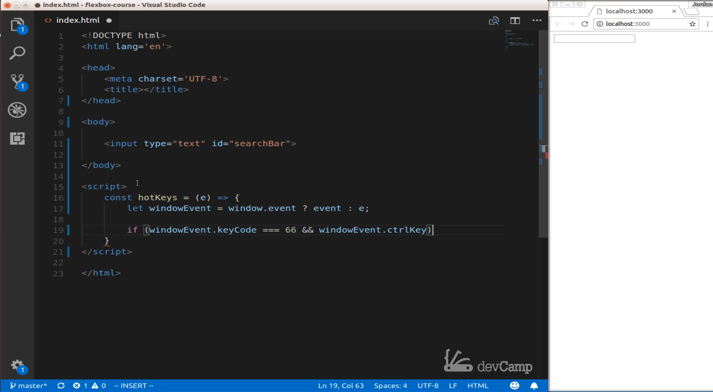
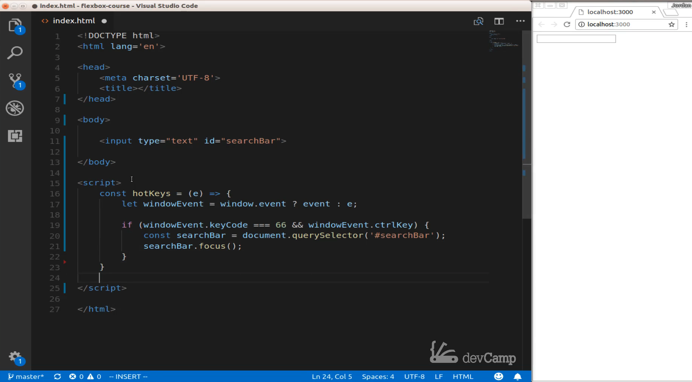
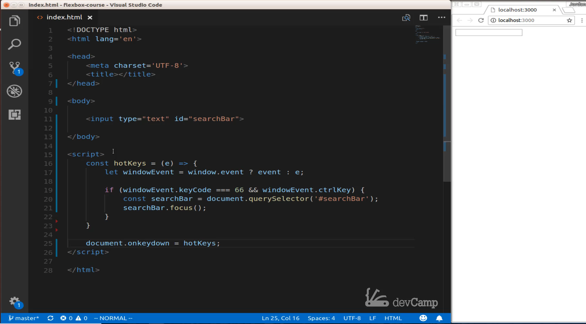

# Module 06 - 121:    JS Applied Exercises

## HotKeys in Vanilla JS

****

1. Core Concepts

2. Objectives

3. Implementation Strategy

4. Key Techniques

5. Advanced Enhancements

****


## 1.     Core Concepts

Hotkeys (keyboard shortcuts) enhance user experience by providing quick access to 
functionality.  

 This guide demonstrates how to implement them using vanilla JavaScript.

### 2.     Objectives:

- Understand keyboard event handling

- Work with key codes and modifier keys

- Manage event listener conflicts

- Implement accessible keyboard shortcuts

- Create reusable hotkey functionality

****

## 3.    Implementation Strategy

### Basic Hotkey Implementation

```js
const hotKeys = (e) => {
  // Handle browser compatibility
  const event = window.event ? window.event : e;

  // Check for Ctrl+B
  if (event.keyCode === 66 && event.ctrlKey) {
    const searchBar = document.querySelector('#searchBar');
    searchBar.focus();
  }
}

// Register the event handler
document.onkeydown = hotKeys;
```

### Modern Event Handling (Recommended)

```js
document.addEventListener('keydown', (e) => {

    // Modern browsers support e.key
    if (e.key === 'b' && e.ctrlKey) {

        e.preventDefault(); // Prevent browser default behavior
        document.querySelector('#searchBar').focus();
    }
});
```

****

## 4.     Key Techniques

### 4.1.     Keyboard Event Properties

| Property   | Description                                                   |
| ---------- | ------------------------------------------------------------- |
| `keyCode`  | Numeric code of pressed key (deprecated but widely supported) |
| `key`      | String representation of key (modern approach)                |
| `ctrlKey`  | Boolean for Ctrl key state                                    |
| `shiftKey` | Boolean for Shift key state                                   |
| `altKey`   | Boolean for Alt key state                                     |
| `metaKey`  | Boolean for Command key (Mac)                                 |

### 4.2.     Event Registration Methods

```js
// Method 1: Direct assignment (overwrites existing)
document.onkeydown = handlerFunction;

// Method 2: addEventListener (recommended)
document.addEventListener('keydown', handlerFunction);

// Method 3: Multiple handlers
const hotkeySystem = {

    handleKeys(e) {
    // Hotkey logic
    },
    init() {
        document.addEventListener('keydown', this.handleKeys.bind(this));
   }
};
```

### 4.3.     Key Code Alternatives

```js
// Modern alternative to keyCode
if (e.key === 'Escape') {

    // Close modal

}

// For letter keys (case-insensitive)
if (e.key.toLowerCase() === 's' && e.ctrlKey) {

    // Save functionality

}
```

****

## 5.     Advanced Enhancements

### 5.1.     Configurable Hotkey System

```js
class HotkeyManager {

    constructor() {
        this.handlers = [];
        document.addEventListener('keydown', this.handleEvent.bind(this));
  }

    register(combination, callback) {

        this.handlers.push({ combination, callback });

    }


    handleEvent(e) {
        this.handlers.forEach(({ combination, callback }) => {

            const keysMatch = combination.keys.toLowerCase() === e.key.toLowerCase();
            const modifiersMatch = 
                (combination.ctrl === undefined || combination.ctrl === e.ctrlKey) &&
                (combination.shift === undefined || combination.shift === e.shiftKey) &&
                (combination.alt === undefined || combination.alt === e.altKey);


            if (keysMatch && modifiersMatch) {

                e.preventDefault();

                callback(e);
            }
        });
    }
}


// Usage
const hotkeys = new HotkeyManager();

hotkeys.register(

    { keys: 'b', ctrl: true }, 
    () => document.querySelector('#searchBar').focus()

);
```

### 5.2.     Accessibility Considerations

```js
// Announce hotkey availability
function initHotkeys() {

    const hotkeyHelp = document.createElement('div');

    hotkeyHelp.className = 'sr-only';
    hotkeyHelp.innerHTML = 'Press Ctrl+B to focus search';
    document.body.prepend(hotkeyHelp);

    // Rest of hotkey initialization
}
```

### 5.3.     Context-Sensitive Hotkeys

```js
let currentContext = 'global';

document.addEventListener('keydown', (e) => {

    if (currentContext === 'search' && e.key === 'Escape') {

        document.querySelector('#searchBar').blur();
        currentContext = 'global';
    }
});


document.querySelector('#searchBar').addEventListener('focus', () => {

    currentContext = 'search';

});
```

****

## Performance Considerations

1. **Debouncing**: For rapid key presses

2. **Event Delegation**: Single listener instead of multiple

3. **Handler Efficiency**: Keep hotkey logic lean

4. **Memory Management**: Clean up unused listeners

## Best Practices

1. **Avoid Overrides**: Use `addEventListener` instead of `onkeydown`

2. **Prevent Defaults**: Stop browser behavior when needed

3. **Document Shortcuts**: Make hotkeys discoverable

4. **Consistency**: Follow platform conventions

5. **Accessibility**: Ensure keyboard-only usability

## Common Pitfalls

1. **Key Code Inconsistency**: Across browsers/OSes

2. **Event Conflicts**: Multiple handlers interfering

3. **Focus Issues**: Trying to focus non-focusable elements

4. **Memory Leaks**: Forgetting to remove listeners

5. **Accessibility Overrides**: Breaking built-in shortcuts

****

## Resources

* [KeyboardEvent - Web APIs | MDN](https://developer.mozilla.org/en-US/docs/Web/API/KeyboardEvent)

## Video Lesson Speech

Right here I have a basic HTML file that I have opened in the browser, and it has an input field. You can imagine that this would be a search field in your application and I want our app to behave more like a need of the application. 

One thing that we can do javascript is we can listen for certain key events and certain key down events on the window itself. This means that whenever your application is being used, then you can listen for the types of key commands that a user's typing out. What I want to do is give the ability for the user to Type 2 keys and then have it focus on the search bar right here. 

We're going to leverage hotkeys and event listeners to make that possible. Let me switch over here into a visual studio code, and I'm going to create a function here. I'm going to call the function hotkeys. I'm going to say const hotkeys and I am going to make an arrow function. It will take an event and were going to pass in an "e" there which will stand for event. Then inside of this arrow function, we're going first to select a window event. I am going to say Lets window of events is just going to be a variable called Window event and then from we're going to listen in on the window and then the event.

 Whenever you're working with the dom, and you're working with a client like a browser you have access in javascript to that window object. We're going to say window event use a tourney operator here and say if the event and if not then e. If that looks a little weird to you don't worry I'm going to walk through exactly what's going on there shortly. It's essentially just checking to see if the window event is what we want it to be. 

If it's what's getting passed and then we want to store it in that window event variable and then I'm going to add a conditional. I will say if window event as is our variable dot keyCode.  This is something that is available, and we have access to the inside of the "Window Event Object" in JavaScript, so the key code is a reserve the word. It is an element inside of that window Event Object, and I am going to say. If windowEvent is equal to 66 and what this means, 66 represents the letter B on the keyboard. In the show notes yet to give you access to a look-up table where you can see all of the different key codes that you have access to. I am going to say If this is equal to sixty-six and the window of event dot control key. This is something that we have access to where it's, and we're not going to use a key code you can type in Control key spelled out like this. 

What this all represents is that we're checking to see if that window or event variable here for one if it's set. That's why we have the conditional here, and we're saying if the key code on the window event is equal to "66" and windowEvent control key which means essentially "did the user type control and the letter B at the same time?" All of this code that we've written so far. That's what it's doing it's just checking for that. 

Now inside of this conditional, that's where we want to activate and focus on our search bar. Here we're going to select the search bar files and say console search bar and the set this equal to document.queryselector, and here we're wanting to grab the id of the search bar. Then below that, we want to focus up, so I'll say searchBar.focus which is a function that we have access to the inside of just regular vanilla javascript.

Then the last thing we have to do is to bind the hotkeys onto the on key down event. Now one thing I will say here is that the practice of doing this so when I'm saying document on key down and set is equal to hotkeys you do have to be cognizant of the fact here that you are now going to be overwriting your documents on key down function. This could have some other kind of unknown effect here. This event listener here, you have to be careful with it because if you have anything else in your program that has hotkeys or is listening down for that on key down event then your hotkeys function is going to override that, just be cognizant of that but it's going to work for this example we have here. 

Now let's switch over into the browser and now if I type control b you can see that our search bar has been activated. So we're able to take that on key down. Then we were able to build out our own key code listener that listens for specific events. Typically it's listening for the control key and the letter B to be pressed at the same time. And then from there it simply focuses the search bar. So that is how you can add hotkeys to your application using JavaScript.

## Starter Code

```html
<!DOCTYPE html>
<html lang='en'>

<head>
  <meta charset='UTF-8'>
  <title></title>
</head>

<body>

  <input type="text" id="searchBar">

</body>

<script>
</script>

</html>
```

## Code

```html
<!DOCTYPE html>
<html lang='en'>

<head>
  <meta charset='UTF-8'>
  <title></title>
</head>

<body>

  <input type="text" id="searchBar" />

</body>

<script>
  const hotKeys = (e) => {
    let windowEvent = window.event ? event : e;
    if (windowEvent.keyCode == 66 && windowEvent.ctrlKey) {
      const searchBar = document.querySelector('#searchBar');
      searchBar.focus();
    }
  }
  document.onkeydown = hotKeys;
</script>

</html>
```

## Resources

- [Key Code Table](https://www.cambiaresearch.com/articles/15/javascript-char-codes-key-codes)

| Key         | Code |     | Key              | Code |     | Key             | Code |
| ----------- | ---- | --- | ---------------- | ---- | --- | --------------- | ---- |
| backspace   | 8    |     | e                | 69   |     | numpad 8        | 104  |
| tab         | 9    |     | f                | 70   |     | numpad 9        | 105  |
| enter       | 13   |     | g                | 71   |     | multiply *      | 106  |
| shift       | 16   |     | h                | 72   |     | add +           | 107  |
| ctrl        | 17   |     | i                | 73   |     | subtract -      | 109  |
| alt         | 18   |     | j                | 74   |     | decimal point . | 110  |
| pause/break | 19   |     | k                | 75   |     | divide /        | 111  |
| caps lock   | 20   |     | l                | 76   |     | f1              | 112  |
| escape      | 27   |     | m                | 77   |     | f2              | 113  |
| page up     | 33   |     | n                | 78   |     | f3              | 114  |
| page down   | 34   |     | o                | 79   |     | f4              | 115  |
| end         | 35   |     | p                | 80   |     | f5              | 116  |
| home        | 36   |     | q                | 81   |     | f6              | 117  |
| left arrow  | 37   |     | r                | 82   |     | f7              | 118  |
| up arrow    | 38   |     | s                | 83   |     | f8              | 119  |
| right arrow | 39   |     | t                | 84   |     | f9              | 120  |
| down arrow  | 40   |     | u                | 85   |     | f10             | 121  |
| insert      | 45   |     | v                | 86   |     | f11             | 122  |
| delete      | 46   |     | w                | 87   |     | f12             | 123  |
| 0           | 48   |     | x                | 88   |     | num lock        | 144  |
| 1           | 49   |     | y                | 89   |     | scroll lock     | 145  |
| 2           | 50   |     | z                | 90   |     | semi-colon ;    | 186  |
| 3           | 51   |     | left window key  | 91   |     | equal sign =    | 187  |
| 4           | 52   |     | right window key | 92   |     | comma ,         | 188  |
| 5           | 53   |     | select key       | 93   |     | dash -          | 189  |
| 6           | 54   |     | numpad 0         | 96   |     | period .        | 190  |
| 7           | 55   |     | numpad 1         | 97   |     | forward slash / | 191  |
| 8           | 56   |     | numpad 2         | 98   |     | grave accent `  | 192  |
| 9           | 57   |     | numpad 3         | 99   |     | open bracket [  | 219  |
| a           | 65   |     | numpad 4         | 100  |     | back slash \    | 220  |
| b           | 66   |     | numpad 5         | 101  |     | close bracket ] | 221  |
| c           | 67   |     | numpad 6         | 102  |     | single quote '  | 222  |
| d           | 68   |     | numpad 7         | 103  |     |                 |      |
