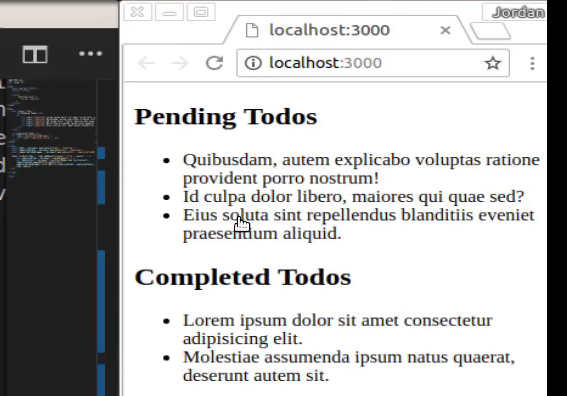
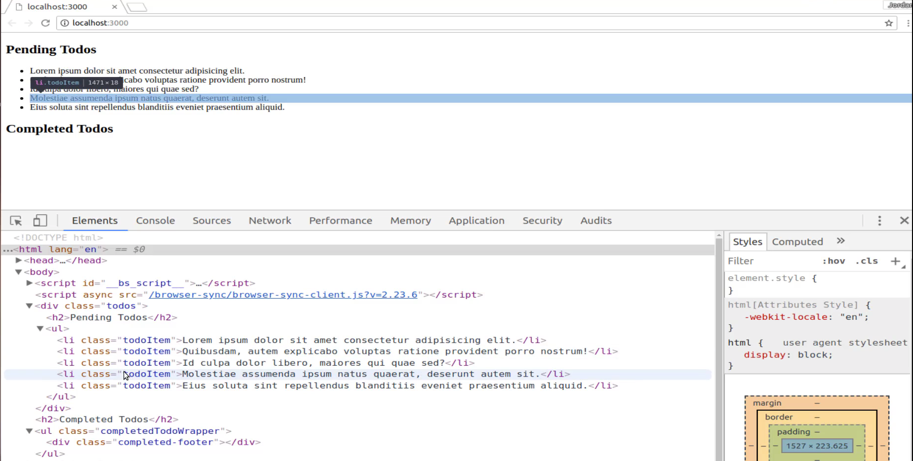
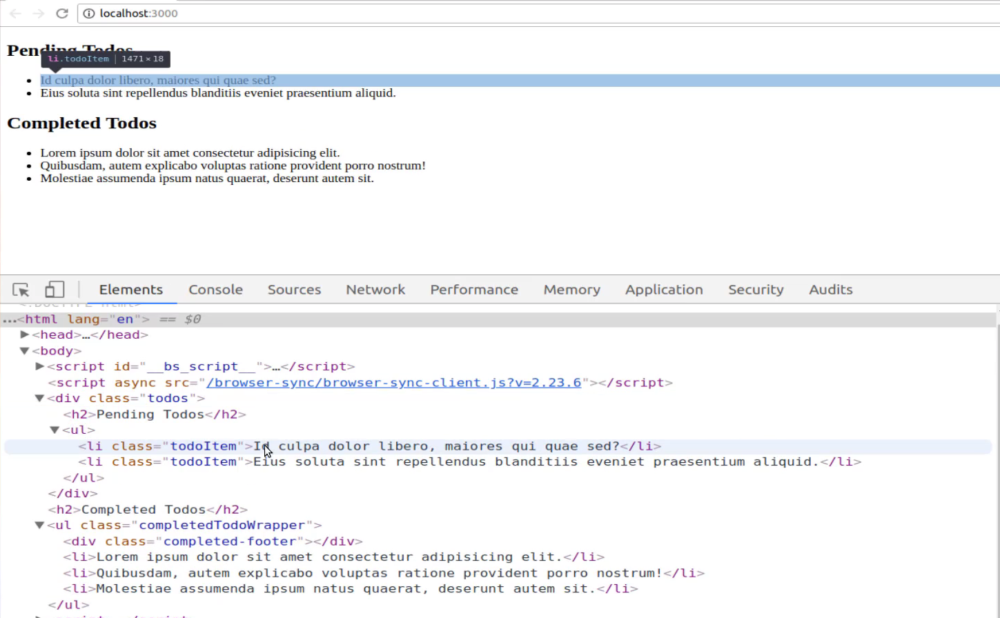

# Module 06 - 126:    JS Applied Exercises

## Guided Solution: Adding / Removing bullets

---

---

## Video Lesson Speech

In this Javascript tutorial, I'm going to walk through how you can build out the functionality where you can use Javascript so that when a user clicks on a list item it is removed from the DOM and it's added into a different list. So the behavior that I'm looking to build out is so that I can click on one of these items. It's going to be completely removed, not hidden, but removed inside of the document object model, and then it's going to be created and added to this other list. 

So here in the HTML side, you see that we have a div class of to-do's that has the heading and a UL tag, and then we have an empty UL. It just has a placeholder here called completed footer and what I want to do is to place in each one of the items dynamically, right inside of this completed to-do wrapper. 


So let's get to that. I am going to inside of this script tag, I'm going to start off by grabbing all of the two items. So I'm going to create a variable here called `const todos` an-d then I'm going to grab those values so I can use query selector all for that and then pass in that class name, ( `const todos = document.querySelectorAll('.todoItem');`). I'm going to also see which to to-do's have been created or which ones have been completed. So I'm going to say `completedTodos = document.querySelector('.completed');`. Then as you can tell right now we do not have (`.completed`) anywhere on the page and that's fine.


That is what we were going to be adding later so I'm going to also make sure that that's a "const" variable and then next I'm going to create or call that completed to-do wrapper. So I'll say, `const completedTodoWrapper = document.querySelector('.completedTodoWrapper');`. OK I believe that I have each one of those items selected. Now what I'm going to do is I'm going to iterate through the to-do's. So I can say `todos.forEach()`, and for each expects a function. So we're going to grab a single to-do and then inside of this we're going to add an event listener to it. So lets say `(todo => todo.addEventListener('click', (event)))` and we're going to listen for a click. Then that click gives us another event.


You can spell event however you want. I can just spell it completely out like that. Now I'm not going to actually use this event. I simply need access to the values inside of that so I'm not going to worry too much about it but I just wanted to place it in there so that you know that you do have access to it if you need it yourself. So now inside of here I'm going to pass in a function and let's create a few variables. Now these are going to continually get reassigned so I'm going to make them. I'm gonna make them be "let" variables. 


So I'm going to say that I want LI tag and I want to store that inside of the completed to-do it. Then I need to have content. So this is going to be `let todoContent = document.createTextNode(todo.textContent);`. So we're going to store it in a variable and now what we can do is check for our completed to-do's and then append that child.


If that naming sounds a little weird then you can feel free to use whatever you personally want. And then from that point I just need to do one other thing and that is to remove the item from the pending to-do list. So here I can say `todo.remove();` call that function and hit save. It looks like I'm may have a little bit of a syntax error. So the reason is because if you notice that when I hit prettify or when I saved it it looks like we're missing a bracket somewhere here. 

Here I have the two iterating over and then that is going to grab the click and the event. I'm not really seeing where the issue is but I'm sure we'll see it here in a second. Oh and it looks like it's working. So I just saved again and updated it. Sometimes prettify the extension in VScode will do that. Okay so now that we have that. Let's see if it's working that should be all of the code that we need to get it working. So if I click on one of these you can see that works perfect so I can click on this third one or the fourth one and that's gotten moved down.




Do it again, again and again and it's working perfectly. So let's take a look at the DOM and see what's going on here. I'll stretch this all the way out and hit refresh and move all of our pending to-do's back where they belong. So now if I go into completed do-to wrapper. Let's take a look at what's happening here. 



So what is going on, is when I click on this first one which you can see is here. If I click on this it is getting deleted from its original spot. So when I use that for each loop, we were iterating over the to-do items right here. So we're iterating over those and then it's getting removed.




This is because on this line right here, on line 43. When I said remove that is removing it from the DOM's spot where it was. 


Then when I create the element I'm not really copying that. That's one thing I want to make clear when I'm walking through this. It's not like JavaScript is taking this DOM node and it's moving it here. Instead what's going on is it's selecting the value. It's extracting that text value here. It's creating a completely new DOM node and as you notice there is no class of to-do item when it gets moved down here and when you click on this nothing happens like we would want it to be. 

So this is working right and part of the reason I want to have to-do item here as well. I didn't add that class and is because I want you to see and not think that we were just moving DOM nodes. The way that JavaScript works with this process is it removes it completely from the DOM and then it's creating a brand new element for us here. And so if I do that on this item and then on this one is replicating that process.


So because we have that event listener, it's listening for the click event on any of these items in pending to-do. Then it is extracting out that content is creating a new node is creating a completely new DOM node. In this case LI node and then it's adding that with the value, and then it removes it from here. 

So as you can see it doesn't really take that much code in order to get this working properly. Really just about 10 lines of code we were able to have an entire system that goes through iterates over all of the elements and then based off an event like a click it will then remove and then dynamically create elements and then place them on other spots on the page. 

So great job if you went through that! You now know how to create and remove elements based on an event, in JavaScript. 

## Code

```html
<!DOCTYPE html>
<html lang='en'>

<head>
  <meta charset='UTF-8'>
  <title></title>

  <style>
    .todoItem:hover {
      cursor: pointer;
    }
  </style>
</head>

<body>
  <div class="todos">
    <h2>Pending Todos</h2>
    <ul>
      <li class="todoItem">Lorem ipsum dolor sit amet, consectetur adipisicing elit. Culpa, animi.</li>
      <li class="todoItem">Numquam dolor quo alias nam vel voluptates magni magnam quisquam.</li>
      <li class="todoItem">Recusandae eaque quisquam facere ab reprehenderit cupiditate magni placeat quis?</li>
      <li class="todoItem">Expedita asperiores nam saepe voluptatem, nostrum aliquid debitis quam recusandae.</li>
      <li class="todoItem">Quaerat velit deserunt reprehenderit, vel placeat impedit accusamus non, deleniti!</li>
    </ul>
  </div>

  <h2>Completed Todos</h2>
  <ul class="completedTodoWrapper">
    <div class="completed"></div>
  </ul>
</body>

<script>
  const todos = document.querySelectorAll('.todoItem');
  const completedTodos = document.querySelector('.completed');
  const completedTodoWrapper = document.querySelector('.completedTodoWrapper');

  todos.forEach(todo => todo.addEventListener('click', (event) => {
    let completedTodo = document.createElement('li');
    let todoContent = document.createTextNode(todo.textContent);
    completedTodo.appendChild(todoContent);
    completedTodoWrapper.insertBefore(completedTodo, completedTodos);
    todo.remove();
  }))
</script>

</html>
```

****

### Coding Exercise

Inside the div below, insert a `span` tag that has a class name of `content` and says "You got this!".

```html
<div id="wrapper"></div>
```

```js
// Write your code here
```
