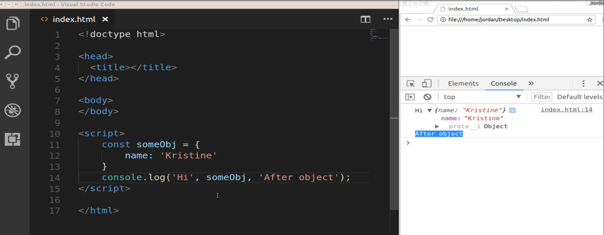
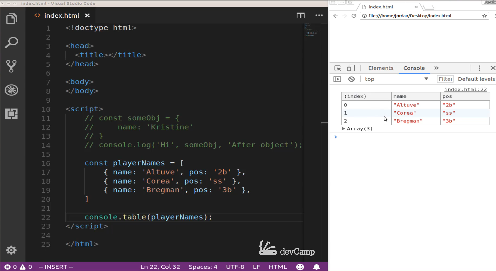
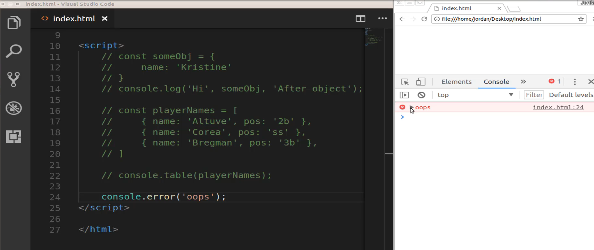
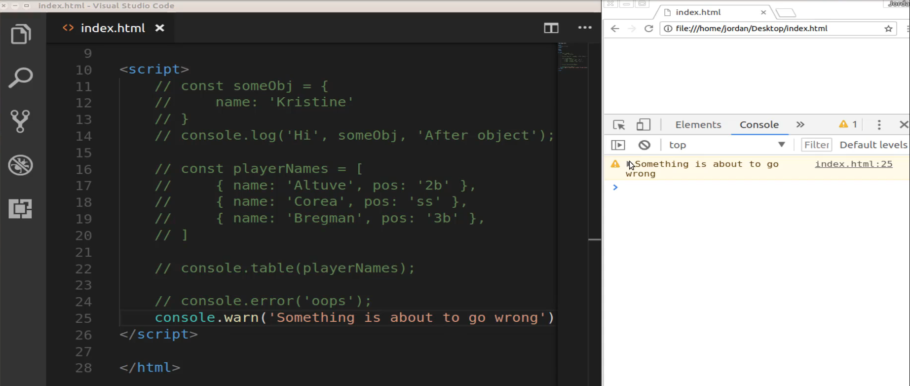
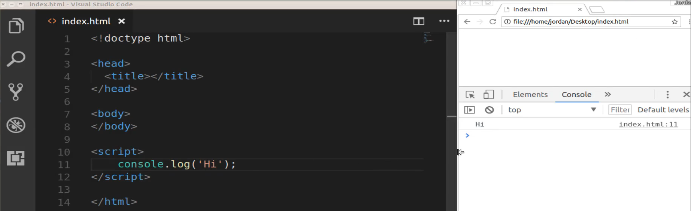
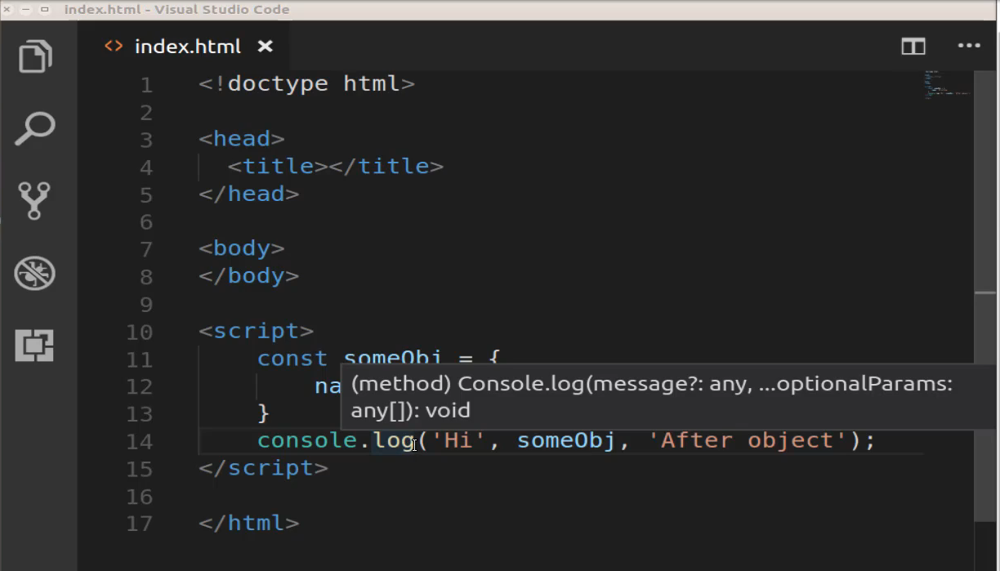

# Module 06 - 128:    Dev Tools

## Various Console Methods

---

1. Beyond `console.log()`

2. Logging Multiple Values

3. Displaying Data as Tables

4. Error and Warning Messages

5. Additional Console Utilities

---

## 1.    Beyond `console.log()`

The `console.log()` method is the most basic tool for debugging in JavaScript, allowing you to print values to the console:

```js
console.log("Hello, World!"); // Prints: Hello, World!
```

While essential, the console offers many more powerful methods for different scenarios.

---

## 2.    Logging Multiple Values

You can pass multiple arguments to `console.log()` to avoid repetitive logging:

```js
const user = { name: "Alice", age: 25 };
console.log("User:", user, "Logged at:", new Date());
```

  
*Example: Logging strings, objects, and dates in a single call.*

---

## 3.    Displaying Data as Tables

For structured data (arrays of objects), use `console.table()` for better readability:

```js
const players = [
 
    { name: "Correa", position: "SS" },    
    { name: "Bregman", position: "3B" }


```

  
*Example: Tabular view of array data.*

---

## 4.    Error and Warning Messages

### `console.error()`

Use for critical issues (e.g., invalid API responses):

```js
console.error("Failed to fetch data: 404 Not Found");
```



### `console.warn()`

Use for deprecations or non-breaking issues:

```js
console.warn("This method will be deprecated in v2.0");
```



---

## Additional Console Utilities

### Other Useful Methods

- **`console.group()` / `console.groupEnd()`**: Nest logs for hierarchy.

- **`console.time()` / `console.timeEnd()`**: Measure execution time.

- **`console.clear()`**: Clear the console.

---

## Tips

- **Combine Methods**: Use `console.group()` with `console.table()` for complex debugging.

- **Colorful Logs**: Use CSS in logs:
  
  ```js
  console.log("%cImportant!", "color: red; font-size: 20px");
  ```

- **Preserve Logs**: Enable "Preserve Log" in DevTools to retain logs during page reloads.

## Common Pitfalls

- Overusing `console.log()` for production code (use proper error handling instead).

- Forgetting to remove debug logs before deployment.

## References

- [console - Web APIs | MDN](https://developer.mozilla.org/en-US/docs/Web/API/console)

- [Console overview &nbsp;|&nbsp; Chrome DevTools &nbsp;|&nbsp; Chrome for Developers](https://developer.chrome.com/docs/devtools/console/)


---

## Video Lesson Speech

When it comes to learning Javascript, one of the very first things that 
you will learn is the console log statement. And that is simply 
console.log() and then you can put anything inside of here that you want
 to log out.

---

Then if you open up a file so right now I have an index.html file I have it open in the browser and if I run this you can see that it displays the hi message that I just had. 



Now that is something you probably learned the very first day that you learned javascript but in this guide, we're going to walk through a number of different ways that you can use the console. So console log is one of the more basic ones but we also have some extensions to this that can be very helpful in a number of ways so that's what we're going to cover in this guide. 

In addition to console log imagine a scenario where you have a number of variables so you might have say const and some object and this object is going to have a name property and it could have a function all kinds of different things like that. For right now it just have a name and in addition to passing just a single item, you can put a full list of anything here that you want. So you could say console log Hi comma and then you could do some object and then you could say after object and now if you save this and come and refresh. 

You can see that this printed out high then it printed out our object and then it printed out After object. 


This is a really helpful way of understanding not just console log but also just JavaScript in general. You can see here console log and especially the log portion here is just a function and as a function, it can take any number of arguments and if you hover over it in Visual Studio code you can even see that where it says that it's a method and it takes in a message with any number of arguments 



so you could pass in strings, you could pass in numbers, or pass in an object like we did right here and it will print those out. That is a very helpful way of being able to consolidate your console log statements. So if you have been getting in the habit of if you have 5 items if you feel like you have to log out each one of those items on its own line you can actually combine those all into a single call which is very helpful. 

Now the next one we're going to walk through is and let me just comment this example out just so you can have it in the show notes. 

So the next one that we're going to work with is incredibly helpful but I don't really see a lot of people using it so I want to show you exactly what you can do. So here if you have an array of objects so say that I have a const playerNames and so this could be something that you're getting back from any API or anything like that. 

I'm going to create an array here and inside of the array I'll have just a number of player names and I could also have a player and then a position and you get the idea here so I'm just going to copy a few of these. Here I have Correa I know it's misspelled but the main point here is what we're actually trying to see so here we'll go Bregman and give him a position as well. 

So that's all we need and so what we can do here with table is it is required that we're working with an array of objects. And so if you are doing that which is very common if you're working with some type of API or any type of collection then you can use this console table method. So here instead of console log, I can say console and as you can see if you're working with a tool like visual studio code you actually have all kinds of different helpers here to help you pick out what you want. So I'm going to say console table and I can take in our player names array. 

So if I hit save now and come over here clear and refresh you can see this very helpful table that gets printed out. 


So if you have been using console log for printing now the output from one of your arrays and it is something like this it has a structure like this then I'm not sure about you but for me, I really like being able to see it in this kind of format it makes it much easier to read. I can see the index value which notice this is something that isn't even shown here so I can see right away with the index as I can see the name attribute and the position attribute. So this is very helpful whenever you're working with more complex data structures and so that is console table. 

I'm going to come up here and I'm going to comment this out for you. And we still have a few other ones to look at and some of these are helpful in the day to day basis. Other are simply helpful if you're doing something such as building out your own library and you want to add helpful messages. 

So for example, if I want to show an error message I can say console.error and then pass in some kind of error and you may wonder when in the world you would do this. Well, this is actually a common thing if you're building out your own code library so if you're building out an NPM library that you want other people to use whenever they make a mistake in their code. 

So if they pass in the wrong data type or something you need to let them know and the better your error messages are the more likely they are going to use your tool which is what you're wanting whenever you're working with open source kind of software so I'm going to clear this and as you can see this doesn't print out a regular console log statement instead it prints out oops which is exactly what we're wanting in this case. 


Because if they make a mistake and you want to make it very clear that a mistake was made you don't simply want to do a normal console log statement instead you want to show that something bad happened and that they need to fix it. So just like we have console log we also have console warned so lets comment this out. And say console.warn and say something is about to go wrong. And so what you typically use console warn for is if you are building out a tool that other people are using and say that they used an older syntax something that you're about to deprecate or something like that. If you come here and hit refresh you can see that it didn't give an error it simply gave a warning. 


And there's a pretty big distinction there and it's a common industry practice that if you're building out tools that others are using and in the future, if you're planning on changing that tool you don't simply change it right away because then you're going to break other people's code but instead you give some period of time where you show a warning. 

All of the popular frameworks such as and not just javascript ones but rails, Django then you get into angular, reactive, view. You will see that they give these types of warning messages whenever you're doing something that may possibly change or if you're doing something dangerous so if you maybe try to override a certain variable or you do something that could potentially have some unknown side effects in the future then it can be helpful to give this warning. 

And what happens here is usually you give a warning when something didn't break. So the only way you'd put a warning there is if it's working but you want to give the developer a heads up that they might want to be careful using that process. 

So I hope that this was a helpful overview of some of the additional ways that you can use the console tool inside of javascript and how you can use that to have some more visibility into your data. In the show notes, I'm going to provide a link to a spot that shows all of the available console methods because there are a few other ones out there, they're ones I don't really use that often and you most likely won't either but it is good to be familiar with them just so you can see them in someone else's code then you'll know exactly what's going on and so I highly recommend for you to go through that guide just so you can get an idea of the full list of those available methods.

## Resources

- [Full list of JavaScript console methods](https://developer.mozilla.org/en-US/docs/Web/API/Console)


