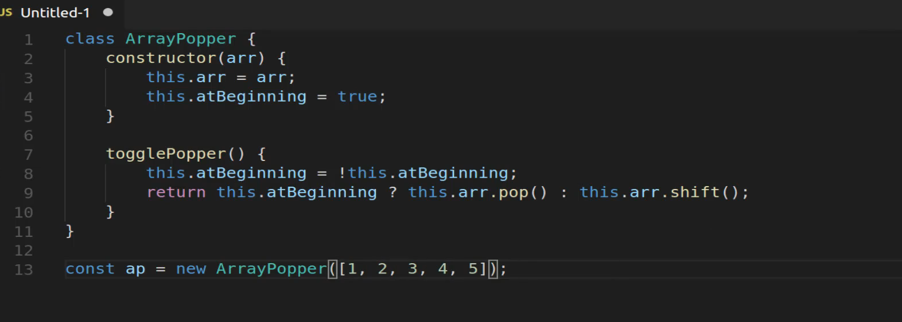
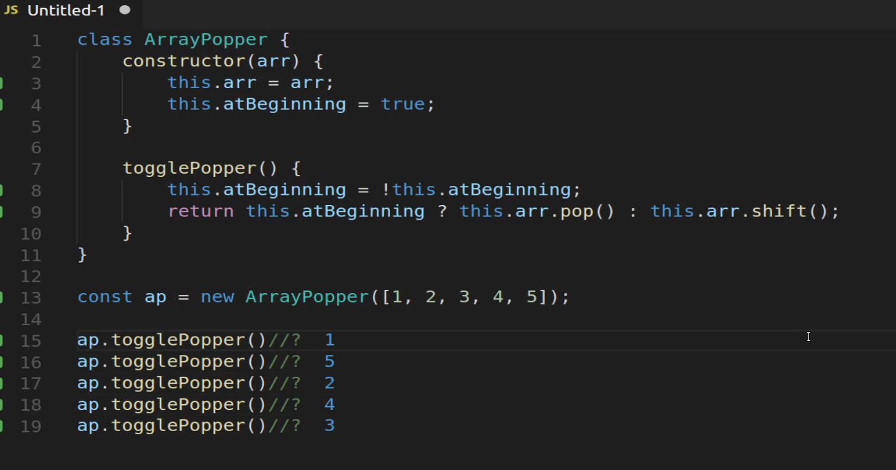
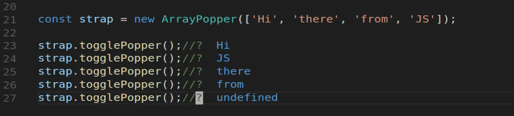
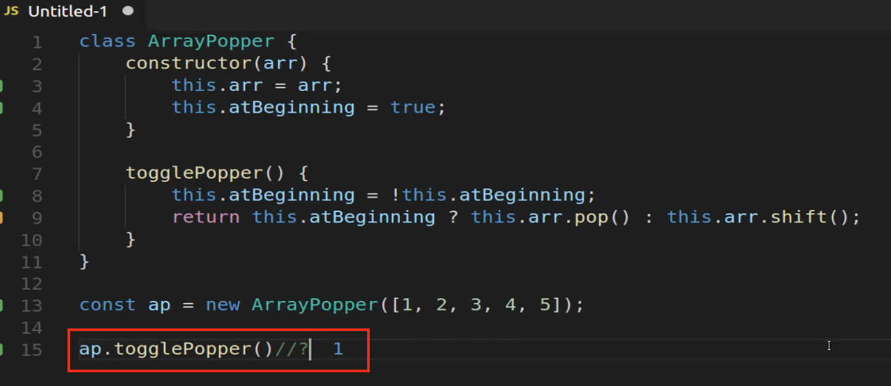
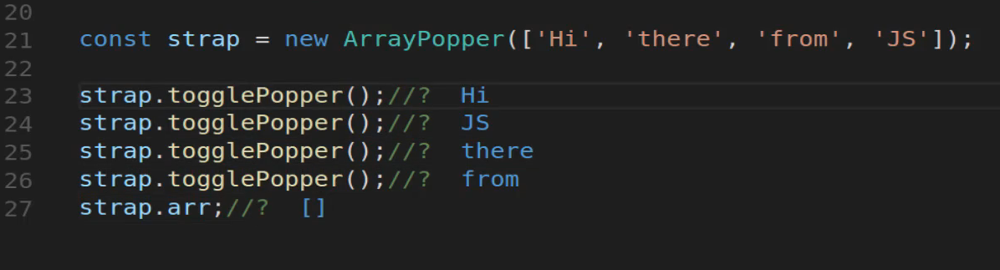
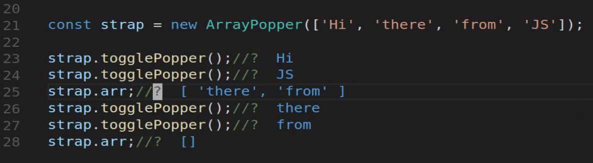

# Module 06 - 130:    Dev Tools

## Create an Array Popper that Alternates Returning from Each Side of an Array

---

# Building an Array Popper that Alternates Sides

1. Understanding the Array Popper Concept

2. Implementing the ArrayPopper Class

3. How the Toggle Mechanism Works

4. Testing with Different Data Types

5. Edge Cases and Considerations

---

## 1.    Understanding the Array Popper Concept

The array popper alternates between removing elements from the **start** (`shift()`) and **end** (`pop()`) of an array. 

For example:

Given `[1, 2, 3, 4, 5]`, the output sequence would be:  
1 → 5 → 2 → 4 → 3

This pattern continues until the array is empty.

---

## 2.    Implementing the ArrayPopper Class

```js
class ArrayPopper {
 
    constructor(arr) {
    this.arr = arr; // Store the input array
    this.atBeginning = true; // Toggle flag (start at beginning)
    }

    togglePopper() {
 
        this.atBeginning = !this.atBeginning; // Flip the toggle
        return this.atBeginning ? this.arr.pop() : this.arr.shift();
    }
}
```

### Key Features:

- **`this.arr`**: Maintains the array state.

- **`this.atBeginning`**: Tracks whether to remove from the start (`shift`) or end (`pop`).

- **Ternary Operator**: Switches between `pop()` and `shift()` based on the toggle.



---

## 3.    How the Toggle Mechanism Works

1. **Initial Call**:
   
   - `atBeginning` is `true` → `shift()` removes `1` (returns `1`).
   
   - Array becomes `[2, 3, 4, 5]`.

2. **Second Call**:
   
   - `atBeginning` flips to `false` → `pop()` removes `5` (returns `5`).
   
   - Array becomes `[2, 3, 4]`.

3. **Third Call**:
   
   - `atBeginning` flips back to `true` → `shift()` removes `2` (returns `2`).
   
   - Array becomes `[3, 4]`.



---

## 4.    Testing with Different Data Types

### Numbers:

```js

const numPopper = new ArrayPopper([1, 2, 3, 4, 5]);
numPopper.togglePopper(); // 1
numPopper.togglePopper(); // 5

```

### Strings:

```js
const strPopper = new ArrayPopper(['Hi', 'there', 'from', 'JS']);


strPopper.togglePopper();     // 'Hi'
strPopper.togglePopper();     // 'JS'

```



---

## 5.    Edge Cases and Considerations

### Empty Arrays

Calling `togglePopper()` on an empty array returns `undefined`.

### Performance

- **Time Complexity**: `O(1)` per operation (`pop()` and `shift()` are constant time).

- **Space Complexity**: `O(n)` (stores the input array).

### Alternative Approach (Without Class)

```js
function arrayPopper(arr) {

    let atBeginning = true;
    
    return () => {
        atBeginning = !atBeginning;
        return atBeginning ? arr.pop() : arr.shift();
    };
}
```


---

## Tips - Best Practices

- **Debugging**: Log the array state after each call to track changes:
  
  ```js
  console.log('Remaining array:', this.arr);
  ```

    

- **Immutable Version**: For functional programming, use array spreading to avoid mutation:
  
  ```js
  return atBeginning ? [...arr].pop() : [...arr].shift();
  ```


## Common Pitfalls

- **State Mismanagement**: Forgetting to toggle `atBeginning` before returning the value.

- **Over-Mutation**: Repeated calls will empty the original array (may not be desired).

---

## References

- [Array.prototype.pop() - JavaScript | MDN](https://developer.mozilla.org/en-US/docs/Web/JavaScript/Reference/Global_Objects/Array/pop)

- [Array.prototype.shift() - JavaScript | MDN](https://developer.mozilla.org/en-US/docs/Web/JavaScript/Reference/Global_Objects/Array/shift)

- [Spread syntax (...) - JavaScript | MDN](https://developer.mozilla.org/en-US/docs/Web/JavaScript/Reference/Operators/Spread_syntax)


---

## Video Lesson Speech

In this coding exercise, we're going to build out what I call an array 
popper. And so what we're going to do is build out a class and then 
build a method or a function that will alternate which side of an array 
that it pops off.

****

So in other words, if I have an array of integers like 1, 2, 3, 4, and 5 if I pass this array to the class and then I call the toggle popper method that we will create. The first time I call it I should get a 1 and then the next time I should get a 5 then a 2 then a 4 and then a 3. 

So if you notice that pattern what we're doing is we're going to call the very first element. Then we're going to go in we're going to pop off the last element. Then we're going to move to what is the new front of the array and pop off the two followed by the four and then lastly the three. So this is going to combine a number of different processes. I will recommend that you utilize a javascript class in order to do this so that you can maintain a form of state because remember a class allows you to have data and functions inside of it. And here we're going to be able to keep track of an array well also being able to implement behavior into it. 

I am going to recommend that right now you pause the video and then you go in you try to do this yourself because that is going to help you to actually understand the process. And regardless if you actually build this out properly or not it will help you to struggle through and to figure exactly what kinds of things are needed in order to build out a system like this and then come and then watch the solution that I personally would implement for this. 

So I'm going to implement the way that I would build this if I were asked to do it. I would create a class right there and I'm going to call mine Arraypopper, you can call yours whatever you would like it to be. And then I'm gonna start off by creating a constructor and the constructor anticipates getting just an array and then inside of the constructor I'm going to set up the instance variables so I'm going to say that this class is going to have an array variable and it's going to store that value that we pass in and then I'm also going to pass in a second value so I'm going to have a default variable here called `this.atBeginning` and I'm going to make this a boolean variable. 

```javascript
class ArrayPopper {
    constructor(arr) {
        this.arr = arr;
        this.atBeginning = true;
    }
}
```

So what this means is that whenever we create a new ArrayPopper I'm going to keep track of it and understand that this is going to start off right at the beginning and when I say at the beginning the way that I'm referencing this is saying that this starts at the beginning of the array because what this is going to allow me to do is to keep track of what position I'm at inside of that array. 

So now I can create a method so I'm going to create a togglePopper method here. It's not gonna take any arguments but inside of it is going to first alternate the atBeginning value so I'll say `this.atBeginning` and then set this equal to the opposite so say this.atBeginning once again. And what this will do is it's going to toggle the values so even though we're starting off with at the beginning being true. Because every time we create a new ArrayPopper it's going to start at the beginning of the array. Anytime we call this method it's going to say whatever the value of atBeginning is, I want you to reverse it and that's what this exclamation mark does right here. 

```javascript
togglePopper() {
    this.atBeginning = !this.atBeginning;
}
```

So inside of togglePopper I'm only going to add one more line so I'm going to use a ternary operator and you can use a traditional type of conditional if you wish but I think this is one case where a ternary operator works quite well. So I'm gonna say `return this.atBeginning?`. So in other words what it's going to do is it's going to say if this value is true then I want you to perform this task so in that case, I'm going to say this dot array or arr because that's what our variable is and then called pop and then add a colon in. So this is going to be what happens if it's not true. I'll say this.arr.shift and then end it. 

```javascript
togglePopper() {
    this.atBeginning = !this.atBeginning;
    return this.atBeginning ? this.arr.pop() : this.arr.shift();
}
```

So if you are not used to working with ternary operators let's walk through exactly what's happening here. So what I'm saying is whenever you call togglePopper I want you to return this.arr.pop which what this means is that it's going to return the very last element from the array and that's what's going to happen if atBeginning is true. And then if that is not true so if atBeginning is false it's going to say that I want to return this.arr.shift and shift if you do not remember is the process and the function that will return the very first element from the array. 

So let's give this a test and see if it's working. I'm gonna create a const variable here and I'm just going to call it ap which is short for ArrayPopper and then say new ArrayPopper. And we're going to pass in an array so let's pass in that sample one we already talked about because I think it's a nice easy base case, so I'm gonna say 1, 2, 3, 4, and 5. 


Now I'm going to save this and actually let me cancel out I don't need to save it because I already have my Quokka on. So you're going to be able to see all of this in real time so I can say ap dot togglePopper and now lets see what this first value is. So that is a one. 



Now let's do this again. Now you can see the next value is 5, trying it again you can see the next one is 2 followed by 4 followed by 3. So this is working perfectly. 


So togglePopper right here, when we initially call it the value is 1 and the reason why it's one is because whenever we create this constructor, whenever we create a new ArrayPopper then atBeginning is going to start off true. We call togglePopper it's going to be false. And what that means is that it's going to hit this.arr.pop ternary operator, it's going to recognize this value right here is false so it's going to skip ahead and it's going to go to this.arr.shift value. 

It's going to say I want you to shift which means I want you to return the very first value. And remember this also updates the array. So what this means is that the array at this stage here will actually be something like this where it's going to be [2, 3, 4, 5]. So it's going to remove that 1 the 1 gets returned right here online 15. And now we're left with this array of 4 items and then it's just going to continue switching back and forth until it's done. 

Now, this is not specific just to numbers. So let's say that we want to do something like this where I say const and I'll say string ap and set this equal to new ArrayPopper and we can pass in a different kind of array. So here we're going to pass an array like Hi there, from and then JS. So we have four elements in this one and so now I'm going to say the string ap which I just realized it is short for strap and then say togglePopper. Now, what exactly is this equal to? 

The very first time we call it it's going to say Hi, the next time we call it it's going to say JS. As you can see that's the very last element in that array. Then it's gonna say there and then from. And let's see what happens if we call this one more time. So we've gone through the entire array. And if we call it one more time it's going to come up with undefined and that's because we have removed all of the elements from the array at this point. 


So if you're curious about the state of the array you can do something like this. I'll get rid of this line right here and let's just call that strap variable. So I'm going to call the strap variable dot and we can call array because it's just an element inside of that class and you can see that we have an empty array at this point. So this is because we have called either shift or pop on each one of the elements. 



Now if we called somewhere in the middle here and wanted to see the state of it here we could call the strap and then the array. And now if we take a look at this state now you can see that the array at this point has there and from. 



So at this stage, we still have a form of this array left and it's not until we've called togglePopper a couple more times that we've actually removed each one of those items.

So I hope that you enjoyed that, in review, everything that you needed in order to build this out was to work with a class build out a constructor for that class so you could maintain some kind of state with these instance variables. And then from that point, you're able to create a method that simply removes the values from the array and it just went back and forth and so this is a really good process for understanding how arrays work, how to work with conditionals, how to use different array functions such as pop and shift, and then how to maintain state by leveraging a class. 

## Resources

- [Exercise Code](https://github.com/bottega-code-school/javascript-code-exercises/blob/master/data-structures/front-and-end-popper.js)
