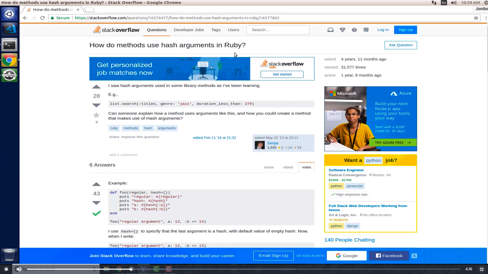
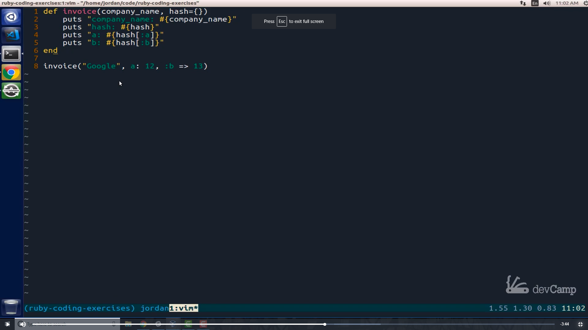
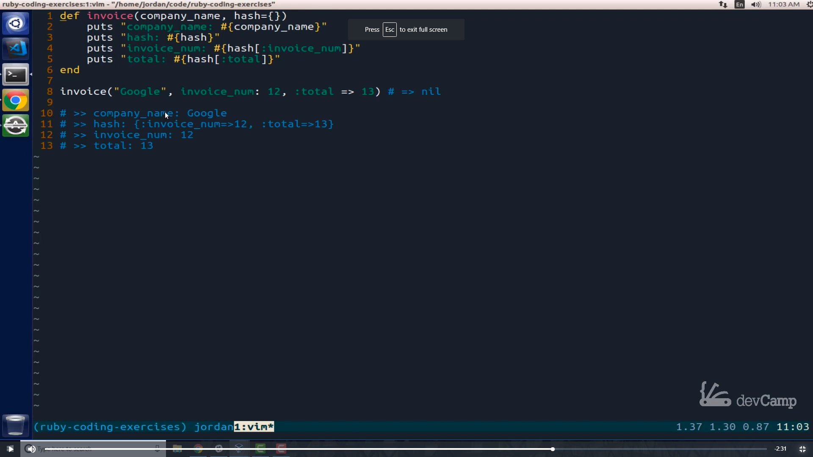
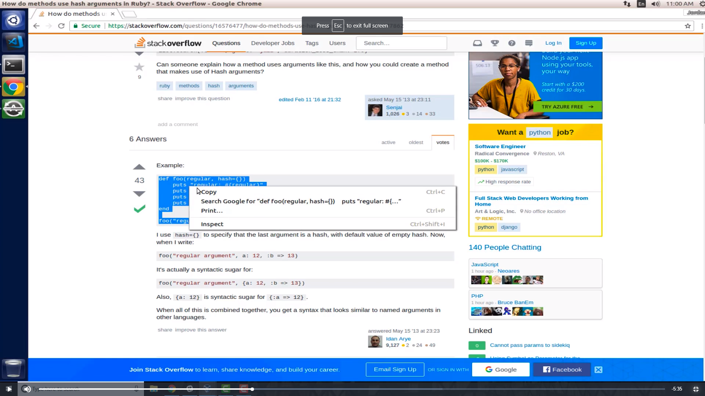
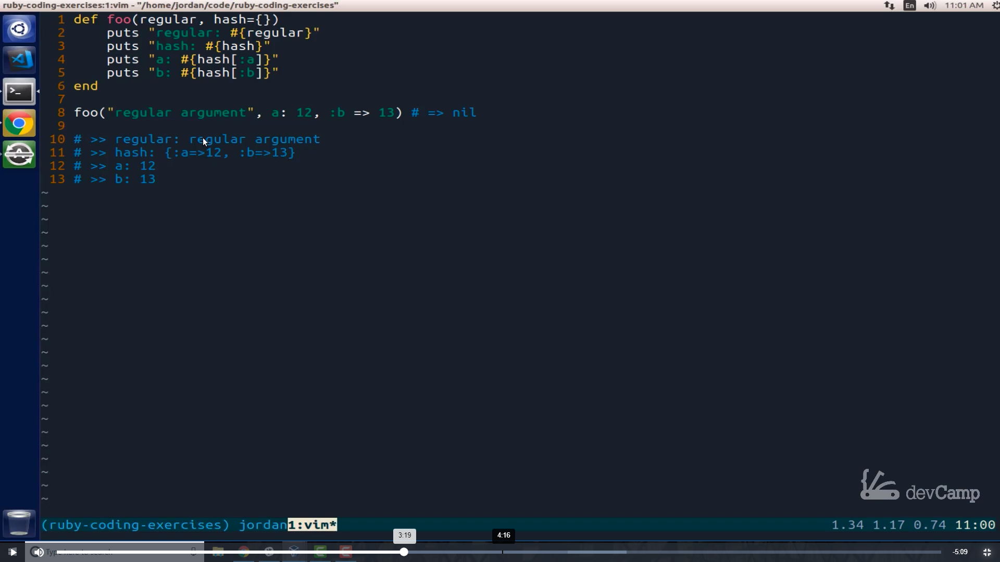
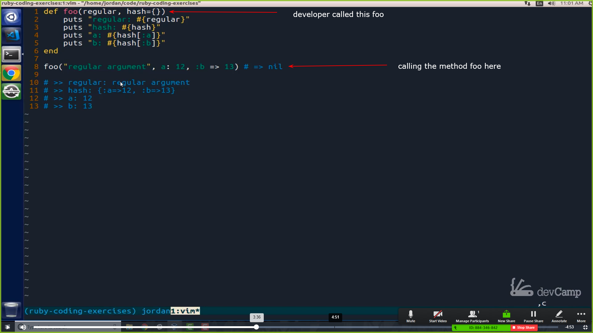
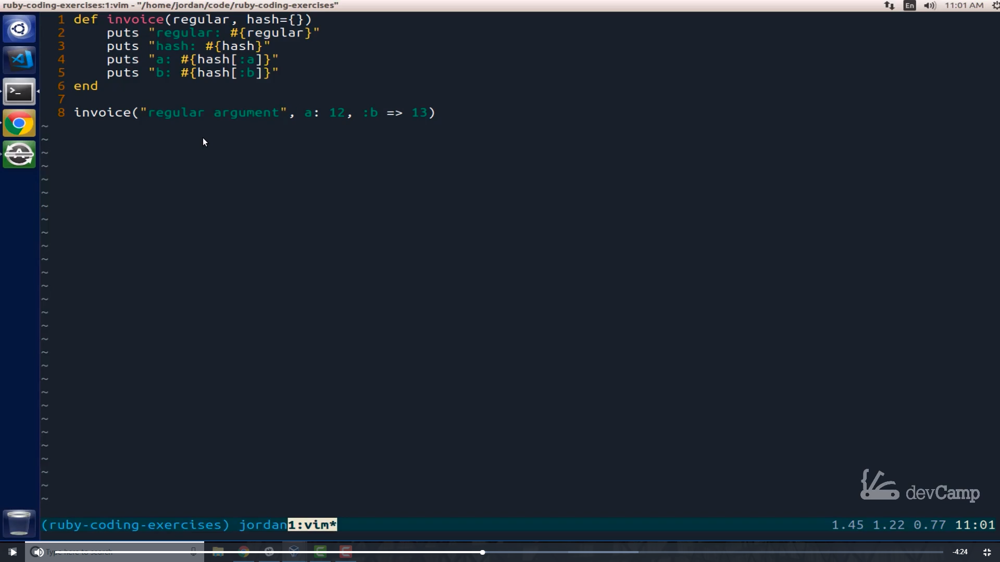
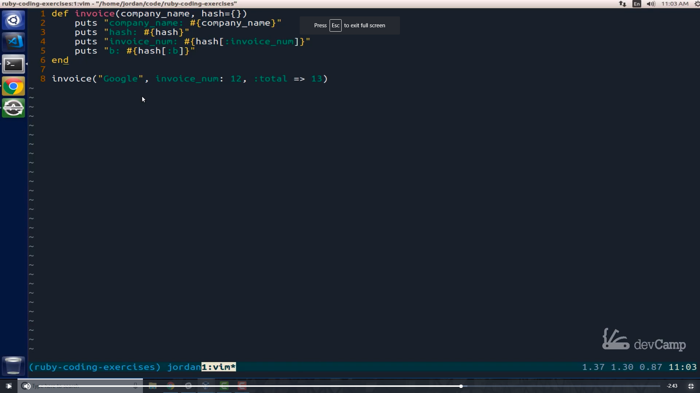

# Module 06 - 131:  Dev Tools

## There is no foo bar

---

# Demystifying "Foo" and "Bar" in Programming

## Table of Contents

1. The Origin of Foo and Bar

2. Why They Cause Confusion

3. Better Naming Practices

4. Real-World Example Transformation

5. Industry Perspectives on Placeholder Names

---

## 1.    The Origin of Foo and Bar

"Foo" and "bar" are **metasyntactic variables** - meaningless placeholders used in documentation and examples. They originated from:

- **1950s-60s**: Appeared in MIT tech reports and early programming manuals.

- **RFC 3092**: Formally defined as "terms used arbitrarily" in network protocols.

Common variants:

- `foo`, `bar`, `baz` (sequential placeholders)

- `qux`, `quux`, `corge` (less common extensions)

---

## 2.    Why They Cause Confusion

### Problems for Learners

1. **Mistaken for Keywords**: New developers may think they're language-specific syntax.

2. **No Context**: Provides zero semantic meaning about the example's purpose.

3. **Cognitive Load**: Forces mental translation to understand the abstract example.

  
*Typical foo/bar usage in documentation that lacks clarity.*

---

## 3.     Better Naming Practices

### Instead of ...

```js
function foo(a, b) {
 
    return a + b;

}
```

### ... Use Descriptive Names

```js
function calculateTotal(price, quantity) {
 
    return price * quantity;

}
```

### Benefits:

- **Immediate Understanding**: Shows the function's purpose.

- **Teaching Tool**: Reinforces good naming conventions.

- **Scalable**: Works for simple snippets or complex tutorials.

  
*Real-world names make examples self-documenting.*

---

## 4.    Real-World Example Transformation

### Original (Ruby with foo/bar)

```js
def foo(regular, **options)
 
    puts "Regular argument: #{regular}"
    puts "Options: #{options}"

end

foo("a", b: 2)
```

### Improved Version

```ruby
def generate_invoice(company_name, **details)
    puts "Client: #{company_name}"
    puts "Invoice Details: #{details}"
end

generate_invoice("Google", invoice_number: 101, total: 299.99)
```


  
*Clearer output with meaningful variable names.*

---

## 5.    Industry Perspectives on Placeholder Names

### Key Opinions

- **DHH (Ruby on Rails Creator)**
  
  > "I hate foo, bar, and baz as prototypical variable names. It's time to change."

- **Teaching Best Practices**
  
  - Use domain-relevant terms (e.g., `user`, `product`, `order`).
  
  - Match the abstraction level to the audience.

### When Abstract Names Are Acceptable

- **Quick Prototyping**: Temporary code that will be discarded.

- **Theoretical Discussions**: When the focus is on structure, not semantics.

---

## Tips - Best Practices

- **For Educators**: Always pair examples with realistic scenarios (e.g., e-commerce, social media).

- **For Developers**: Treat example code with the same naming rigor as production code.

- **For Learners**: When you see `foo/bar`, mentally substitute with context-appropriate names.

---

## References

- [RFC 3092: Etymology of &quot;Foo&quot;](https://www.rfc-editor.org/rfc/rfc3092)

- [Clean Code: A Handbook of Agile Software Craftsmanship[Book]](https://www.oreilly.com/library/view/clean-code-a/9780136083238/)


---

## Video Lesson Speech

If you're a new or aspiring developer you may have come across that 
terms foo and bar whether you're reading a post on Stack Overflow, or 
listening to some type of webinars, or anything like that

****

And if you've never seen those terms before they might be kind of confusing you might think that those terms are reserved words in a specific language or they actually represent something. But what I want to do in this guide is to tell you that there is no such thing as foo and bar.

I want to dispel the myth that you need to use those or even to know really what they represent and instead, I'm going to show you that there are just placeholders and so hopefully they'll help prevent any confusion as you go along in as you see them on different posts that you're not going to think of what those words represent but instead you're going to see that simply use there as placeholders and the way that I'm going to do is I'm going to take some examples that I found on stack overflow and then I'm going to simply change them up. 

And if you're a more advanced developer so if you're going through this and you know that foo and bar don't really mean anything then I still think that this is a good exercise for you to go through because what I'm going to walk through is not just showing that foo and bar don't I'm also going to show how I don't use them at all when I'm teaching the students I've taught over 35000 students over the past five or six years and I never use the terms foo and bar and I don't think that advanced developers or teachers should use them because I've seen through the years they cause a lot of confusion. And so instead I'm going to show you what my approach is for creating placeholder functions. 

"So with all that being said let's jump into some code examples". 
For a code example I found a post here on Stack Overflow where someone asked how do methods use hash arguments in Ruby.

 

Now I'm just using this as an example you could use this with JavaScript, python, pretty much everyone seems to use this foobar kind of syntax for examples and if you scroll down right here to the accepted answer you can see that the answer includes the word foo. And if you look at some other answers then some of them will also use the word bar. And that's where the confusion comes in. For many students and I think for good reason because you see these kind of words so often if no one's told you that they don't actually mean anything that can be pretty confusing. So what I'd like to do is to just dispel the myth right here that this does anything and so the way you do that is I'm just going to copy all of this code right here 

 

and let's open it up ourselves and start building it out. So I now have this code and if I save this and if I run this code then you'll see here at the bottom that it gives the output that it gave in the answer where it just prints out some text where it says regular regular argument gives a hash and then gives us ``a and b`` set of examples.



Now notice that the method that was created and you don't have to know Ruby to know what's going on right here this is just a method and the developer called this ``foo`` and then down here they are calling this ``foo method``

 

so let's just show that foo as an actually mean anything. 
So what I do whenever I'm teaching or where ever I'm showing a student or another dev. An example I never use these kinds of terms but instead I try to pick out something real life that actually has a meaning. So I'll do something like say let's call an ``invoice method`` here. So down below we're not going to have foo. We're just going to say ``invoice``.

 

This could be anything but an invoice is much easier to understand. You could call this anything you want. A lot of times all use a greeting method or anything that makes a little bit more real life sense. And then you also have these other words here you may think that regular is a reserved word but it's not let's just use something that everyone's going to know is not a reserve word. So here I'd say something like. Company name and then down below in the example I would say company name and change it up here as well. Company name and then coming down. I can say this is ``Google``.

  So so far so good. And now if you want to test us out we can run it again.  

So just run this code and you can see everything still works except now we have some output that is a little bit less abstract 

we have something where a student when they're looking at this is probably going to realize that the words like invoice. and company name are just things that we're making up they're not some kind of special coding construct. 

And if you really want to get even further into this whenever I'm using an example I really don't like using terms like ``a and b``. Those seem like those are also a little abstract too. So here I might do something like say ``invoice number`` and then same thing over here. So ``invoice number`` here and then come down and when I'm calling that this is now invoice number and instead of b I might go with something like ``Total``

 

and then I can come up to this example. Switch it out for ``total`` run this code again. And now you can see that we are getting the exact same type of output.


So the same concept that was trying to be explained is still in place. We've created a method we've used the kinds of principles that are looking to show which is to show how to work with a data structure as an argument and then how to call those values. But instead of using terms like Foo or Bar or A and B instead what we've done is we've created more of a real life scenario. And I think that this really helps to clarify that. So if you're a developer a more senior developer and you're teaching your developer you're more junior developers how to learn then this type of approach is going to make a lot more sense to them.  

I've seen this over the years with the students that I've taught is when I have been able to use an example that truly made sense to them something they could relate to. They were able to understand so much better than if I used abstractions. And so this is what I have personally found very helpful to me both when I learn and also when I teach others. I hope you found those examples helpful. Whether you're a new developer and now you realize that foo and bar don't actually mean anything they're just placeholders or if you're a more advanced instructor or a more senior developer then you'll have a little bit different approach when you're trying to explain code. 

And it's not just me who thinks that foo and bar need to die. If you look at some recent Twitter posts and actually the inspiration behind this video I saw where DHH, the creator of the rails framework, who is definitely pretty much as senior of a developer as you can get has shown that he thinks that we need to stop using terms like ``foo`` ``bar`` and ``baz`` and like he says I'm just going to say it. I hate foobar and baz as prototypical variable names and it's time to change and I believe that completely I think that not only should our code be expressive so when we're building a true production application we're very careful with the variable names and the class names and the method names that we pick out when we're using these kinds of prototypical examples to show whether it's for instruction or whether it's simply for example. I think it's just as important to use names that are descriptive of what we're trying to impart.
