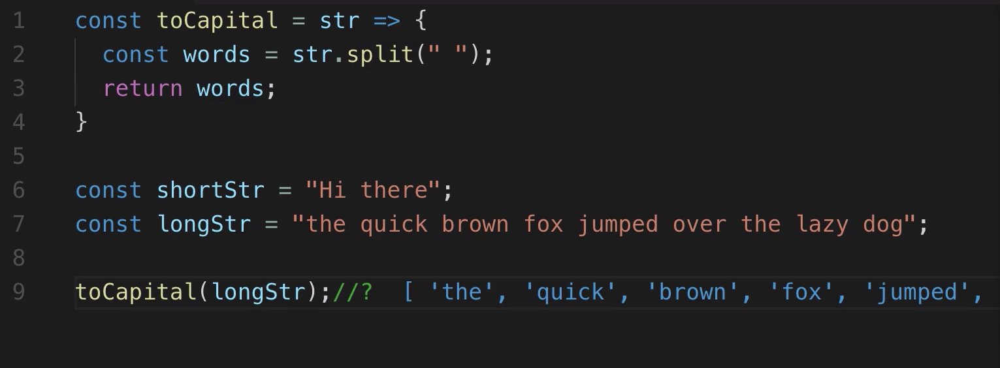
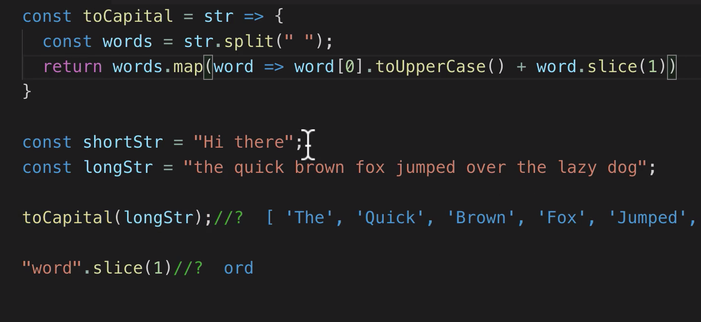

# Module 06 - 133: Dev Tools

## Capitalize function

---

---

## Video Lesson Speech

In this JavaScript coding exercise, we're gonna walk through how we can create a toCapital function.

****

What I'm essentially wanting to do, is if I have string, and I'll create a variable here. Let's just call this, `shortStr`, if it says, Hi there, you can see we have the H capitalized, but the t isn't. 

```javascript
const shortStr = "Hi there";
```

What I wanna do is build out a function that will go through, and it'll capitalize every word that we have here. If I had one called, long string and this said, the quick brown fox jumped over the lazy dog, just like this.

```javascript
const longStr = "the quick brown fox jumped over the lazy dog";
```

Then when we run the function through it, it would go, and it would go capitalize each one of the first words. 

Now, there are a number of ways to do this, you could loop over each one of the elements. You could create some kind of starter string, so you could say something like this, or it's just creating the string. You start with it just being an empty string. 

And then you go through, and you loop through each one of the words, then you pipe it into the strong. That would be a valid way of doing it. I wanna show you a way that I personally think is a little bit cleaner, it's more of a functional approach. Hopefully, you'll enjoy going through this one. 

I'm gonna start by creating a function called, toCapital. This is going to take a string as an argument and it's going to be an arrow function, and inside of here, the very first thing that I wanna do, is I want to break up this string, into a set of words. 

The way we can do that, is with the split function. I can say const words = string.split, and I wanna split it at each space. The way you can do that is by saying split, and then the argument to split is where you want it split at. If we wanted it say, this was a CVS file and you wanted it split at each comma, you'd say split, with a comma inside of it, and then it'd break each one of those into its own element. For right now, I want to split it, so that each word is gonna be converted. 

```javascript
const toCapital = str => {
  const words = str.split(" ");
}
```

Now, let's see what this looks like. If I call toCapital, and then I pass it, let's pass it the longStr, you can see that we're getting undefined, cause I need to return this. Here I'll say, return words, there you go. You can see that we're getting an array of the words, and they're all split up the way we want. 



That's the first step. Really, we only have one more line of code, in order to get this working. Instead of returning words, what I wanna do is, return words and I wanna map over it. I want to iterate over the collection of words we just created, and run a process here. 

So word takes a function, I'm gonna make it an arrow function. I'm gonna say, Map and then each time we iterate over, map is going to loop through the words, it's going to give me access to the words, one at a time. From here, what I wanna do is, I want to change how word is processed, so I wanna grab the first element of the word. 

Now, because of the word, being a string, what I can do is, grab it, just like this, let me show you what this looks like. Well, you can see exactly what's getting returned, it's breaking up each one of those items. Let me show you how this can work down here. If I say short string, and then I grab the very first element from that, you can see it's saying, H. 

The way that you can parse through strings in JavaScript is very similar to how you would parse through an array. When I say shortStr[0], this is grabbing me, the very first element, that is exactly what I'm wanting. I'm gonna say, word[0], and then I want to cast this or change it to upper case. 

What that's gonna do is, that is going to grab the first element, and then it is going to convert it, no matter what it is. If it already is upper case, it's going to keep it that way, if it is lower case, it's gonna make it upper case. 

From there, I simply want to add on to the rest of the words, so for this very first example, for the quick brown fox, for this one, it's going to loop over the word. It's going to give me the, it's going to take the T, it's going to make that upper case. 

What we need is to get access to the H and the E, and then combine them. The way we can do that is with the slice method. I can say, word.slice and pass in a one. Now, if you have never seen this before, let's take a look at what this is going to do. 

If I say, let's just grab some word, so let's just call it word actually, just to make it nice and easy. I say, slice and pass in one, just like I'm doing here, then, oh, it's not gonna let me do it til I comment this out, there we go. It was giving me an error, so it wasn't processing the rest of the file. 

Here, you can see that I am calling the string, word and I'm calling slice on it. And then I pass in one, and you see this returns ord. 


Slice is a really helpful function when you're working with strings and you want to slice them up. Now, by default, if you only pass in one value, what this is gonna do, is it's gonna start at whatever index you pass in. Since I'm passing in one, that means that it's gonna start at index one, which is the O, and then it's just gonna return the rest of the string. 

Now, you could also do something like this, you could say, one and two. You can see this is going to bring me back O by itself. It's bringing me where it starts, index one, and then where I want it to end, which is index two. If I say one and three, that'll bring, or and so on and so forth. 

We simply want it to skip whatever the first letter is, and then return that. The way it's gonna work is, if you look at this long string, it's gonna grab the first element of T. It's gonna make it uppercase, then slice is gonna give me H, and E, then we're just gonna combine those. 

Let's un-comment this out and finish out this function. I'm saying word.slice, let's close it off. As you can see right here, when we're calling this function, this is now working. We can already tell that it's working, because each one of these words, now has a capital for the very first letter. 



We wanna also just return a string, not an array, so from there, just say, join, and then we're going to join it with a space. Right up here, we remove the space when we combined it, here we're adding it, so we're returning a string. Just hit save. 

Now you can see this is working perfectly. Get rid of our little test input here. Now, if I call the short string, then you can see, Hi There is also being Capitalized. In review, that is how you can build a toCapital function in JavaScript. 

## Code

```javascript
const toCapital = str => {
  const words = str.split(" ");
  return words.map(word => word[0].toUpperCase() + word.slice(1)).join(" ");
};

const shortStr = "Hi there";
toCapital(shortStr); // Hi There

const longStr = "the quick brown fox jumped over the lazy dog";
toCapital(longStr); // The Quick Brown Fox Jumped Over The Lazy Dog
```
