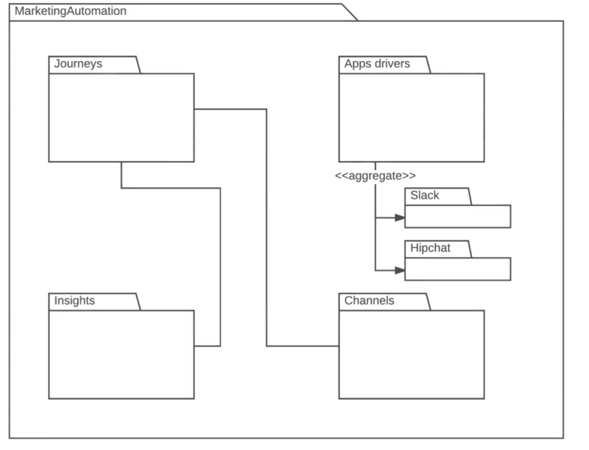

# Module 06 - 151:     UML

## Stages of development where UML is utilized

---

---

## Video Lesson Speech

We just finished going through an overview of UML, however, I don't think UML can really be appreciated until you think about when it can be used. Part of the reason I have created this course is because UML provides a great tool for problem solving. 
---
Whenever you are approached with building an application or adding a new feature to a preexisting application, it might be a little bit of a daunting task that can intimidate developers and lead to procrastination. UML is a nice tool for stepping in and can help you get started because you can develop a plan to visualize your code and be able to model your systems before worrying about the actual code. when we talk about the stages where you can use UML, there is in my mind, a great opportunity before you touch any code to actually start building some diagrams. 

## Activity Diagram

While deciding when to use UML, before you've touched a single line of code, it is helpful to actually start building some diagrams. For example: if you're a little confused on the functionality you're going to build for an application you might want to start with a visual before you write any code, create a controller generator, or anything like that. You may want to start off with building an Activity Diagram which allows you to say what happens at each stage of an application's flow. You can say a user has the ability to perform one task, then they're going to be asked a question, then based off of that input they're going to have other options. It's a way of being able to break down the flow of an application into very small manageable chunks.

## Deployment Diagram

Another tool that I find incredibly helpful before I've built out an application is by implementing a Deployment Diagram. A deployment diagram gives you the ability to take an incredibly high-level look at your code. You can say that I want to have a front end MVC be a Javascript-Angular type of application and I want an API that performs certain tasks and I also want to have a database server along with specific types of elements configured on it. You could build out your entire architecture that way.

I've found that there have been many times when I would start to build the system before building a deployment diagram, and I may make some missteps. I may make a decision that I have to pull back which causes me to waste time if I had spent a little bit more time planning with a deployment diagram it would have helped me in the long run. Those are a couple of diagrams that you can use before you've even started coding a single line of code during development. 

## Class Diagram

During development, you can use Class Diagrams to help you model your entire database to see the relationships between tables and to ensure that you're performing best practices such as database normalization, etc. if you build it prior to building the entire system,  you'll find that you're going to have a much more organized approach to modeling your databases. 

## Use Case Diagram

Another diagram I use in the middle of the development process is a Use Case Diagram. Use Case Diagrams are very high level and allow you to organize each of the processes a specific user of the system is allowed to access. When I'm building an authorization system I can check to see the different features that users or that type of user should have access to. By utilizing a Use Case Diagram, it allows me to take a visual approach. It also is something I can use to show non-technical stakeholders to ensure that I'm building the system in the right way. 

## Sequence Diagram

Lastly, after the entire application has been built, UML can still play a very helpful role. For example: if I have to build in a more advanced feature or refactor something that was built awhile ago, I can use what's called a Sequence Diagram. Sequence Diagrams are able to see all of the messages the system is passing internally to ensure that I'm building my methods in an efficient way and I'm following best practices so I can implement something that'll actually work in the system.

## Package Diagram

In the final example, we will be using a Package Diagram. After the entire system has been built, there are times where I personally go look at the code base and see how I can organize it be more efficient or I want to decrease the coupling between different modules. I may take out one part of the entire application and turn it into an outside code library. To do that, I can use a Package Diagram to see how I'm organizing the entire code base. That also gives me a very high-level overview for every component in the system and allows me to make sure that I'm conforming to best practices. If I bring a new member to the team, I can show them that Package Diagram and they'll be able to see how the entire system is organized. 

Those are just a few of the examples of the different types of diagrams we're going to go through in this course. Technically, each one of these diagrams could be used at each stage of a project's lifecycle. Part of going through this course and part of what my goals are is to impart to you is so that you can learn about each diagram and see when it's right for you to use it in your own applications. 