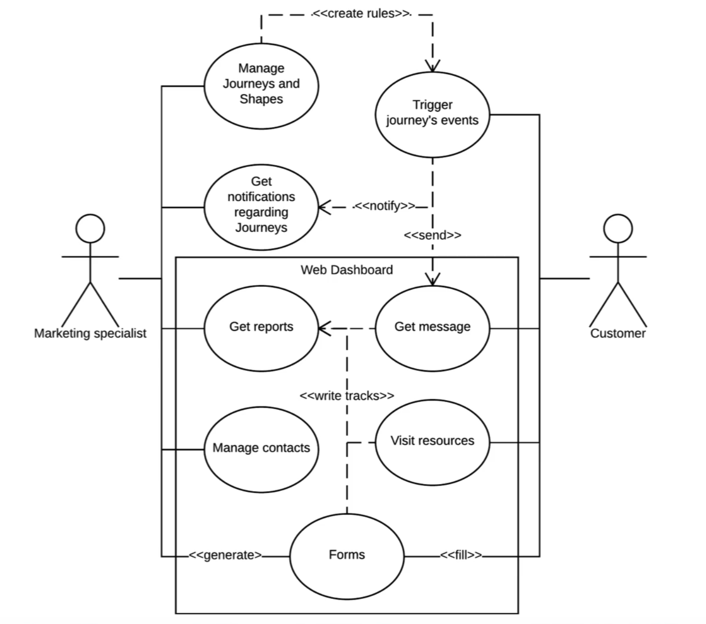
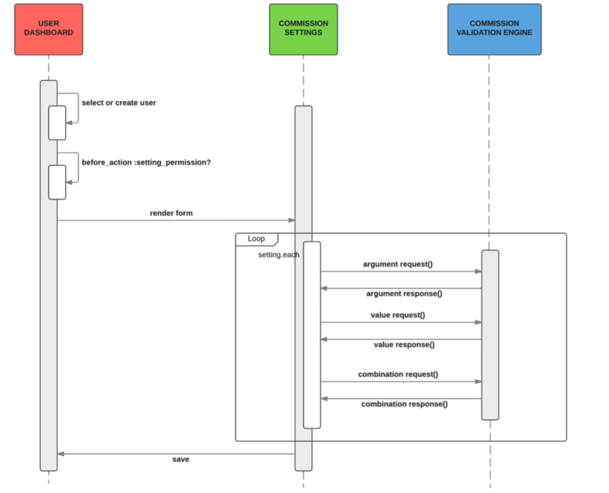

# Module 06 - 151:     UML

## Stages of development where UML is utilized

---

1. UML as a Problem-Solving Tool
   
   1. 2    Benefits of using UML

2. Development LifeCycle vs UML Integration

3. Development Phases vs Diagram types used
   
   1. Pre-Developing 
      
      A.    Activity Diagrams
      
      B.    Deployment Diagrams
   
   2. Active Developing
      
      C.    Class DIagrams
      
      D.    Use Case Diagrams
   
   3. Post-Development / Mainteinance    
      
      E.     Sequence Diagrams
      
      F.     Package Diagrams

4. Strategic Application

5. Tools, Books & Software

----

## 1.    UML as a Problem-Solving Tool

UML (Unified Modeling Language) serves as more than just a documentation tool—it's a powerful problem-solving instrument that can transform how we approach software development.   

Many developers feel intimidated when faced with building new applications or adding complex features to existing systems. UML provides a structured approach to break down these challenges into manageable, visual components.

### 1.2.    Benefits of UML

- **Visual Planning**: Model systems before writing code

- **Risk Reduction**: Identify potential issues early

- **Communication**: Bridge technical and non-technical stakeholders

- **Organization**: Structure complex systems logically

- **Efficiency**: Reduce development time through better planning

- Reduce development time through better planning

- Minimize costly architectural mistakes

- Improve communication with stakeholders

- Maintain code quality through visual organization

- Facilitate team collaboration and onboarding

The key is to view UML not as additional overhead, but as an investment in project success that pays dividends throughout the entire development process.

---

## 2.    Development Lifecycle and UML Integration

UML diagrams can be strategically employed throughout the entire software development lifecycle. Each phase benefits from specific diagram types that address particular challenges and requirements.

---

## 3.    Development Phases Overview

1. **Pre-Development Planning**
2. **Active Development**
3. **Post-Development Maintenance**

---

## Phase 1: Pre-Development Planning

### Purpose

Before writing a single line of code, UML helps establish a clear roadmap and architecture for your application.

### 

### ### Diagrams Used in Pre-Development Phase

## A)    Activity Diagrams

**When to Use**: When you need to understand application flow and user interactions

**Purpose**

- Map out the sequential flow of activities
- Define decision points and alternative paths
- Break down complex processes into manageable steps
- Visualize user journey through the application

**Example Scenario**
Planning a user registration system where you need to understand the flow from initial signup through email verification to account activation.

**Benefits**

- Clarifies functionality before implementation
- Identifies potential bottlenecks or complex decision points
- Provides a reference for developers and stakeholders

## B)    Deployment Diagrams

**When to Use**: When designing system architecture and infrastructure

**Purpose**

- Define high-level system architecture
- Specify technology stack and component relationships
- Plan server configurations and deployment strategies
- Visualize how different system components will communicate

**Example**
Planning a web application with a JavaScript/Angular frontend, REST API backend, and database server with specific configurations.

**Benefits**

- Prevents architectural missteps early in development
- Helps estimate infrastructure costs and requirements
- Facilitates communication with DevOps and system administrators
- Serves as a blueprint for deployment procedures

---

## Phase 2: Active Development

### Purpose

During development, UML helps maintain organization and ensures best practices while building the system.

### ### Diagrams Used in Active Development Phase

## C)    Class Diagrams

**When to Use**: When designing database schemas and object relationships

**Purpose**

- Model database table relationships
- Ensure proper database normalization
- Define object properties and methods
- Visualize inheritance and composition relationships

**Example***
Designing an e-commerce database with User, Product, Order, and Payment entities and their relationships.

**Benefits**

- Promotes organized database design
- Helps identify redundancy and optimization opportunities
- Serves as documentation for database structure
- Facilitates code generation and ORM mapping

## D)    Use Case Diagrams

**When to Use**: When building authorization systems and defining user roles

**Purpose**:

- Define user roles and permissions
- Organize system functionalities by user type
- Document feature access levels
- Plan authorization and authentication requirements

**Example Scenario**:
Defining different access levels for Admin, Manager, and Customer roles in a business application.

**Benefits**:

- Provides clear authorization roadmap
- Facilitates communication with non-technical stakeholders
- Helps prevent security oversights
- Serves as a requirements checklist

---

## Phase 3: Post-Development / Maintenance

### Purpose

After the system is built, UML continues to provide value for maintenance, optimization, and team onboarding.

### Diagrams Used in Post-Development / Mainteinance Phase

## E)    Sequence Diagrams

**When to Use**: When adding advanced features or refactoring existing code

**Purpose**

- Visualize internal system message flow
- Analyze method interactions and dependencies
- Identify optimization opportunities
- Debug complex system behaviors

**Example***
Understanding the message flow in a payment processing system to add new payment methods or troubleshoot transaction failures.

**Benefits**

- Reveals system inefficiencies
- Helps maintain code quality during modifications
- Facilitates debugging of complex interactions
- Documents system behavior for future reference

## F)    Package Diagrams

**When to Use**: When organizing code architecture or planning modularization

**Purpose**

- Visualize code organization and dependencies
- Identify opportunities to reduce coupling
- Plan code library extraction
- Document system structure for new team members

**Example Scenario**
Analyzing a monolithic application to identify components that could be extracted into microservices or separate libraries.

**Benefits**

- Improves code maintainability
- Facilitates team onboarding
- Identifies refactoring opportunities
- Documents architectural decisions

---

## 4.     Strategic Application Guidelines

### Choosing the Right Diagram

While any UML diagram can technically be used at any development stage, strategic selection based on your current needs and phase will maximize effectiveness.

### Decision Matrix

| Development Phase  | Primary Challenge          | Recommended Diagrams       | Secondary Options |
| ------------------ | -------------------------- | -------------------------- | ----------------- |
| Pre-Development    | Understanding requirements | Activity, Use Case         | Sequence, Class   |
| Pre-Development    | Architecture planning      | Deployment, Package        | Component         |
| Active Development | Data modeling              | Class, Entity-Relationship | Package           |
| Active Development | Feature planning           | Use Case, Activity         | Sequence          |
| Post-Development   | Performance optimization   | Sequence, Activity         | Package           |
| Post-Development   | Code organization          | Package, Component         | Class             |

### Best Practices

1. **Start Simple**: Begin with high-level diagrams before diving into details
2. **Iterate Frequently**: Update diagrams as understanding evolves
3. **Collaborate**: Use diagrams as communication tools with team members
4. **Document Decisions**: Include rationale for architectural choices
5. **Keep Current**: Maintain diagrams alongside code changes

---

## Practical Implementation Strategy

### Getting Started Checklist

**Before Any Project**

- [ ] Create an Activity Diagram to understand user flows
- [ ] Design a Deployment Diagram for architecture planning
- [ ] Review and validate with stakeholders

**During Development**

- [ ] Build Class Diagrams for data modeling
- [ ] Create Use Case Diagrams for feature organization
- [ ] Update diagrams as requirements change

**After Initial Development**

- [ ] Document complex interactions with Sequence Diagrams
- [ ] Organize architecture with Package Diagrams
- [ ] Plan future enhancements using appropriate diagram types

---

### Common Pitfalls to Avoid

1. **Over-Documentation**: Don't create diagrams for the sake of completeness
2. **Outdated Diagrams**: Keep diagrams synchronized with code changes
3. **Wrong Tool Selection**: Choose diagrams that address specific current needs
4. **Isolation**: Don't create diagrams in a vacuum—collaborate with your team

---

## 5.References

### Primary Sources

- **Object Management Group (OMG)**. *UML 2.5.1 Specification*.  [About the Unified Modeling Language Specification Version 2.5.1](https://www.omg.org/spec/UML/2.5.1/)
- [**Booch, G., Rumbaugh, J., & Jacobson, I.** (2005). *The Unified Modeling Language User Guide* (2nd ed.). Addison-Wesley Professional.](https://patologia.com.mx/informatica/uug.pdf)

### Software Development Lifecycle Integration

- [**Sommerville, I.** (2016). *Software Engineering* (10th ed.). Pearson. Chapter 5: System modeling.](https://dn790001.ca.archive.org/0/items/bme-vik-konyvek/Software%20Engineering%20-%20Ian%20Sommerville.pdf)
- [**Pressman, R. S., & Maxim, B. R.** (2019). *Software Engineering: A Practitioner's Approach* (9th ed.). McGraw-Hill Education.](https://mlsu.ac.in/econtents/16_EBOOK-7th_ed_software_engineering_a_practitioners_approach_by_roger_s._pressman_.pdf)

### UML Diagram Types - Detailed References

- [**Fowler, M.** (2003). *UML Distilled: A Brief Guide to the Standard Object Modeling Language* (3rd ed.). Addison-Wesley Professional.](https://www.cs.uah.edu/~rcoleman/CS307/Announcements/UML%20Distilled.pdf)
- **Arlow, J., & Neustadt, I.** (2005). *UML 2 and the Unified Process: Practical Object-Oriented Analysis and Design* (2nd ed.). Addison-Wesley Professional.

### Activity Diagrams

- [**Russell, N., ter Hofstede, A. H., & Mulyar, N.** (2006). Workflow ControlFlow Patterns: A Revised View. *BPM Center Report BPM-06-22*.](https://pure.tue.nl/ws/portalfiles/portal/2456784/710796038377571.pdf)
- **Object Management Group**. *UML 2.5.1 - Activity Diagrams*. Section 15.

### Deployment Diagrams

- **Bass, L., Clements, P., & Kazman, R.** (2021). *Software Architecture in Practice* (4th ed.). Addison-Wesley Professional.
- **Richards, M., & Ford, N.** (2020). *Fundamentals of Software Architecture*. O'Reilly Media.

### Class Diagrams

- **Martin, R. C.** (2017). *Clean Architecture: A Craftsman's Guide to Software Structure and Design*. Prentice Hall.
- **Evans, E.** (2003). *Domain-Driven Design: Tackling Complexity in the Heart of Software*. Addison-Wesley Professional.

### Use Case Diagrams

- **Cockburn, A.** (2000). *Writing Effective Use Cases*. Addison-Wesley Professional.
- **Bittner, K., & Spence, I.** (2002). *Use Case Modeling*. Addison-Wesley Professional.

### Sequence Diagrams

- **Gamma, E., Helm, R., Johnson, R., & Vlissides, J.** (1994). *Design Patterns: Elements of Reusable Object-Oriented Software*. Addison-Wesley Professional.
- **Larman, C.** (2004). *Applying UML and Patterns: An Introduction to Object-Oriented Analysis and Design* (3rd ed.). Prentice Hall.

### Package Diagrams

- **Martin, R. C.** (2002). *Agile Software Development: Principles, Patterns, and Practices*. Prentice Hall.
- **Lakos, J.** (2019). *Large-Scale C++ Software Design*. Addison-Wesley Professional.

### Tools and Software

- **Enterprise Architect** - Sparx Systems: [https://sparxsystems.com/](https://sparxsystems.com/)
- **Lucidchart** - UML Diagramming: https://www.lucidchart.com/pages/uml
- **PlantUML** - Open Source UML Tool: [https://plantuml.com/](https://plantuml.com/)
- **Visual Paradigm** - UML Modeling Tool: [https://www.visual-paradigm.com/](https://www.visual-paradigm.com/)

### Online Resources

- **UML Tutorials Point**: [UML Tutorial](https://www.tutorialspoint.com/uml/index.htm)
- **IBM Developer - UML Basics**: [IBM Developer](https://developer.ibm.com/articles/an-introduction-to-uml/)
- **LucidChart - ¿Qué es UML?**: [LucidChart](https://www.lucidchart.com/pages/es/que-es-el-lenguaje-unificado-de-modelado-uml)

### Academic Papers

- [**Störrle, H.** (2005). How are Conceptual Models Used in Industrial Software Development? A Descriptive Survey. *Proceedings of the 17th Workshop on Software Engineering*.](https://www.researchgate.net/publication/317486480_How_are_Conceptual_Models_used_in_Industrial_Software_Development_A_Descriptive_Survey)
- [**Dobing, B., & Parsons, J.** (2006). How UML is used. *Communications of the ACM*, 49(5), 109-113.](https://dl.acm.org/doi/10.1145/1125944.1125949)
- [**Reggio, G., Leotta, M., & Ricca, F.** (2014). Who knows/uses UML? A personal opinion survey. *International Conference on Model Driven Engineering Languages and Systems*.](https://sepl.dibris.unige.it/publications/2014-reggio-MODELS.pdf)

### Standards and Specifications

- **ISO/IEC 19501:2005** - Information technology — Open Distributed Processing — Unified Modeling Language (UML)
- **IEEE 1016-2009** - Standard for Information Technology — Systems Design — Software Design Descriptions 

---

## Video Lesson Speech

We just finished going through an overview of UML, however, I don't think UML can really be appreciated until you think about when it can be used. Part of the reason I have created this course is because UML provides a great tool for problem solving. 

Whenever you are approached with building an application or adding a new feature to a preexisting application, it might be a little bit of a daunting task that can intimidate developers and lead to procrastination. UML is a nice tool for stepping in and can help you get started because you can develop a plan to visualize your code and be able to model your systems before worrying about the actual code. when we talk about the stages where you can use UML, there is in my mind, a great opportunity before you touch any code to actually start building some diagrams. 

## Activity Diagram

While deciding when to use UML, before you've touched a single line of code, it is helpful to actually start building some diagrams. For example: if you're a little confused on the functionality you're going to build for an application you might want to start with a visual before you write any code, create a controller generator, or anything like that. You may want to start off with building an Activity Diagram which allows you to say what happens at each stage of an application's flow. You can say a user has the ability to perform one task, then they're going to be asked a question, then based off of that input they're going to have other options. It's a way of being able to break down the flow of an application into very small manageable chunks.

## Deployment Diagram

Another tool that I find incredibly helpful before I've built out an application is by implementing a Deployment Diagram. A deployment diagram gives you the ability to take an incredibly high-level look at your code. You can say that I want to have a front end MVC be a Javascript-Angular type of application and I want an API that performs certain tasks and I also want to have a database server along with specific types of elements configured on it. You could build out your entire architecture that way.

I've found that there have been many times when I would start to build the system before building a deployment diagram, and I may make some missteps. I may make a decision that I have to pull back which causes me to waste time if I had spent a little bit more time planning with a deployment diagram it would have helped me in the long run. Those are a couple of diagrams that you can use before you've even started coding a single line of code during development. 

## Class Diagram

During development, you can use Class Diagrams to help you model your entire database to see the relationships between tables and to ensure that you're performing best practices such as database normalization, etc. if you build it prior to building the entire system,  you'll find that you're going to have a much more organized approach to modeling your databases. 

## Use Case Diagram

Another diagram I use in the middle of the development process is a Use Case Diagram. Use Case Diagrams are very high level and allow you to organize each of the processes a specific user of the system is allowed to access. When I'm building an authorization system I can check to see the different features that users or that type of user should have access to. By utilizing a Use Case Diagram, it allows me to take a visual approach. It also is something I can use to show non-technical stakeholders to ensure that I'm building the system in the right way. 

## Sequence Diagram

Lastly, after the entire application has been built, UML can still play a very helpful role. For example: if I have to build in a more advanced feature or refactor something that was built awhile ago, I can use what's called a Sequence Diagram. Sequence Diagrams are able to see all of the messages the system is passing internally to ensure that I'm building my methods in an efficient way and I'm following best practices so I can implement something that'll actually work in the system.

## Package Diagram

In the final example, we will be using a Package Diagram. After the entire system has been built, there are times where I personally go look at the code base and see how I can organize it be more efficient or I want to decrease the coupling between different modules. I may take out one part of the entire application and turn it into an outside code library. To do that, I can use a Package Diagram to see how I'm organizing the entire code base. That also gives me a very high-level overview for every component in the system and allows me to make sure that I'm conforming to best practices. If I bring a new member to the team, I can show them that Package Diagram and they'll be able to see how the entire system is organized. 

Those are just a few of the examples of the different types of diagrams we're going to go through in this course. Technically, each one of these diagrams could be used at each stage of a project's lifecycle. Part of going through this course and part of what my goals are is to impart to you is so that you can learn about each diagram and see when it's right for you to use it in your own applications. 
