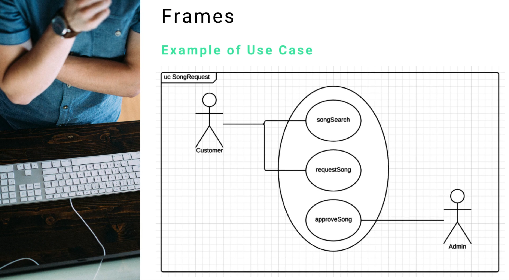

# Module 06 - 153:     UML Components

## FRAMES

---

---

## Video Lesson Speech

Starting off our list of common UML components is the concept of frames.

---

## Frames

We're going to talk about what frames are how they can be implemented and why they're important. First and foremost, frames help you encapsulate your view components. I know those are some large words and they don't mean much until you actually use them and see how they are beneficial as you design your system. Essentially, what frames do is provide context. If you are looking at 10 different models, it can be a bit challenging to see what one model represents compared to another, especially if you're working on a system that has some similar naming conventions. You want to instantly be able to look at a model and know what it's supposed to do.

You want to know a couple of things:

- You want to know exactly what type of system it represents. 
- You want to know what type of diagram it is 

As you start to get into more advanced UML diagrams there are some subtle differences and it's nice when you can have a mapping of how you can understand what one is just by looking at it. How we implement that is by having some headings and then we have descriptive notation on what the model is, we'll go into a direct mapping and a common naming convention that you can use. Once again, the most important reason why you want to implement frames is because when you are working on large systems, you and the developers that are working with the system, want to instantly understand the context and what you're talking about.

The next thing we're to talk about is the diagram mapping for frames. I talked about how you need to have a standardized naming convention, this is the one that is recommended by UML. 

The example we have right here is for a Use Case Diagram.

The important part to look at is in the top left-hand side, you see where it says UC SongRequest and then it's wrapping the entire thing in a box. What this allows me as a developer to see is if someone else's software engineer brings me this diagram I can instantly tell that this is a use case diagram because of the little UC in the top left-hand side. I know that it is a use case diagram for the SongRequest module so I'm going to know exactly where this needs to be implemented in the application. I also will know how to interpret the diagram.

This is how you can build a frame in UML. 
