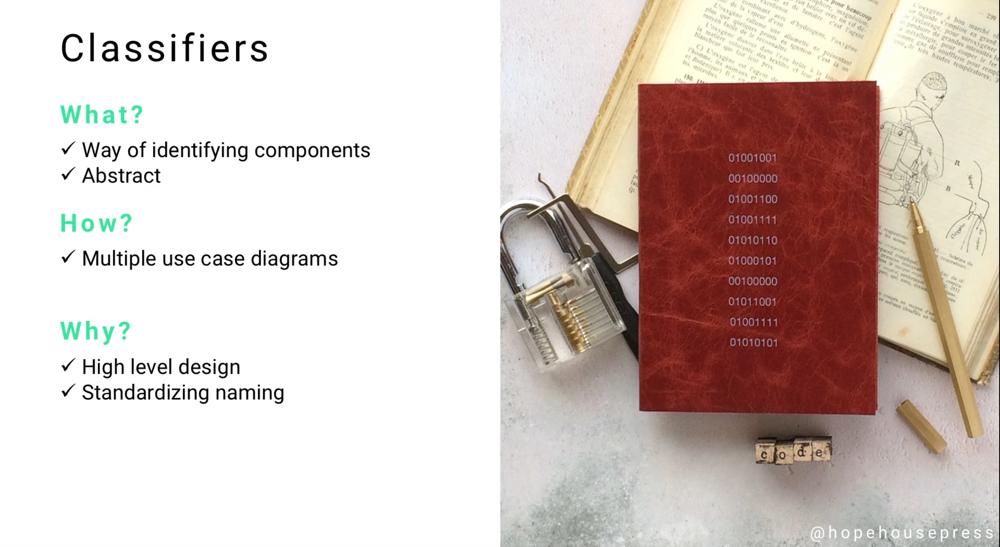
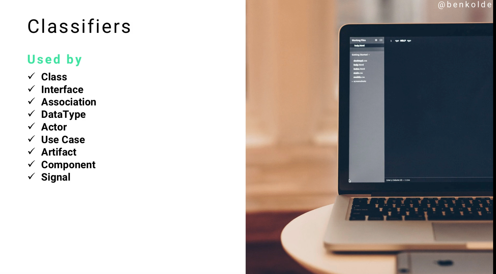
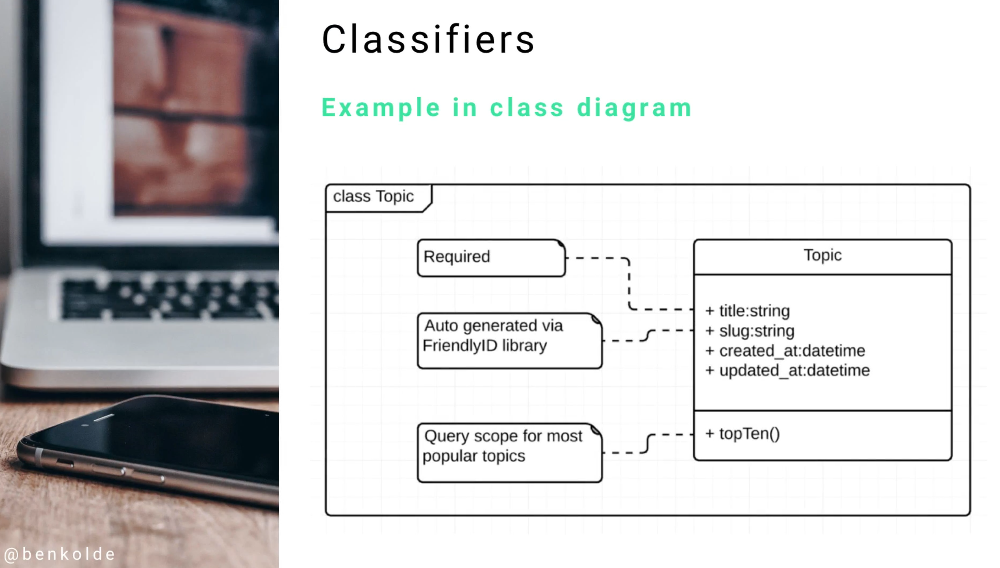

# Module 06 - 154:     UML Components

## CLASSIFIERS

---

---

## Video Lesson Speech

Next on our list of common UML components are classifiers. Classifiers 
allow us to identify components. One thing that can be a little bit 
tricky when you're starting to use UML is that classifiers are 
technically abstract.

---

## Classifiers

What that means is you won't actually implement a classifier directly. It's more of a category of components that you're going to see in practically every kind of diagram. That is the one part that can trip people up, whether it's on an exam or anything like that. 

You are going to be using classifiers throughout the entire course and throughout your entire career as long as you're using UML. Essentially, what they do is exactly what the name implies, they classify items. It's high level, it allows you to have a standardized naming convention as you start building out your designs. Also as developers are reading your designs, they are going to be using classifiers as the application is built.

So what are some different components and diagrams that use classifiers? 

I was not kidding when I said they're used by pretty much every diagram that you're going to implement. It means that this is the high-level name, make sure to not get it confused with a class diagram. I have seen a number of different forum posts and questions from students asking if a class is a class diagram is the same as a classifier and no it is not. A classifier is simply a way of titling your different UML components and diagrams, it allows you to have one kind of standardized approach. 

An example is here in a class diagram where you see "Topic" on the right-hand side. That is the name of the class and that is the classifier for the class diagram. If you are doing this in a Use Case Diagram, like we'll get into later in the course, when you name that Use Case Diagram and you name the different elements that are associated whether it's a topic or a blog post or anything like that, those are the classifiers. 

