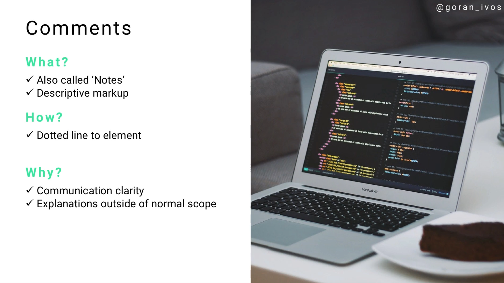
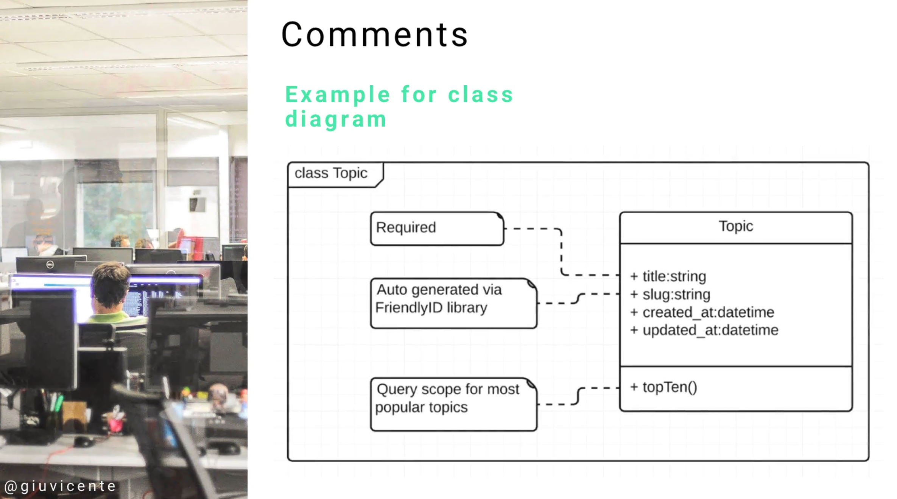

# Module 06 - 155:     UML Components

## COMMENTS and NOTES

---

---

## Video Lesson Speech

Next on our list of common UML components are comments. Comments can 
also be called "Notes" depending on who you're working with on UML, and 
they give you the ability to have descriptive markup.

---

## Comments

We talked about how you can use Stereotypes to help give some clarification. Stereotypes are much more formal, that's what you would use when you want to name an abstract system like a Model Viewer or Controller. 

Comments add clarification for anybody reading the code, however, they are not formalized. You can put pretty much anything you want in a comment. Comments can be incredibly helpful if you're working with developers that are unfamiliar with UML and also when you are building diagrams that may be shown to non-technical stakeholders. 

if I'm building a system for a client that has no idea what UML is, they're not going to be able to read the formal naming conventions or know what a filled-in circular dot means and how it differs from a circle that's not filled in. Comments allow us to add clarification and make it very evident to the goals you're trying to accomplish with a specific diagram. 

Comments are in rectangular boxes and they have a dotted line to the element they describe. 

Here is an example for a class diagram. 

This is a class diagram called Topic, it has three comments or three notes. The first one points to the title attribute in the Topic class and indicates it is a required field. The next one points to the Slug attribute and indicates it is automatically generated. When someone goes to the URL bar, they can type in the topic name and it will navigate to that page. We're letting the developer know that these should be auto-generated via the friendly ID library. The last one points to the top Ten attributes and states the query scope for the most popular topics should be called top Ten.

Typically you want to be very descriptive with your methods and attributes. Hopefully, comments won't be necessary, however, if you feel a little clarification is needed then feel free to use notes and comments in order to accomplish that goal. 
