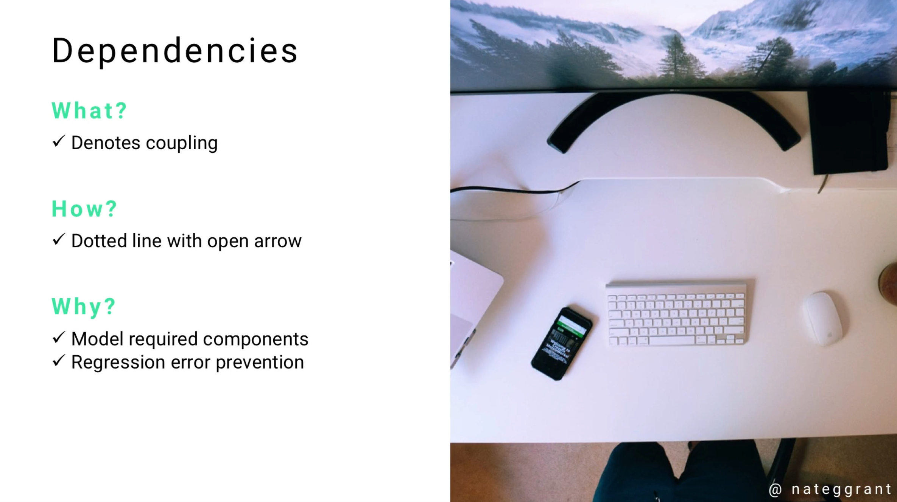
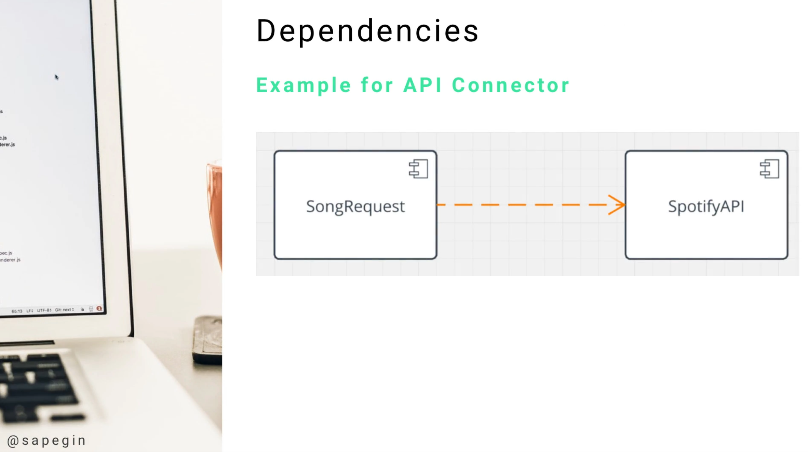

# Module 06 - 156:     UML Components

## DEPENDENCIES

---

---

## Video Lesson Speech

Moving our way down the line of coming UML, the next component is the 
Dependency. A high level explanation of a dependency is that they denote
 coupling. Coupling gives us the ability to see how badly one component 
needs another component.

---

## Dependencies

That is really the most straightforward explanation on being able to understand how a coupling work, that in turn describes how dependencies work. 

From a practical perspective, it's simply a dotted line with an open arrow from one element to another. Why is it important? Well we need to know which components need other components. If we do not know how this works, whoever is building the system is not going to be able to know how important one element is to another. 

There is another important purpose. If I'm new to a project that has been around for several years, usually that project has thousands if not tens of thousands of lines of code. It's very difficult to know if one part of the website or the application needs some other part. What could potentially happen is I may not understand that one part of the application has that dependency. I may rip it out when I'm building a new feature or I'm customizing, then the entire system could break. 

The dependency gives us the ability to know what parts of the application or the software need other parts. The dependency is shown with a dotted line with the open arrow. 

Our example right here is for a music and song request system that connects to Spotify. This is a pretty simple example but this is an application that I'm currently building and is a very real UML diagram. 

We have this song request class and it communicates with the Spotify API. If I remove the Spotify API or I break that connection the SongRequest class will no longer work. Coupling means that one component relies on another component and if it does not have it then will not function properly. 
