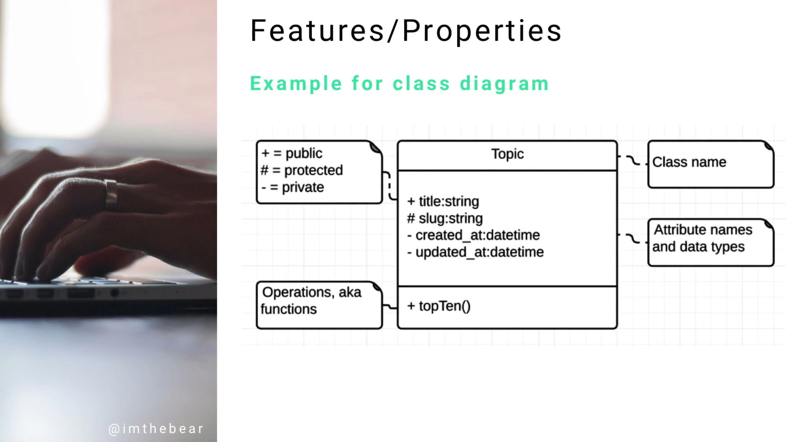

# Module 06 - 157:     UML Components

## FEATURES and PROPERTIES

---

---

## Video Lesson Speech

Next item on the list of common UML components is a Feature and a Property.

---

## Features and Property

This is something that you're going to see pretty much universally throughout all of the UML diagrams in the course and as you build them yourself. 

They represent attributes of an element. You may assume pretty much every diagram has elements at some point or another. Why is it important? It's important because one of the most critical parts of UML is being able to establish standardize naming conventions. 

Imagine a scenario where you have five different developers who are all building side by side but not communicating with each other, even though they're working on the same application. You will start to see some very weird and very different types of naming conventions in the same app. When it's done and someone else comes and works on it, they're going to be very confused. It's going to be very apparent that five different developers worked on it without communicating. There will be naming conventions for a few features and then a completely different set of naming conventions for another based on the developer preference.

One helpful part about utilizing tools like UML is you can standardize those types of naming conventions. The goal of any application that I work on is that when another developer works on it, they wouldn't be able to know how many developers worked on it. The naming convention should be as universal and as simple as possible to pick up, UML can help us accomplish that. Having a strict way that you're following what you name your features and your properties is a great way of doing that. 

Here's an example. 

I have expanded the topic class that we've looked at previously and we have features and properties inside. The title, the slug, created at, updated at, and top ten, those are all various features and properties. 

I've also added some comments that described each of the other elements, we have operations and ways of declaring the visibility of the attributes inside of the topic. We know which attributes and properties can be called by other ones and which ones are only used for that class itself. We have the class name and inside the main part are those attribute names and data types. 

Again, we're talking about components that are shared across pretty much every type of diagram you're going to be using. We need a name for these things and the name for these are features and properties. 

If you're like me, when I started learning UML, I thought it was weird to talk about things like features. It seemed like those are just words, it didn't really make sense why are we calling something specific when they are just words that go in the diagram. The more experience I got it really started to make sense why they had come up with these types of conventions. Say that I'm reading someone else's documentation and they're using UML, when they say feature a property I will know to look right in the center of this topic diagram and know what they're referencing. 

Having these kinds of naming conventions is very helpful, that is what having something like features and properties allows us to do.
