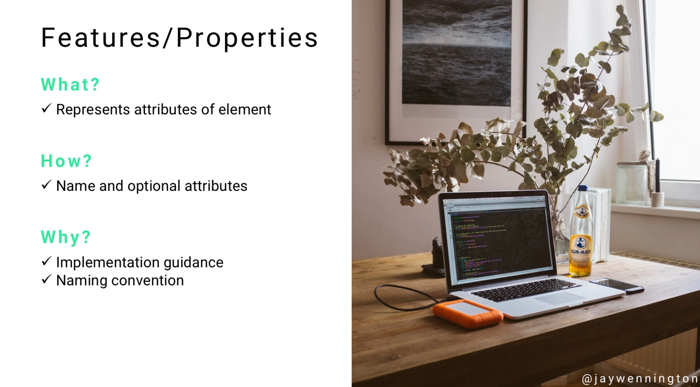

# Module 06 - 157:     UML Components

## FEATURES and PROPERTIES

---

1. Introduction to UML Features and Properties
   1.1 Definition and Core Concepts
   1.2 Universal Application Across Diagrams
   1.3 Role in Element Specification

2. Understanding Features in UML
   2.1 Feature Fundamentals
   2.2 Types of Features
   2.3 Feature Characteristics
   2.4 Feature Visibility and Access

3. Understanding Properties in UML
   3.1 Property Definitions
   3.2 Property Types and Categories
   3.3 Property Constraints and Specifications
   3.4 Property Relationships

4. Standardized Naming Conventions
   4.1 Importance of Consistency
   4.2 Naming Convention Benefits
   4.3 Team Communication Enhancement
   4.4 Code Quality and Maintainability

5. Features and Properties in Different Diagram Types
   5.1 Class Diagrams
   5.2 Object Diagrams
   5.3 Component Diagrams
   5.4 Package Diagrams
   5.5 Other Diagram Applications

6. Attribute Specification and Documentation
   6.1 Attribute Naming Standards
   6.2 Data Type Specifications
   6.3 Multiplicity and Constraints
   6.4 Default Values and Initialization

7. Visibility and Access Control
   7.1 Visibility Modifiers
   7.2 Public, Private, and Protected Access
   7.3 Package and Implementation Visibility
   7.4 Encapsulation Principles

8. Operations and Behavioral Features
   8.1 Method Definitions
   8.2 Operation Signatures
   8.3 Parameter Specifications
   8.4 Return Types and Exceptions

9. Advanced Feature Concepts
   9.1 Static vs Instance Features
   9.2 Abstract and Virtual Features
   9.3 Derived Properties
   9.4 Feature Redefinition and Inheritance

10. Best Practices and Guidelines
    10.1 Naming Convention Standards
    10.2 Documentation Strategies
    10.3 Team Collaboration Guidelines
    10.4 Quality Assurance Practices

11. Common Pitfalls and Anti-Patterns
    11.1 Inconsistent Naming Problems
    11.2 Over-Specification Issues
    11.3 Visibility Misuse
    11.4 Documentation Neglect

12. Tools and Implementation Support
    12.1 UML Modeling Tools
    12.2 Code Generation Features
    12.3 Reverse Engineering Capabilities
    12.4 Documentation Generation

13. Standards and References

---

## 1.     Introduction to UML Features and Properties

### 1.1     Definition and Core Concepts

**Features** and **Properties** in UML represent the fundamental building blocks that define the characteristics and capabilities of model elements. 

They serve as the standardized way to describe what an element **has** (properties) and what it can **do** (behavioral features).

**Definition**

- **Feature**: A distinguishing characteristic of a model element that can be either structural or behavioral
- **Property**: A structural feature that represents an attribute or association end of a classifier
- **Element**: Any constituent part of a UML model that can have features and properties

These concepts form the foundation for creating consistent, understandable, and maintainable UML models across different diagram types and development teams.

### 1.2     Universal Application Across Diagrams

Features and properties appear in virtually every UML diagram type, making them essential components for UML practitioners to master. Their universal nature means that understanding these concepts provides a foundation that applies to:

- **Structural diagrams** - Class, object, component, package, and deployment diagrams
- **Behavioral diagrams** - Use case, activity, sequence, and state machine diagrams
- **Interaction diagrams** - Communication and timing diagrams

This universality enables consistent communication and documentation practices across all aspects of system modeling.

### 1.3     Role in Element Specification

Features and properties serve critical roles in element specification:

- **Identification** - Uniquely identify and differentiate elements
- **Specification** - Define the detailed characteristics of elements
- **Communication** - Provide a common vocabulary for team discussions
- **Documentation** - Create self-documenting models that explain system behavior
- **Implementation guidance** - Direct code generation and development activities

---

## 2.     Understanding Features in UML

### 2.1     Feature Fundamentals

A **feature** is a distinguishing characteristic of a model element. Features can be:

- **Structural features** - Define what an element contains or is composed of
- **Behavioral features** - Define what an element can do or how it behaves

**Feature categories**

```
Features
├── Structural Features
│   ├── Properties (Attributes)
│   ├── Association Ends
│   └── Ports
└── Behavioral Features
    ├── Operations (Methods)
    ├── Receptions
    └── Extensions Points
```

### 2.2     Types of Features

**Structural Features**

1. **Attributes** - Simple properties with values
   
   - Example: `name: String`, `age: Integer`

2. **Association Ends** - Connections to other elements
   
   - Example: Customer has Orders (multiplicity relationship)

3. **Ports** - Interaction points for components
   
   - Example: Service interfaces, communication endpoints

**Behavioral Features**

1. **Operations** - Methods that can be invoked
   
   - Example: `calculateTotal(): Money`, `validate(): Boolean`

2. **Receptions** - Signal handling capabilities
   
   - Example: Event handlers, message processors

3. **Extension Points** - Variation points in use cases
   
   - Example: Optional steps in use case flows

### 2.3     Feature Characteristics

All features have common characteristics that define their behavior:

**Identity properties**

- **Name** - Unique identifier within the containing element
- **Type** - Data type or classifier that defines the feature
- **Multiplicity** - Number of values the feature can hold
- **Visibility** - Access level for the feature

**Behavioral properties**

- **Scope** - Instance-level or classifier-level (static)
- **Changeability** - Whether values can be modified after initialization
- **Ordering** - Whether multiple values have a specific order
- **Uniqueness** - Whether duplicate values are allowed

### 2.4     Feature Visibility and Access

Feature visibility controls access to features from outside the containing element:

| Visibility    | Symbol | Access Level  | Description                               |
| ------------- | ------ | ------------- | ----------------------------------------- |
| **Public**    | `+`    | Unrestricted  | Accessible from anywhere                  |
| **Private**   | `-`    | Element only  | Accessible only within the element        |
| **Protected** | `#`    | Inheritance   | Accessible to element and its descendants |
| **Package**   | `~`    | Package scope | Accessible within the same package        |

---

## 3.     Understanding Properties in UML

### 3.1     Property Definitions

**Properties** are structural features that represent typed elements within a classifier. They are the most common type of feature and appear as attributes in class diagrams.

**Property syntax**

```
[visibility] name [multiplicity] : type [= default] [property-modifiers]
```

**Example**

- `+ title: String` - Public string property
- `- id: Integer [1] = 0` - Private integer with default value
- `# items: Product [0..*] {ordered}` - Protected collection with constraints

### 3.2     Property Types and Categories

**Simple Properties**

- **Primitive types** - String, Integer, Boolean, Real
- **Enumeration types** - Predefined sets of values
- **Custom data types** - User-defined value types

**Complex Properties**

- **Class references** - Properties that reference other classes
- **Collection properties** - Arrays, lists, sets of other elements
- **Composite properties** - Properties containing other structured data

**Special Property Categories**

1. **Derived properties** - Values computed from other properties
   
   - Notation: `/propertyName`
   - Example: `/fullName` derived from firstName and lastName

2. **Static properties** - Shared across all instances
   
   - Notation: Underlined property name
   - Example: `counter: Integer` (underlined)

### 3.3     Property Constraints and Specifications

**Multiplicity constraints**

- `[1]` - Exactly one (default for single-valued properties)
- `[0..1]` - Zero or one (optional property)
- `[0..*]` - Zero or more (unlimited collection)
- `[1..*]` - One or more (required collection)
- `[n..m]` - Between n and m values

**Property modifiers**

- `{ordered}` - Collection maintains insertion order
- `{unique}` - No duplicate values allowed
- `{readOnly}` - Value cannot be changed after initialization
- `{union}` - Property represents union of other properties
- `{subsets propertyName}` - Property is subset of another property

### 3.4     Property Relationships

Properties can participate in various relationships:

**Subsetting relationships**

```
Person
+ contacts: Contact [*]
+ friends: Person [*] {subsets contacts}
+ colleagues: Person [*] {subsets contacts}
```

**Union relationships**

```
Vehicle
+ /occupants: Person [*] {union}
+ driver: Person [1] {subsets occupants}
+ passengers: Person [*] {subsets occupants}
```

---

## 4.     Standardized Naming Conventions

### 4.1     Importance of Consistency

Standardized naming conventions are crucial for several reasons:

**Communication benefits**

- **Universal understanding** - All team members use the same terminology
- **Reduced ambiguity** - Clear meaning eliminates confusion
- **Faster onboarding** - New team members learn patterns quickly
- **Cross-team collaboration** - Consistent practices across projects

**Maintenance benefits**

- **Code readability** - Self-documenting code through clear names
- **Refactoring safety** - Consistent patterns make changes safer
- **Bug reduction** - Clear naming reduces misunderstandings
- **Knowledge transfer** - Easier to hand off projects between developers

### 4.2     Naming Convention Benefits

**Development team scenario:** Without naming conventions, five developers working independently might create:

- Developer A: `usr_nm`, `usrEmail`, `user_created`
- Developer B: `userName`, `emailAddress`, `dateCreated`
- Developer C: `name`, `email`, `timestamp`
- Developer D: `user_name`, `user_email`, `created_at`
- Developer E: `Name`, `Email`, `CreatedDate`

**Result**: Inconsistent, confusing codebase that's difficult to maintain.

**With UML features and properties standardization**

- All developers use: `name: String`, `email: String`, `createdAt: DateTime`
- **Consistent patterns** across the entire application
- **Predictable structure** for new developers
- **Maintainable codebase** with clear intent

### 4.3     Team Communication Enhancement

Standardized features and properties create a **common vocabulary** for team communication:

**In documentation:** "The User class has a `name` property that stores the user's full name" **In code reviews:** "Update the `updatedAt` property when the record changes" **In meetings:** "We need to add a `status` feature to track the order state"

This shared language eliminates confusion and accelerates development discussions.

### 4.4     Code Quality and Maintainability

**Quality improvements**

- **Predictable patterns** - Developers know what to expect
- **Reduced cognitive load** - Less mental effort to understand code
- **Faster debugging** - Consistent naming aids problem identification
- **Improved testing** - Clear property names improve test readability

**Maintainability benefits**

- **Easier refactoring** - Consistent patterns simplify large-scale changes
- **Knowledge preservation** - Naming conventions encode team knowledge
- **Onboarding efficiency** - New developers learn faster with consistent patterns
- **Cross-project consistency** - Patterns transfer between projects

---

## 5.     Features and Properties in Different Diagram Types

### 5.1     Class Diagrams

Class diagrams are the primary location for detailed feature and property specification:

```
┌─────────────────────────────┐
│           Topic             │
├─────────────────────────────┤
│ + title: String             │
│ + slug: String              │
│ + createdAt: DateTime       │
│ + updatedAt: DateTime       │
│ + /topTen: Query {readOnly} │
├─────────────────────────────┤
│ + save(): Boolean           │
│ + validate(): Boolean       │
│ + generateSlug(): String    │
└─────────────────────────────┘
```

**Feature representation**

- **Attributes section** - Shows structural properties
- **Operations section** - Shows behavioral features
- **Visibility indicators** - Show access levels
- **Type specifications** - Define data types and constraints

### 5.2     Object Diagrams

Object diagrams show specific instances with actual property values:

```
┌─────────────────────────────┐
│    myTopic: Topic           │
├─────────────────────────────┤
│ title = "UML Features"      │
│ slug = "uml-features"       │
│ createdAt = 2024-01-15      │
│ updatedAt = 2024-01-20      │
└─────────────────────────────┘
```

**Property values**

- **Concrete values** instead of types
- **Instance-specific** data
- **Runtime state** representation

### 5.3     Component Diagrams

Components expose features through interfaces:

```
┌─────────────────────────────┐
│      UserService           │
├─────────────────────────────┤
│ ○ IUserRepository          │
│ ○ IEmailService            │
├─────────────────────────────┤
│ + createUser()             │
│ + validateEmail()          │
│ + sendWelcome()            │
└─────────────────────────────┘
```

**Component features**

- **Required interfaces** - Dependencies on external features
- **Provided interfaces** - Features offered to other components
- **Internal properties** - Component configuration and state

### 5.4     Package Diagrams

Packages organize features into logical groups:

```
┌─────────────────────────────┐
│        Domain              │
├─────────────────────────────┤
│ + User                     │
│ + Order                    │
│ + Product                  │
├─────────────────────────────┤
│ + UserRepository           │
│ + OrderService             │
│ + ProductCatalog           │
└─────────────────────────────┘
```

**Package features**

- **Contained elements** - Classes, interfaces, other packages
- **Visibility rules** - What features are accessible outside the package
- **Namespace management** - Feature name scoping and organization

### 5.5     Other Diagram Applications

**Activity diagrams**

- **Activity properties** - Duration, resources, constraints
- **Object node features** - State specifications, transformations

**Use case diagrams**

- **Actor properties** - Roles, responsibilities, capabilities
- **Use case features** - Preconditions, postconditions, scenarios

**Sequence diagrams**

- **Lifeline properties** - Object states, creation/destruction
- **Message features** - Parameters, return values, timing constraints

---

## 6.     Attribute Specification and Documentation

### 6.1     Attribute Naming Standards

**Naming guidelines**

- **Use descriptive names** - `customerName` not `cn`
- **Follow casing conventions** - `camelCase` for most languages
- **Avoid abbreviations** - `address` not `addr`
- **Use noun phrases** - `orderDate` not `dateOrder`
- **Be consistent** - Same concepts use same names

**Common naming patterns**

| Pattern            | Example                               | Usage                   |
| ------------------ | ------------------------------------- | ----------------------- |
| **Simple nouns**   | `name`, `price`, `quantity`           | Basic properties        |
| **Compound nouns** | `firstName`, `unitPrice`, `orderDate` | Specific properties     |
| **Boolean flags**  | `isActive`, `hasChildren`, `canEdit`  | Status properties       |
| **Collections**    | `items`, `orders`, `children`         | Multi-valued properties |

### 6.2     Data Type Specifications

**Primitive types**

- `String` - Text data
- `Integer` - Whole numbers
- `Real` - Decimal numbers
- `Boolean` - True/false values
- `Date` - Calendar dates
- `DateTime` - Date with time
- `Time` - Time without date

**Custom types**

- `Money` - Currency amounts with precision
- `EmailAddress` - Validated email strings
- `PhoneNumber` - Formatted phone numbers
- `URL` - Web addresses
- `UUID` - Unique identifiers

**Collection types**

- `Array[Type]` - Fixed-size ordered collection
- `List[Type]` - Variable-size ordered collection
- `Set[Type]` - Unique values collection
- `Map[KeyType, ValueType]` - Key-value pairs

### 6.3     Multiplicity and Constraints

**Multiplicity specification**

```
Customer
+ name: String [1]           // Required single value
+ nickname: String [0..1]    // Optional single value
+ phoneNumbers: String [1..*] // At least one required
+ tags: String [*]           // Zero or more allowed
+ preferences: String [3..5]  // Between 3 and 5 values
```

**Constraint examples**

```
Product
+ price: Money [1] {price > 0}
+ categories: Category [1..*] {ordered}
+ reviews: Review [*] {readOnly}
+ /averageRating: Real {derived}
```

### 6.4     Default Values and Initialization

**Default value syntax**

```
User
+ status: String = "active"
+ loginCount: Integer = 0
+ registrationDate: Date = today()
+ preferences: Map = empty()
```

**Initialization strategies**

- **Literal values** - Direct value assignment
- **Constructor initialization** - Values set during object creation
- **Factory methods** - Initialization through specialized methods
- **Dependency injection** - Values provided by external systems

---

## 7.     Visibility and Access Control

### 7.1     Visibility Modifiers

UML defines four standard visibility levels that control access to features:

| Modifier | Symbol | Name      | Access Level                       |
| -------- | ------ | --------- | ---------------------------------- |
| **+**    | Plus   | Public    | Accessible from anywhere           |
| **-**    | Minus  | Private   | Only within the owning element     |
| **#**    | Hash   | Protected | Within element and its descendants |
| **~**    | Tilde  | Package   | Within the same package            |

### 7.2     Public, Private, and Protected Access

**Public features (`+`):**

```
Customer
+ name: String              // Anyone can access
+ email: String            // External systems can read/write
+ getFullName(): String    // Public operation
```

**Usage:** API interfaces, external communication, public contracts

**Private features (`-`):**

```
Customer
- id: UUID                 // Internal identifier only
- passwordHash: String     // Sensitive data protection
- validatePassword(): Boolean  // Internal validation
```

**Usage:** Internal implementation details, sensitive data, helper methods

**Protected features (`#`):**

```
Person
# birthDate: Date          // Accessible to subclasses
# calculateAge(): Integer  // Inherited behavior
```

**Usage:** Inheritance hierarchies, template method patterns, shared behavior

### 7.3     Package and Implementation Visibility

**Package visibility (`~`):**

```
OrderProcessor
~ auditLog: List[String]   // Package-internal logging
~ validateOrder(): Boolean // Package-internal validation
```

**Usage:** Internal package collaboration, framework boundaries

**Implementation-specific visibility**

- **Friend classes** (C++) - Specific class access privileges
- **Internal** (C#) - Assembly-level visibility
- **Default** (Java) - Package-private access

### 7.4     Encapsulation Principles

**Encapsulation benefits**

- **Data hiding** - Internal details protected from external access
- **Interface stability** - Public interfaces remain consistent
- **Implementation flexibility** - Internal changes don't affect clients
- **Security** - Sensitive data and operations protected

**Best practices**

- **Minimize public interface** - Expose only what's necessary
- **Use private by default** - Make features public only when needed
- **Protect invariants** - Use private features to maintain object consistency
- **Design for change** - Keep implementation details private for flexibility

---

## 8.     Operations and Behavioral Features

### 8.1     Method Definitions

Operations define the behavioral capabilities of elements. They specify what actions an element can perform.

**Operation syntax**

```
[visibility] name ([parameter-list]) [: return-type] [property-modifiers]
```

**Examples**

```
Customer
+ getName(): String
+ setEmail(email: String): void
+ calculateDiscount(orderAmount: Money): Money
+ validateAccount(): Boolean {query}
- encryptPassword(password: String): String
```

### 8.2     Operation Signatures

**Parameter specifications**

```
OrderService
+ createOrder(
    customer: Customer,
    items: OrderItem [1..*],
    shippingAddress: Address [0..1] = null,
    priority: Priority = normal
  ): Order
```

**Parameter directions**

- **in** - Input parameter (default)
- **out** - Output parameter (return value)
- **inout** - Both input and output
- **return** - Method return value

### 8.3     Parameter Specifications

**Parameter properties**

```
PaymentService
+ processPayment(
    in amount: Money,
    in method: PaymentMethod,
    out transactionId: String,
    inout receipt: Receipt [0..1]
  ): PaymentResult
```

**Parameter constraints**

- **Multiplicity** - Number of parameter values
- **Default values** - Used when parameter not provided
- **Type constraints** - Additional validation rules
- **Direction** - How parameter is used in operation

### 8.4     Return Types and Exceptions

**Return type specifications**

```
UserService
+ findUser(id: UUID): User [0..1]      // Optional return
+ getAllUsers(): User [*]              // Collection return
+ validateUser(user: User): Boolean    // Simple return
+ /getUserCount(): Integer {query}     // Derived query
```

**Exception specifications**

```
FileService
+ readFile(path: String): String 
    {exceptions: FileNotFoundException, SecurityException}
+ writeFile(path: String, content: String): void
    {exceptions: IOException, SecurityException}
```

---

## 9.     Advanced Feature Concepts

### 9.1     Static vs Instance Features

**Instance features** - Belong to individual object instances:

```
BankAccount
+ balance: Money              // Each account has its own balance
+ deposit(amount: Money): void // Operation on specific account
```

**Static features** - Belong to the class itself, shared across all instances:

```
BankAccount
+ interestRate: Real {static}     // Same rate for all accounts
+ calculateInterest(): Money {static}  // Class-level operation
```

**Visual representation:** Static features are **underlined** in UML diagrams

### 9.2     Abstract and Virtual Features

**Abstract features** - Declared but not implemented in the current class:

```
Shape {abstract}
+ /area(): Real {abstract}        // Must be implemented by subclasses
+ /perimeter(): Real {abstract}   // Abstract operation
```

**Virtual features** - Can be overridden by subclasses:

```
Vehicle
+ startEngine(): void {virtual}   // Default implementation provided
+ stopEngine(): void {virtual}    // Can be customized by subclasses
```

### 9.3     Derived Properties

**Derived properties** are computed from other properties:

```
Person
+ firstName: String
+ lastName: String
+ /fullName: String {derived}     // Computed from firstName + lastName

Order
+ items: OrderItem [1..*]
+ /totalAmount: Money {derived}   // Sum of all item prices
+ /itemCount: Integer {derived}   // Number of items
```

**Derivation rules**

- **Computation** - How the value is calculated
- **Dependencies** - Which properties affect the derived value
- **Caching** - Whether computed values are stored or calculated on demand
- **Update triggers** - When derived values need recalculation

### 9.4     Feature Redefinition and Inheritance

**Feature inheritance**

```
Animal
+ name: String
+ makeSound(): String {abstract}

Dog extends Animal
+ breed: String                   // Additional property
+ makeSound(): String             // Redefined operation
```

**Redefinition types**

- **Override** - Replace parent implementation completely
- **Extend** - Add behavior to parent implementation
- **Restrict** - Narrow the contract (e.g., more specific return type)
- **Specialize** - Provide concrete implementation of abstract feature

---

## 10.     Best Practices and Guidelines

### 10.1     Naming Convention Standards

**Attribute naming**

- **Use clear, descriptive names** - `customerEmail` not `ce`
- **Follow language conventions** - `camelCase` in Java, `snake_case` in Python
- **Use meaningful prefixes/suffixes** - `isActive`, `hasPermission`, `itemCount`
- **Avoid technical jargon** - Business domain terminology preferred
- **Be consistent across the model** - Same concepts use same names

**Operation naming**

- **Use verb phrases** - `calculateTotal()`, `validateInput()`
- **Query operations** - Start with `get`, `find`, `is`, `has`
- **Command operations** - Start with action verbs `create`, `update`, `delete`
- **Boolean returns** - Use `is`, `has`, `can` prefixes

### 10.2     Documentation Strategies

**Feature documentation levels**

1. **Name documentation** - Clear, self-documenting names
2. **Type documentation** - Precise type specifications
3. **Constraint documentation** - Multiplicity and validation rules
4. **Comment documentation** - Additional clarification when needed
5. **External documentation** - Detailed specifications in separate documents

**Documentation templates**

```
Customer
+ email: String [1] {unique}      // Primary contact email
  // Must be valid email format, used for notifications
+ orders: Order [*] {ordered}     // Purchase history
  // Ordered by creation date, includes all order statuses
```

### 10.3     Team Collaboration Guidelines

**Establishing standards**

- **Create naming guides** - Document team conventions
- **Use code review** - Enforce consistency through peer review
- **Provide examples** - Show good and bad naming practices
- **Regular refactoring** - Update names as understanding improves
- **Tool support** - Use UML tools that enforce consistency

**Communication practices**

- **Feature glossaries** - Shared terminology definitions
- **Regular model reviews** - Team validation of feature designs
- **Cross-training** - Ensure team members understand conventions
- **Documentation updates** - Keep standards current with practice

### 10.4     Quality Assurance Practices

**Feature quality checks**

- **Naming consistency** - Same concepts use same names
- **Type accuracy** - Correct data types for intended usage
- **Constraint completeness** - All business rules captured
- **Visibility appropriateness** - Proper encapsulation levels
- **Documentation adequacy** - Sufficient clarification provided

**Quality metrics**

- **Feature coverage** - Percentage of features with proper documentation
- **Naming compliance** - Adherence to established conventions
- **Type safety** - Correct type specifications and constraints
- **Interface stability** - Changes to public features over time

---

## 11.     Common Pitfalls and Anti-Patterns

### 11.1     Inconsistent Naming Problems

**Common inconsistencies**

```
// BAD: Multiple naming styles in same model
User
+ userName: String        // camelCase
+ user_email: String      // snake_case  
+ UserPhone: String       // PascalCase
+ addr: String           // abbreviation
```

```
// GOOD: Consistent naming throughout
User
+ name: String
+ email: String
+ phoneNumber: String
+ address: String
```

**Problems caused**

- **Developer confusion** - Unclear which style to follow
- **Maintenance difficulty** - Harder to find and update features
- **Code generation issues** - Inconsistent output from UML tools
- **Team friction** - Arguments over "correct" naming

### 11.2     Over-Specification Issues

**Over-detailed models**

```
// BAD: Too much implementation detail in UML
DatabaseConnection
- connectionString: String
- maxPoolSize: Integer = 10
- minPoolSize: Integer = 2
- connectionTimeout: Integer = 30000
- commandTimeout: Integer = 30000
- retryCount: Integer = 3
- retryDelay: Integer = 1000
- enableSsl: Boolean = true
- sslProtocol: String = "TLS 1.2"
```

**Problems**

- **Model complexity** - Overwhelming detail obscures important concepts
- **Maintenance burden** - Every implementation change requires model updates
- **Implementation coupling** - UML becomes too tied to specific technology
- **Reduced flexibility** - Over-specification constrains implementation choices

### 11.3     Visibility Misuse

**Common visibility mistakes**

```
// BAD: Everything public
Customer
+ id: UUID                    // Should be private
+ passwordHash: String        // Should be private
+ internalNotes: String       // Should be private
+ calculateRiskScore(): Integer  // Should be private
```

```
// BAD: Everything private
Customer
- name: String               // Should be public
- email: String             // Should be public
- getContactInfo(): String   // Should be public
```

**Consequences**

- **Security vulnerabilities** - Sensitive data exposed
- **Encapsulation violations** - Internal details leaked
- **Interface instability** - Internal changes break clients
- **Usability problems** - Required features not accessible

### 11.4     Documentation Neglect

**Under-documented features**

```
// BAD: Unclear purpose and constraints
Order
+ data: String              // What kind of data?
+ process(): Boolean        // What does this do?
+ x: Integer               // Meaningless name
+ stuff: Object [*]        // Vague type and purpose
```

**Problems**

- **Implementation confusion** - Developers guess at feature purpose
- **Integration difficulties** - Other systems don't know how to use features
- **Testing challenges** - Unclear what behavior to test
- **Maintenance issues** - Future developers can't understand intent

---

## 12.     Tools and Implementation Support

### 12.1     UML Modeling Tools

**Enterprise modeling tools**

- **Enterprise Architect** - Comprehensive feature specification and validation
- **MagicDraw/Cameo** - Advanced property constraint modeling
- **Visual Paradigm** - Feature-rich property definition and documentation
- **IBM Rational Software Architect** - Integration with development environments

**Lightweight modeling tools**

- **Lucidchart** - Web-based UML with basic feature support
- **Draw.io/Diagrams.net** - Free online UML modeling
- **PlantUML** - Text-based UML generation
- **Gliffy** - Simple diagramming with UML templates

### 12.2     Code Generation Features

**Forward engineering capabilities**

```
// UML Class Definition
Customer
+ name: String
+ email: String
+ calculateDiscount(): Money

// Generated Java Code
public class Customer {
    private String name;
    private String email;

    public String getName() { return name; }
    public void setName(String name) { this.name = name; }

    public String getEmail() { return email; }
    public void setEmail(String email) { this.email = email; }

    public Money calculateDiscount() {
        // Implementation to be added
        return null;
    }
}
```

**Code generation benefits**

- **Consistency** - Generated code follows UML specifications exactly
- **Speed** - Rapid skeleton generation from models
- **Accuracy** - Reduces manual coding errors
- **Synchronization** - Keeps code and models aligned

### 12.3     Reverse Engineering Capabilities

**Code-to-UML extraction**

- **Automatic feature discovery** - Extract properties and operations from existing code
- **Relationship inference** - Identify dependencies and associations
- **Documentation generation** - Create UML models from code comments
- **Legacy system modeling** - Understand existing systems through reverse engineering

**Supported languages**

- **Object-oriented languages** - Java, C#, C++, Python
- **Functional languages** - Limited support for Scala, F#
- **Database schemas** - Extract entity models from database structures
- **Web services** - Generate models from API definitions

### 12.4     Documentation Generation

**Generated documentation types**

- **HTML documentation** - Web-browsable feature specifications
- **PDF reports** - Printable model documentation
- **Word documents** - Editable specification documents
- **Wiki integration** - Automatic wiki page generation from models

**Documentation content**

- **Feature catalogs** - Complete lists of all properties and operations
- **Cross-reference tables** - Where features are used throughout the model


---

## References

---

## Video Lesson Speech

Next item on the list of common UML components is a Feature and a Property.

---

## Features and Property

This is something that you're going to see pretty much universally throughout all of the UML diagrams in the course and as you build them yourself. 



They represent attributes of an element. You may assume pretty much every diagram has elements at some point or another. Why is it important? It's important because one of the most critical parts of UML is being able to establish standardize naming conventions. 

Imagine a scenario where you have five different developers who are all building side by side but not communicating with each other, even though they're working on the same application. You will start to see some very weird and very different types of naming conventions in the same app. When it's done and someone else comes and works on it, they're going to be very confused. It's going to be very apparent that five different developers worked on it without communicating. There will be naming conventions for a few features and then a completely different set of naming conventions for another based on the developer preference.

One helpful part about utilizing tools like UML is you can standardize those types of naming conventions. The goal of any application that I work on is that when another developer works on it, they wouldn't be able to know how many developers worked on it. The naming convention should be as universal and as simple as possible to pick up, UML can help us accomplish that. Having a strict way that you're following what you name your features and your properties is a great way of doing that. 

Here's an example. 


I have expanded the topic class that we've looked at previously and we have features and properties inside. The title, the slug, created at, updated at, and top ten, those are all various features and properties. 

I've also added some comments that described each of the other elements, we have operations and ways of declaring the visibility of the attributes inside of the topic. We know which attributes and properties can be called by other ones and which ones are only used for that class itself. We have the class name and inside the main part are those attribute names and data types. 

Again, we're talking about components that are shared across pretty much every type of diagram you're going to be using. We need a name for these things and the name for these are features and properties. 

If you're like me, when I started learning UML, I thought it was weird to talk about things like features. It seemed like those are just words, it didn't really make sense why are we calling something specific when they are just words that go in the diagram. The more experience I got it really started to make sense why they had come up with these types of conventions. Say that I'm reading someone else's documentation and they're using UML, when they say feature a property I will know to look right in the center of this topic diagram and know what they're referencing. 

Having these kinds of naming conventions is very helpful, that is what having something like features and properties allows us to do.
