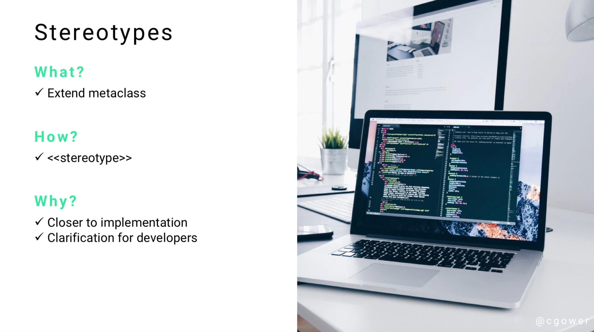

# Module 06 - 155:     UML Components

## COMMENTS and NOTES

---

1. Introduction to UML Comments and Notes
   1.1 Definition and Purpose
   1.2 Terminology Variations
   1.3 Role in UML Documentation

2. Characteristics and Properties
   2.1 Visual Representation
   2.2 Connection Methods
   2.3 Content Flexibility

3. Comments vs Stereotypes
   3.1 Formality Levels
   3.2 Use Case Distinctions
   3.3 Semantic Differences

4. Application Scenarios
   4.1 Developer Communication
   4.2 Stakeholder Clarification
   4.3 Technical Documentation

5. Visual Elements and Notation
   5.1 Standard Notation
   5.2 Connection Lines
   5.3 Positioning Guidelines

6. Practical Examples
   6.1 Class Diagram Applications
   6.2 Attribute Clarification
   6.3 Method Documentation

7. Implementation Guidelines
   7.1 When to Use Comments
   7.2 Content Best Practices
   7.3 Placement Strategies

8. Best Practices and Tips
   8.1 Writing Effective Comments
   8.2 Avoiding Over-Documentation
   8.3 Maintenance Considerations

---

## 1.     Introduction to UML Comments and Notes

### 1.1     Definition and Purpose

UML Comments (also referred to as **Notes**) are supplementary documentation elements that provide descriptive markup within UML diagrams. They serve as a bridge between formal UML notation and natural language explanation, enabling clearer communication of design intent and implementation details.

Comments are **non-formalized** annotations that can contain virtually any descriptive text, making them highly flexible tools for enhancing diagram readability and comprehension.

### 1.2     Terminology Variations

The terminology used for these elements can vary depending on the context and tools:

- **Comments** - More commonly used in software development contexts
- **Notes** - Often preferred in academic and formal documentation
- **Annotations** - Sometimes used in specialized UML tools
- **Remarks** - Occasionally found in legacy documentation

Both "Comments" and "Notes" refer to the same UML construct and can be used interchangeably.

### 1.3     Role in UML Documentation

Comments serve multiple critical functions in UML modeling:

- **Clarification** of complex or ambiguous elements
- **Context provision** for non-technical stakeholders
- **Implementation guidance** for development teams
- **Business rule documentation** within technical diagrams
- **Assumption recording** for future reference

---

## 2.     Characteristics and Properties

### 2.1     Visual Representation

UML Comments are represented by **rectangular boxes** with specific visual characteristics:

- **Shape**: Rectangle with a "dog-eared" corner (folded corner effect)
- **Background**: Typically yellow or light-colored
- **Border**: Solid thin line
- **Corner**: Small triangular fold in the upper-right corner

### 2.2     Connection Methods

Comments connect to UML elements through:

- **Dotted lines** (dashed lines) - The standard connection method
- **Dependency arrows** - Used in some specialized cases
- **Direct positioning** - When the context makes the association clear

### 2.3     Content Flexibility

Unlike other UML elements, comments have minimal restrictions on content:

- **Free-form text** - No specific format requirements
- **Multiple languages** - Can be written in any natural language
- **Mixed content** - Can include technical and business terminology
- **Variable length** - From brief annotations to detailed explanations

---

## 3.     Comments vs Stereotypes

### 3.1     Formality Levels

Understanding the distinction between Comments and Stereotypes is crucial:

| Aspect        | Comments                      | Stereotypes                  |
| ------------- | ----------------------------- | ---------------------------- |
| **Formality** | Informal, descriptive         | Formal, standardized         |
| **Purpose**   | Explanation and clarification | Classification and extension |
| **Content**   | Free-form text                | Predefined keywords          |
| **Usage**     | Communication aid             | Semantic enhancement         |

### 3.2     Use Case Distinctions

**Comments are ideal for:**

- Explaining business rules
- Providing implementation hints
- Clarifying complex relationships
- Adding context for stakeholders

**Stereotypes are ideal for:**

- Extending UML metamodel
- Formal classification (e.g., «Controller», «Model», «View»)
- Tool-specific annotations
- Architectural pattern identification

### 3.3     Semantic Differences

- **Comments** do not affect the semantic meaning of the model
- **Stereotypes** extend and modify the semantic interpretation of elements
- **Comments** are purely documentational
- **Stereotypes** can influence code generation and tool behavior

---

## 4.     Application Scenarios

### 4.1     Developer Communication

Comments excel in scenarios where developers need additional context:

- **Algorithm explanations** for complex methods
- **Performance considerations** for critical operations
- **Integration notes** for external system interactions
- **Maintenance warnings** for sensitive code areas

### 4.2     Stakeholder Clarification

When presenting UML diagrams to non-technical audiences:

- **Business process explanations** in activity diagrams
- **User interaction clarifications** in use case diagrams
- **Data flow descriptions** in sequence diagrams
- **System boundary explanations** in deployment diagrams

### 4.3     Technical Documentation

Comments serve as embedded documentation for:

- **Design decisions** and their rationale
- **Constraint explanations** and their implications
- **Assumption documentation** for future reference
- **Requirements traceability** links

---

## 5.     Visual Elements and Notation

### 5.1     Standard Notation

The UML specification defines specific visual elements for comments:

```
┌─────────────────┐
│ Comment text    │◣
│ goes here...    │
└─────────────────┘
```

**The folded corner (◣) is a distinctive feature that immediately identifies the element as a comment.**

### 5.2 Connection Lines

Connection lines between comments and model elements follow these conventions:

- **Style**: Dashed or dotted line
- **Direction**: No specific arrowhead required
- **Multiple connections**: One comment can connect to multiple elements
- **Positioning**: Lines should not obscure other diagram elements

### 5.3 Positioning Guidelines

Effective comment placement follows these principles:

- **Proximity**: Place comments near the elements they describe
- **Clarity**: Avoid overlapping with other diagram elements
- **Readability**: Ensure connection lines are clear and unambiguous
- **Balance**: Maintain visual harmony within the diagram

---

## 6.     Practical Examples

### 6.1     Class Diagram Applications

Consider a `Topic` class in a content management system:

```
┌─────────────────┐
│ Topic           │
├─────────────────┤
│ - title: String │ ←──┐
│ - slug: String  │ ←──┤
│ - topTen: Query │ ←──┤
├─────────────────┤    │
│ + save()        │    │
│ + validate()    │    │
└─────────────────┘    │
                       │
┌─────────────────────────┐◣
│ Required field for      │
│ all topic instances     │
└─────────────────────────┘

┌─────────────────────────┐◣
│ Auto-generated using    │
│ friendly_id library     │
└─────────────────────────┘

┌─────────────────────────┐◣
│ Query scope for most    │
│ popular topics          │
└─────────────────────────┘
```

### 6.2     Attribute Clarification

Each comment in the example above serves a specific purpose:

1. **Title attribute comment**: Indicates business rule (required field)
2. **Slug attribute comment**: Provides implementation guidance (auto-generation)
3. **TopTen attribute comment**: Explains query scope functionality

### 6.3     Method Documentation

Comments can also document methods and their behavior:

```
┌─────────────────┐
│ + authenticate()│ ←──┐
└─────────────────┘    │
                       │
┌─────────────────────────┐◣
│ Implements OAuth 2.0    │
│ with JWT tokens         │
└─────────────────────────┘
```

---

## 7.     Implementation Guidelines

### 7.1     When to Use Comments

Comments should be used when:

- **Standard UML notation** is insufficient for clarity
- **Business rules** need explicit documentation
- **Implementation details** require specification
- **Non-technical stakeholders** need explanation
- **Complex relationships** require clarification

### 7.2     Content Best Practices

Effective comment content should be:

- **Concise** yet informative
- **Clear** and unambiguous
- **Relevant** to the associated element
- **Current** and up-to-date
- **Consistent** in style and terminology

### 7.3     Placement Strategies

Strategic comment placement involves:

- **Logical grouping** of related comments
- **Visual balance** within the diagram
- **Connection clarity** to avoid confusion
- **Space efficiency** to maintain readability
- **Update accessibility** for maintenance

---

## 8.     Best Practices and Tips

### 8.1     Writing Effective Comments

#### **Do**

- Use clear, simple language
- Focus on "why" rather than "what"
- Include business context when relevant
- Keep comments concise but complete
- Use consistent terminology throughout

#### **Don't**

- Duplicate information already clear from the diagram
- Use overly technical jargon without explanation
- Create comments that will quickly become outdated
- Clutter diagrams with excessive annotations

### 8.2     Avoiding Over-Documentation

Signs of over-documentation include:

- **Redundant information** already evident from naming
- **Excessive detail** that obscures the main diagram
- **Trivial explanations** of obvious elements
- **Outdated comments** that no longer reflect reality

### 8.3     Maintenance Considerations

**Regular Review Process**

- Schedule periodic comment reviews during design updates
- Remove obsolete comments promptly
- Update comments when requirements change
- Validate comment accuracy with stakeholders

**Version Control**

- Track comment changes alongside diagram evolution
- Document rationale for comment modifications
- Maintain comment history for traceability

**Team Coordination**

- Establish comment writing standards
- Define review processes for comment additions
- Ensure consistent comment quality across team members

### 8.4     Tool-Specific Considerations

Different UML tools may have variations in:

- **Comment formatting** options
- **Connection line** styles
- **Export capabilities** for comments
- **Search functionality** within comments

### 8.5 Accessibility and Internationalization

Consider these factors for broader accessibility:

- **Language consistency** within project contexts
- **Cultural sensitivity** in explanations
- **Technical translation** accuracy
- **Screen reader compatibility** in digital formats

---

## 9.     Standards and References

### 9.1 UML Standards

- **OMG UML 2.5.1 Specification** - Object Management Group
  - Section 7.3.2: Comments and their usage
  - Annex B: UML Notation Guide
- **ISO/IEC 19505-1:2012** - Information technology — Object Management Group Unified Modeling Language (UML)
- **ISO/IEC 19505-2:2012** - UML Superstructure specification

### 9.2 Design Guidelines and Best Practices

- [UML Comments and Notes - UML-diagrams.org](https://www.uml-diagrams.org/uml-25-diagrams.html#comment)
- [UML Modeling Style Guidelines - Agile Modeling](http://agilemodeling.com/style/)

### 9.3 Tool Documentation

- **Enterprise Architect** - Comments and Notes Implementation
- **Visual Paradigm** - UML Comment Features and Usage
- **Lucidchart** - UML Annotation Guidelines
- **Draw.io/Diagrams.net** - UML Comment Notation

### 9.4 Industry Standards and Frameworks

- **TOGAF** - The Open Group Architecture Framework documentation standards
- **IEEE 1471-2000** - Recommended Practice for Architectural Description
- **IEEE 830-1998** - Recommended Practice for Software Requirements Specifications
- **CMMI** - Capability Maturity Model Integration documentation practices


---

## Video Lesson Speech

Next on our list of common UML components are comments. Comments can 
also be called "Notes" depending on who you're working with on UML, and 
they give you the ability to have descriptive markup.

---

## Comments

We talked about how you can use Stereotypes to help give some clarification. Stereotypes are much more formal, that's what you would use when you want to name an abstract system like a Model Viewer or Controller. 



Comments add clarification for anybody reading the code, however, they are not formalized. You can put pretty much anything you want in a comment. Comments can be incredibly helpful if you're working with developers that are unfamiliar with UML and also when you are building diagrams that may be shown to non-technical stakeholders. 

if I'm building a system for a client that has no idea what UML is, they're not going to be able to read the formal naming conventions or know what a filled-in circular dot means and how it differs from a circle that's not filled in. Comments allow us to add clarification and make it very evident to the goals you're trying to accomplish with a specific diagram. 

Comments are in rectangular boxes and they have a dotted line to the element they describe. 

Here is an example for a class diagram. 


This is a class diagram called Topic, it has three comments or three notes. The first one points to the title attribute in the Topic class and indicates it is a required field. The next one points to the Slug attribute and indicates it is automatically generated. When someone goes to the URL bar, they can type in the topic name and it will navigate to that page. We're letting the developer know that these should be auto-generated via the friendly ID library. The last one points to the top Ten attributes and states the query scope for the most popular topics should be called top Ten.

Typically you want to be very descriptive with your methods and attributes. Hopefully, comments won't be necessary, however, if you feel a little clarification is needed then feel free to use notes and comments in order to accomplish that goal. 
