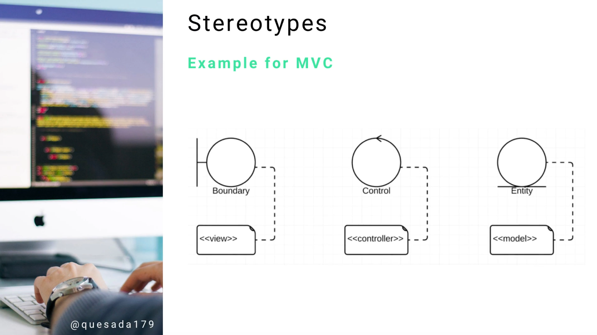

# MODULE 06-155:    UML
## Sterotypes
--

1. Introduction to UML Stereotypes
   1.1 Definition and Purpose
   1.2 Why Stereotypes Look Strange
   1.3 When and Where to Use Them

2. Stereotype Syntax and Notation
   2.1 Basic Syntax Rules
   2.2 Visual Representation
   2.3 Placement Guidelines

3. Understanding Metaclass Extension
   3.1 What "Extends a Metaclass" Means
   3.2 Abstract to Practical Translation
   3.3 Standardized Naming Benefits

4. Common Stereotype Applications
   4.1 Model-View-Controller (MVC) Patterns
   4.2 Architectural Pattern Representation
   4.3 Framework-Specific Stereotypes
   4.4 Domain-Specific Modeling

5. Practical Examples
   5.1 MVC Architecture Stereotypes
   5.2 Enterprise Application Patterns
   5.3 Web Development Stereotypes
   5.4 Database Modeling Stereotypes

6. Best Practices
   6.1 When to Use Stereotypes
   6.2 Clarity vs Complexity
   6.3 Team Communication
   6.4 Tool Considerations

7. Standards and References

---

## 1. Introduction to UML Stereotypes

### 1.1 Definition and Purpose

**Stereotypes** are UML extension mechanisms that allow to **create new types of modeling elements by extending existing UML metaclasses.** 
They provide a way to give more **practical and meaningful names** to abstract or complex system components.

**Core purpose**

- **Clarify abstract concepts** using familiar terminology
- **Extend UML vocabulary** for specific domains or frameworks
- **Improve communication** between team members
- **Standardize naming conventions** across projects

### 1.2 Why Stereotypes Look Strange

Stereotypes can appear confusing for several reasons:

- **Not used in every diagram** - Selective application makes them less familiar
- **Abstract nature** - They represent conceptual extensions rather than concrete elements
- **Unfamiliar syntax** - Double angle brackets `«stereotype»` are unique to UML
- **Incorrect implementation** - Many people misuse them, adding to confusion

Understanding their purpose helps demystify their appearance and usage.

### 1.3 When and Where to Use Them


**Appropriate scenarios**

- **Architectural pattern documentation** - MVC, MVP, MVVM
- **Framework-specific modeling** - Spring, Angular, .NET components
- **Domain-specific applications** - Business process modeling, embedded systems
- **Team communication improvement** - Making abstract concepts concrete


**Diagram types where commonly used**
- Class diagrams (most common)
- Component diagrams
- Package diagrams
- Use case diagrams (occasionally)

---

## 2. Stereotype Syntax and Notation

### 2.1 Basic Syntax Rules

**Standard notation**

```
«stereotype_name»
ElementName
```


**Key elements**

- **Double angle brackets** - `«` and `»` (guillemets)
- **Stereotype name** - Descriptive identifier
- **Placement** - Above or before the element name
- **Case sensitivity** - Usually lowercase or camelCase


### 2.2 Visual Representation

**Examples of proper notation**

```
«controller»
UserController

«model»
User

«view»
UserRegistrationForm

«service»
EmailService

«repository»
UserRepository
```


### 2.3 Placement Guidelines

#### **CLASS DIAGRAMS **
```
┌─────────────────┐
│ «controller»    │
│ UserController  │
├─────────────────┤
│ + handleLogin() │
│ + handleLogout()│
└─────────────────┘
```

#### **COMPONENT DIAGRAMS**
```
┌─────────────────┐
│ «service»       │
│ PaymentService  │
├─────────────────┤
│ ○ PaymentAPI    │
└─────────────────┘
```

---

## 3. Understanding Metaclass Extension
---
### 3.1 What "Extends a Metaclass" Means

#### **Metaclass**
> **METACLASS** = The "class of a class" - what defines kinds of elements can exist in UML


#### **Extension process**
- Take an existing UML element type (like Class or Component)
- Add specific meaning through a stereotype
- Create a new "virtual" element type with enhanced semantics


##### **Example**
- **Base metaclass:** Class
- **Stereotype:** `«controller»`
- **Result:** A class that specifically represents a controller in MVC architecture

---

### 3.2 Abstract to Practical Translation

##### **Problem scenario**
```
Abstract UML Terms    →    What Developers See
─────────────────────      ─────────────────────
Boundary                   "What is this?"
Control                    "I don't understand"
Entity                     "How do I implement this?"
```

##### **Solution with stereotypes**
```
Abstract Terms + Stereotypes    →    Clear Understanding
──────────────────────────────      ───────────────────
Boundary → «view»                   "User interface component"
Control → «controller»              "Business logic handler"  
Entity → «model»                    "Data representation"
```

---

### 3.3 Standardized Naming Benefits

##### **Before stereotypes**

- Developers confused by abstract UML terminology
- Inconsistent interpretation of diagram elements
- Difficulty connecting UML to actual code implementation
- Team communication problems


##### **After stereotypes**

- **Common vocabulary** - Everyone understands `«controller»`
- **Implementation guidance** - Clear mapping to code patterns
- **Framework alignment** - Matches popular architectural patterns
- **Faster onboarding** - New developers recognize familiar terms


---


## 4. Common Stereotype Applications

---
### 4.1 Model-View-Controller (MVC) Patterns

#### **Standard MVC stereotypes**

| Stereotype | Purpose | Typical Responsibilities |
|------------|---------|-------------------------|
| `«model»` | Data representation | Business logic, data validation, persistence |
| `«view»` | User interface | Display data, capture user input, presentation |
| `«controller»` | Flow control | Handle requests, coordinate model/view, routing |


##### **Example implementation**
```
«model»              «controller»           «view»
User                 UserController         UserProfilePage
├─ name             ├─ createUser()        ├─ displayProfile()
├─ email            ├─ updateUser()        ├─ editProfile()
└─ validate()       └─ deleteUser()        └─ showErrors()
```

---

### 4.2 Architectural Pattern Representation

#### **Enterprise application stereotypes**

- `«service»` - Business service layer
- `«repository»` - Data access layer
- `«factory»` - Object creation patterns
- `«facade»` - Simplified interface to complex subsystems
- `«adapter»` - Interface adaptation between incompatible components


---

### 4.3 Framework-Specific Stereotypes

#### **Spring Framework examples**

- `«component»` - Spring-managed component
- `«restController»` - REST API endpoint handler
- `«service»` - Business service bean
- `«repository»` - Data access repository


##### **Angular Framework examples**

- `«component»` - Angular component
- `«service»` - Injectable service
- `«directive»` - Custom directive
- `«pipe»` - Data transformation pipe

---


### 4.4 Domain-Specific Modeling

#### **Web development stereotypes**

- `«api»` - Web API interface
- `«middleware»` - Request processing middleware
- `«validator»` - Input validation component
- `«authenticator»` - Authentication handler


#### **Database modeling stereotypes**

- `«entity»` - Database entity/table
- `«valueObject»` - Immutable value representation
- `«aggregate»` - Domain aggregate root
- `«specification»` - Business rule specification

---

## 5. Practical Examples

---

### 5.1 MVC Architecture Stereotypes

**Traditional UML (confusing)**
```
┌─────────────┐    ┌─────────────┐    ┌─────────────┐
│ Boundary    │    │ Control     │    │ Entity      │
│ UserForm    │    │ UserHandler │    │ UserData    │
└─────────────┘    └─────────────┘    └─────────────┘
```

**With stereotypes (clear)**
```
┌─────────────┐    ┌─────────────┐    ┌─────────────┐
│ «view»      │    │«controller» │    │ «model»     │
│ UserForm    │    │ UserHandler │    │ UserData    │
├─────────────┤    ├─────────────┤    ├─────────────┤
│ +render()   │    │ +process()  │    │ +save()     │
│ +validate() │    │ +route()    │    │ +validate() │
└─────────────┘    └─────────────┘    └─────────────┘
```

---

### 5.2 Enterprise Application Patterns

#### **Layered architecture with stereotypes**
```
┌─────────────────────────────────────┐
│              «controller»           │
│            OrderController          │
├─────────────────────────────────────┤
│ + createOrder()                     │
│ + updateOrder()                     │
└─────────────────────────────────────┘
                    │
                    ▼
┌─────────────────────────────────────┐
│               «service»             │
│            OrderService             │
├─────────────────────────────────────┤
│ + processOrder()                    │
│ + calculateTotal()                  │
└─────────────────────────────────────┘
                    │
                    ▼
┌─────────────────────────────────────┐
│             «repository»            │
│           OrderRepository           │
├─────────────────────────────────────┤
│ + save()                           │
│ + findById()                       │
└─────────────────────────────────────┘
```
---

### 5.3 Web Development Stereotypes

#### **REST API modeling**
```
┌─────────────────┐
│ «restController»│
│ UserAPI         │
├─────────────────┤
│ + GET /users    │
│ + POST /users   │
│ + PUT /users/:id│
│ + DELETE /users │
└─────────────────┘
         │
         ▼
┌─────────────────┐
│ «service»       │
│ UserService     │
├─────────────────┤
│ + createUser()  │
│ + findUser()    │
│ + updateUser()  │
│ + deleteUser()  │
└─────────────────┘
```

---

### 5.4 Database Modeling Stereotypes

#### **Domain-driven design example**
```
┌─────────────────┐
│ «aggregate»     │
│ Order           │
├─────────────────┤
│ - id: OrderId   │
│ - total: Money  │
│ + addItem()     │
│ + calculate()   │
└─────────────────┘
         │
         ▼
┌─────────────────┐
│ «entity»        │
│ OrderItem       │
├─────────────────┤
│ - id: ItemId    │
│ - quantity: int │
│ - price: Money  │
└─────────────────┘
```

---

## 6. Best Practices / TIps

### 6.1 When to Use Stereotypes

👌 **Use stereotypes when**  

- **Abstract UML elements need clarification** for the team
- **Architectural patterns** need explicit documentation
- **Framework-specific components** require identification
- **Domain terminology** differs from standard UML vocabulary
- **Code generation** tools need additional semantic information


❌ **Avoid stereotypes when**  

- Standard UML notation is already clear
- Adding unnecessary complexity to simple diagrams
- Team members are unfamiliar with the stereotype meanings
- Diagrams become cluttered with too many stereotypes


### 6.2 Clarity vs Complexity

**Good practice - Clear and helpful**  

```
«controller»
UserController
+ handleLogin()
+ handleRegistration()
```


**Poor practice - Overly detailed**  
```
«springMvcRestControllerWithJsonResponseHandling»
UserController
```


**Guidelines**  

- **Keep stereotype names short** and meaningful
- **Use established conventions** when possible
- **Prioritize clarity** over technical precision
- **Consider your audience** - what will they understand?


### 6.3 Team Communication

**Establishing stereotype standards**  

- **Create a team glossary** of approved stereotypes
- **Document stereotype meanings** and usage guidelines
- **Use consistent naming** across all project diagrams
- **Train team members** on stereotype semantics
- **Review and validate** stereotype usage in design sessions


### 6.4 Tool Considerations


**UML tool support**  

- **Check tool capabilities** - not all tools support custom stereotypes
- **Use standard profiles** when available (UML profiles for specific domains)
- **Consider code generation** - some tools generate code based on stereotypes
- **Export compatibility** - ensure stereotypes survive diagram exports


**Code generation benefits**  
- Stereotypes can guide automatic code generation
- Framework-specific templates can be applied
- Architectural patterns can be scaffolded automatically
- Consistency between model and implementation improves

---

## References

### Framework-Specific Documentation

- **Spring Framework** - [Spring Stereotype Annotations](https://docs.spring.io/spring-framework/docs/current/reference/html/core.html#beans-stereotype-annotations)
- **Angular Framework** - [Angular Architecture Overview](https://v17.angular.io/guide/architecture)
- **ASP.NET** - [MVC Pattern in ASP.NET](https://learn.microsoft.com/en-us/aspnet/mvc/)
- **Django** - [Model-View-Template Pattern](https://docs.djangoproject.com/en/5.2/faq/general/#faq-mtv)


--
## Video Lesson Speech
As we make our way down our journey of common UML components, the next one that we're going to discuss is the stereotype component. 
---
## Stereotypes

Stereotypes are something that may look a little bit strange to you if you are not familiar with UML. In many cases they can look kind of strange even if you use UML on a regular basis. Part of the reason is because they're not used in every single type of diagram. Even when they are used, many people don't really understand the correct implementation so it can be a little bit confusing. I want to show it because you are going to see this notation in a number of diagrams as you go through this course and as you move through your career. I don't want it to trip you up when you see them. 


The syntax is right there in the "how" where it shows a stereotype and it has a double angle brackets on both sides. So why do we use this? It extends a medic class but what in the world does that even mean? It allows us to take a more complicated or abstract kind of system, maybe something that has a little bit of a weird type of component name, and then give a much more practical name. A name that is going to make more sense to the developers when they're working within the system. The name can also follow a more standardized naming convention that you'll see throughout the rest of the software engineering implementation. 

A good example is to show that a stereotype can represent how Model View Controller (MVC) architectures can be designed.



look at this top set of diagram components, if we look at the Boundary, Control and Entity, we may be a bit confused on what that represents. If you're working with developers who haven't been trained in UML, these things are going to look incredibly confusing. They're going to spend more time trying to understand the diagram instead of interpreting the diagram as a list of instructions and blueprint. 

That is where a stereotype can help. You can see right below the Boundary, Control and Entity, we have the stereotypes:

View
Controller
Model.

This allows us to represent, using more of a standardized naming convention, what types of components are actually being implemented. For example, the control component in the middle may not make sense to people when they see it. When you start to wire up other elements and connect it to them, a new developer or developers not familiar with UML are going to have no idea what you're talking about. 

When you identify the Controller, other developers are going to understand this is where they can manage, make database queries or communicate with the view, etc.

Those are some things that are helpful about stereotypes. Basically, they can add some clarification when you're building out a diagram. 


