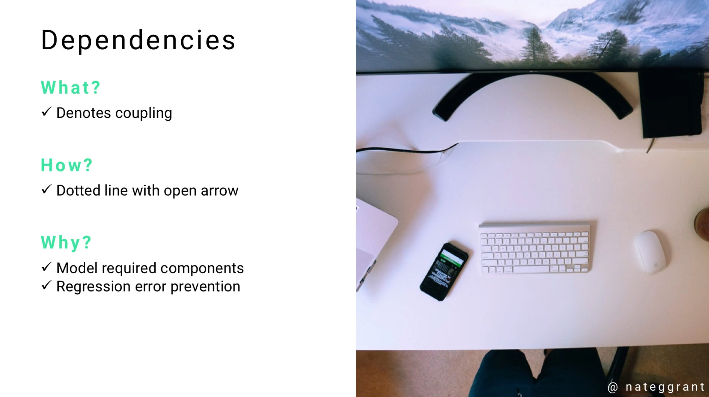
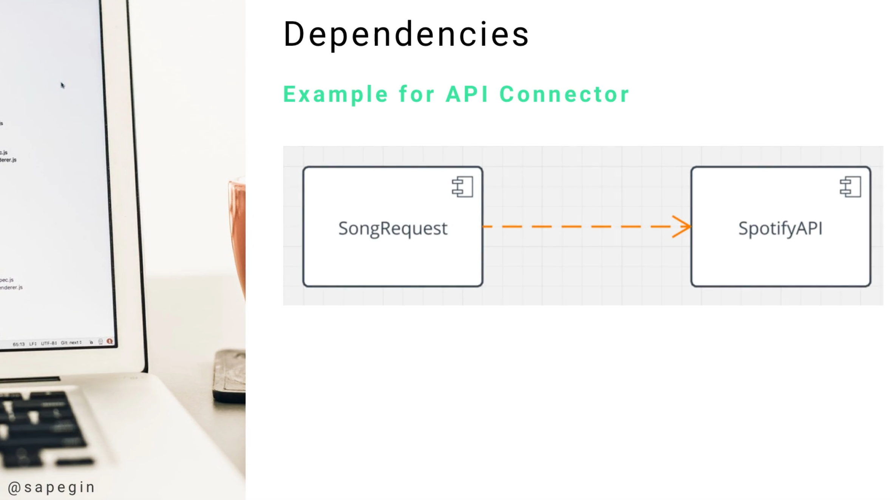

# Module 06 - 157:     UML Components

## DEPENDENCIES

---

1. Introduction to UML Dependencies
   1.1 Definition and Core Concepts
   1.2 The Role of Coupling in Software Design
   1.3 Dependencies as System Architecture Indicators

2. Understanding Coupling
   2.1 Coupling Fundamentals
   2.2 Types of Coupling
   2.3 Coupling Strength Assessment
   2.4 Impact on System Maintainability

3. Visual Representation and Notation
   3.1 Standard UML Notation
   3.2 Arrow Direction and Meaning
   3.3 Line Styles and Variations
   3.4 Stereotyped Dependencies

4. Types of UML Dependencies
   4.1 Use Dependencies
   4.2 Abstraction Dependencies
   4.3 Permission Dependencies
   4.4 Realization Dependencies
   4.5 Substitution Dependencies

5. Dependency Applications Across Diagrams
   5.1 Class Diagrams
   5.2 Component Diagrams
   5.3 Package Diagrams
   5.4 Deployment Diagrams
   5.5 Use Case Diagrams

6. Practical Examples and Case Studies
   6.1 API Integration Dependencies
   6.2 Library and Framework Dependencies
   6.3 Database Connection Dependencies
   6.4 Service Layer Dependencies

7. Dependency Analysis and Management
   7.1 Identifying Critical Dependencies
   7.2 Dependency Impact Assessment
   7.3 Reducing Unnecessary Coupling
   7.4 Refactoring Strategies

8. Best Practices and Design Patterns
   8.1 Dependency Inversion Principle
   8.2 Loose Coupling Strategies
   8.3 Interface-Based Dependencies
   8.4 Dependency Injection Patterns

9. Common Anti-Patterns and Pitfalls
   9.1 Circular Dependencies
   9.2 Over-Coupling Issues
   9.3 Hidden Dependencies
   9.4 Transitive Dependency Problems

10. Tools and Techniques for Dependency Management
    10.1 Static Analysis Tools
    10.2 Dependency Visualization
    10.3 Impact Analysis Methods
    10.4 Automated Dependency Tracking

---

## 1.     Introduction to UML Dependencies

### 1.1     Definition and Core Concepts

A UML **dependency** is a relationship that indicates one element (the client) relies on another element (the supplier) for its proper functioning.   

Dependencies **represent the most fundamental form of relationship in UML**, denoting that changes to the supplier may affect the client.

The essence of dependencies lies in **coupling** - the degree to which one component needs another component to function correctly. Understanding dependencies is crucial for:

- **System architecture comprehension**
- **Impact analysis** during changes
- **Risk assessment** for modifications
- **Maintenance planning** and resource allocation


### 1.2     The Role of Coupling in Software Design

Coupling describes the **interdependence between software modules or components**. In UML dependencies:

- **High coupling** = Strong dependency, difficult to modify independently
- **Low coupling** = Weak dependency, easier to maintain and modify
- **No coupling** = Independent components, maximum flexibility

The goal in software design is typically to achieve **low coupling** **while maintaining necessary functional relationships**.

### 1.3     Dependencies as System Architecture Indicators

Dependencies serve as architectural indicators that reveal:

- **Critical system paths** that cannot be broken
- **Single points of failure** that could crash the system
- **Integration complexity** between components
- **Testing dependencies** and required test sequences
- **Deployment order** requirements for system components

---

## 2.     Understanding Coupling

### 2.1     Coupling Fundamentals

Coupling in software systems manifests through various mechanisms:

- **Data coupling** - Components share data structures
- **Control coupling** - One component controls another's execution
- **Common coupling** - Components share global data
- **Content coupling** - One component modifies another's internal data
- **Message coupling** - Components communicate through well-defined interfaces

### 2.2     Types of Coupling

| Coupling Type | Strength   | Description               | UML Representation                      |
| ------------- | ---------- | ------------------------- | --------------------------------------- |
| **Data**      | Low        | Parameter passing only    | Simple dependency                       |
| **Stamp**     | Low-Medium | Data structure sharing    | Dependency with stereotype              |
| **Control**   | Medium     | Control flow dependency   | Dependency with control stereotype      |
| **Common**    | High       | Global data sharing       | Multiple dependencies to shared element |
| **Content**   | Very High  | Internal structure access | Strong dependency relationship          |

### 2.3     Coupling Strength Assessment

Factors that determine coupling strength:

- **Number of connection points** between components
- **Type of data shared** (primitive vs. complex)
- **Frequency of interaction** between components
- **Degree of knowledge** one component has about another
- **Stability of the interface** between components

### 2.4     Impact on System Maintainability

Strong coupling negatively impacts:

- **Modifiability** - Changes cascade through dependent components
- **Testability** - Difficult to test components in isolation
- **Reusability** - Tightly coupled components cannot be easily reused
- **Understandability** - Complex interdependencies obscure system behavior

---

## 3.     Visual Representation and Notation

### 3.1     Standard UML Notation

Dependencies are represented by:

```
Client -----> Supplier
       (dashed line with open arrowhead)
```



**Visual elements:**

- **Line style**: Dashed or dotted line
- **Arrowhead**: Open triangle pointing to the supplier
- **Direction**: From client (dependent) to supplier (dependency target)
- **Optional labels**: Dependency name or stereotype

### 3.2     Arrow Direction and Meaning

The arrow direction is crucial for understanding the dependency relationship:

```
A -----> B
```

**Interpretation**: "A depends on B"

- A is the **client** (the dependent element)
- B is the **supplier** (the element being depended upon)
- Changes to B may affect A
- A cannot function properly without B

### 3.3     Line Styles and Variations

Different line styles can indicate dependency characteristics:

- **Standard dashed line** - General dependency
- **Dotted line with stereotype** - Specific dependency type
- **Colored lines** - Priority or category indication (tool-specific)
- **Thick/thin variations** - Strength indication (tool-specific)

### 3.4     Stereotyped Dependencies

Common dependency stereotypes include:

- **«use»** - Client uses services of supplier
- **«call»** - Client calls operations on supplier
- **«create»** - Client creates instances of supplier
- **«import»** - Client imports supplier's namespace
- **«access»** - Client accesses supplier's public features
- **«instantiate»** - Client creates instances of supplier class

---

## 4.     Types of UML Dependencies

### 4.1     Use Dependencies

**Use dependencies** indicate that one element requires another for its implementation or operation.

```
Controller -----> Service
           «use»
```

**Characteristics:**

- Most common dependency type
- Indicates operational reliance
- Often represents method calls or service usage

### 4.2     Abstraction Dependencies

**Abstraction dependencies** relate elements at different levels of abstraction.

**Subtypes:**

- **«derive»** - Derived element computed from source
- **«trace»** - Informal correspondence between elements
- **«refine»** - Refined element adds detail to source

### 4.3     Permission Dependencies

**Permission dependencies** grant access rights to elements.

**Subtypes:**

- **«access»** - Public feature access
- **«import»** - Namespace importation
- **«friend»** - Special access privileges (C++ concept)

### 4.4     Realization Dependencies

**Realization dependencies** indicate implementation relationships.

```
ConcreteClass -----> Interface
              «realize»
```

**Usage:** Classes implementing interfaces or components realizing specifications

### 4.5     Substitution Dependencies

**Substitution dependencies** indicate that one element can be substituted for another.

```
SubClass -----> SuperClass
         «substitute»
```

**Usage:** Polymorphic relationships and design pattern implementations

---

## 5.     Dependency Applications Across Diagrams

### 5.1 Class Diagrams

In class diagrams, dependencies represent:

- **Method parameter types** used by a class
- **Local variable types** within methods
- **Exception types** thrown by methods
- **Utility class usage** for operations

**Example:**

```
┌─────────────────┐     «use»     ┌─────────────────┐
│ OrderProcessor  │ ────────────> │ PaymentService  │
├─────────────────┤               ├─────────────────┤
│ + processOrder()│               │ + charge()      │
└─────────────────┘               │ + refund()      │
                                  └─────────────────┘
```

### 5.2 Component Diagrams

Component dependencies show:

- **Service consumption** between components
- **Interface usage** requirements
- **Library dependencies** for functionality
- **Framework requirements** for operation

### 5.3 Package Diagrams

Package dependencies indicate:

- **Import relationships** between packages
- **Access permissions** across package boundaries
- **Compilation dependencies** in build processes
- **Deployment sequence** requirements

### 5.4 Deployment Diagrams

Deployment dependencies represent:

- **Hardware requirements** for software components
- **Network connectivity** needs between nodes
- **Service dependencies** across deployment units
- **Infrastructure requirements** for applications

### 5.5 Use Case Diagrams

Use case dependencies show:

- **«include»** relationships for mandatory sub-use cases
- **«extend»** relationships for optional extensions
- **Actor dependencies** on system capabilities
- **System boundary** crossing requirements

---

## 6.     Practical Examples and Case Studies

### 6.1 API Integration Dependencies

Consider a music request system integrating with Spotify:

```
┌─────────────────┐               ┌─────────────────┐
│ SongRequest     │ ────────────> │ SpotifyAPI      │
├─────────────────┤    «use»      ├─────────────────┤
│ - title: String │               │ + search()      │
│ - artist: String│               │ + getTrack()    │
├─────────────────┤               │ + addToQueue()  │
│ + submit()      │               └─────────────────┘
│ + validate()    │
└─────────────────┘
```

**Analysis**

- SongRequest **cannot function** without SpotifyAPI
- Breaking the API connection **breaks** the SongRequest functionality
- Any changes to SpotifyAPI interface **may require** SongRequest modifications
- This represents **tight coupling** that needs careful management

### 6.2 Library and Framework Dependencies

```
┌─────────────────┐     «import»   ┌─────────────────┐
│ WebController   │ ────────────>  │ Spring Framework│
├─────────────────┤                ├─────────────────┤
│ @RestController │                │ RestController  │
│ + handleRequest │                │ RequestMapping  │
└─────────────────┘                │ ResponseEntity  │
                                   └─────────────────┘
```

### 6.3 Database Connection Dependencies

```
┌─────────────────┐     «use»      ┌─────────────────┐
│ UserRepository  │ ────────────>  │ DatabaseDriver  │
├─────────────────┤                ├─────────────────┤
│ + findById()    │                │ + connect()     │
│ + save()        │                │ + query()       │
│ + delete()      │                │ + disconnect()  │
└─────────────────┘                └─────────────────┘
```

### 6.4 Service Layer Dependencies

```
┌─────────────────┐               ┌─────────────────┐
│ OrderService    │ ────────────> │ PaymentService  │
├─────────────────┤    «call»     ├─────────────────┤
│ + createOrder() │               │ + processPayment│
└─────────────────┘               └─────────────────┘
         │                                 │
         │ «use»                          │ «use»
         ▼                                 ▼
┌─────────────────┐               ┌─────────────────┐
│ InventoryService│               │ NotificationSvc │
├─────────────────┤               ├─────────────────┤
│ + checkStock()  │               │ + sendEmail()   │
│ + reserveItems()│               │ + sendSMS()     │
└─────────────────┘               └─────────────────┘
```

---

## 7.     Dependency Analysis and Management

### 7.1 Identifying Critical Dependencies

**Critical dependency indicators**

- **Single points of failure** - Components with no alternatives
- **High-frequency usage** - Components called repeatedly
- **Cross-boundary dependencies** - Dependencies spanning architectural layers
- **External service dependencies** - Third-party service integrations

**Analysis techniques**

- **Dependency mapping** - Visual representation of all dependencies
- **Impact analysis** - Assessment of change ripple effects
- **Criticality scoring** - Ranking dependencies by importance
- **Failure mode analysis** - Identifying potential failure scenarios

### 7.2 Dependency Impact Assessment

**Assessment criteria**

- **Change frequency** of supplier components
- **Stability** of supplier interfaces
- **Number of clients** affected by supplier changes
- **Cost of modification** when dependencies break
- **Alternative options** available for replacement

**Impact levels**

- **High impact** - Mission-critical dependencies with no alternatives
- **Medium impact** - Important dependencies with difficult workarounds
- **Low impact** - Convenience dependencies with easy alternatives

### 7.3 Reducing Unnecessary Coupling

**Strategies for coupling reduction**

1. **Interface abstraction** - Depend on interfaces, not implementations
2. **Dependency injection** - Externalize dependency creation
3. **Event-driven architecture** - Replace direct calls with events
4. **Service abstraction** - Use service layers to hide implementation details
5. **Configuration externalization** - Move dependencies to configuration

### 7.4 Refactoring Strategies

**Common refactoring patterns**

- **Extract Interface** - Create abstractions for concrete dependencies
- **Introduce Service Layer** - Add indirection between components
- **Replace Inheritance with Delegation** - Reduce coupling through composition
- **Move Method** - Relocate functionality to reduce dependencies
- **Extract Component** - Separate concerns to minimize coupling

---

## 8.     Best Practices and Design Patterns

### 8.1 Dependency Inversion Principle

**Principle statement:** "Depend upon abstractions, not concretions"

**Implementation**

```
┌─────────────────┐     «use»      ┌─────────────────┐
│ HighLevelModule │ ────────────>  │ <<interface>>   │
│                 │                │ AbstractService │
└─────────────────┘                └─────────────────┘
                                           ▲
                                           │ «implement»
                                           │
                                   ┌─────────────────┐
                                   │ ConcreteService │
                                   └─────────────────┘
```

### 8.2     Loose Coupling Strategies

**Design approaches**

1. **Publish-Subscribe Pattern** - Decouple producers from consumers
2. **Mediator Pattern** - Centralize component interactions
3. **Observer Pattern** - Minimize direct dependencies between objects
4. **Factory Pattern** - Decouple object creation from usage
5. **Strategy Pattern** - Make algorithms interchangeable

### 8.3     Interface-Based Dependencies

**Benefits**

- **Flexibility** - Easy to swap implementations
- **Testability** - Simple to create test doubles
- **Maintainability** - Changes isolated to implementations
- **Extensibility** - New implementations without client changes

**Implementation pattern**

```
Client -----> <<interface>> -----> Concrete Implementation
       «use»  AbstractService  «realize»
```

### 8.4     Dependency Injection Patterns

**Common injection types**

- **Constructor injection** - Dependencies provided during object creation
- **Property injection** - Dependencies set through public properties
- **Interface injection** - Dependencies provided through specific interfaces
- **Service locator** - Dependencies retrieved from central registry

---

## 9.     Common Anti-Patterns and Pitfalls

### 9.1 Circular Dependencies

**Problem:** Two or more components depend on each other directly or indirectly

```
A -----> B -----> C
▲                 │
└─────────────────┘
```

**Solutions**

- **Interface extraction** - Break cycles with abstractions
- **Mediator introduction** - Central coordination component
- **Dependency restructuring** - Reorganize responsibilities

### 9.2     Over-Coupling Issues

**Symptoms**

- **Shotgun surgery** - Small changes require many modifications
- **Fragile systems** - Minor changes cause unexpected failures
- **Testing difficulties** - Cannot test components in isolation
- **Deployment complexity** - Must deploy multiple components together

**Prevention**

- **Regular coupling analysis** - Monitor dependency growth
- **Architectural reviews** - Evaluate coupling in design decisions
- **Refactoring discipline** - Continuously improve coupling levels

### 9.3     Hidden Dependencies

**Common sources**

- **Global variables** - Implicit dependencies through shared state
- **Singletons** - Hidden dependencies through global access
- **Static methods** - Direct usage without explicit declaration
- **Framework magic** - Dependencies created by frameworks

**Detection strategies**

- **Static analysis tools** - Automated dependency discovery
- **Code reviews** - Manual inspection for hidden dependencies
- **Testing isolation** - Identify dependencies through test failures

### 9.4     Transitive Dependency Problems

**Issues**

- **Version conflicts** - Different versions of same dependency
- **Bloated deployments** - Unnecessary dependencies included
- **Security vulnerabilities** - Unknown dependencies with issues
- **License complications** - Conflicting license requirements

**Management approaches**

- **Dependency analysis tools** - Map transitive dependencies
- **Version management** - Control dependency versions explicitly
- **Regular audits** - Review and clean up dependencies
- **Minimal dependency principle** - Only include necessary dependencies

---

## 10.     Tools and Techniques for Dependency Management

---
### 10.1     *Static Analysis Tools*

#### **Code analysis tools**

- **SonarQube** - Dependency analysis and coupling metrics
- **NDepend** - .NET dependency analysis and visualization
- **JDepend** - Java package dependency analysis
- **Dependency Cruiser** - JavaScript/TypeScript dependency analysis

#### **UML tools with dependency analysis**

- **Enterprise Architect** - Comprehensive dependency modeling
- **Visual Paradigm** - Dependency impact analysis
- **MagicDraw** - Advanced dependency management features

---
### 10.2     *Dependency Visualization*

#### **Visualisation techniques**

- **Dependency graphs** - Node-and-edge representations
- **Dependency matrices** - Tabular dependency relationships
- **Layered diagrams** - Architectural layer dependencies
- **Tree structures** - Hierarchical dependency views

#### **Visualisation tools**

- **Graphviz** - Graph visualization engine
- **D3.js** - Interactive dependency visualizations
- **Gephi** - Network analysis and visualization
- **yEd** - Professional graph editing and analysis

---
### 10.3     *Impact Analysis Methods*

#### **Analysis approaches**

- **Forward impact** - What does this component affect?
- **Backward impact** - What affects this component?
- **Change impact** - What changes when this is modified?
- **Failure impact** - What fails if this component fails?

#### **Impact analysis tools**

- **Lattix** - Architecture and dependency analysis
- **Structure101** - Dependency structure matrices
- **CAST** - Application intelligence and impact analysis

---
### 10.4     *Automated Dependency Tracking*

#### **Tracking capabilities**

- **Build-time analysis** - Dependencies identified during compilation
- **Runtime monitoring** - Dynamic dependency discovery
- **Version tracking** - Dependency version changes over time
- **Usage analytics** - Frequency and patterns of dependency usage

#### **Implementation tools**

- **Maven/Gradle** - Build-time dependency management
- **NPM/Yarn** - JavaScript dependency tracking
- **NuGet** - .NET package dependency management
- **Pip/Poetry** - Python dependency management

---

## 11.     Standards and References

### 11.1     UML Standards and Specifications

- **OMG UML 2.5.1 Specification** - Object Management Group
  - Section 7.8: Dependencies and their semantics
  - Section 11.1: Dependency notation and usage
- **ISO/IEC 19505-1:2012** - UML Infrastructure specification
  - Part 1: Core UML concepts and dependency relationships
- **ISO/IEC 19505-2:2012** - UML Superstructure specification
  - Part 2: Detailed dependency type definitions

### 11.2     Software Architecture and Design Standards

- **IEEE 1471-2000** - Recommended Practice for Architectural Description
  - Dependency documentation in architectural views
- **IEEE 42010-2011** - Systems and Software Engineering Architecture Description
  - Updated architectural description standards
- **ISO 25010:2011** - Systems and Software Quality Requirements and Evaluation (SQuaRE)
  - Maintainability and coupling quality characteristics

### 11.3     Design Principles and Best Practices

- [Dependency Inversion Principle - Martin Fowler](https://martinfowler.com/articles/dipInTheWild.html)
- [Patterns in Practice: Cohesion And Coupling | Microsoft Learn](https://learn.microsoft.com/en-us/archive/msdn-magazine/2008/october/patterns-in-practice-cohesion-and-coupling)

### 11.4     UML Modeling Resources

- [UML Dependencies - UML-diagrams.org](https://www.uml-diagrams.org/dependency.html)
- [Component Diagram - UML 2 Diagrams - UML Modeling Tool](https://www.visual-paradigm.com/VPGallery/diagrams/Component.html)
- [UML Component Diagrams: An Agile Introduction](https://agilemodeling.com/artifacts/componentdiagram.htm)

### 11.5     Software Engineering References

- **"Clean Architecture" by Robert C. Martin** - Dependency management principles
- **"Software Architecture in Practice" by Bass, Clements, and Kazman** - Architectural dependency analysis
- **"UML Distilled" by Martin Fowler** - Practical UML dependency usage
- **"Pattern-Oriented Software Architecture" by Buschmann et al.** - Dependency patterns and solutions

### 11.6     Industry Frameworks and Guidelines

- **TOGAF** - The Open Group Architecture Framework dependency modeling
- **Zachman Framework** - Enterprise architecture dependency perspectives
- **DoDAF** - Department of Defense Architecture Framework dependency views
- **SABSA** - Sherwood Applied Business Security Architecture dependency analysis


---

## Video Lesson Speech

Moving our way down the line of coming UML, the next component is the 
Dependency. A high level explanation of a dependency is that they denote
 coupling. Coupling gives us the ability to see how badly one component 
needs another component.

---

## Dependencies

That is really the most straightforward explanation on being able to understand how a coupling work, that in turn describes how dependencies work. 


From a practical perspective, it's simply a dotted line with an open arrow from one element to another. Why is it important? Well we need to know which components need other components. If we do not know how this works, whoever is building the system is not going to be able to know how important one element is to another. 

There is another important purpose. If I'm new to a project that has been around for several years, usually that project has thousands if not tens of thousands of lines of code. It's very difficult to know if one part of the website or the application needs some other part. What could potentially happen is I may not understand that one part of the application has that dependency. I may rip it out when I'm building a new feature or I'm customizing, then the entire system could break. 

The dependency gives us the ability to know what parts of the application or the software need other parts. The dependency is shown with a dotted line with the open arrow. 


Our example right here is for a music and song request system that connects to Spotify. This is a pretty simple example but this is an application that I'm currently building and is a very real UML diagram. 

We have this song request class and it communicates with the Spotify API. If I remove the Spotify API or I break that connection the SongRequest class will no longer work. Coupling means that one component relies on another component and if it does not have it then will not function properly. 
