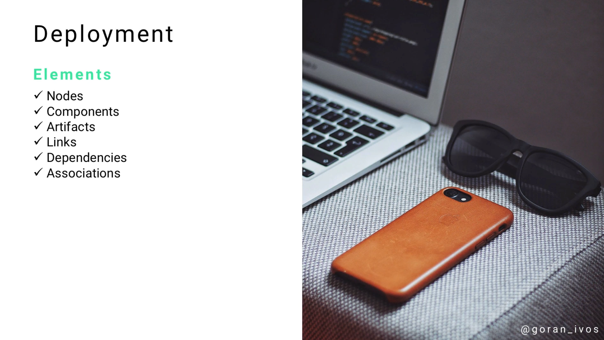
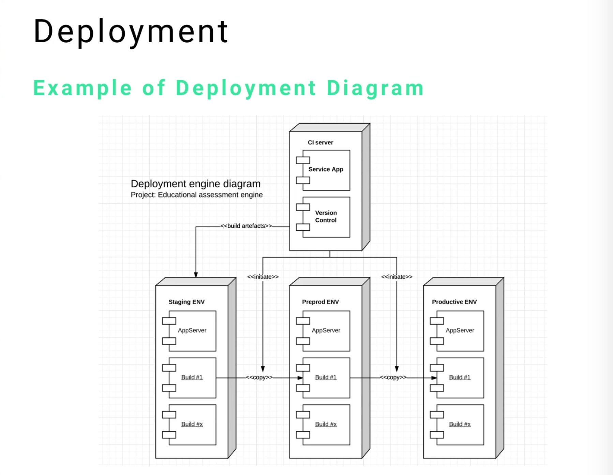
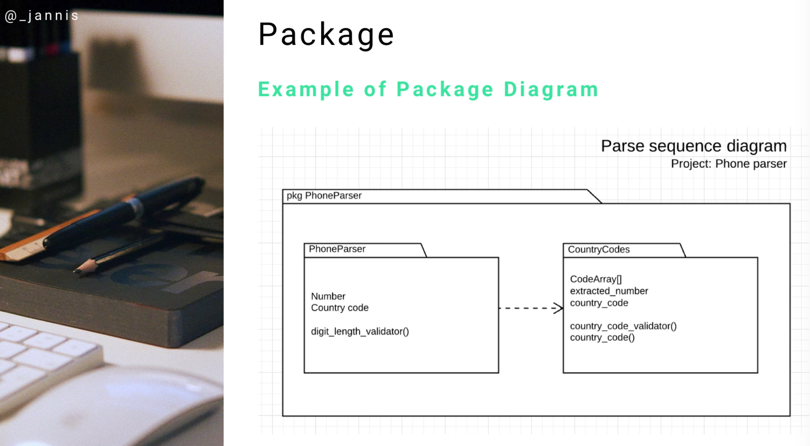

# MODULE 06 - 160    UML Diagrams

## Structural Diagrams - Overview

---

---

## Video Lesson Speech

In this section on diagrams, we we're going to take a high-level overview of structural UML diagrams.

---

## Structural Diagrams

We're going to start off by going through the three main types, `Class`, `Deployment`, and `Package`. 

Each one is going to have their very own section of the course so we're not going to dive too far deep into those. I want to provide a resource so that you can have a high-level overview. You can start to see some familiar types of components on the page and the more you see it the more you're going to become familiar with it and feel comfortable using it in your own projects. 

## Class Diagram

The first diagram we're going to talk about is the Class diagram. The class diagram is probably the most popular and most common type of diagram that you're going to see. If an organization is a fan of utilizing UML for architecture but it's a small dev shop, they may want to use their time as efficiently as possible. They don't always have the time to build out an entire set of diagrams outlining every part of the system. If they want to have one diagram they can point to for how their system was put together, they can use a class diagram. 

A class diagram fits in very well with a database modeling system. If you're trying to start a new project, a commonplace to start is to pick out what type of data you want, how you want those elements to be associated with each other, and some of the core operations. The elements that make up a class diagram are `Name`, `Attributes`, and `Operations`.

Looking at an example, you saw this one earlier when we're talking about the elements, we have a class diagram for our Topic class. Our topic has attributes, name and operations. The top part is the `name` of the class followed by the `attributes` and the bottom has the `operations`.

To take more of a deep dive, Let's see what each one really does and also what some symbols represent. 

We know the top class name is "topic." The next box is where you put all your attributes. if you're going to take this class diagram and translate it to use a `Mysql` or a `Postgres` database table, you would create a table called topic or topics. 

You know you're going to have a title, slug, created at and updated at field for your topics table. It's going to have a set of data types, titles are going to be a string, slug is going to be a string and created at and updated at are both going to be Date Time fields. 

One great thing about using class diagrams is, if you gave this class to a database administrator, they would know what they need in order to create a schema, create a database table, they'd know what attributes to give and they'd be able to copy and paste each one of these elements in order to build that out.

Additionally, you can use it when building the functionality itself. For example, if you look at the bottom, we have operations. The operations have specific syntax.

The little plus sign means that the operation/method/function is available to outside classes. In other words, if we have a controller that calls topic, it creates a topic. It can then call top ten on that topic instance and bring back the top ten topics. 

If we add a little minus sign, that would mean that it is an operation/method/function that is only available to the topic. For example, if we had some specialized algorithm that determined the top ten and we didn't want any other class to be able to call it, we would put a little minus sign right there to say this is private. It's visible only to the topic. 

So that's a very high-level view of how a Class diagram works. 

## Deployment Diagrams

Next, we're going to talk about deployment diagrams. deployment diagrams are made up of six different elements. 

At a high level, deployment diagrams give us the ability to model how an entire system architecture should be configured. 

If we have an application that has multiple servers, multiple places where we can store code and it's going to communicate with the system, a deployment diagram is perfect for setting that up.

For right here, let's talk about things at a high level. This is a deployment diagram for an assessment engine, starting at the top, it has what is called the CI server. In the CI server we have:

- Staging environment
- Pre-production environment
- Production environment

Each of these are the nodes for the deployment diagram. Those large boxes are what a node is. Inside, It has components, these components could be their own applications, processes, or anything like that.

Starting with the CI server, we have a service app and then we have version control. If you're relatively new to DevOps, CI stands for "Continuous Integration." If you have an application on your local machine, you don't just send that application up to the final production server.  The typical process for a large scale system is you'd push to a CI server. From there it would process a number of different procedures, it would run all of your tests, It would run your database migrations, etc. The main goal of the CI server is to guide and protect your deployment, preventing an accidental deployment of something that shuts down the entire system. 

From there, CI server is going to be connected via different archetypes with the build artifacts and it's going to connect to the staging environment. From there the staging environment has an app server, It has a build process and it also has X number of additional build processes. 

A practical example of this would be having a node application, that node application has things such as a sass Precompiler and it also uses gulp, etc. You can have all those builds right in with that staging environment node. 

If everything works on staging, you have the ability through the CI server to copy everything over and deploy that to a pre-production environment. That's usually where QA will perform their testing, then you can finally copy everything over and deploy to the production environment. 

This is a standard setup, we have four servers here and the deployment engine allows us to connect all of them together to show at a high level how the system components are going to be organized.

## Package Diagram

Moving on to the last diagram. The package diagram is something that I use when I am building a code library where I want to allow another application to communicate with. 

For the example below, this is a phone parser ruby gem that I built for another project. You can see a frame surrounding it and it's a package diagram for the phone parser gem library that I built. it's made up of a couple different sub-packages. 

We have a phone parser and this has a few elements:

- Number 
- Country code
- Digit length validator

If you notice right there in between we have a dependency. Remember dependencies are those elements that have the dotted lines connected to an open arrow. 

A dependency to country codes, which is another code library all wrapped inside of the phone parser package. Inside of there, we have some data collections and we have some other operations. The nice thing about a package diagram like this, we have the ability to, at a glance, see that we have these two modules that make up the package. We know that one of the modules depends on the other and we can see all of the attributes and operations at a glance. 

This makes it easy when you have these types of diagrams, you can organize your code and it also makes it a bit easier to think through things. If you looked at your hub repo or you open that code up on your local machine, it is challenging to understand all of the components that make a system. 

This is a basic one, this only has two modules inside of it. Imagine a project that has a code library that's massive, 50 or 100 of these. It can be hard to wrap your mind around all of that. A package diagram allows you to encapsulate all of the important items, see how they're related to each other and see which ones depend on the others. This allows you to move forward with the most efficient process possible.     
