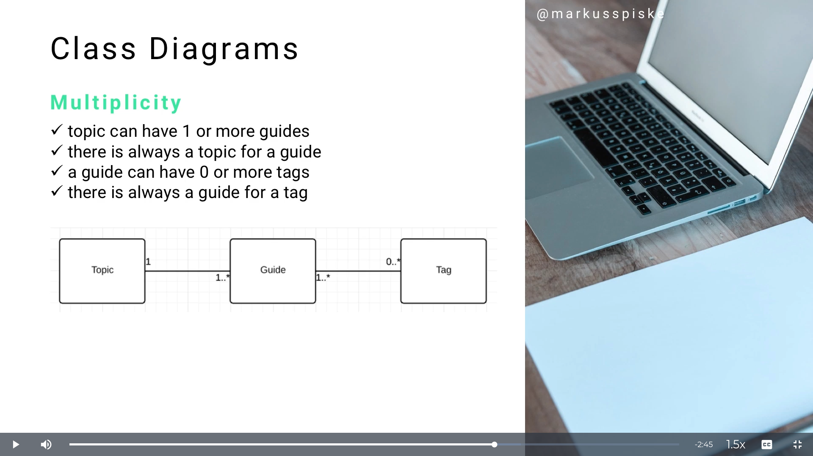
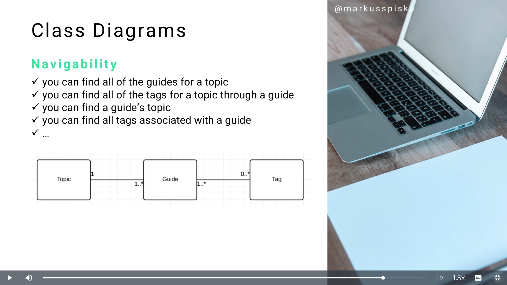

# MODULE 06 - 164    UML Diagrams

## Class Diagram Associations, Multiplicity, Navigability

---

---

## Video Lesson Speech

As we've analyzed our UML class diagrams, we've been looking at the 
elements that make up that diagram. That by itself is only one part of 
what it takes to build an effective full diagram for a system.

---

The other side is being able to establish the right kinds of associations between classes. I have created three different classes and taken out the attributes and the operations so we can focus on the relationships. Relationship is the same thing as an association, It is how one class is connected to another.

I have a topic class which is connected to a guide which is connected to a tag class. Each of these has a relationship/association with the other one. This is how you can set up your associations at a high level. You may have noticed those little `1's` and `0's`, `...` , `*`, those are ways that we can be very clear and very explicit about that type of association. 

In addition to associations, we have a few other sub-points. 

- Association
- Multiplicity
- Navigability

Each one of those is needed in order to properly set up an association inside of a class diagram.

## Association

We're going to talk about a high level Association, I'm going to give examples based off of this set of topic, guide, and tag. Using our current setup we can say

- guide belongs to a topic
- topic has many guides
- guide has many and belongs to tags
- tag has many and belongs to guides

How do we know that a topic has many guides and not the other way around? When we talk about those things that may seem kind of intuitive, however, the numbers are what give it away. That leads to how we need to understand multiplicity. 

## Multiplicity

Multiplicity is how we designate the direction of the relationship in regards to numbers. Right here we can see

- Topic can have 1 or more guides. The way that we can see this is, the line from topic to guide says `1...*`, that means that a topic can have one or more guides. 

- Going in the opposite direction, guide has an association line to topic. A guide is always going to have one topic. You see how we only have  `1` by itself and there is no `...*`, that means that a guide belongs to a topic. There is always going to be one topic for every guide. 

- We have a guide and it can have `0` or more tags. That means, if you think about building a blogging engine, you can create a guide. If you have a tag class attached to it, you may want to be able to create this guide with no tags or create it with any number of tags. That's a pretty standard way of setting up that type relationship. You would denote it exactly like how we have here, we would say a guide can have 0 to many tags. 

- There is always at least one guide for every tag. The tag, if you think about it in a blogging sense, are not going to live by itself. A tag has to have some guide that it was created for and added to in order to be alive, that's its dependency. It can also belong to many guides. Think of having multiple blog posts where you're talking about UML, you may add the tag UML, you would add that to the blog/guide. That means a tag can still have many guides, once we get into our detailed breakdown and go into how we would rebuild Twitter using a class diagram, we're going to see this type of relationship quite a bit. 

Another more simplified way is, we can draw a line and put a star there. If we put a guide and connected it to tag, we could put a star where the tag is and most developers could see that we mean a guide can have many tags. That's another type of approach you will see often. 

## Navigability

Navigability deals with is how you can have one class communicate with any other class. This sets the rules for knowing how that communication can take place. 

- You can find all of the guides for each topic because topic is connected to guide
- You can find all of the tags for a topic through a guide. Imagine that we add a topic, like UML, and underneath that, we had any number of guides. if you traverse and go from topic to one of the guides, you could get access to see all of the tags that are associated with that guide. You can do that for each one of the other ones, you can find a guide topic, you can find all the tags associated with a guide, etc. 

This is a great time to point out why UML is so powerful. Imagine a situation where we didn't have UML., (UML was never invented) and we had to write out all of these associations so the developer would be able to understand it and translate it into code. Notice, we didn't have room to write all the different ways you could navigate from a topic to a tag using these 3 classes. Imagine taking a system that has several classes and all kinds of different relationships. It would be a very long list in order to build those and write out all navigation rules. With UML, you can visually see how each one of these elements is connected. You could pick one and then traverse the line to see what items it can navigate. If it can navigate to it here it should be able to do that in the code. 
