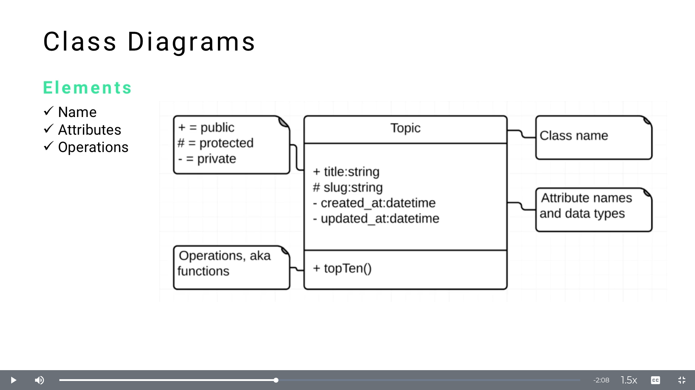

# MODULE 06 - 164    UML Diagrams

## Class Diagram Elements - Overview

---

# Class Diagram Fundamentals Guide

## Overview
Class diagrams are the most popular structural diagrams in UML. They provide a blueprint for your object-oriented system by showing the static structure of classes and their basic elements.

## Class Diagram Structure

Every class diagram consists of **three main sections**:

```
┌─────────────────┐
│   Class Name    │  ← Name Section
├─────────────────┤
│   Attributes    │  ← Attributes Section
├─────────────────┤
│   Operations    │  ← Operations Section
└─────────────────┘
```

---

## 1. Name Section

### Purpose
- Identifies the class
- Should be a **noun** representing the entity
- Follows **PascalCase** convention

### Best Practices
- Use descriptive, meaningful names
- Avoid abbreviations unless universally understood
- Keep it concise but clear

### Examples
```
User
BankAccount
ShoppingCart
EmailService
```

---

## 2. Attributes Section

Attributes represent the **data** or **properties** that objects of this class will hold.

### Required Components
Each attribute must include **three elements**:

1. **Visibility**
2. **Name** 
3. **Data Type**

### Visibility Symbols
| Symbol | Visibility | Meaning |
|--------|------------|---------|
| `+` | Public | Accessible from anywhere |
| `#` | Protected | Accessible within class and subclasses |
| `-` | Private | Accessible only within the class |

### Syntax Format
```
[visibility][name]: [dataType]
```

### Examples
```
+ firstName: String
+ lastName: String
+ age: Integer
- accountBalance: Double
# userId: Long
```

### Real-World Class Example
```
┌─────────────────┐
│   BankAccount   │
├─────────────────┤
│ + accountNumber: String │
│ + holderName: String    │
│ - balance: Double       │
│ # accountType: String   │
└─────────────────┘
```

---

## 3. Operations Section

Operations represent the **behavior** or **methods** that the class can perform.

### Key Characteristics
- Always followed by **parentheses** `()`
- Use **visibility symbols** (same as attributes)
- Represent what the class **can do**

### Visibility Rules
- `+` (Public): Can be called from **outside** the class
- `-` (Private): Can **only** be called from **within** the class
- `#` (Protected): Can be called from class and **subclasses**

### Syntax Format
```
[visibility][methodName](): [returnType]
```

### Examples
```
+ deposit(): void
+ withdraw(): boolean
+ getBalance(): Double
- validateAccount(): boolean
# generateReport(): String
```

### Complete Class Example
```
┌─────────────────────────┐
│      BankAccount        │
├─────────────────────────┤
│ + accountNumber: String │
│ + holderName: String    │
│ - balance: Double       │
│ # accountType: String   │
├─────────────────────────┤
│ + deposit(): void       │
│ + withdraw(): boolean   │
│ + getBalance(): Double  │
│ - validateAccount(): boolean │
│ # generateReport(): String   │
└─────────────────────────┘
```

---

## Programming Language Mapping

### JavaScript/TypeScript Example
```typescript
class BankAccount {
    public accountNumber: string;
    public holderName: string;
    private balance: number;
    protected accountType: string;
    
    public deposit(): void { }
    public withdraw(): boolean { }
    public getBalance(): number { }
    private validateAccount(): boolean { }
    protected generateReport(): string { }
}
```

### Python Example
```python
class BankAccount:
    def __init__(self):
        self.account_number = ""    # public
        self.holder_name = ""       # public
        self.__balance = 0.0        # private
        self._account_type = ""     # protected
    
    def deposit(self):              # public
        pass
    
    def withdraw(self):             # public
        pass
    
    def get_balance(self):          # public
        pass
    
    def __validate_account(self):   # private
        pass
    
    def _generate_report(self):     # protected
        pass
```

---

## Common Data Types

### Primitive Types
- `String` - Text data
- `Integer` - Whole numbers
- `Double/Float` - Decimal numbers
- `Boolean` - True/false values
- `Date` - Date/time values

### Object Types
- Custom class names (e.g., `User`, `Address`)
- Collections (e.g., `List<String>`, `Array<Integer>`)

---

## Quick Reference Template

```
┌─────────────────┐
│   ClassName     │  ← PascalCase noun
├─────────────────┤
│ + attr1: Type   │  ← Public attribute
│ # attr2: Type   │  ← Protected attribute  
│ - attr3: Type   │  ← Private attribute
├─────────────────┤
│ + method1(): ReturnType │  ← Public method
│ # method2(): ReturnType │  ← Protected method
│ - method3(): ReturnType │  ← Private method
└─────────────────┘
```

---

## Key Takeaways

1. **Three sections**: Name, Attributes, Operations
2. **Visibility matters**: Use `+`, `#`, `-` appropriately
3. **Operations always have parentheses**: `methodName()`
4. **Attributes show data**: What the object **has**
5. **Operations show behavior**: What the object **does**

This foundation prepares you for more advanced concepts like relationships, associations, and multiplicities in the next guide.


---

## Video Lesson Speech

We're going to start off this section on the class diagrams with a 
review. You may be curious on why we're returning to this topic class 
diagram. We've walked through it a few times.

---

I wanted to design this course so in the future you would have a quick reference.



A Class diagram has three elements.

- Name
- Attributes
- Operations

The name is the most self-explanatory piece, we have a topic which is
 the name for this class diagram. In a real-world scenario, you wouldn't
 add these specific types of notes like class name because it's 
self-explanatory.

Attributes have three different items at a minimum that you should include.

- Visibility (public/protected/private can be denoted with a plus/hash/minus)
- Name
- Data Type

Operations are methods/functions. Add a plus if you want to call from
 outside of the topic or a minus if you do not want to call outside the 
topic. Also, operations are always followed by parentheses.
