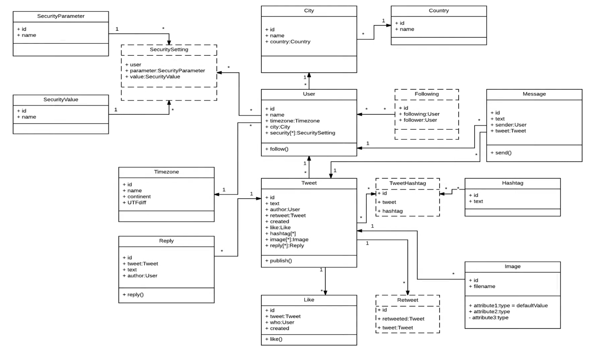
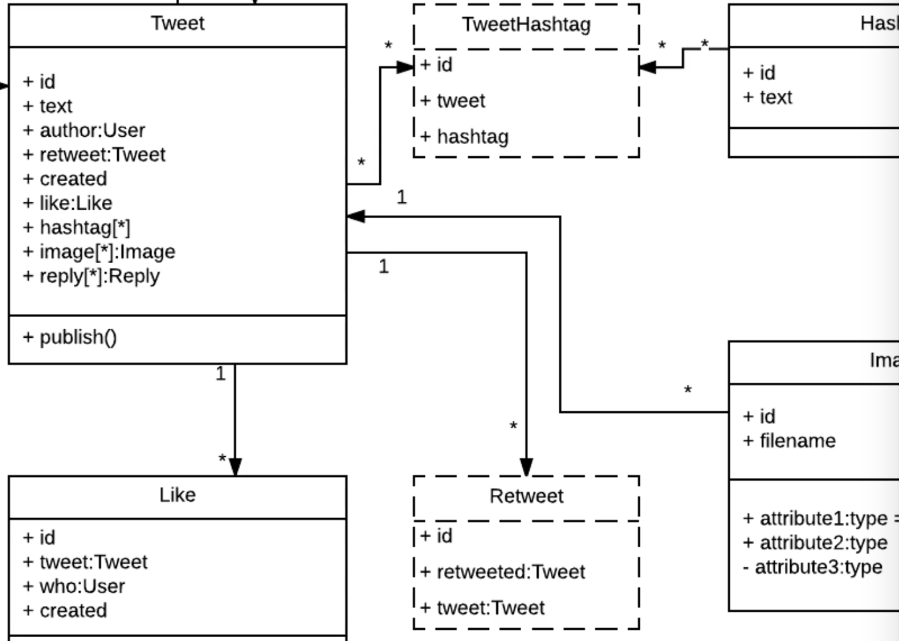
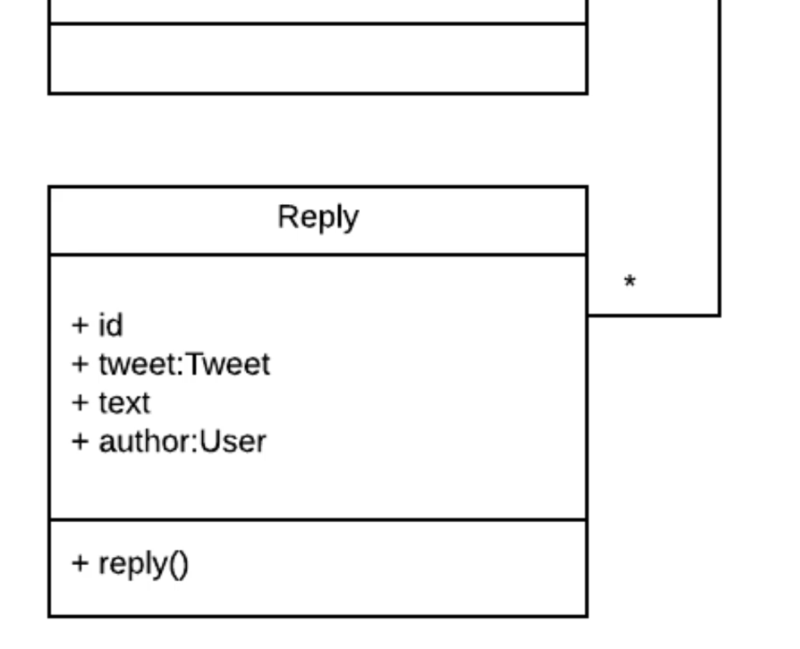
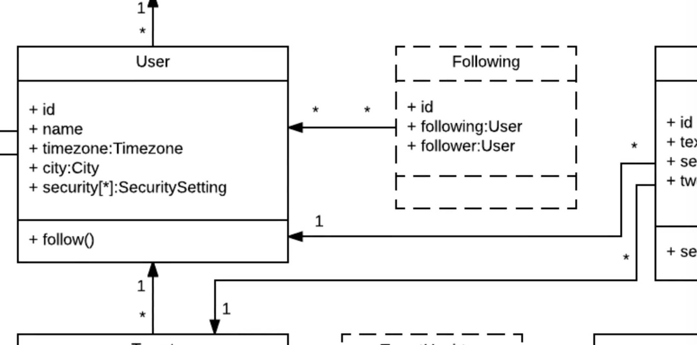

# MODULE 06 - 165    UML Examples

## Build Twitter using Class Diagrams

---

---

## Video Lesson Speech

Now that you've seen all of the elements that make up a class diagram 
and you have seen the various associations we use in order to show how 
classes are associated, we're ready to take a deep dive into building a 
non-trivial type of class diagram.

---

We have a very special treat, we are going to rebuild Twitter using UML. 

We have a Twitter class diagram. It is made up of a number of classes, everything from the main `tweet` class, all the way through security parameters messages. The real Twitter, the full application that we all know and love, is probably much larger than this. Given my experience, I can tell you they probably have a lot of other classes we simply don't know about. I wanted to extract out many of the different elements that we are aware of to show how we could design it ourselves. 

There are a couple of things that I want to note before we get into detail on different portions of the diagram. I am using a slightly different type of syntax than a formal by the book UML. When we come up to those times I'm going to show you I'm doing this for a very specific reason. I've mentioned a few times throughout this course that UML is challenging to standardize. We have a standard called the UML standard, however, I've noticed if I go to ten different organizations that all implement UML, I would get ten different versions of UML. I personally think that in addition to understanding all of the important elements and the diagram types, another important skill is to adjust and be flexible with how other people have implemented UML. As we go through this diagram I will point out when something doesn't fit exactly with the specification. I'll explain why a decision was made, it wasn't just randomly made or done just out of spite to the UML standard. It's actually for a very specific purpose.

Anytime I go outside of the realm of standard UML it's for a specific reason. Since I'm building these diagrams for myself/other developers/other stakeholders I am not going to live by a standard when I know that I could do something better. As you start to grow in your own UML knowledge and start building out complex systems, my guess is you will start to customize in ways that fit best for you. 

So the very first item that I want to look at is one of the most key components of Twitter which is the `tweet` class.

Looking at the `tweet` class, this is a pretty massive class. It has a number of attributes, everything from an ID through likes. We also have a number of items such as hashtags, images, replies, etc. We also have the ability to publish items, which is one of the operations. The real Twitter has many other items. We're not going to go into each one. The important part is understanding which elements are needed in order to build it. 

Looking at the `tweet` class we can see that it has a number of associations. One of the items I'm going to harp on throughout this guide, and anytime I talk about class diagrams, are the associations. Associations are one of the most important parts when it comes to building out a class diagram. If you didn't care about the associations and how those were formulated, you could just type a class name and list out the attributes and different operations you wanted. You wouldn't have to worry about building the whole thing. Association is really where the power of UML comes in. 

We see that a tweet belongs to a user. If you notice, we have `1` to the `*` of "like", remember when I talked about associations, I talked about multiplicity. I said that we don't always have to do something like `0..*` order to say that something has a many kind of relationship. Many times you're going to simply see a `*`, what that represents is that we have a one to many relationship. This means is that a user can have many tweets. We also know since `*` goes to `1` that a tweet has to have one user. In order for a tweet to be in existence/created a tweet object has to be associated with at least one user. 

If you look down inside of the tweet attributes, we have an attribute called "author." Depending on what kind of programming language and framework you're using this might also be called user_ID. Technically, you could call it by any name you want but it's operating as the foreign key to the user table. You can tell because it is called class user right after. 

We have an ID, text, author, and one called retweet.

Now you see this `retweet` class. I want to point out this is not formal UML right here. You see what we have with a dotted line around the retweet class, you're going to see this for the `tweet`, `#`, for `following` and for the `security` setting. That represents a join table with a bidirectional relationship. Essentially, it means it is an area in the database. In the way that I'm looking at it, it's a class that does nothing but connects other classes. It's kind of like a go-between database table, it is only used as a way of navigating from one class to another. 

We have what's called a self-referential join table. What that means is that when someone performs a retweet, there is not a duplicate kind of tweet that occurs, what's happening is it's creating a new record called "retweet." That is going to have a retweeted object and then it's going to have a `tweet` object, those both reference to the same table. If anyone going through this is on Twitter, you know how read tweets work. This is the database relationship you have set up, you need a join table and you need a way of keeping track of which tweets have been retweeted. Then you just need a reference point to that. That's something that is very helpful, you can tell what the original tweet was and then which one represents the retweeted version. 

Moving down to the very bottom, you can see we have a `like` class, the relationship between `like` is going to belong to a `tweet.` 

If you look at those parameters, we have

- id
- tweet 
- who (which lists out the user that like the tweet)
- created (which says when that tweet was liked)

For the one operation, we have a like, that's what would manage the process of actually liking the tweet. 

If you're thinking about this in regards to how you would build the feature, you'd have this "like" method that would be able to be called. When someone presses that button, it would perform all the actions. It would say what the tweet was, who is liking it, and it would associate the time stamp on the server to and create a record in the database. 

The `reply` class gives us the ability to have users reply to a tweet, which is a common pattern that you see when you go to Twitter. The `reply` class has a reference to the `tweet` that owns it. 

Hopefully, you can start to see a pattern here. The way the relationships and associations are configured then set up and how one class can communicate with another one. We're not going to go to every single one of these, if you look you'll see it's pretty much identical in most regards. It's simply a matter of rearranging the attributes, names, and direction the associations point to. 

There is just a couple more items that I want to focus on.

The next one is with the `user` class and `following` class. One of the more confusing and advanced features that you'll come across when you're building out social networks is the ability to have a user or one class reference itself. 

Imagine a situation where you have "Bob" and "Alice." They are both users on Twitter and Bob follows Alice. How are you going to keep track of that? They're both in the same class. It's not like our relationship between a user and a tweet, those are two completely different tables and it's easy to set that up. 

What happens when you need to keep track of one object inside of a class that is keeping track and having a reference to another object in the same class? 

That is where self referential tables come into play. Right here we'd have a following table. This following table does nothing except keep track of who is following who. Both references are back to the user class and they'll keep track of Bob's ID and Alice's ID. When you want query, you can check to see how many followers does Alice have, it will bring up all the people that followed her (including Bob).

That is very different if you've never done it before, it's a completely different way of thinking about database relationships. It's also a common pattern that you will need to follow. 

The last item I'm going to point to is this `TweetHashtag` join table.

We talked about self-referential tables, we have a few other join tables that are simply managing the connection between two classes. So `TweetHashtag` connects the `Tweet` to the `Hashtag`. This is what you typically want to do whenever you have a many to many relationship. A `tweet` needs to be able to have many hashtags and vice versa a hashtag needs to have many tweets. 

If you think about this logically, if you have a `tweet`, you can't store the `hashtag` inside of that tweet in that database record. Vice-versa with your hashtag, you can't store all of the tweets associated with that hashtag inside of a single hashtag record. 

What a join table does is it gives the ability to say every time a `tweet` has a `hashtag`, it creates a new record in the database. Now you have this reference to the tweet and the hashtag which that makes it more straightforward to call tweet and see what are the hashtags. You can look up the hashtag and see what tweets are associated with it. 

That's another common pattern. It's something that may seem a little challenging. In all actuality, by building these types of join tables, it makes it more straightforward to think about. You're breaking it down into tiny pieces. 

That is an analysis on the class diagram for Twitter. 
