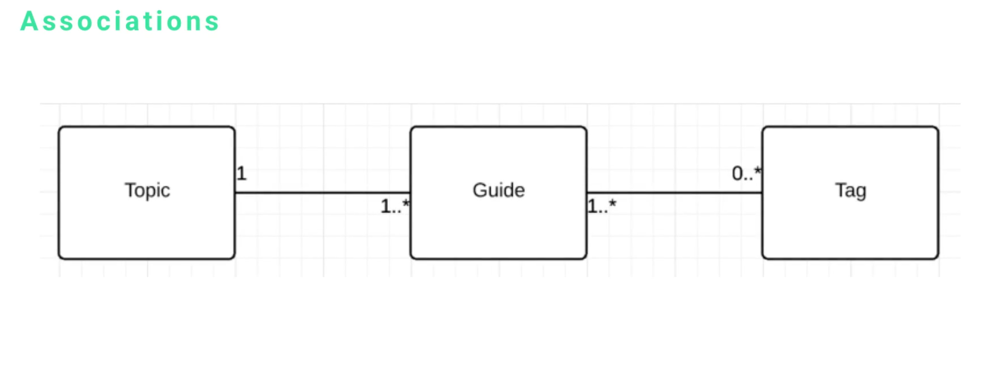

# MODULE 06 - 165    UML Diagrams

## Class Diagram Associations, Multiplicity, Navigability

---

1. Introduction to Class Relationships

2. Association Fundamentals
   2.1. Basic Relationship Concepts
   2.2. Topic-Guide-Tag Example
   2.3. Association Direction and Meaning

3. Multiplicity Specification
   3.1. Numerical Relationship Indicators
   3.2. Common Multiplicity Patterns
   3.3. Simplified Star Notation
   3.4. Real-World Application Examples

4. Navigability Rules
   4.1. Class Communication Pathways
   4.2. Traversal Capabilities
   4.3. UML Visual Advantage

5. Best Practices for Class Relationships

6. Implementation Guidelines

---

## 1.    Introduction to Class Relationships

While understanding individual class components (name, attributes, operations) forms the foundation of UML class diagrams, **establishing proper associations between classes completes the system design**.  

Class relationships define how objects interact, communicate, and depend on each other within the system architecture.

The three essential aspects of class relationships are:

- **Association**: The fundamental connection between classes
- **Multiplicity**: Numerical constraints defining relationship cardinality
- **Navigability**: Rules governing how classes can access and communicate with each other

These concepts work together to create precise, implementable system designs that translate directly into code structure and database relationships.

---

## 2.   Association Fundamentals

### Basic Relationship Concepts

Association represents the fundamental connection between classes, defining how instances of one class relate to instances of another.  
**In object-oriented systems, associations model real-world relationships and dependencies.**

**Key Association Principles:**

- Associations are **bidirectional by default**
- Each association **has specific meaning and purpose**
- Association strength varies **from loose coupling to tight dependency**
- Proper associations enable **effective system navigation and data access**

### Topic-Guide-Tag Example

Using a content management system model with three classes:

**Relationship Definitions:**

- **Guide belongs to Topic**: Each guide is categorized under one topic
- **Topic has many Guides**: Topics can contain multiple guides
- **Guide has many Tags**: Guides can be tagged with multiple keywords
- **Tag belongs to many Guides**: Tags can be applied to multiple guides


This creates a hierarchical content structure where topics organize guides, and tags provide cross-cutting categorization.

### Association Direction and Meaning

Association direction determines relationship ownership and dependency:

**Ownership Patterns:**

- **One-to-Many**: Parent class contains multiple child instances
- **Many-to-Many**: Bidirectional relationships with multiple instances on both sides
- **One-to-One**: Singular relationship between class instances

The numerical indicators on association lines specify these relationships precisely, eliminating ambiguity in system design.


---

##  3.   Multiplicity Specification

### Numerical Relationship Indicators

Multiplicity defines the quantitative aspects of associations using specific notation:

**Standard Multiplicity Notation:**

- `1`: Exactly one instance
- `0..1`: Zero or one instance (optional relationship)
- `1..*`: One or more instances (at least one required)
- `0..*` or `*`: Zero or more instances (completely optional)
- `n..m`: Specific range (where n and m are numbers)

### Common Multiplicity Patterns


**Topic to Guide Relationship: `1..*`**

- Each topic must have at least one guide
- Topics can contain unlimited guides
- Prevents orphaned topics without content

**Guide to Topic Relationship: `1`**

- Every guide belongs to exactly one topic
- Ensures clear content categorization
- Maintains hierarchical organization

**Guide to Tag Relationship: `0..*`**

- Guides can exist without tags
- Guides can have unlimited tags
- Flexible content classification system

**Tag to Guide Relationship: `1..*`**

- Tags must be associated with at least one guide
- Prevents unused tag accumulation
- Ensures tag relevance and utility

### Simplified Star Notation

For common many-to-many relationships, simplified notation using asterisk (`*`) symbols provides quick visual reference:

**Simplified Approach:**

```
Guide <-------- * -> Tag
```

This notation immediately conveys that guides can have multiple tags, making diagrams more readable for rapid comprehension.

### Real-World Application Examples

**Blogging System Implementation:**

- **Topic**: "UML Modeling" contains multiple guides
- **Guide**: "Class Diagrams" belongs to UML topic, tagged with "design," "documentation," "OOP"
- **Tag**: "Design" appears across multiple guides in different topics



This structure enables flexible content organization while maintaining clear hierarchical relationships.


---


##  4.  Navigability Rules

### Class Communication Pathways

Navigability defines **how objects can access and communicate with related objects through association paths**.  


**Navigation Capabilities:**

- **Direct Access**: Following immediate association lines
- **Indirect Access**: Traversing multiple association paths
- **Bidirectional Navigation**: Access possible in both directions
- **Unidirectional Navigation**: Access restricted to specific directions

### Traversal Capabilities

Using the Topic-Guide-Tag model, navigation possibilities include:


**From Topic:**

- Access all associated guides directly
- Access all tags indirectly through guides
- Aggregate tag information across all topic guides

**From Guide:**

- Access parent topic directly
- Access all associated tags directly
- Access sibling guides through parent topic

**From Tag:**

- Access all associated guides directly
- Access topics indirectly through guides
- Find related tags through shared guides

### UML Visual Advantage

UML's visual representation provides immediate understanding of navigation possibilities without extensive documentation:

**Benefits of Visual Navigation**

- **Immediate Comprehension**: Developers can **trace relationship paths visually**
- **Implementation Guidance**: Clear direction for code structure
- **Complexity Management**: Complex relationships become manageable through visual representation
- **Documentation Efficiency**: Single diagram replaces extensive written specifications

**Alternative Documentation Challenges:**   
Without UML, documenting navigation rules would require extensive written specifications:

- "Topics can access guides through the topic-guide association"
- "Guides can access tags through the guide-tag association"
- "Topics can access tags by traversing topic-guide-tag associations"

This text-based approach becomes unwieldy for complex systems with multiple classes and relationships.

---

## Best Practices for Class Relationships

### Association Design Guidelines

- **Minimize Dependencies**: Reduce tight coupling between classes
- **Clear Ownership**: Establish obvious parent-child relationships
- **Consistent Direction**: Maintain logical relationship directions
- **Meaningful Names**: Use descriptive association labels when needed

### Multiplicity Best Practices

- **Realistic Constraints**: Reflect actual business rules and requirements
- **Optional vs. Required**: Carefully consider whether relationships are mandatory
- **Performance Implications**: Consider database and memory implications of multiplicity choices
- **Future Flexibility**: Design for potential requirement changes

### Navigability Considerations

- **Bidirectional Access**: Enable navigation in both directions when needed
- **Performance Optimization**: Consider query efficiency for frequently accessed paths
- **Security Implications**: Ensure navigation doesn't expose unauthorized data
- **Maintenance Simplicity**: Keep navigation rules as simple as possible

### Common Relationship Patterns

- **Composition**: Strong ownership (parent destroys children)
- **Aggregation**: Weak ownership (shared children)
- **Association**: Simple reference relationships
- **Dependency**: Temporary usage relationships

---

## Implementation Guidelines

### Database Translation

Class associations translate directly to database relationships:

- **Foreign Keys**: Represent one-to-many associations
- **Junction Tables**: Handle many-to-many associations
- **Referential Integrity**: Enforce multiplicity constraints

### Code Implementation

Object-oriented code reflects association patterns:

- **Collection Properties**: Represent one-to-many relationships
- **Reference Properties**: Represent one-to-one relationships
- **Navigation Methods**: Implement traversal capabilities

### Validation and Constraints

Implement multiplicity rules through:

- **Database Constraints**: Enforce at data layer
- **Business Logic**: Validate in application layer
- **User Interface**: Guide user interactions appropriately

---

## References

- [UML - Asociaciones (relaciones entre objetos) - UOC (Spanish)](https://openaccess.uoc.edu/server/api/core/bitstreams/4f5e34d7-2737-4ba3-ad2a-b8bb888e9b71/content) - Comprehensive relationship guide with examples
- [UML Class Diagram Relationships](https://www.lucidchart.com/pages/uml-class-diagram) - Comprehensive relationship modeling guide
- [Class Association Patterns](https://www.visual-paradigm.com/guide/uml-unified-modeling-language/uml-class-diagram-tutorial/) - Detailed association pattern examples

---

## Video Lesson Speech

As we've analyzed our UML class diagrams, we've been looking at the 
elements that make up that diagram. That by itself is only one part of 
what it takes to build an effective full diagram for a system.

---

The other side is being able to establish the right kinds of associations between classes. I have created three different classes and taken out the attributes and the operations so we can focus on the relationships. Relationship is the same thing as an association, It is how one class is connected to another.


I have a topic class which is connected to a guide which is connected to a tag class. Each of these has a relationship/association with the other one. This is how you can set up your associations at a high level. You may have noticed those little `1's` and `0's`, `...` , `*`, those are ways that we can be very clear and very explicit about that type of association. 

In addition to associations, we have a few other sub-points. 

- Association
- Multiplicity
- Navigability

Each one of those is needed in order to properly set up an association inside of a class diagram.

## Association

We're going to talk about a high level Association, I'm going to give examples based off of this set of topic, guide, and tag. Using our current setup we can say

- guide belongs to a topic
- topic has many guides
- guide has many and belongs to tags
- tag has many and belongs to guides


How do we know that a topic has many guides and not the other way around? When we talk about those things that may seem kind of intuitive, however, the numbers are what give it away. That leads to how we need to understand multiplicity. 

## Multiplicity

Multiplicity is how we designate the direction of the relationship in regards to numbers. Right here we can see

- Topic can have 1 or more guides. The way that we can see this is, the line from topic to guide says `1...*`, that means that a topic can have one or more guides. 

- Going in the opposite direction, guide has an association line to topic. A guide is always going to have one topic. You see how we only have  `1` by itself and there is no `...*`, that means that a guide belongs to a topic. There is always going to be one topic for every guide. 

- We have a guide and it can have `0` or more tags. That means, if you think about building a blogging engine, you can create a guide. If you have a tag class attached to it, you may want to be able to create this guide with no tags or create it with any number of tags. That's a pretty standard way of setting up that type relationship. You would denote it exactly like how we have here, we would say a guide can have 0 to many tags. 

- There is always at least one guide for every tag. The tag, if you think about it in a blogging sense, are not going to live by itself. A tag has to have some guide that it was created for and added to in order to be alive, that's its dependency. It can also belong to many guides. Think of having multiple blog posts where you're talking about UML, you may add the tag UML, you would add that to the blog/guide. That means a tag can still have many guides, once we get into our detailed breakdown and go into how we would rebuild Twitter using a class diagram, we're going to see this type of relationship quite a bit. 


Another more simplified way is, we can draw a line and put a star there. If we put a guide and connected it to tag, we could put a star where the tag is and most developers could see that we mean a guide can have many tags. That's another type of approach you will see often. 

## Navigability

Navigability deals with is how you can have one class communicate with any other class. This sets the rules for knowing how that communication can take place. 

- You can find all of the guides for each topic because topic is connected to guide
- You can find all of the tags for a topic through a guide. Imagine that we add a topic, like UML, and underneath that, we had any number of guides. if you traverse and go from topic to one of the guides, you could get access to see all of the tags that are associated with that guide. You can do that for each one of the other ones, you can find a guide topic, you can find all the tags associated with a guide, etc. 


This is a great time to point out why UML is so powerful. Imagine a situation where we didn't have UML., (UML was never invented) and we had to write out all of these associations so the developer would be able to understand it and translate it into code. Notice, we didn't have room to write all the different ways you could navigate from a topic to a tag using these 3 classes. Imagine taking a system that has several classes and all kinds of different relationships. It would be a very long list in order to build those and write out all navigation rules. With UML, you can visually see how each one of these elements is connected. You could pick one and then traverse the line to see what items it can navigate. If it can navigate to it here it should be able to do that in the code. 
