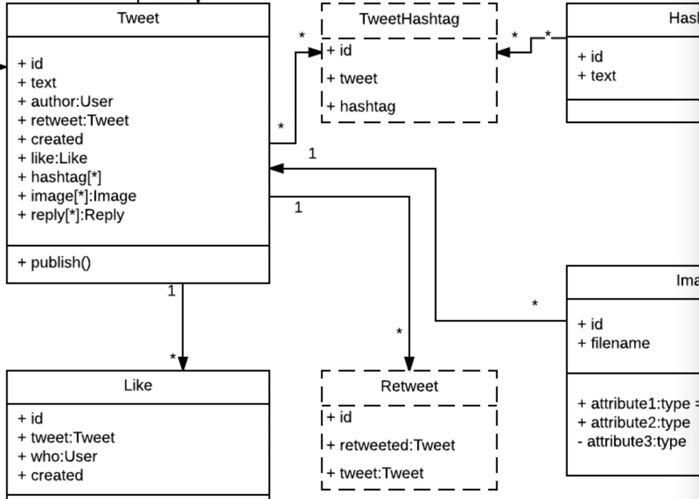
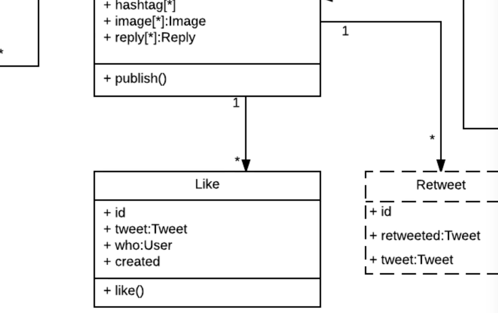
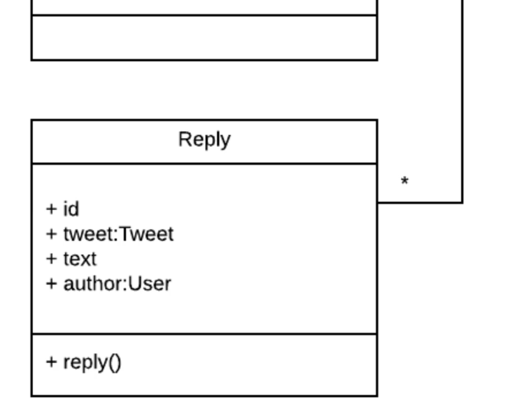
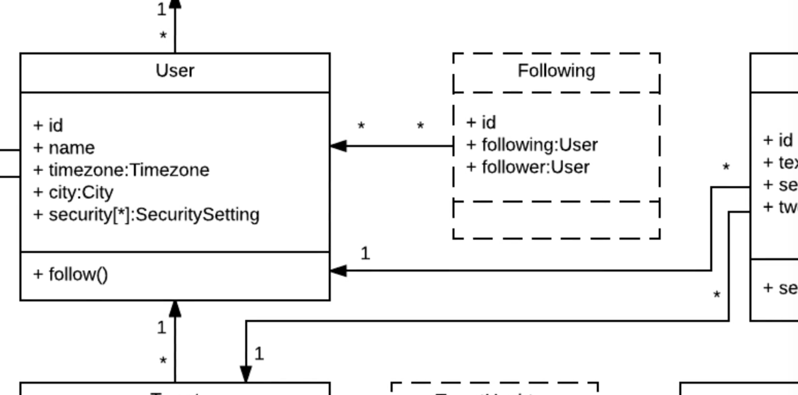
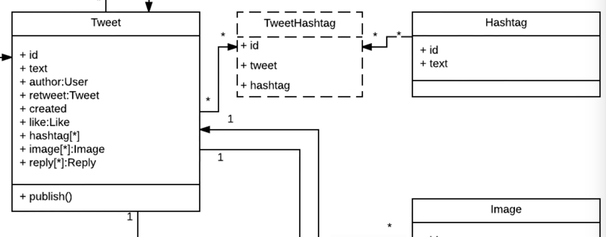

# MODULE 06 - 165    UML Examples

## UML Customization (by) Building Twitter using Class Diagrams

---

1. Introduction to Complex System Modeling

2. Twitter System Overview
   2.1. Non-Trivial Class Diagram Design
   2.2. Adapting UML Standards for Practical Use
   2.3. System Architecture Scope

3. Core Tweet Class Analysis
   3.1. Tweet Class Structure
   3.2. Association Patterns and Multiplicity
   3.3. Foreign Key Relationships

4. Join Tables and Bidirectional Relationships
   4.1. Retweet Self-Referential Pattern
   4.2. Join Table Notation (Non-Standard UML)
   4.3. Database Relationship Implementation

5. Supporting Classes Deep Dive
   5.1. Like Class Implementation
   5.2. Reply Class Structure
   5.3. Pattern Recognition Across Classes

6. Advanced Relationship Patterns
   6.1. User-Following Self-Referential Tables
   6.2. Many-to-Many Relationships
   6.3. TweetHashtag Join Table Implementation

7. Practical Implementation Guidelines

8. UML Flexibility and Customization Philosophy

---

## 1.    Introduction to Complex System Modeling

This analysis moves beyond theoretical concepts to examine how UML adapts to actual implementation challenges and business requirements.

**Key Learning Objectives**

- Understanding complex / non-trivial class diagram construction
- Recognizing when to adapt UML standards to customs for clarity
- Implementing complex association patterns
- Managing self-referential relationships and join tables

This Twitter reconstruction focuses on extracting known system components while acknowledging that the actual Twitter application may contain significantly more classes and complexity than here is represented.

---

## 2. Twitter System Overview

### Non-Trivial Class Diagram Design

The Twitter class diagram encompasses multiple interconnected classes representing core social media functionality:

- **Tweet**: Central content class
- **User**: Account and profile management
- **Like**: User engagement tracking
- **Reply**: Comment and conversation system
- **Retweet**: Content sharing mechanism
- **Hashtag**: Content categorization
- **Following**: Social network relationships
- **Security**: Authentication and authorization

This comprehensive model demonstrates how UML scales from simple examples to production-level system design.

### Adapting UML Standards for Practical Use

**Philosophy of Practical UML** 

Throughout this diagram, certain elements deviate from formal UML specification for specific reasons:

- **Enhanced Clarity**: Making relationships more obvious to developers
- **Implementation Focus**: Emphasizing database and code translation
- **Team Communication**: Prioritizing understanding over strict compliance
- **Flexible Adaptation**: Customizing notation for specific organizational needs

**Standard Deviation** 

> Anytime I go outside of the realm of standard UML it's for a specific reason. 
> 
> Since I'm building these diagrams for myself/other developers/other stakeholders I am not going to live by a standard when I know that I could do something better.

**This approach reflects real-world UML usage where organizations adapt notation to their specific needs and contexts.**

### System Architecture Scope

The diagram represents a subset of Twitter's actual architecture:

- **Known Components**: Publicly visible features and interactions
- **Estimated Complexity**: Real Twitter likely contains hundreds of additional classes
- **Educational Focus**: Emphasizing core patterns and relationships
- **Scalable Principles**: Demonstrating patterns applicable to larger systems

---

## 3. Core Tweet Class Analysis

### Tweet Class Structure

The Tweet class serves as the central hub of the Twitter system, containing extensive attributes and multiple associations:

**Core Attributes**

- `id`: Unique identifier
- `text`: Tweet content
- `author`: Foreign key reference to User class
- `retweet`: Self-referential relationship indicator
- `hashtags`: Collection of associated tags
- `images`: Media attachments
- `replies`: Response collection
- `likes`: Engagement metrics


**Primary Operations/Methods**

- `publish()`: Core tweet creation and distribution functionality

### Association Patterns and Multiplicity

**User-Tweet Relationship:**

- **Multiplicity**: `1` User to `*` Tweets
- **Meaning**: Each user can have many tweets, but each tweet belongs to exactly one user
- **Implementation**: User can create unlimited tweets; tweets require associated user

**Simplified Multiplicity Notation** 

Instead of formal `0..*` notation, the diagram may use `*` to represent many relationships, reflecting  a common industry practice:

> Exact multiplicity ranges are less important than the general one-to-many pattern.

### Foreign Key Relationships

**Author Attribute Implementation:** The `author` attribute within the Tweet class demonstrates foreign key relationships:

- **Database Translation**: Becomes `user_id` foreign key in implementation
- **Class Reference**: Links to User class through association
- **Naming Flexibility**: Can be named according to framework conventions
- **Referential Integrity**: Ensures every tweet has valid user association

---

## 4. Join Tables and Bidirectional Relationships

### Retweet Self-Referential Pattern

**Non-Standard UML Notation:** The retweet class uses dotted line notation to represent join tables with bidirectional relationships:

- **Visual Indicator**: Dotted outline distinguishes join tables from regular classes
- **Purpose**: Represents database tables that exist solely for connecting other tables
- **Implementation**: Creates intermediate records for complex relationships

### Join Table Notation (Non-Standard UML)

It might be considered as a **reflexive** (kind of) association, where two classes may belong to each other.

**Dotted Line Classes:** Classes with dotted outlines represent:

- **Retweet**: Self-referential tweet connections
- **Following**: User-to-user relationships
- **TweetHashtag**: Many-to-many tweet-hashtag connections
- **Security**: Authentication relationship management

 **Non-Standard Notation, again, due to the clarity** 

This visual distinction immediately communicates to developers which classes represent join tables versus primary business entities, **improving implementation clarity.**

---

### Database Relationship Implementation

**Self-Referential Join Table Structure**

```textile
Retweet Table:
- id (primary key)
- original_tweet_id (foreign key to Tweet)
- retweeted_tweet_id (foreign key to Tweet)
- user_id (foreign key to User)
- created_at (timestamp)
```

**Functional Benefits**

- **No Duplication**: Avoids creating duplicate tweet content
- **Clear Tracking**: Maintains relationship between original and shared content
- **Query Efficiency**: Enables efficient retrieval of retweet relationships
- **Data Integrity**: Preserves original tweet data while tracking sharing

---

## 5.    Supporting Classes Deep Dive

### Like Class Implementation

**Like Class Structure**

- **id**: Unique identifier for each like action
- **tweet**: Foreign key reference to liked tweet
- **who**: User who performed the like action
- **created**: Timestamp of like action

**Like Operation:** The `like()` method encapsulates complete like functionality:

- **Tweet Association**: Links like to specific tweet
- **User Identification**: Records who performed the action
- **Timestamp Creation**: Server-side time recording
- **Database Persistence**: Creates permanent like record

### Reply Class Structure

**Reply Functionality:** Replies follow similar patterns to likes but with content:

- **Tweet Reference**: Foreign key to parent tweet
- **User Association**: Reply author identification
- **Content Storage**: Reply text and media
- **Threading Support**: Potential for nested reply structures

### Pattern Recognition Between Classes

**Common Association Patterns**

1. **Belongs To Tweet**: Like, Reply, Retweet classes
2. **Belongs To User**: Tweet, Like, Reply classes
3. **Many-to-Many**: Tweet-Hashtag, User-Following relationships
4. **Self-Referential**: Retweet, Following relationships

**Implementation Consistency**

> Hopefully, you can start to see a pattern here:
> 
> The way the relationships and associations are configured then set up and how one class can communicate with another one.
> 
> It's simply a matter of rearranging the attributes, names, and direction the associations point to.

---

## 6.    Advanced Relationship Patterns

### User-Following Self-Referential Tables

**Complex Self-Reference Challenge:** "One of the more confusing and advanced features that you'll come across when you're building out social networks is the ability to have a user or one class reference itself."

**Following Relationship Example**

- **Scenario**: Bob follows Alice (both are User objects)
- **Challenge**: Same class, different instances
- **Solution**: Following join table with dual User references

**Following Table Structure**

```
TweetHashtag Table:
- id (primary key)
- tweet_id (foreign key to Tweet)
- hashtag_id (foreign key to Hashtag)
- created_at (timestamp)
```

**Functional Benefits**

- **Flexible Association**: Any tweet can have any number of hashtags
- **Efficient Queries**: Quick retrieval of tweets by hashtag
- **Clean Separation**: Clear distinction between content and categorization
- **Scalable Design**: Handles growing hashtag usage patterns

**Implementation Philosophy** 

> "By building these types of join tables, it makes it more straightforward to think about. **You're breaking it down into tiny pieces.**"

---

## 7.    Practical Implementation Guidelines

### Association Priority

**Focus on Relationships:** "Associations are one of the most important parts when it comes to building out a class diagram. Association is really where the power of UML comes in."

**Implementation Translation**

- **Database Schema**: Associations become foreign keys and join tables
- **Object-Oriented Code**: Associations become object references and collections
- **API Design**: Associations define endpoint relationships and data structures

### Join Table Best Practices

- **Clear Naming**: Use descriptive names that indicate relationship purpose
- **Minimal Attributes**: Include only essential relationship data
- **Proper Indexing**: Optimize for common query patterns
- **Referential Integrity**: Enforce foreign key constraints

### Self-Referential Design Patterns

- **Identify Use Cases**: Following, friendship, organizational hierarchy
- **Plan Query Patterns**: Consider common traversal needs
- **Handle Cycles**: Prevent infinite loops in recursive relationships
- **Performance Optimization**: Index appropriately for relationship queries

---

## 8.    UML Flexibility and Customization Philosophy

### Pragmatic UML Approach

**Customization Philosophy** 

> "I've noticed if I go to ten different organizations that all implement UML, I would get ten different versions of UML."

**Flexibility Benefits**

- **Team Communication**: Adapt notation to team understanding
- **Implementation Focus**: Emphasize practical development needs
- **Organizational Standards**: Align with existing documentation practices
- **Evolutionary Design**: Allow notation to evolve with system understanding

### 

### Growing UML Knowledge

**Expected Evolution** 

> "As you start to grow in your own UML knowledge and start building out complex systems, my guess is you will **start to customize in ways that fit best for you**."

**Customization Guidelines**

- **Document Deviations**: Explain non-standard notation choices
- **Maintain Consistency**: Use custom notation consistently across diagrams
- **Team Alignment**: Ensure all team members understand custom elements
- **Purpose-Driven Changes**: Make modifications for specific improvement reasons

---

## References

- https://highscalability.com/the-architecture-twitter-uses-to-deal-with-150m-active-users/Real-world - Full Twitter Architecture explained

---

## Video Lesson Speech

Now that you've seen all of the elements that make up a class diagram 
and you have seen the various associations we use in order to show how 
classes are associated, we're ready to take a deep dive into building a 
non-trivial type of class diagram.

---

We have a very special treat, we are going to rebuild Twitter using UML. 


We have a Twitter class diagram. It is made up of a number of classes, everything from the main `tweet` class, all the way through security parameters messages. The real Twitter, the full application that we all know and love, is probably much larger than this. Given my experience, I can tell you they probably have a lot of other classes we simply don't know about. I wanted to extract out many of the different elements that we are aware of to show how we could design it ourselves. 

There are a couple of things that I want to note before we get into detail on different portions of the diagram. I am using a slightly different type of syntax than a formal by the book UML. When we come up to those times I'm going to show you I'm doing this for a very specific reason. I've mentioned a few times throughout this course that UML is challenging to standardize. We have a standard called the UML standard, however, I've noticed if I go to ten different organizations that all implement UML, I would get ten different versions of UML. I personally think that in addition to understanding all of the important elements and the diagram types, another important skill is to adjust and be flexible with how other people have implemented UML. As we go through this diagram I will point out when something doesn't fit exactly with the specification. I'll explain why a decision was made, it wasn't just randomly made or done just out of spite to the UML standard. It's actually for a very specific purpose.

Anytime I go outside of the realm of standard UML it's for a specific reason. Since I'm building these diagrams for myself/other developers/other stakeholders I am not going to live by a standard when I know that I could do something better. As you start to grow in your own UML knowledge and start building out complex systems, my guess is you will start to customize in ways that fit best for you. 

So the very first item that I want to look at is one of the most key components of Twitter which is the `tweet` class.


Looking at the `tweet` class, this is a pretty massive class. It has a number of attributes, everything from an ID through likes. We also have a number of items such as hashtags, images, replies, etc. We also have the ability to publish items, which is one of the operations. The real Twitter has many other items. We're not going to go into each one. The important part is understanding which elements are needed in order to build it. 

Looking at the `tweet` class we can see that it has a number of associations. One of the items I'm going to harp on throughout this guide, and anytime I talk about class diagrams, are the associations. Associations are one of the most important parts when it comes to building out a class diagram. If you didn't care about the associations and how those were formulated, you could just type a class name and list out the attributes and different operations you wanted. You wouldn't have to worry about building the whole thing. Association is really where the power of UML comes in. 

We see that a tweet belongs to a user. If you notice, we have `1` to the `*` of "like", remember when I talked about associations, I talked about multiplicity. I said that we don't always have to do something like `0..*` order to say that something has a many kind of relationship. Many times you're going to simply see a `*`, what that represents is that we have a one to many relationship. This means is that a user can have many tweets. We also know since `*` goes to `1` that a tweet has to have one user. In order for a tweet to be in existence/created a tweet object has to be associated with at least one user. 

If you look down inside of the tweet attributes, we have an attribute called "author." Depending on what kind of programming language and framework you're using this might also be called user_ID. Technically, you could call it by any name you want but it's operating as the foreign key to the user table. You can tell because it is called class user right after. 

We have an ID, text, author, and one called retweet.



Now you see this `retweet` class. I want to point out this is not formal UML right here. You see what we have with a dotted line around the retweet class, you're going to see this for the `tweet`, `#`, for `following` and for the `security` setting. That represents a join table with a bidirectional relationship. 
Essentially, it means it is an area in the database. In the way that I'm looking at it, it's a class that does nothing but connects other classes. It's kind of like a go-between database table, it is only used as a way of navigating from one class to another. 

We have what's called a self-referential join table. What that means is that when someone performs a retweet, there is not a duplicate kind of tweet that occurs, what's happening is it's creating a new record called "retweet." That is going to have a retweeted object and then it's going to have a `tweet` object, those both reference to the same table.   

If anyone going through this is on Twitter, you know how read tweets work.   

This is the database relationship you have set up, you need a join table and you need a way of keeping track of which tweets have been retweeted. 

Then you just need a reference point to that. That's something that is very helpful, you can tell what the original tweet was and then which one represents the retweeted version. 



Moving down to the very bottom, you can see we have a `like` class, the relationship between `like` is going to belong to a `tweet.` 

If you look at those parameters, we have

- id
- tweet 
- who (which lists out the user that like the tweet)
- created (which says when that tweet was liked)

For the one operation, we have a like, that's what would manage the process of actually liking the tweet. 

If you're thinking about this in regards to how you would build the feature, you'd have this "like" method that would be able to be called. When someone presses that button, it would perform all the actions. It would say what the tweet was, who is liking it, and it would associate the time stamp on the server to and create a record in the database. 



The `reply` class gives us the ability to have users reply to a tweet, which is a common pattern that you see when you go to Twitter. The `reply` class has a reference to the `tweet` that owns it. 

Hopefully, you can start to see a pattern here. The way the relationships and associations are configured then set up and how one class can communicate with another one. We're not going to go to every single one of these, if you look you'll see it's pretty much identical in most regards. It's simply a matter of rearranging the attributes, names, and direction the associations point to. 

#### Outside the UML Standards, explained

There is just a couple more items that I want to focus on.



The next one is with the `user` class and `following` class. One of the more confusing and advanced features that you'll come across when you're building out social networks is the ability to have a user or one class reference itself. 

Imagine a situation where you have "Bob" and "Alice." They are both users on Twitter and Bob follows Alice. How are you going to keep track of that? They're both in the same class. It's not like our relationship between a user and a tweet, those are two completely different tables and it's easy to set that up. 

What happens when you need to keep track of one object inside of a class that is keeping track and having a reference to another object in the same class? 

That is where self referential tables come into play. Right here we'd have a following table. This following table does nothing except keep track of who is following who. Both references are back to the user class and they'll keep track of Bob's ID and Alice's ID. When you want query, you can check to see how many followers does Alice have, it will bring up all the people that followed her (including Bob).

That is very different if you've never done it before, it's a completely different way of thinking about database relationships. It's also a common pattern that you will need to follow. 

The last item I'm going to point to is this `TweetHashtag` join table.



We talked about self-referential tables, we have a few other join tables that are simply managing the connection between two classes. So `TweetHashtag` connects the `Tweet` to the `Hashtag`. This is what you typically want to do whenever you have a many to many relationship. A `tweet` needs to be able to have many hashtags and vice versa a hashtag needs to have many tweets. 

##### It's like the REFLEXIVE (kind of) Association!

If you think about this logically, if you have a `tweet`, you can't store the `hashtag` inside of that tweet in that database record. Vice-versa with your hashtag, you can't store all of the tweets associated with that hashtag inside of a single hashtag record. 

What a join table does is it gives the ability to say every time a `tweet` has a `hashtag`, it creates a new record in the database. Now you have this reference to the tweet and the hashtag which that makes it more straightforward to call tweet and see what are the hashtags. You can look up the hashtag and see what tweets are associated with it. 

That's another common pattern. It's something that may seem a little challenging. In all actuality, **by building these types of join tables, it makes it more straightforward to think about. You're breaking it down into tiny pieces.** 

That is an analysis on the class diagram for Twitter. 
