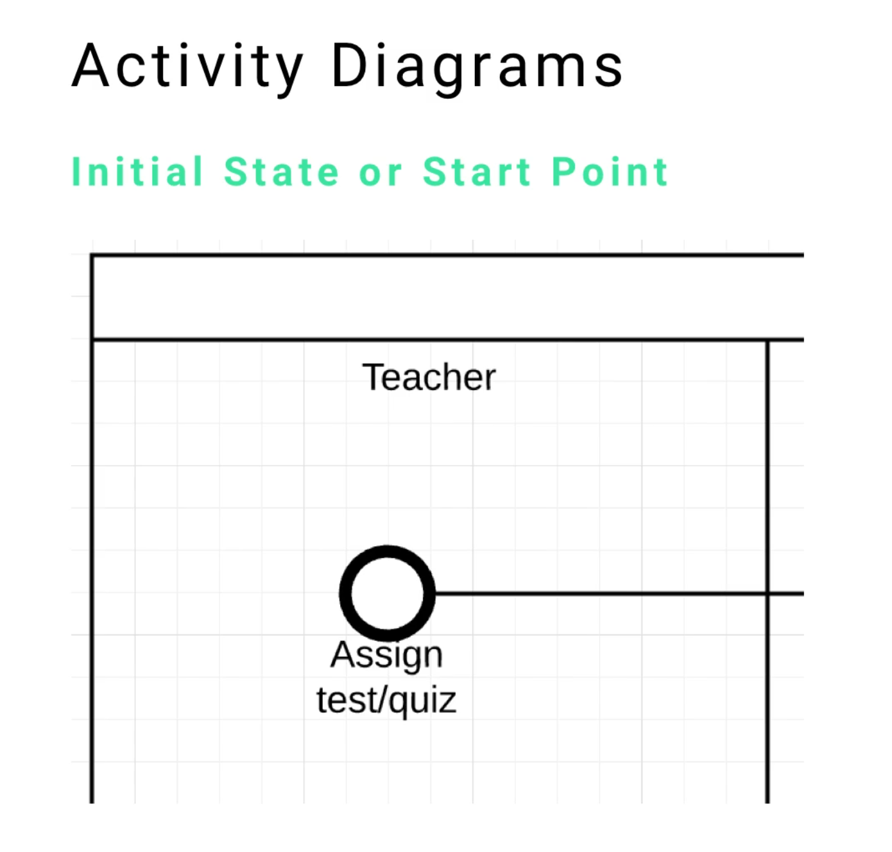
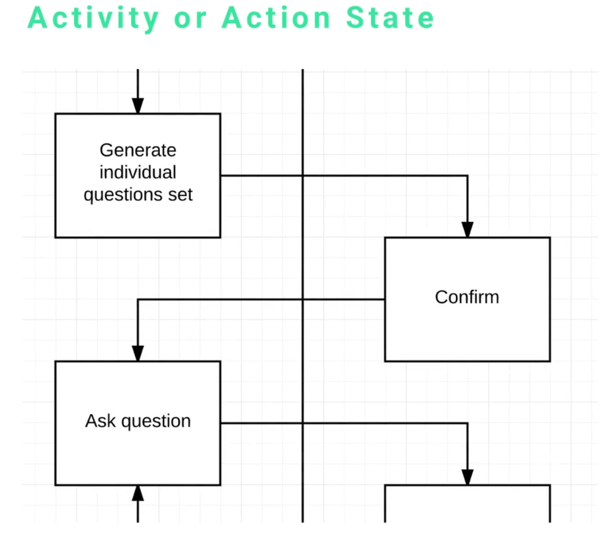
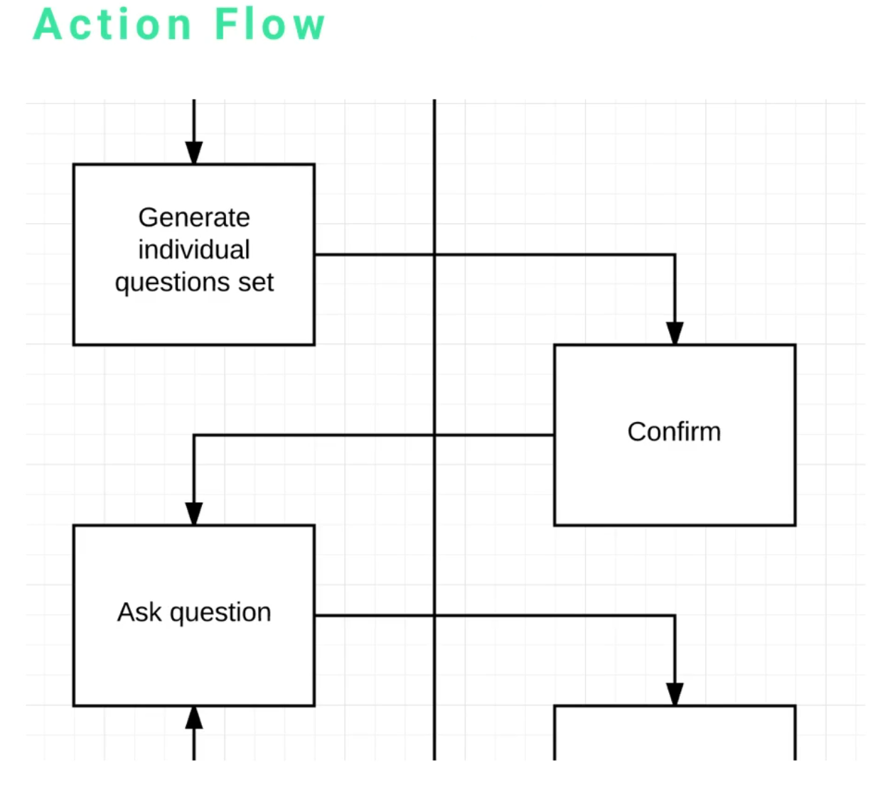
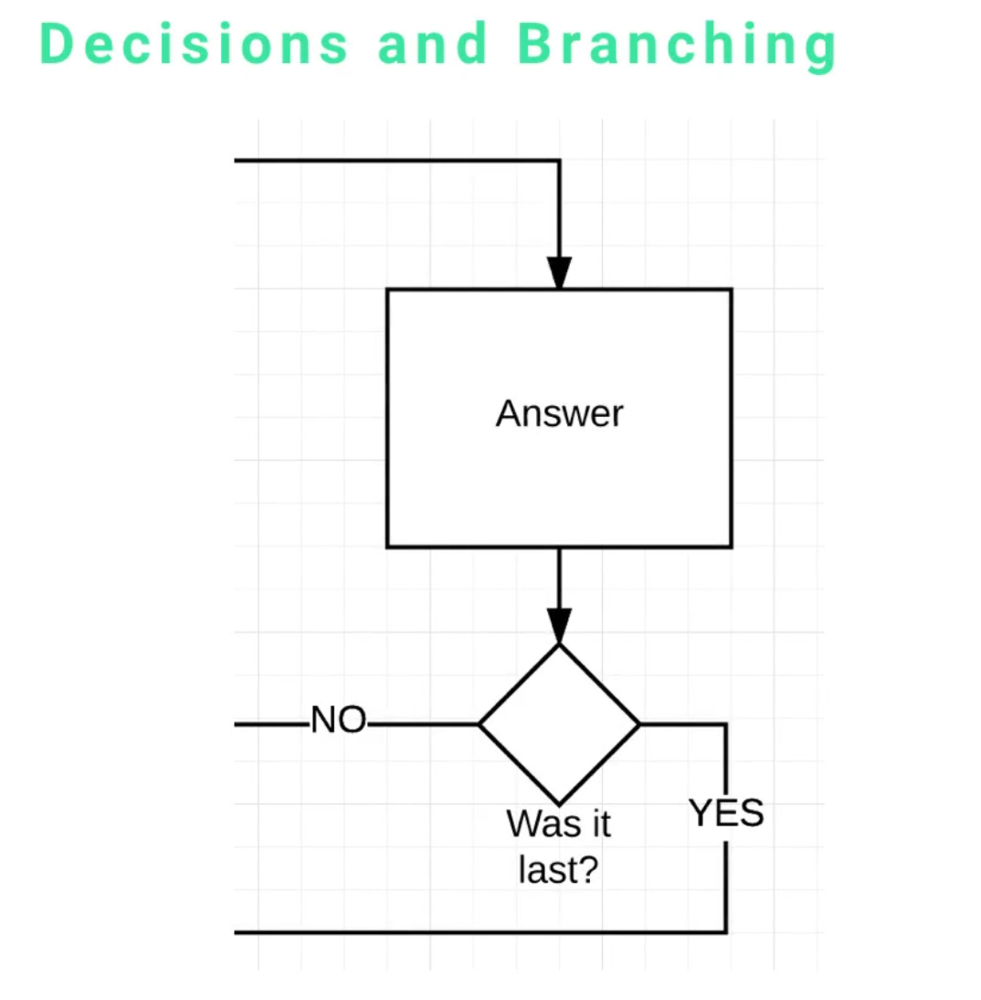
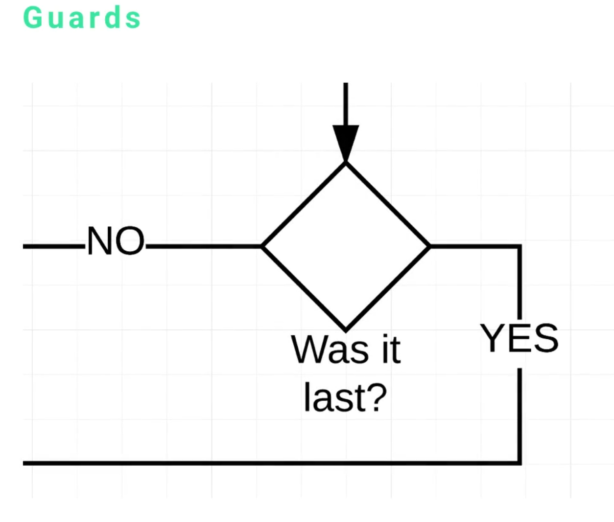
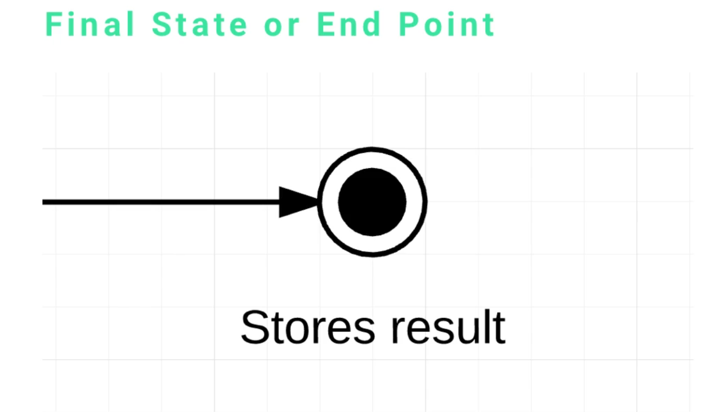
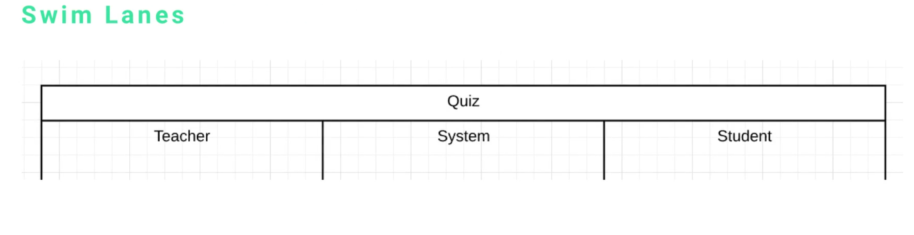

# MODULE 06 - 167    UML

## Activity Diagram Elements (1/2)

---

1. Introduction to Activity Diagrams

2. Core Elements

3. Detailed Element Analysis
   
   - Initial State (Start Point)
   - Activity/Action State
   - Action Flow
   - Decision Points and Branching
   - Guards
   - Final State (End Point)
   - Swim Lanes

4. Practical Application Context

5. Design Considerations and Best Practices

---

## 1.     Introduction to Activity Diagrams

UML Activity Diagra**ms are behavioral diagrams that illustrate the flow of activities within a system or process**.   

They provide a **visual representation of workflows**, business processes, and algorithmic logic, making them essential tools for system analysis and design.

Activity diagrams are particularly useful for:

- Modeling business processes
- Describing use case scenarios
- Representing algorithmic workflows
- Documenting system behavior across different actors

---

## 2.     Core Elements

Activity diagrams consist of **SEVEN** fundamental elements that work together to represent process flow:

1. **Initial State** 
   The starting point of any activity flow

2. **Activity/Action State**
   
   Individual actions/processes within the workflow.

3. **Action Flow** 
   Connections between different states showing process direction

4. **Decision Points**
   Branch points where the flow can take different paths

5. **Guards**
   Conditions that determine which path to follow at decision points

6. **Final State** 
   The termination point of the activity flow

7. **Swim Lanes**
   Organizational boundaries that group activities by responsibility

---

## 3. Detailed Element Analysis

---

### 1.    Initial State (Start Point)

The **Initial State** is represented by **a thick black filled circle and marks the beginning of any activity diagram**.

This element **indicates where a user or system begins the process flow**.

**Characteristics**

- Every activity diagram must have exactly one initial state
- Represents the trigger or starting condition for the entire process
- No incoming flows, only outgoing action flows

**Example Context** 

In a grading system, the initial state represents when a teacher decides to assign a test or quiz.

---

### 2.    Activity/Action State

**Activities** or **Action States** are the core building blocks of activity diagrams, represented by rectangular boxes (may have rounded edges depending on the UML tool used).

**Characteristics**

- **Each box** represents **a single action, process, or state** within the workflow
- Activities should be "atomic" -> **representing one clear action or transformation**
- Most of the diagram content consists of these activity states
- Activities **represent points where data changes or alterations occur**

**Design Principle**

 When traversing through the diagram as a user, each activity represents a stage where something meaningful happens to the data or system state.

**Examples in Grading System**

- *"Generate individual question set"*
- *"Confirm question parameters"*
- "*Ask question to student"*

---

### 3.    Action Flow

**Action Flows** are **represented by arrows** with filled arrowheads that connect different activities, showing the direction of process flow.

**Characteristics**

- **Indicates the sequence and direction** of activities
- Show **how data or control moves from one state to another**
- Create the **logical pathway** through the process
- Essential for understanding process dependencies

**Conceptual Understanding**

 Action flows <u>represent the "movement"</u> of something (data, control, or process state) from one activity to another, creating the workflow's logical structure.

---

### 4.    Decision Points and Branching

**Decision Points** are **represented by diamond shapes** ("square rotated 45 degrees") and indicate locations where **decisions** have to be made, where **the process flow must choose** between different paths based on specific conditions.

**Characteristics**

- Diamond shape represents a **branch point or decision node**
- Exactly **one incoming flow and multiple outgoing flows**
- **Each outgoing flow** represents a **different possible path**
- Decisions are based on conditions or criteria evaluated at that point

**Example Context** 

In the grading system, a decision point might ask "Was this the last question?" leading to different actions based on the answer.

---

### 5.    Guards

**Guards** are **conditions** or **criteria** associated with action flows **leaving decision points**, typically represented as text labels like "yes," "no," or more complex conditional expressions.

**Characteristic:**

- Define the **conditions under which a particular flow path is taken**
- Can be simple boolean conditions or complex logical expressions
- Essential for understanding when different paths are executed
- Critical for process logic and flow control

**Design Consideration** 

> **The more guards and branches in a system, the higher the complexity. **

Multiple branches from a single decision point may indicate a need for design review, as changes become more difficult to propagate throughout the system.

---

### 6.    Final State (End Point)

The **Final State** represents the **termination of the activity flow**, shown as a circle with a smaller filled circle inside (bull's-eye pattern).

**Characteristics**

- Indicates the completion of the entire process
- According to UML specification, e**very activity diagram should have a final state**
- **Only incoming** flows, no outgoing flows
- Represents the successful completion of the workflow

**Example Context** 

In the grading system, the final state occurs when results are stored in the system database.

---

### 7.    Swim Lanes

**Swim Lanes** are vertical or horizontal divisions that organize activities based on responsibility, role, or organizational boundaries.

**Characteristics**

- Provide organizational structure to complex diagrams
- Clearly delineate responsibilities among different actors
- Help identify who performs which activities
- Essential for multi-actor processes

**Benefits**

- **Clarity of Responsibility**: Immediate visual identification of who does what
- **System Organization**: Clear separation of system, user, and external actor responsibilities
- **Process Understanding**: Easier comprehension of role interactions and handoffs

**Example Structure in Grading System:**

- **Teacher Lane**: Activities related to test creation and result review
- **System Lane**: Automated processes like question generation and result storage
- **Student Lane**: Activities performed by students during the assessment

***

***

## 4.     Practical Application Context

The grading system example demonstrates how these elements work together in a real-world scenario:

1. **Process Initiation**: Teacher decides to create a quiz (Initial State)
2. **System Actions**: Generate questions, configure parameters (Activities)
3. **Flow Control**: Questions presented in sequence (Action Flows)
4. **Decision Logic**: Determine if more questions remain (Decision Points with Guards)
5. **Process Completion**: Store results in database (Final State)
6. **Responsibility Distribution**: Clear separation between teacher, system, and student actions (Swim Lanes)

---

## 5.     Design Considerations and Best Practices

### Complexity Management

- **Minimize Branching**: Excessive decision points increase system complexity
- **Atomic Activities**: Each activity should represent one clear, indivisible action
- **Clear Flow Direction**: Ensure action flows create logical, easy-to-follow pathways

### Organizational Clarity

- **Effective Swim Lanes**: Use swim lanes to clearly separate responsibilities
- **Consistent Naming**: Use clear, descriptive names for activities and guards
- **Logical Grouping**: Group related activities within appropriate swim lanes

### Maintainability

- **Impact Analysis**: Consider how changes propagate through multiple branches
- **Documentation**: Ensure guards and decision conditions are clearly documented
- **Validation**: Verify that all paths lead to appropriate final states

---

## References

* [Análisis UML - UOC [ SPA]](https://openaccess.uoc.edu/server/api/core/bitstreams/a21b69c6-0ee4-4d72-8186-a88df9420bed/content)
- [UML activity diagrams are UML behavior diagrams which show flow of control or object flow with emphasis on the sequence and conditions of the flow.](https://www.uml-diagrams.org/activity-diagrams.html) - Comprehensive reference for activity diagram notation
- [Activity Diagram Best Practices](https://sparxsystems.com/resources/tutorials/uml/activity-diagram.html) - Professional guidelines for creating effective activity diagrams

##### Outside the Coding Perspective (Designing/Branding POV)

* [Interacción y arquitectura de la información](https://materials.campus.uoc.edu/daisy/Materials/PID_00268312/html5/PID_00268312.html)

* [Diseño de la navegación &#8211; Arq. de la Información aula 1](https://202-m4-352-01.folio.uoc.edu/actiuoc/activity-805161-1133453/)

---

## Video Lesson Speech

In this section of the course we're going to talk about UML activity 
diagrams. In this guide we're going to start with an overview, then 
we're going to dissect each element of an activity diagram to see how 
they are represented.

---

In the next guide, we're going to walk through a full project.

We have seven different elements. 

- Initial state or Start Point
- Activity or Action State
- Action Flow
- Decisions and Branching
- Guards
- Final State or End Point
- Swim Lanes

We have an initial state represented by that thick circle that has the white circle in the middle of it. in an activity diagram, this is how you represent how a user or system will begin. We have a teacher that is going to assign a test or a quiz, all of these examples for the activity diagram are going to be for a grading system. This is going to be the initial state or start point.

The next portion is the activity or the action state. This is a pretty significant portion of an activity diagram, each box is an activity or it is a state. Another syntax, depending on the UML tool that you're using, will have rounded edges for each of these states. 

For this example, generating an individual question set, confirming, and asking a question are various actions states that the system can utilize. The easiest way to think about this is, imagine you're the user and you're traversing down each stage of these elements, every time you get to the spot where the data changes or you're going to make an alteration, that could be a potential state. That is a pretty important thing to see when you see activity diagrams the majority of the diagram is filled up with these activities. 

The next item is the action flow. As you may have noticed we didn't actually change anything in the diagram, that's because the activity diagram action flows are all right here. Anytime you see a filled-in arrow tip, that is an action flow. It means that we took a piece of data and took it from one action state to another action state and this action flow is how they're connected. When you confirm and ask a question, that is an action flow. It's easy to remember, something is flowing from one state to another one. 

The next item on the list is decisions (also called branching). You see in the example there is a 45-degree diamond square, which is called a branch point or a decision. That represents a stage in the application where a decision has to be made. In this case, it's asking the question "was it last?" If so, it's going to perform one action, if not it's going to perform a different action. That's how you can understand branching which leads perfectly into guards. 

Guards are the "no" or "yes" options. This is straightforward for simple conditions, however, there may be times where it's going to be more complex and have several conditions.

If you get into a situation where you have many potential branches from one activity, you may want to think your design through. The more branches or guards that we have, the higher the level of complexity. That means if you go back to change something in that process, you're going to have to populate that change throughout the entire system

Now the next point is our final state. Most of the time you're going to have a final state and the UML specification says that every activity diagram should have a final state. In this sense, it is simply going to store the result inside of the system database and that's it. 

The syntax for this is going to be an action flow from one activity to the final endpoint. It's going to have an arrow pointing to a large circle with a smaller black circle in the middle, which represents that you've come to the end of that activity. 

This is what is called the swim lane. In the example, we have a quiz that is the activity diagram, inside of that we have swim lanes. In this case, we have a teacher, system, and student. 

This represents a way of organizing each of the activities

- we know when a teacher should be for performing a task 
- when a system/server should be performing a task
- when a student should be performing a task

This is helpful the more complex a system gets, the more actors in the process, you want to organize the entire system this way. At a simple glance, anyone will be able to see what the teacher can do, what the system can do, and what roles and responsibilities the student is going to have. 

Now that we've covered each of the major elements of an activity diagram, we're going to put all of them together to build the entire system. 
