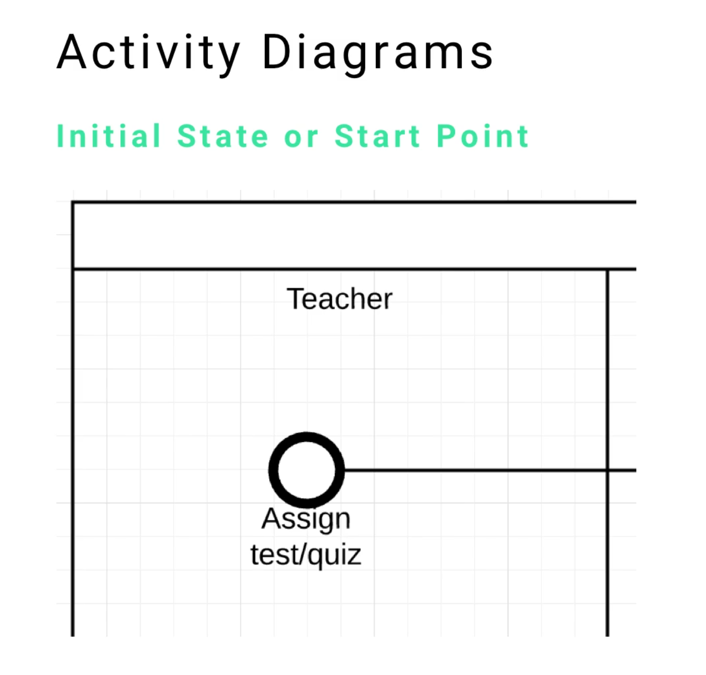
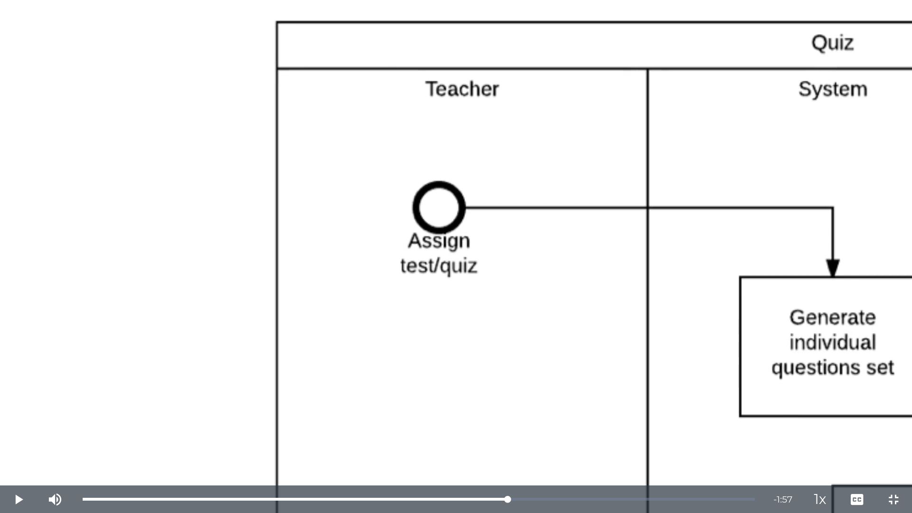
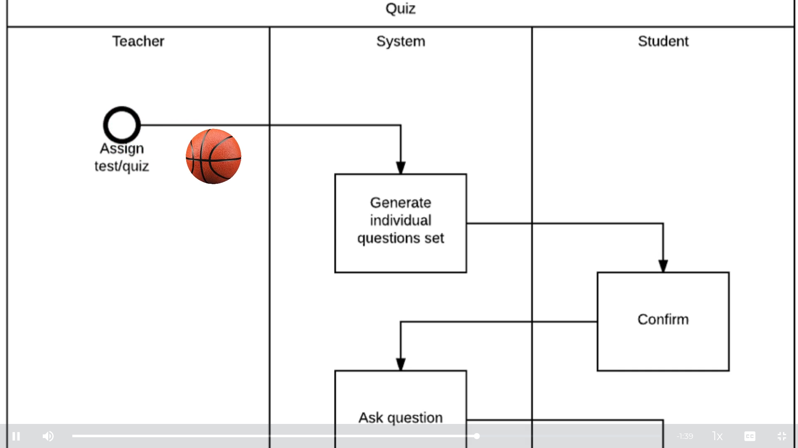
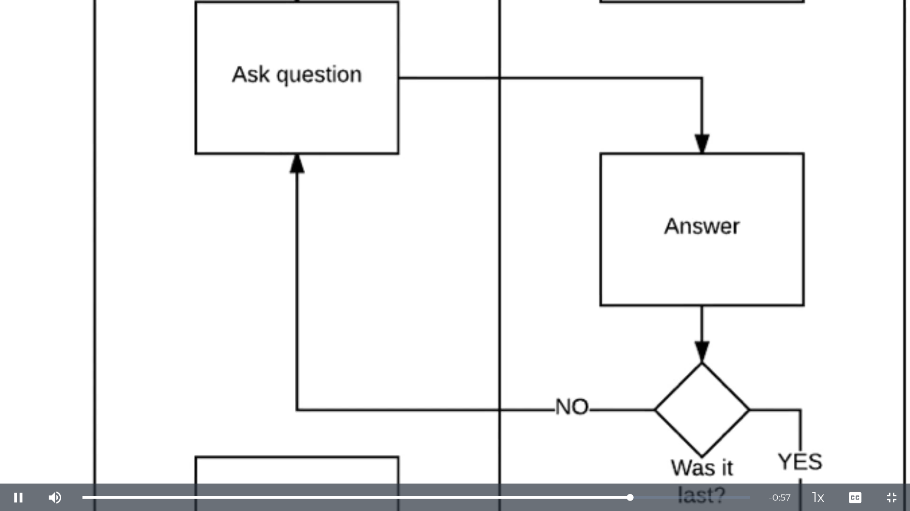
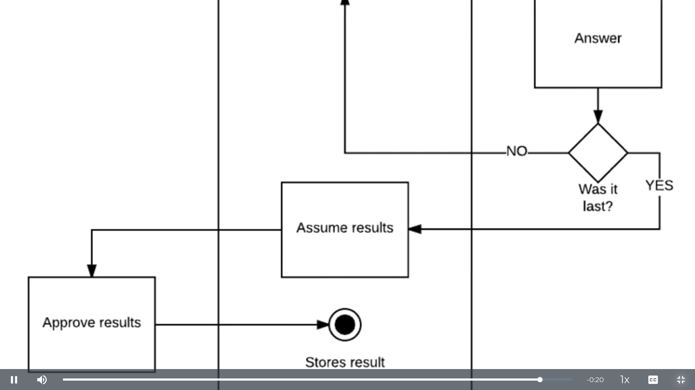

# MODULE 06 - 168    UML

## Designing an Activity Diagram for an online grading system

---

---

## Video Lesson Speech

In this guide we're going to open up a full activity. Before, we looked 
at each element of an activity diagram, now we're going to look at a 
grading system diagram.

---

We're going to follow the data along at each stage. 

The first thing that I look at with this activity diagram is the name "quiz" up at the top. I know that this activity diagram has to do with the process of working through a quiz. The next spot I look at is the swim lanes, depending on how the UML designer made the diagram, you may see swim lanes that are horizontal. Don't let that throw you off, there are no changes whatsoever, it is dependent on how the components fit on the page and if it makes more sense to place it horizontally or vertically.

We see in the swim lanes is that we have 

- Teacher
- System
- Student

First, I look at the roles and responsibilities of each one of the users. When I say user, I don't mean user as in an individual, if you look in the middle you can see that one of the swim lanes also represents the system. I look to see what does each swim Lane has to do from a roles and responsibilities standpoint. 

If I look at the teacher, they simply assign a test or a quiz and then don't have anything until they approve the result. So that makes it easy knowing what my teacher objects are going to have access to. 

Next, I look at the system, I see that the system's going to

- Generate the individual questions set
- Ask a question
- Assume the results
- Store that result

Lastly, I look at the student, which will confirm and answer. The system will be redirected if the student has not answered the last question, otherwise, it will allow them to finish. 

Let's start at the very beginning:

- We see that a teacher assigns a test in the quiz.
- From there, it's going to get redirected to the system (if you like sports analogies you can think of action flows kind of like you're playing basketball, with each action flow you're passing the basketball to another player):

- The system passes to the student. 
- The student has the ability to confirm (that would be like a student logging into the system and confirming that they want to start a quiz)
- From that point, the system is going to take over again and ask a question
- That question gets passed to the student. 
- The student answers
- That goes down to a branch (remember the branches are where we can branch and have two different kinds of behavior)

So, if the guards switch "yes" and "no" are there, then we check with the branches where it says "was at last?" If it was not the last question, it is going to be redirected to the system. It's going to ask another question and loop like that until that branch answer changes.   

Once we get to the point where it was the last question, it's going to switch to "yes" and it's going to follow the other action flow:  

- it's going to assume the results 
- It's going to get redirected to the teacher
- Teacher will approve it
- Lastly, at the endpoint, the result is stored

That is the full activity for a quiz in this system. 
