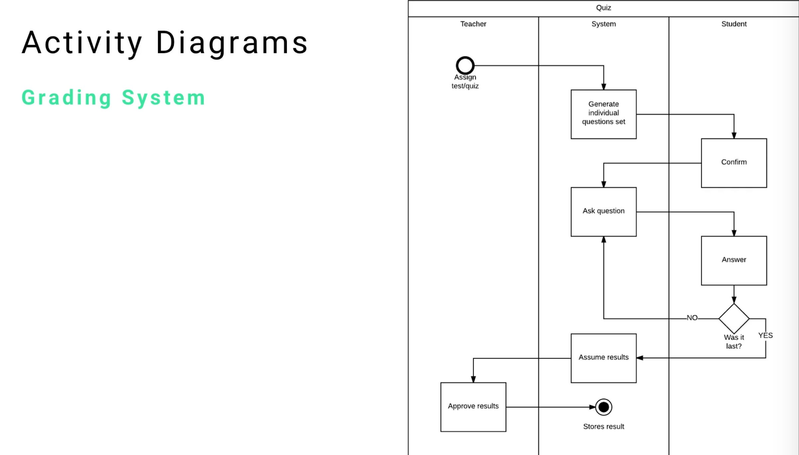
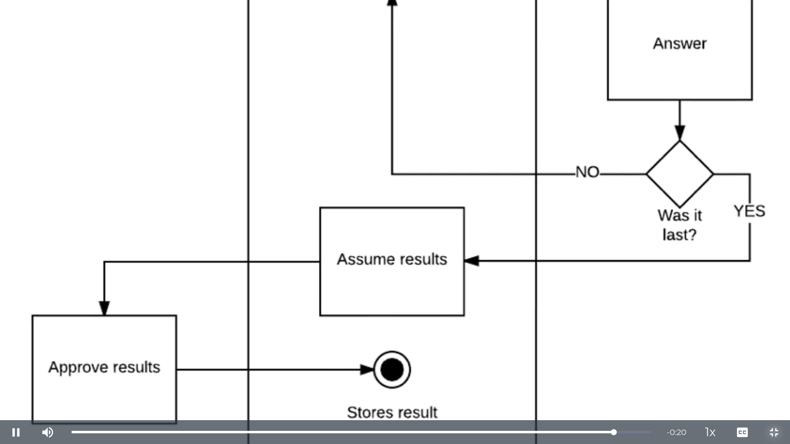

# MODULE 06 - 169    UML

## Designing an Activity Diagram for an online grading system (2/2)

---

1. System Architecture Analysis
   - Diagram Overview and Naming
   - Swim Lane Organization
   - Role and Responsibility Distribution

2. Process Flow Walkthrough
   - Initial Process Phase
   - System Processing Phase
   - Student Interaction Phase
   - Decision and Loop Logic
   - Final Approval and Storage Phase

3. Activity Flow Analysis
   - Basketball Analogy for Action Flows
   - Data Flow Patterns
   - Control Transfer Mechanisms

4. Implementation Patterns and Logic
   - Loop Implementation
   - Guard Conditions
   - Branch Resolution

5. Best Practices for Complex Diagrams

---

This guide continues demonstrating the practical implementation of UML activity diagrams, but through a comprehensive online grading system example. 

Unlike theoretical element analysis, this implementation shows how all activity diagram components work together to model a complete business process from start to finish.

The focus is on understanding how to read, analyze, and follow complex activity diagrams in real-world applications, emphasizing the logical flow of data and control through different system actors.

---

## 1.     System Architecture Analysis

### Diagram Overview and Naming Used

The activity diagram, titled **"Quiz"**, immediately establishing the scope and purpose of the modeled process.   

This naming convention is crucial for diagram identification and helps stakeholders understand the specific workflow being represented.

**Naming Principles**

- Diagram titles should clearly indicate the process scope
- Names should be **specific enough** to distinguish from related processes
- Clear identification helps in documentation and maintenance

### Swim Lane Organization

The diagram employs a three-lane swim lane structure that can be oriented either horizontally or vertically depending on space constraints and design preferences.   

The orientation choice is purely aesthetic and functional - horizontal and vertical arrangements are equivalent in meaning.

**Swim Lane Structure**

- **Teacher Lane**: Represents human instructor responsibilities
- **System Lane**: Represents automated system processes
- **Student Lane**: Represents learner interactions and responses

**Design Flexibility** 

The orientation of swim lanes (horizontal vs. vertical) depends on:

- Available page space and layout constraints
- Number of activities per lane
- Diagram readability and flow visualization
- Tool-specific formatting preferences

### Role and Responsibility Distribution

Understanding role distribution is fundamental to system design and implementation. Each swim lane defines clear boundaries of responsibility and capability.

**Teacher Responsibilities**

- **Process Initiation**: Assign test or quiz to students
- **Final Approval**: Review and approve final results
- **Minimal Intermediate Involvement**: Teachers have limited active participation during quiz execution

**System Responsibilities**

- **Content Generation**: Generate individual question sets
- **Question Delivery**: Present questions to students
- **Result Processing**: Assume and calculate results
- **Data Persistence**: Store final results in system database
- **Process Orchestration**: Manage the overall workflow and transitions

**Student Responsibilities**

- **Process Confirmation**: Confirm participation and readiness
- **Question Response**: Answer presented questions
- **Limited Control**: Students follow system-guided workflow with minimal autonomous actions

This distribution pattern reveals a **system-centric architecture** where the automated system handles most of the complex processing, while human actors (teacher and student) perform specific, well-defined tasks.

---

## 2.     Process Flow Walkthrough

### Initial Process Phase

The workflow begins in the Teacher swim lane with the activity **"Assign Test/Quiz"**. This represents the trigger event that initiates the entire assessment process.

**Process Characteristics**

- **Single Entry Point**: One clear starting condition
- **Role-Specific Initiation**: Only teachers can start the process
- **System Handoff**: Immediate transfer of control to the system

### System Processing Phase

Following teacher initiation, control transfers to the System lane for **"Generate Individual Question Set"**.   

This represents the system's preparation phase where assessment content is customized or selected.

**Key System Behaviors**

- **Content Preparation**: System prepares personalized question sets
- **Resource Allocation**: System allocates necessary resources for the assessment
- **State Preparation**: System prepares for student interaction

### Student Interaction Phase

The process moves to the Student lane for **"Confirm"** activity. This represents student authentication, readiness verification, or explicit consent to begin the assessment.

**Student Confirmation Logic**

- **Access Verification**: Student logs into the system
- **Readiness Acknowledgment**: Student confirms they are ready to begin
- **Process Commitment**: Student commits to starting the assessment

After confirmation, control returns to the system for **"Ask Question"**, followed by transfer to the student for **"Answer"** activity.


### Decision and Loop Logic

The critical decision point occurs after the student answers, represented by the branch with the guard condition **"Was it last?"**

**Branch Logic**

- **"No" Path**: If not the last question, flow returns to "Ask Question" creating a processing loop
- **"Yes" Path**: If it was the last question, flow proceeds to result processing

**Loop Implementation** 

This creates an iterative pattern where the system continues asking questions until all questions in the set are completed. The loop structure demonstrates:

- **Conditional Iteration**: Loop continues based on question availability
- **State Management**: System tracks progress through question set
- **Dynamic Flow Control**: Flow path determined at runtime based on current state


### Final Approval and Storage Phase

When the last question is completed, the workflow proceeds through:

1. **"Assume Results"** (System): Calculate and prepare final assessment results
2. **"Approve"** (Teacher): Teacher reviews and approves the calculated results
3. **"Store Result"** (System): Final storage and process completion

---

## 3.     Activity Flow Analysis

### Basketball Analogy for Action Flows

The action flows in activity diagrams can be conceptualized using a basketball analogy where each activity represents a player and action flows represent passing the ball between players.


**Flow Characteristics**

- **Control Transfer**: Each action flow represents passing control from one actor to another
- **Sequential Processing**: Like basketball passes, flows typically move in logical sequence
- **Clear Handoffs**: Each transfer has a clear sender and receiver
- **Process Continuity**: The "ball" (process control) never disappears, always held by some actor

**Practical Application**

- Teacher "passes" to System by assigning the quiz
- System "passes" to Student by requesting confirmation
- Student "passes" back to System by confirming readiness
- System "passes" to Student by asking questions
- Student "passes" back to System by providing answers

### Data Flow Patterns

The diagram demonstrates several key data flow patterns:

**Linear Flow Pattern**

```
Teacher → System → Student (initial setup) **
```

**Ping-Pong Pattern**

```
System ↔ Student (question-answer cycles)
```

**Convergent Flow Pattern**

```
Multiple paths converging at decision points
```

**Divergent Flow Pattern**

```
Decision points creating multiple possible paths
```


### Control Transfer Mechanisms

Each action flow represents not just data movement but control transfer:

- **Synchronous Transfer**: Control waits for activity completion before proceeding
- **State Consistency**: Each actor maintains appropriate state during their control period
- **Error Handling**: Implicit assumption that activities complete successfully

---

## 4.     Implementation Patterns and Logic

### Loop Implementation

The question-answer loop demonstrates a fundamental pattern in activity diagrams:

**Loop Structure Components:**

- **Loop Entry Point**: "Ask Question" activity
- **Loop Body**: Question presentation and answer collection
- **Loop Condition**: "Was it last?" decision point
- **Loop Exit**: Progression to "Assume Results"

**Loop Characteristics:**

- **Finite Iteration**: Loop has a defined termination condition
- **State Progression**: Each iteration advances the overall state
- **Consistent Interface**: Same activities repeated with different data

### 

### Guard Conditions

The guards "Yes" and "No" provide explicit control flow logic:

**Guard Implementation:**

- **Boolean Logic**: Simple yes/no decision making
- **Runtime Evaluation**: Guards evaluated when flow reaches decision point
- **Deterministic Behavior**: Each guard condition produces predictable flow direction

### Branch Resolution

The decision diamond creates two distinct execution paths:

**Path A (No - Continue Loop):**

- Redirects to "Ask Question"
- Maintains current process state
- Continues iterative behavior

**Path B (Yes - Complete Process):**

- Proceeds to result processing
- Initiates completion sequence
- Prepares for process termination

---

## 5. Best Practices for Complex Diagrams

### Reading Strategy

When analyzing complex activity diagrams:

1. **Start with Identification**: Read the diagram title and understand the process scope
2. **Identify Swim Lanes**: Understand the actors and their general responsibilities
3. **Locate Start and End Points**: Find initial and final states
4. **Follow the Main Path**: Trace the primary workflow from start to finish
5. **Analyze Decision Points**: Understand branching logic and alternative paths
6. **Identify Loops**: Look for iterative patterns and their termination conditions

### Design Validation

For creating robust activity diagrams:

**Completeness Checks**

- Every swim lane should have meaningful activities
- All decision points should have clearly defined guards
- All paths should lead to appropriate endpoints
- Loop termination conditions should be explicit

**Consistency Validation**

- Action flows should follow logical sequence
- Swim lane boundaries should be respected
- Role responsibilities should align with organizational structure
- Data flow should be consistent with system architecture


### Documentation Standards

**Naming Conventions**

- Activities should use verb-noun format
- Guards should be clear and testable conditions
- Swim lanes should represent distinct organizational entities
- Diagram titles should clearly indicate process scope

---

## Video Lesson Speech

In this guide we're going to open up a full activity.  

 Before, we looked at each element of an activity diagram, now we're going to look at a 
grading system diagram.

---

We're going to follow the data along at each stage. 



The first thing that I look at with this activity diagram is the name "quiz" up at the top. I know that this activity diagram has to do with the process of working through a quiz. The next spot I look at is the swim lanes, depending on how the UML designer made the diagram, you may see swim lanes that are horizontal. Don't let that throw you off, there are no changes whatsoever, it is dependent on how the components fit on the page and if it makes more sense to place it horizontally or vertically.

We see in the swim lanes is that we have 

- Teacher
- System
- Student

First, I look at the roles and responsibilities of each one of the users. When I say user, I don't mean user as in an individual, if you look in the middle you can see that one of the swim lanes also represents the system. I look to see what does each swim Lane has to do from a roles and responsibilities standpoint. 

If I look at the teacher, they simply assign a test or a quiz and then don't have anything until they approve the result. So that makes it easy knowing what my teacher objects are going to have access to. 

Next, I look at the system, I see that the system's going to

- Generate the individual questions set
- Ask a question
- Assume the results
- Store that result

Lastly, I look at the student, which will confirm and answer. The system will be redirected if the student has not answered the last question, otherwise, it will allow them to finish. 

Let's start at the very beginning:


- We see that a teacher assigns a test in the quiz.
- From there, it's going to get redirected to the system (if you like sports analogies you can think of action flows kind of like you're playing basketball, with each action flow you're passing the basketball to another player):


- The system passes to the student. 
- The student has the ability to confirm (that would be like a student logging into the system and confirming that they want to start a quiz)
- From that point, the system is going to take over again and ask a question
- That question gets passed to the student. 
- The student answers
- That goes down to a branch (remember the branches are where we can branch and have two different kinds of behavior)


So, if the guards switch "yes" and "no" are there, then we check with the branches where it says "was at last?" If it was not the last question, it is going to be redirected to the system. It's going to ask another question and loop like that until that branch answer changes.   

Once we get to the point where it was the last question, it's going to switch to "yes" and it's going to follow the other action flow:  



- it's going to assume the results 
- It's going to get redirected to the teacher
- Teacher will approve it
- Lastly, at the endpoint, the result is stored

That is the full activity for a quiz in this system. 
