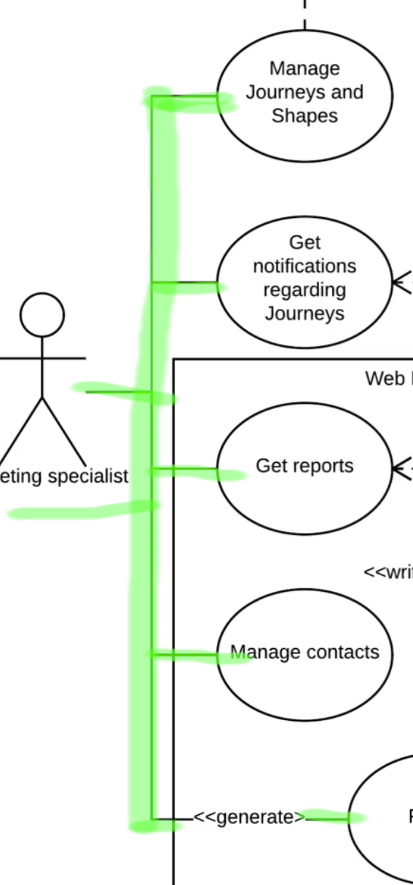
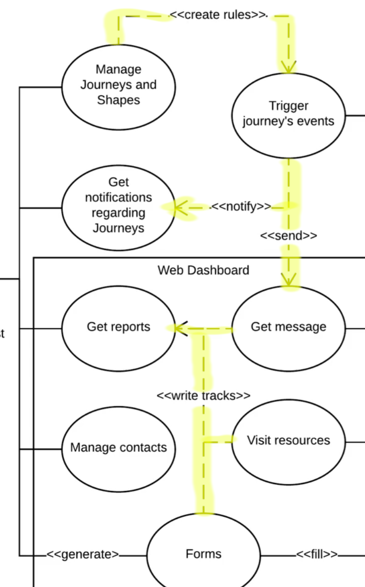

# MODULE 07 - 173:     UML - UseCase
## Building a Marketing Automation System UseCase Diagram
---

1. System Overview

2. Actor Analysis
    - Marketing Specialist
    - Customer/Lead

3. Use Case Breakdown
    - External System Functions
    - Web Dashboard Subsystem

4. Relationship Patterns

5. Development Implementation Insights

6. System Architecture Implications

7. UML Value Demonstration

---

## 1.      System Overview

The Marketing Automation System use case diagram demonstrates a complete implementation of all use case diagram elements working together to model a real-world business application.   

It's based/derivated from what we walked through the Activity Diagram section, at least as actors' part.

This system manages the entire customer journey from lead generation to conversion, providing different access levels for marketing specialists and customers.

**Core System Purpose**

- Track customer journeys from lead to sale
- Automate marketing processes and notifications
- Provide reporting and contact management capabilities
- Enable dynamic form creation and customer interaction

---

## 2.      Actor Analysis

---
### Marketing Specialist

**Role Definition**: Administrative user with comprehensive system access, functioning as the primary system operator.

**Available Use Cases**

- **Manage Journeys and Shapes**: Create and modify customer journey workflows
- **Get Notifications Regarding Journeys**: Receive alerts about customer journey events
- **Get Reports**: Access analytics and performance data
- **Manage Contacts**: Handle customer and lead information
- **Generate Forms**: Create dynamic forms for customer interaction
- **Get Messages**: Access communication logs and customer messages
- **Visit Resources**: View system resources and documentation

**Access Pattern**: The marketing specialist has the broadest system access, including both external functions and full web dashboard capabilities.

---
### Customer/Lead

**Role Definition**: External users interacting with the marketing system, representing potential or existing customers.

**Available Use Cases**

- **Trigger Journey Events**: Initiate marketing workflows (e.g., signing up via website forms)
- **Get Messages**: Receive communications from the marketing system
- **Visit Resources**: Access provided materials and content
- **Fill Out Forms**: Complete dynamic forms created by marketing specialists

**Access Pattern**: Customers have limited, interaction-focused access designed to capture engagement and move them through marketing funnels.

---

## 3. Use Case Breakdown

---
### External System Functions

Functions that operate outside the web dashboard subsystem:
##### **Manage Journeys and Shapes**

- **Purpose**: Configure customer journey workflows and decision trees
- **Implementation Implication**: Requires workflow engine and visual journey builder
- **Actor Access**: Marketing Specialist only

##### **Get Notifications Regarding Journeys**

- **Purpose**: Alert marketing specialists about customer journey events
- **Implementation Implication**: Email notification system required
- **Actor Access**: Marketing Specialist only
- **Special Relationship**: Connected to "Trigger Journey Events" via "notify" relationship

##### **Trigger Journey Events**

- **Purpose**: Customer actions that initiate or advance marketing workflows
- **Implementation Implication**: Event tracking and workflow trigger system
- **Actor Access**: Customer/Lead only
- **Connection**: Links to notification system for marketing specialists

---
### Web Dashboard Subsystem

The web dashboard contains five integrated use cases representing the core administrative interface:

##### **Get Reports**

- **Purpose**: Analytics and performance monitoring
- **Implementation Requirement**: Reporting interface with data visualization

##### **Manage Contacts**

- **Purpose**: Customer and lead information management
- **Implementation Requirement**: Contact database and management interface

##### **Generate Forms**

- **Purpose**: Dynamic form creation for customer engagement
- **Implementation Requirement**: Form builder components and rendering system

##### **Get Messages**

- **Purpose**: Communication log access and management
- **Implementation Requirement**: Message storage and retrieval system

##### **Visit Resources**

- **Purpose**: Access to system documentation and materials
- **Implementation Requirement**: Resource library and access control

---

## 4.      Relationship Patterns

*-*--
### Direct Actor-Use Case Relationships

##### **Marketing Specialist Connections**

- Direct access to all external functions
- Full access to web dashboard subsystem
- Comprehensive system privileges

##### **Customer/Lead Connections**

- Limited to customer-facing interactions
- No administrative access
- Focused on engagement and data collection

---
### Inter-Use Case Relationships

##### **"Notify" Relationship**

- **Source**: Trigger Journey Events
- **Target**: Get Notifications Regarding Journeys
- **Purpose**: Automatic notification flow when customers take actions
- **Implementation**: Event-driven notification system

---

## 5.      Development Implementation Insights

### System Architecture Requirements

**Email Notification System:** The placement of "Get Notifications Regarding Journeys" outside the web dashboard indicates a separate email notification service that alerts marketing specialists of customer actions.

**Form System Components:** The "Generate Forms" use case implies a dual-component system:

- **Admin Component**: Form builder interface for marketing specialists
- **Customer Component**: Form rendering and submission system for customers
- **Data Flow**: Form submissions feed into reporting system

**Web Dashboard Structure:** - Five distinct functional areas requiring:

- Reporting interface with analytics
- Contact management system
- Message handling capabilities
- Resource library
- Form generation tools

### Authorization Engine Requirements

**Role-Based Access Control**

- **Marketing Specialist**: Full system access including administrative functions
- **Customer/Lead**: Limited to interaction and engagement functions
- **Clear Boundaries**: Web dashboard requires authentication and role verification

---

## 6.      System Architecture Implications

---
### Component Distribution

#### **External Services**

- Journey management engine
- Notification service
- Event tracking system

#### **Web Dashboard Module**

- Integrated administrative interface
- Reporting subsystem
- Contact management
- Form builder
- Resource management

---
### Data Flow Patterns

#### **Customer Journey Flow**

1. Customer triggers journey event (signup, form submission)
2. System processes event and updates journey state
3. Marketing specialist receives notification
4. Reports updated with new engagement data

#### **Form Interaction Flow**

1. Marketing specialist generates form in web dashboard
2. Customer accesses and fills out form
3. Form data feeds into contact management and reporting systems

---

## 7.      UML Value Demonstration

### 1. Efficiency of Visual Modeling

**Information Density**: This compact diagram conveys system architecture information that would require extensive written documentation to communicate effectively.

**Clear Authorization Framework**: The visual representation immediately shows:

- Who can access what functionality
- Which components belong to which system modules
- How different user types interact with the system

### 2. Development Planning Benefits

**Component Identification**: Developers can immediately identify required system components:

- Web dashboard interface
- Email notification service
- Form generation and rendering systems
- Journey management engine
- Reporting infrastructure

**Feature Scope Understanding**: Eight use cases reveal significant functionality requirements including:

- Dynamic form creation
- Customer journey tracking
- Automated notifications
- Comprehensive reporting
- Contact management

### 3. UML Power Demonstration

**Simple Tools, Complex Systems**: Using only four UML elements (actors, use cases, subsystems, relationships), the diagram models an entire marketing automation platform.

**Longevity and Effectiveness**: The enduring relevance of UML is demonstrated by how these simple visual tools can capture complex system requirements clearly and efficiently.

**Communication Bridge**: The diagram serves multiple audiences:

- **Developers**: Clear implementation requirements
- **Business Stakeholders**: Understanding of system capabilities
- **System Architects**: High-level system organization

---
## Video Lesson Speech  

Now that we've reviewed all of the elements, let's take a deep dive into what we're going to be building when we put these together.

---

We have a use case diagram for a marketing automation system, this has all the elements that we've walked through with using Use Case diagrams. 

Looking at the marketing specialist, you can think about them being an admin user for the system. If you follow along to see each one of the different use cases they have access to. You can see at the very top they have the ability to:

- manage journeys and shapes
- get notifications regarding journeys (you can think of a journey as a marketing lingo where it gives you the ability to track users from lead to sale)
- get a notification on that side

Next to notification you see that we have a relationship that says "notify." That gives us some guidance on the processes that will happen. If we go from "trigger journey events", that has to connect to the marketing specialist getting notifications, so they're going to be notified. 

Moving down, we have our subsystem of the web dashboard. This is where each one of these five elements is going to be included. 

- get reports 
- manage contacts
- generate forms

they can do all of this from within the web dashboard. 

The customer (you could also call them a lead) has access to a number of things. For example, it can trigger a journey event by signing up with a company's website sign-up form. They would then get a message and they can visit resources and fill out forms. This gives a nice level of visualization when it comes to seeing what types of functionalities and features every user in the system has access to. 

If an engineer handed me this type of diagram I would be able to see that we have a web dashboard that's going to:

- have a reporting interface
- it's going to have messages
- it's going to have resources
- a spot to manage contacts 
- spot to manage forms

Then by looking at the actors, I can see what each one of them has access to and which one of them should be able to do things like getting notifications.  

When I see notifications at the top and I see it's not inside the web dashboard, that tells me that I'm going to build an email system to notify the marketing specialists each time a change happens from that lead. 

When I go into the web dashboard and I see where it says "generate forms" that tells me that I'm going to have a number of components to build. On the form side of things, I need the ability to create dynamic forms that the specialists can build, then the customer needs access to see them and fill them out. That's going to feed into reports. This diagram may not be that big, however, with these eight different use cases I see a lot of functionality. This goes back to one of the entire purposes behind UML, this small diagram would take pages of written content if somebody told me this by hand. 

By building a diagram like this I can see 

- what users should be authorized to do
- I can see different components that are going to be available on the pages
- I can see features such as notifications, journeys, and rules 

This is part of the reason why UML has been around for decades and hasn't changed a lot, you can utilize a lot of power by using these simple tools. Notice how we are only using four elements inside of this use case diagram and we've modeled an entire system.

