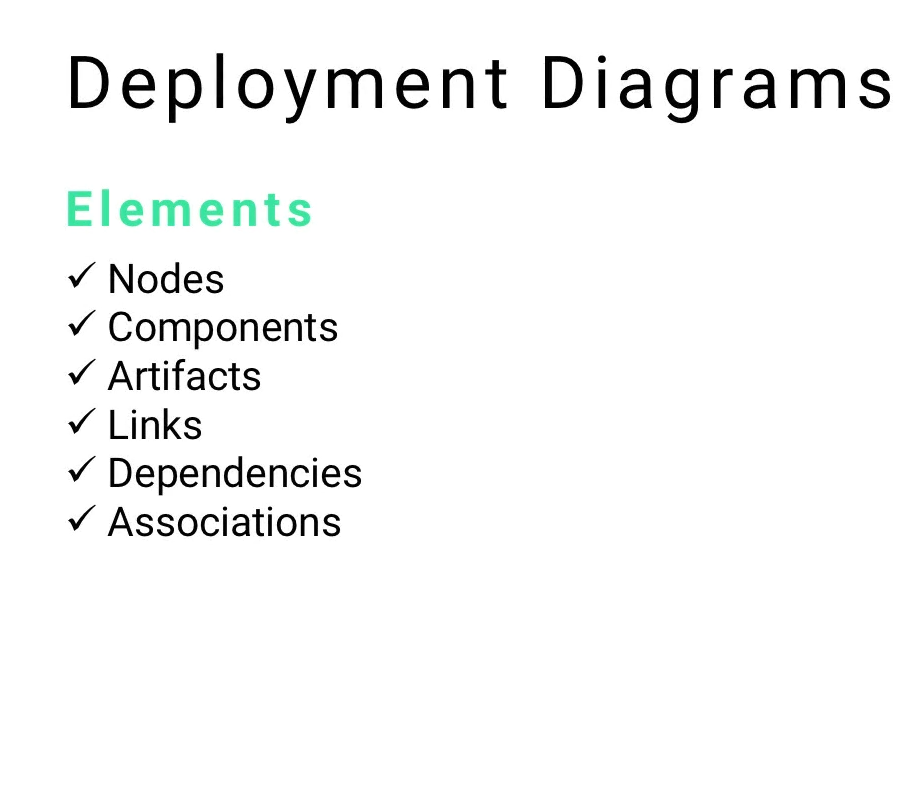
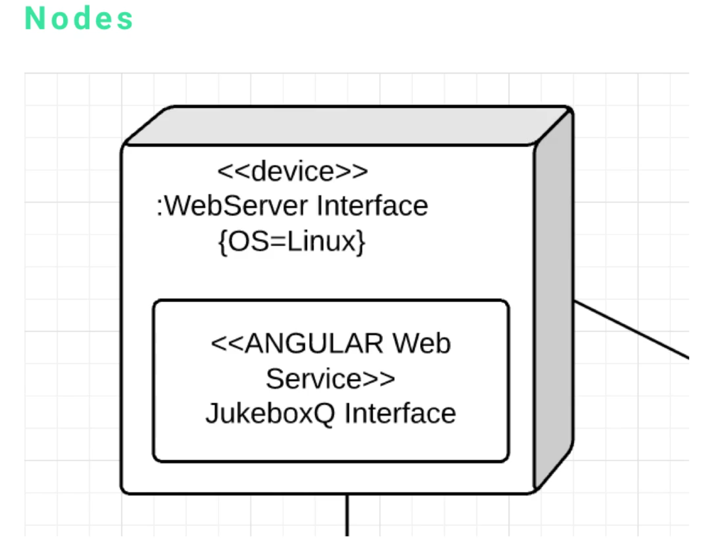
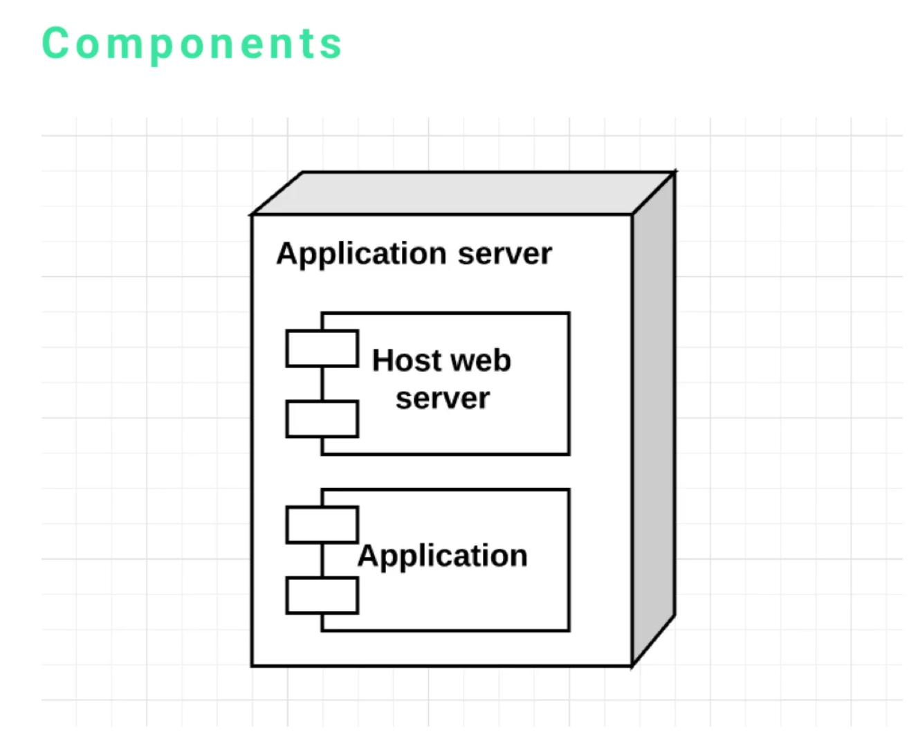
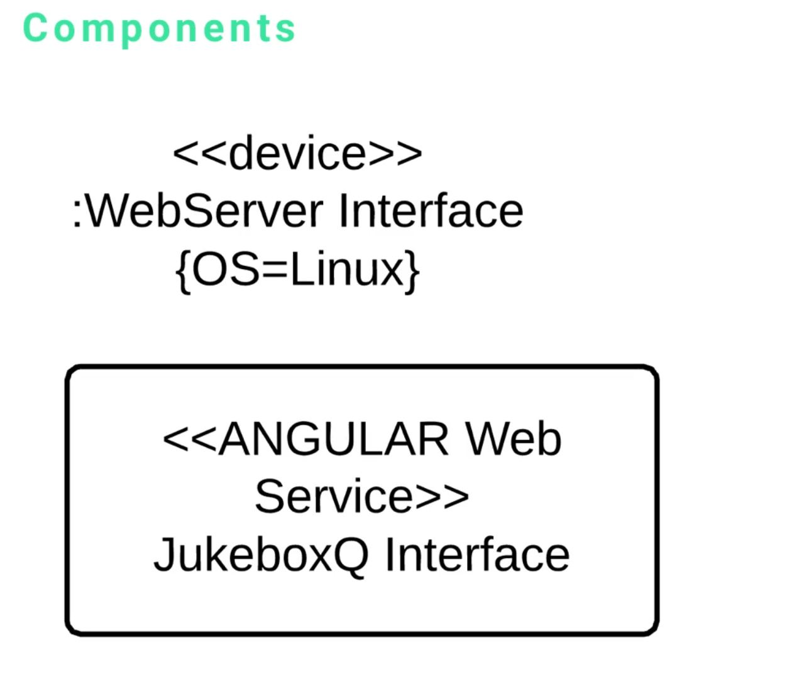
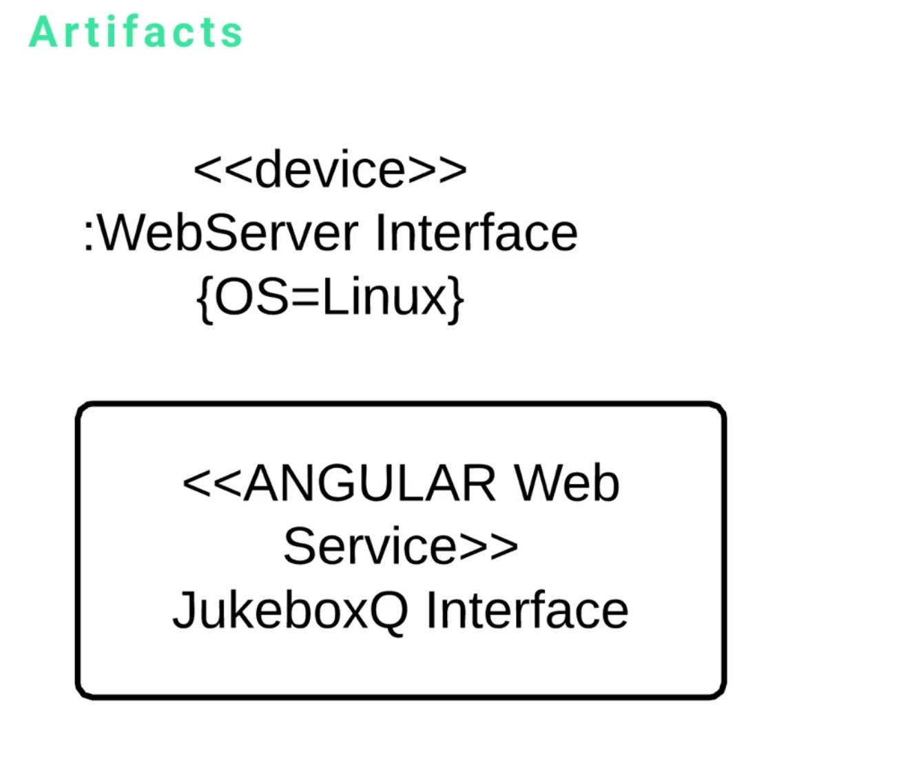
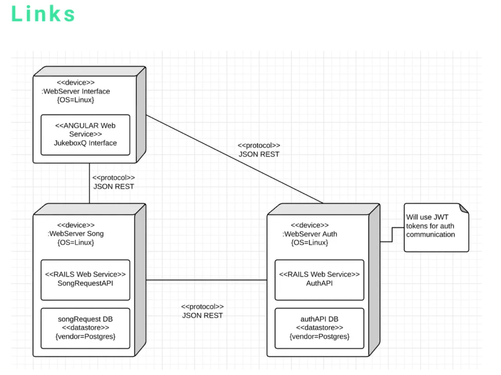
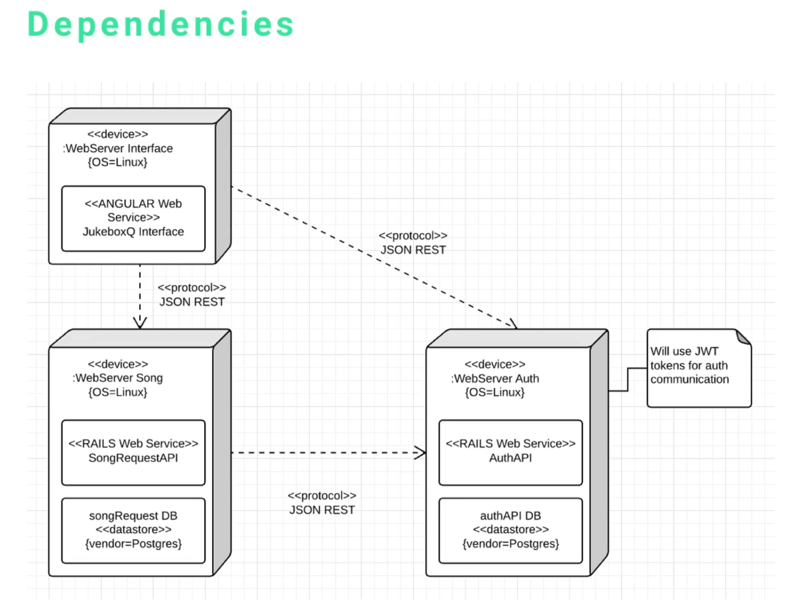

# MODULE 07-175:    UML
## Deplyment Diagrams
---

1. Introduction to Deployment Diagrams

2. Core Elements Overview
	1. Nodes
	2. Components
	3. Artifacts
	4. Links
	5. Dependencies
	6. Associations

3. Design Principles and Best Practices

---

## ***1. Introduction to Deployment Diagrams***
---
Deployment diagrams are **structural UML diagrams that model the physical architecture of a system.** 

They are primarily used for **system architecture decisions** and show how software components are distributed across hardware infrastructure.

#### **Primary Purpose**

- **Visualise system architecture and infrastructure requirements**
- **Define deployment strategies and configuration** needs
- Show relationships between hardware and **software** components
- **Guide infrastructure setup and deployment** processes

#### **When to Use**

- Planning system architecture at project start
- Documenting existing system infrastructure
- Communicating deployment requirements to operations teams
- Designing scalable and distributed systems

---

## ***2. Core Elements Overview***
---
Deployment diagrams consist of **SIX** fundamental elements that work together to represent system architecture:

- **Nodes**: Physical or logical hardware/software units
- **Components**: Software applications or services running on nodes
- **Artifacts**: Deployable software elements with specific configurations
- **Links**: Basic connections between nodes
- **Dependencies**: Directional relationships showing dependencies
- **Associations**: Complex relationships in distributed systems

---

## ***1.      Nodes***
---

### **Definition** 

>  Nodes represent **the fundamental building blocks** of deployment diagrams - they are **the actual real-world components where software runs**.

### **Visual Representation**

Three-dimensional boxes or cubes representing physical or logical deployment targets

### **Types of Nodes**

- **Physical Servers**: Web servers, database servers, application servers
- **Virtual Machines**: Cloud instances, containers
- **Databases**: Database management systems
- **APIs**: Service endpoints
- **Network Devices**: Load balancers, routers, firewalls

### **Key Principle** 

> **Everything in a deployment diagram is essentially a node**. All other elements either add detail to nodes or show relationships between them.

#### **Examples**

- Web Server hosting a React/Angular frontend
- Database Server running MongoDB, PostgreSQL
- API Gateway managing service requests
- Load Balanser distributing traffic

---

## ***2.      Components***
---

### **Definition**:

> **Software applications, services, or logical units that run within nodes** and handle business logic and communication.

### **Visual Representation**

Rounded rectangles contained within nodes, often with component stereotypes

### **Component Types**

- **Web Applications**: Front-end applications (Angular, React, Vue)
- **Web Services**: Back-end services and APIs
- **Database Systems**: Database management software
- **Middlewares**: Message queues, caching systems
- **Business Logic Services**: Domain-specific applications

### **Alternative Syntax**

Different UML tools may represent components with varying visual styles:

- **Standard Style**: Rounded rectangles with component labels
- **Enterprise Architect Style**: Rectangular boxes with component stereotypes
- **Simplified Style**: Text labels within nodes

### **Design Philosophy**

> **The specific visual representation is less important than clearly communicating the software components** and their organisation. 

##### Choose the style that best serves your stakeholders and documentation needs.

---

## ***3.      Artifacts***
---

### **Definition**

**Specific "deployable" software elements** that provide detailed configuration and deployment information.

#### **Visual Representation**

Text surrounded by angle brackets (e.g., `<<device>>`, `<<angular web service>>`)

### **Purpose**

Artifacts tell architects and operations teams exactly **what needs to be installed, configured, and deployed** on each node.

### **Artifact Information Types**

- **Software Stack Requirements**: Framework and runtime specifications
- **Operating System Details**: OS type and version requirements
- **Configuration Parameters**: Environment-specific settings
- **Interface Specifications**: Communication protocols and ports

#### **Examples**

- `<<device:webServer Interface {OS=Linux}>>`
- `<<angular web service>>`
- `<<Rails API {version=7.0, database=PostgreSQL}>>`

### **Practical Value Example**

#### 1. When an artifact specifies "angular web service" ....
#### 2. .... operations teams know to install Node.js, NPM, and Angular dependencies. 

#### 1. If it specifies "Rails web service,".... 
#### 2. .... they know to prepare Ruby, Rails, and associated dependencies.

### **Formal Naming Convention**

UML standard format includes **device type, interface specification, and configuration parameters in a structured forma**t for precise deployment instructions.

---

## ***4.      Links***
---

### **Definition**

Basic connections between nodes showing that communication occurs between system components.

### **Visual Representation**

Simple lines connecting nodes without directional information

### **Purpose**

- **Show which nodes can communicate with each other**
- Indicate network connectivity requirements
- Visualise basic system topology

### **Connection Examples**

- Angular front-end linked to Authentication system
- Front-end linked to Rails API
- API linked to Authentication system

### **Use Case**

> **Links provide a high-level view of system connectivity without specifying the nature or direction of dependencies.**

---

## ***5.      Dependencies***
---

### **Definition**
Directional relationships that specify which nodes depend on others for functionality.

### **Visual Representation**

Dotted lines with arrows pointing toward the nodes being depended upon

### **Purpose**

- **Show explicit dependency relationships**
- Indicate deployment **order requirements**
- **Clarify** service dependencies for troubleshooting
- **Guide system startup and shutdown sequences**

### **Dependency Analysis Benefits**

- **Quick Assessment**: At a glance, understand which components rely on others
- **Deployment Planning**: Dependencies indicate which services must be started first
- **Impact Analysis**: Understand which components are affected if a dependency fails

### **Example Pattern**

- Angular frontend depends on Authentication system (arrow points to Auth)
- Angular frontend depends on Rails API (arrow points to API)
- Rails API depends on Authentication system (arrow points to Auth)

---

## ***6.      Associations***
---

### **Definition**

Complex relationships in distributed systems that show how multiple nodes work together in sophisticated architectures.

### **Visual Representation**

Lines connecting multiple nodes, often in hub-and-spoke or network patterns

### **Use Cases**

- **Load Balancer Architectures**: Show how load balancers distribute requests to multiple application servers
- **Microservice Communication**: Model complex service-to-service communication patterns
- **Database Clustering**: Represent database replication and clustering relationships
- **CDN Networks**: Show content distribution and caching relationships

###  **Example Architecture**:  

A load balancer receiving requests from the Internet and mapping them to various application servers, which then communicate with database clusters.

### **Deployment Strategy Insights**

Association patterns provide a "recipe" for infrastructure setup, showing:

- Number of application servers needed
- Database clustering requirements
- Load balancer configuration needs
- Network topology requirements

---

## 3.      Design Principles and Best Practices***
---
### Clarity Over Perfection

- Focus on clear communication rather than perfect UML notation
- Choose visual styles that make sense to your stakeholders
- Prioritize understanding over strict symbol adherence

### Architecture-First Approach

- Use deployment diagrams early in project planning
- Let infrastructure requirements drive technology choices
- Consider scalability and maintenance from the start

### Stakeholder Communication

- Ensure diagrams serve both technical and business audiences
- Include enough detail for implementation without overwhelming
- Use consistent notation across project documentation

### Deployment Recipe Mentality

- Design diagrams that serve as deployment guides
- Include configuration details in artifacts
- Show dependencies clearly for proper deployment sequencing

### Tool Flexibility

- Accept that different UML tools may have varying visual representations
- Focus on content accuracy rather than visual consistency across tools
- Document any tool-specific notation choices for team clarity

---
## Video Lesson Speech

In this section we're going to walk through the deployment diagram. Many times when I come to a project, the first task that is deciding the architecture for a system, that is exactly what deployment diagrams do. 

---

We're going to start this off by walking through the six elements that make up a deployment diagram;

- Nodes
- Components 
- Artifacts
- Links 
- Dependencies
- Associations. 

## Nodes

The very first item is the node, it is one of the most important parts of the entire system. Essentially, every component of a deployment diagram is a node. Everything else is simply adding detail to that node or it's showing how the nodes are related to each other. The node itself is the actual real-world component. We have a web server and that web server has an angular front end system. We're going to go into the details of everything shortly but for right now just know that a node could be anything from a server to a database or it could be an API. It's anything that you can communicate with. 

## Components

Now we're going to talk about components. There are a couple of different syntax options for components. The component is the kind of rounded rectangle storing the angular web service. A component could be an application, a web service, it could be the API itself or it could be a database, there are numerous things a component could be. Usually, it is the actual piece of software that manages communication and handles the business logic for the node that it resides on. 

I also want to show you a separate syntax, the main reason is depending on the type of software that you use, you might have a couple of different options for showing and visualizing components. If you use something like an enterprise architect, your components inside a deployment diagram are going to look like this.

It's going to look like the host web server, either option is valid for you to use. Remember, the most important thing when working with UML is not to worry about all of the little details or getting every single symbol right. The most critical part is that you're able to visualize and represent your system in a way that makes sense to you and to all of the other stakeholders on the project. 

## Artifacts

The next item is the artifact. Artifacts are those items that are surrounded by the angle brackets (device and angular web service). When analyzing a deployment diagram, if I want to see what type of server I'm going to deploy or the type of application that I'm going to configure, these are the items that I look at. 

Right here I would be able to look at that bottom component and know that the server needs to work with angular, I would need to install a node, NPM, and other dependencies. If it said Rail's web service, then there would be different items that I would have to install. 

This artifact is very descriptive, it will tell the architect how everything needs to be configured. You can also pass other parameters, just like you see at the very top. We have an artifact called "device" followed by a :webServer Interface which is also followed by {OS=Linux}. 

This is a formal way of defining the type of server and the type of device in UML. There are times where I see them say "server" and then Linux and a version. I met with a number of other software engineers to make sure that I am presenting it in a way that conforms to the UML standard. One of the requests they had was to show you this formal type of interface for naming.

## Links

Now we have links. The links are those lines that are connecting each one of the nodes. We have a link from the angular front end to the authentication system. We have a link between the front end and the rails API and then we have a link between the API and the authentication system. That's a way of showing how each one of the nodes is connected. 

## Dependencies

Dependencies put a twist on what links do. Links connect our items, if we want to be more specific, we can add dependencies. Dependencies are represented by that dotted line with arrows going in the direction of the node. It shows what other nodes it depends on. At a cursory glance, you'd be able to look at this and understand that the angular front end depends on the auth system and it also depends on the API. The API depends on the auth system and you can see that simply by knowing that it's a dotted line with arrows going to each one of those other nodes. 

## Associations

The association element is very similar to the link and the dependency. It is a way of connecting all of the nodes and showing how they're associated. In this case, we have an entire system that represents how a user and an API can connect with a web application that leverages a load balancer. We're not going to focus on how load balancers work, however, by looking at this system you can tell that a load balancer can take in a request from the Internet and then maps that to various applications servers. 

When I see something like this, it's helpful for me to understand what has to be done from a deployment strategy. I know that I'm going to:

- set up and clone various application servers
- they're going to communicate with database clusters
- there's going to have to be a load balancer that can manage all of the incoming traffic and pass that to the server.

I'm going to have to set up a number of items that this deployment diagram essentially gives me a recipe for. 

So that is the full set of the core elements used in deployment diagrams. In the next guide, we'll take a deep dive into a real-world scenario. 
