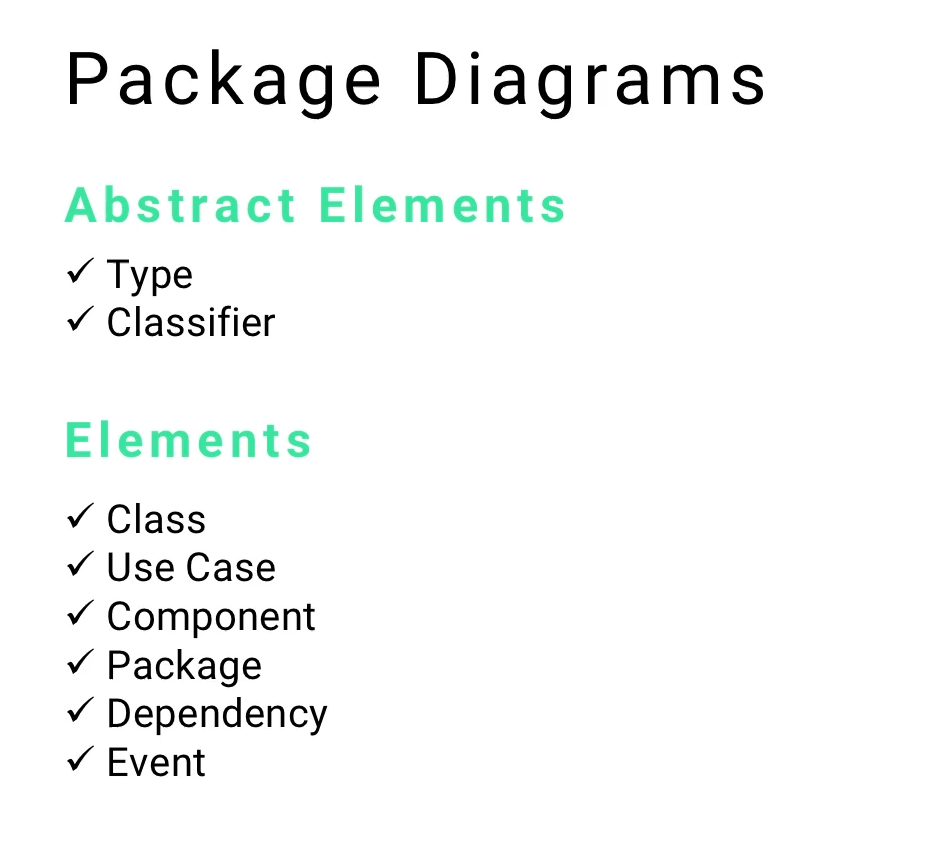

# MODULE 07-178:    UML Diagrams
## Package Diagrams (1)

---

---
## Video Lesson Speech

Nice work in the progress that you've been making through this course! This is going to be one of the shortest sections of the entire course and it's for a good reason. 

---

We're going to talk about UML Package Diagrams, in starting off and talking about the elements that make up a diagram. It's going to be something that may surprise you a little bit. Package diagrams at a high level are simply ways of wrapping some of the other components from other diagrams and what they represent. 

So whereas you have something like a class diagram

- where you want to list out in detail each one of the attributes
- you want to list the different operations
- the connectivity between the two 
- if they have multiplicity or not 

all kinds of things that are very low level. They speak directly to how the code itself needs to be written. 

Package diagrams are very different. First and foremost, they're going to carry a number of abstract elements

- types
- classifiers 

some of the things we talked about early on in the course when we talked about just some kind of shared types of ways of naming things. 

It also can contain some more concrete elements. If you look at what they are, they are things that have made up other diagrams that we've already gone through. 
The elements are

- Class
- Use Case
- Component
- Package
- Dependency
- Event 

Your package diagram is something that allows you to take your other different components inside of your system and show how they relate to each other and you can show dependencies and some different elements like that. I typically use a package diagram when I'm building out something like a ruby gem, some type of third party library, to show where the dependencies are and how each one of the modules relates to each other. For example, that's exactly what we're going to walk through. 

This is different than a deployment diagram. Those diagrams communicate and show how you have all of these nodes that are connected but they usually have to deal with how you actually have a deployed system, servers, and different things like that. Package diagrams are much different, they simply represent the structure of your software at a very high level and show how it can be composed and also how each one of the elements is interconnected. 

So you have a good idea of the goal of a package diagram. Let's take a look at an example. 
