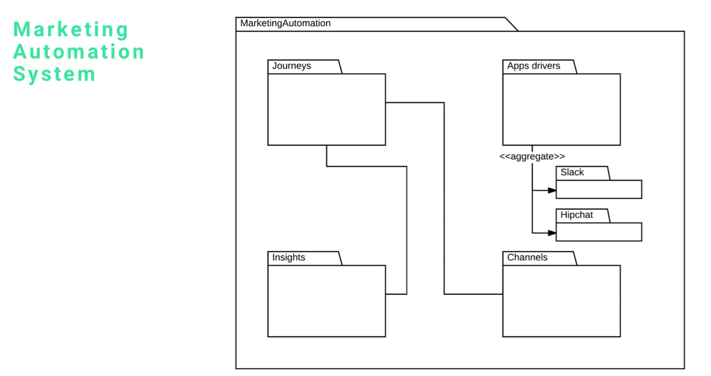

# MODULE 07-179:    UML
## Package Diagram Example
---

---

## Video Lesson Speech

In this guide we're going to walk through a package diagram that I have built out for a system we currently have in development.

---

We have this marketing automation system and as you can see, it has a number of packages inside. We have marketing automation which wraps up 

- journeys
- insights 
- channels 
- app drivers 

and then app drivers are connected to a few other elements. 

The way that this works is we have one application and that application has a number of different software components that comprise it. This does not mean that journeys and insights are different applications, that would be the way we'd set it up if we had Micro's service architecture and we had this full set up the way we did with the deployment diagram. That is not the case here and it's part of the reason why I like using package diagrams when I'm a little bit unsure about the architecture, there may be a time where I do want to split these different services out into their own applications. 

A very common pattern that I personally follow, I first start with one single application and I build as much of the functionality into that app as I can. Later I may decide to rip it out and make it into its own app and then it can connect via APIs. The cool thing about this, if I do my job right when I build out a package diagram, I shouldn't have to change it later on. That doesn't mean I don't have too, there are many times where I get into the system and realize that I've missed a key component and then I'll have to update the diagram and add that. 

For right now the way you can think about it is these are your high-level modules. As you notice, we don't have details such as your class names or different activities or anything like that. This is one of the most high-level structure diagrams that you can use. This might be one of the very first diagrams I'll draw up when I'm starting a new project. Right here, I can say that I need this large scale application and then I try to load up the modules that I'm estimating are going to be needed. That's where I'll put things like journeys and app drivers and when they tell me that I'm going to have a slack, and a hipchat integration then I know that I'm going to have some way of connecting those. You can see that we have an artifact that creates a connection between our app drivers with those ones like the slack API or hipchat. 

This is something, as you can notice, is a very high level. It is a great way of being able to start to plan out the way your application works. This is a tool that I recommend to students and developers when they're a little bit unsure of what the structure of the application is going to be and they want to have an idea of all of the various components that are going to make that up.

This is also a great example of a diagram that you can use when you're building a code library like a ruby gem or something like that. We'll be in a different course we'll actually do that and leverage a package diagram for that. In fact, in other languages, such as Java, they have an entire part of the language structure itself is called the package. If you are familiar with Java or if you ever do Java work in the future then you'll run into that where you'll see that they organize their code and their groups of code files into packages. 

That's part of where the entire concept of package diagrams got brought into UML is that there are so many Java developers and what they used their packages for were to be able to wrap a large number of different code files. When I say large number it might be just a few or it could be dozens, It depends on the use case. What a package allows you to do is to wrap a number of other components, whether they be other applications or just code modules, then be able to show how they relate to each other. 
