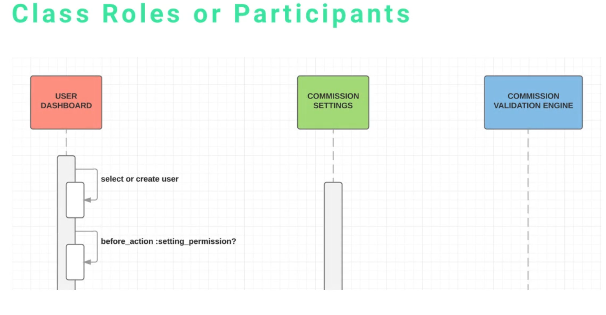
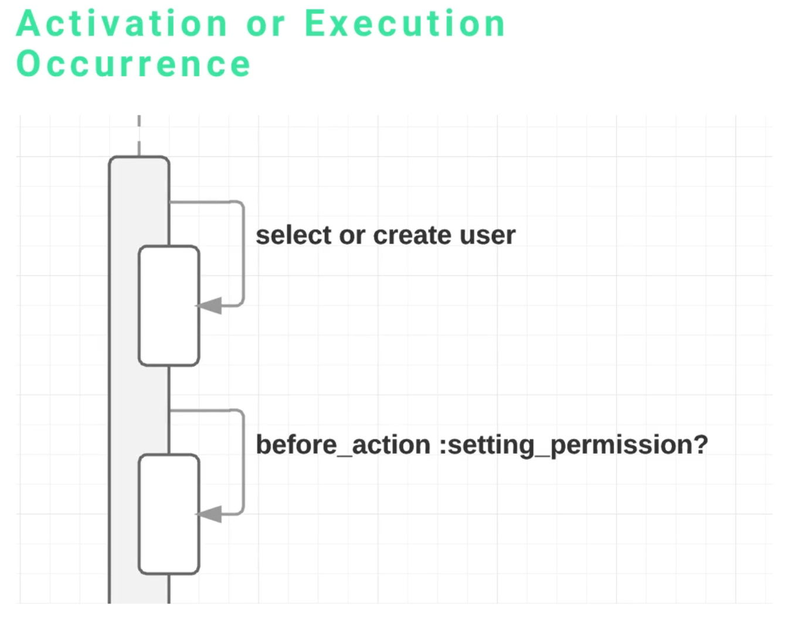
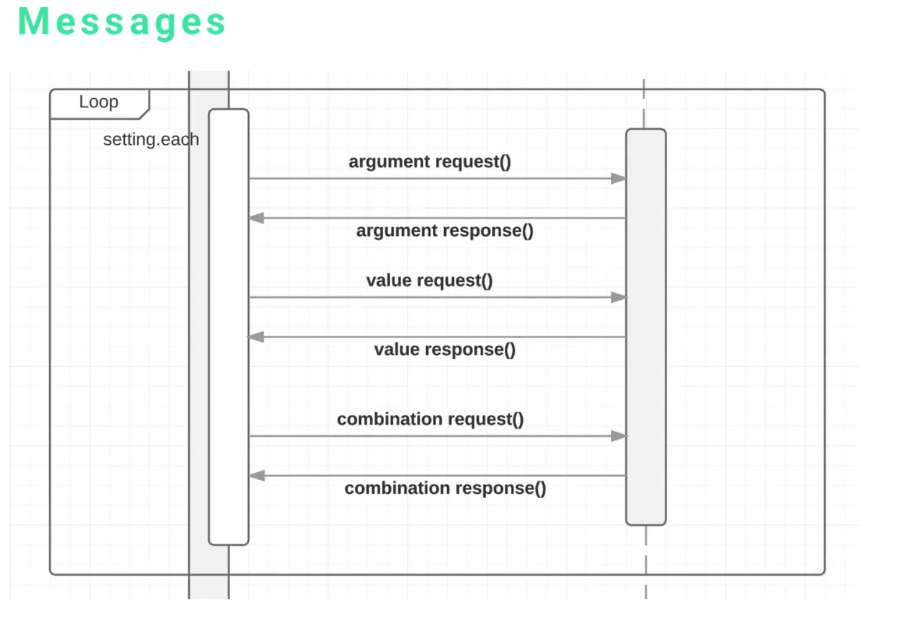
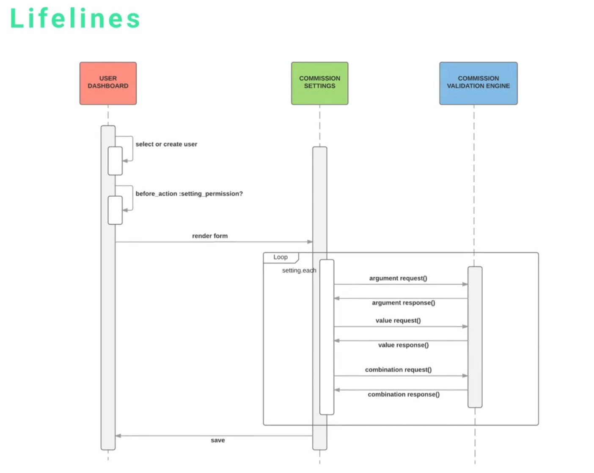

# MODULE 07-181:    UML
## Sequence Diagrams (1)
---

---
## Video Lesson Speech

In this section of the course we're going to discuss UML Sequence Diagrams. Sequence diagrams are some of the most popular UML diagrams used, especially as you get into more advanced development.

---
If you look through some of the books, especially the programming books that have to deal with implementing design patterns and more advanced topics like that, you're going to see a lot of sequence diagrams that are utilized. One of the main reasons is because they allow you as a developer to completely dissect not just the activities or the data and the relationships, it also allows you to visualize all of the messages that are being passed between the various components of your system. 

When it comes down to it, one of the ways that it's helped me the most to be a developer is to try to drill down a system or a feature to its lowest level, which is deciding what is the input and what is the output for this particular component. 

If I can get it down to that level I can build it, that is as straightforward as it gets. If I know and I can get to the level where I can build a method that has a simple input and a simple output, then that makes that a relatively straightforward thing to build. It only gets more complicated when you have all of these different ideas and different elements of the application that are going all over the place.

What a sequence diagram allows you to do is to drill down so that you can pick and choose and isolate all of the elements and see how they should communicate with each other. 

Now the elements that make up a sequence diagram are 

- Class Roles or Participants 
- Activation or Execution Occurrences 
- Messages 
- Lifelines. 

We're going to go through each one of those elements 

## Class Roles or Participants

Starting it off we have Class Rules or Participants. When I say "or" I mean that you may see it named a "class role" in one form of the documentation or with one type of software and then it may be called a "participant" with others. I've seen it called both ways, that's a reason why I included both options. 

Now what they are is if you look at the very top those colored little rectangles that says "User Dashboard" "Commission Settings" and then "Commission Validation Engine" those are participants. Those are the class roles. One of the nice things about sequence diagrams is they allow you to isolate all of the different communication occurrences that will happen to a participant. 

Once we get into the full demo and analyze a full system, you're going to see that the user dashboard is going to receive responses, it's going to send these requests, we can isolate that and know what that participant is in charge of from a communication and from a message sending point. 

## Activation or Execution Occurence

The next element we're going to talk about is the Activation or the Execution Occurrence. What that is, if you look at those vertical pipe looking items one is gray and the other set are white. Those are execution occurrences. 

Essentially they are the event when something transpires when it either receives a message or when it sends it. What that tells me from a developer's perspective, when I see that I know there's going to probably have to be some type of method there's going to have to be a module or something that can manage that communication. 

## Message

The next element is one of the most important and that is the message. 

The messages are represented by lines with arrows going in the direction that the message is being sent. They also can have names, just like here 

- we have a argument request
- we have a value request 
- then a combination request 

in this case each one of them have an associated response. 

For this particular use case, it was for a commission engine for a CRM system that I was working on and this part of the system was very complex. It had to deal with allowing for dynamic settings and having one company or one client could have a completely different type of commission engine then another client of the service. This had to be very dynamic and that's a reason why I use this type of diagram was to really isolate what the messages had to look like, and what the responses had to look like so the system would be able to follow those rules.

You could think of a message as being a method that has the ability to take in some kind of input send output and in some cases it can receive output back. 

If you're working with some type of asynchronous system, say you're working with a angular or react front end, then one of these items could be a method that calls an API and then it waits for a response. So you type some input into a form, it sends off a message to the API, It waits for that response back, if it receives some type of value back then it will render something on the screen. So that's a real world case scenario of understanding how messages work. 

## Lifelines

Now moving down the line, we have Lifelines. 

Lifelines are those dotted lines that go from the participant all the way down for the entire diagram. What they really represent is to make it easier for us to see each one of the stages and to give a spot where the messages can be sent. They don't actually do anything, they're more there so we can know at what stage a message is going to be sent to one of the participants and so on and so forth. That's what the lines are, if you're building informal UML they are always represented by dotted lines. Part of the reason for that is so that we don't get them confused with some of the other items such as a activation event or something like that. 
