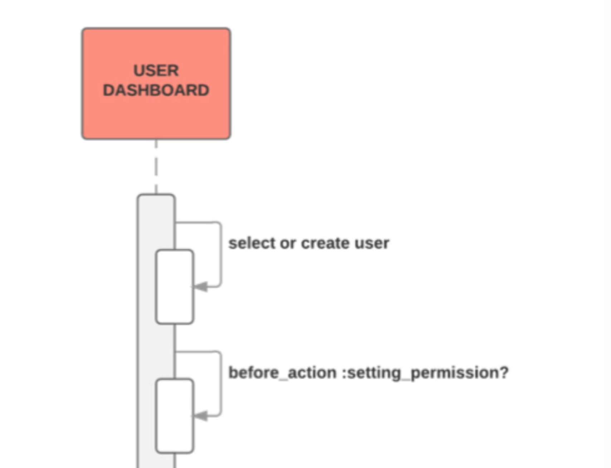
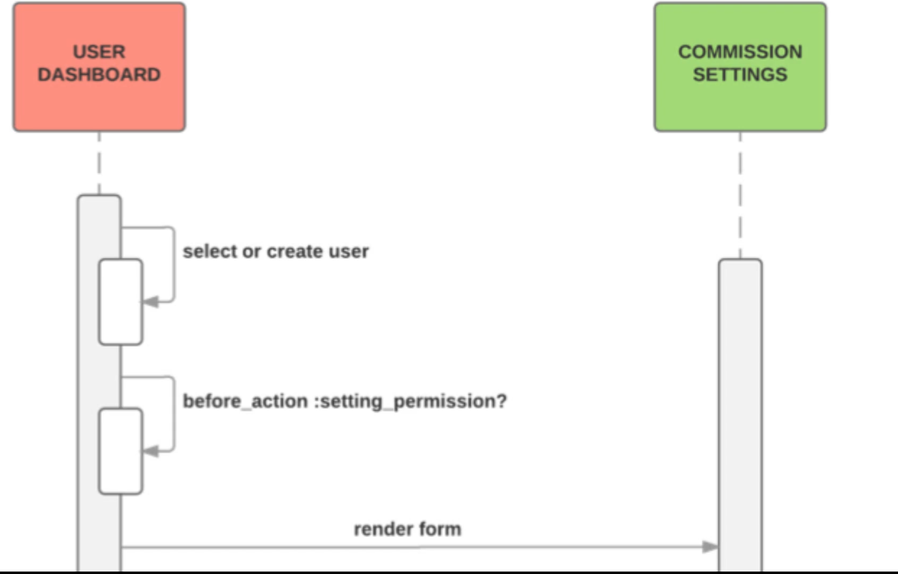
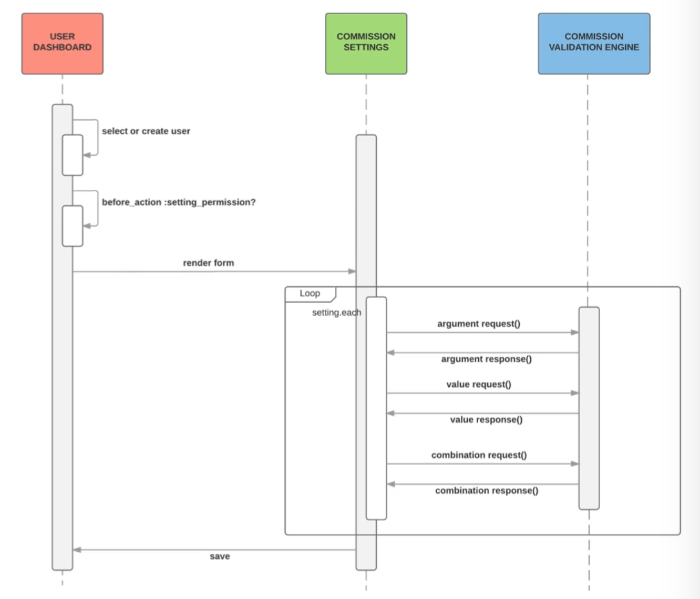

# MODULE 07-182:    UML
## Sequence Diagrams (2) Example

----

----

Now that we reviewed each of the key elements that make up a sequence diagram, let's take a look at a full example.

---

We're going to use the commission engine that I worked on about a year or so ago. we can take a look at it in kind of a holistic approach 

Right here we have a "user dashboard" we have a "commission setting" and then we have a "commission validation engine." The way that I thought about these were not so much as classes or modules but more as full functionality of the site. I didn't care as much about the low level things such as class names or even method names or anything like that. 

I wanted to abstract the features and I knew I could focus on the details later on. first I needed to give myself a frame of reference for how the system needed to work.

Starting with the user dashboard, the first thing that happens is they're going to be asked if they want to select or create a user. This is self-referential and this is one of the action executions, so they can choose to select or create a user. All of that is going to happen in the user dashboard, which means the message is being sent internally. For example, if we had a user dashboard class it is going to communicate with itself in order to process that request. 

Then it's going to move down the line and it's going to check to see if that user has the setting permission in order to move forward. Once again that's self-referential. The message gets sent back, It starts with the user dashboard level and it gets sent back to whatever module is working with that. That may end up being, if this is a Rails application, a model, view and controller all for the user dashboard. It might even include some other modules to manage some of that. That part doesn't matter. This is not so low level that it gets into those implementation details. This is more looking at the entire participant. Later on I could break it out and I may create a sequence diagram for the process of selecting or creating a user, that's a very common pattern. 

One thing that I want to make sure that is understood, we wouldn't create a entire system into a sequence diagram. That would just be so massive, it would not be a fun thing to do. 

What I personally like to do, is break my systems into tiny little pieces and then I will build sequence diagrams for those. I might create a entire sequence diagram just for that little process we see with selecting or creating a user. It would have a message that goes out and checks with the authentication system to create the user and add them to the database. That's going to have talk to user model, there's a bunch of different messages that are going to have to be sent inside of that little tiny feature that you see right there. 

Then it checks on their setting permission. If I were to create a sequence diagram for the setting permission, it would do things like check through a list of known policies for that user. That may have to call a few different models. I may have to call an org admin model or user model and check the different validations to make sure that the user that is currently on the dashboard has access to perform what they're trying to do. 

Moving down the lifeline of the user dashboard, you can see the first time where it communicates with an outside system, it sends the render form message to the commission setting participant. 

This might be an entire dashboard dedicated just to setting permissions or setting the commission values or it might be a nested form inside of the user dashboard. Once again it doesn't really matter for the sake of what sequence diagrams care about. They care about what the message looks like. They care about what happens when you send a message and it cares about what happens when it gets back and everything in between. It doesn't care about user interface it doesn't care about class names or module names or anything like that. In this case it's going to render the form and then from there you may notice that we're entering into a frame.

I specifically added this frame to show that it's a loop, if I didn't, it may be more challenging for developer reading this to notice that there is a chance that there could be identical versions of these arguments and values and combinations. You don't really have to worry about those names as they are specific to the commission engine system that I was building out. What is important, if you need to show what a loop looks like, leveraging a frame is a great way of doing that. A developer can look at it and instantly see that whatever is encapsulated inside of that frame may have to occur multiple times. 

What that will tell them is to not hard code a single set of form elements. Whenever I see a form that gets rendered and then instantly goes into a loop, that typically tells me is I'm going to have to create a dynamic form. In this case I'm going to have to create a form where the user is going to click and add their different values and have the ability to add another form and another form and it's going to loop through each one of those. So that's on the rendering form side and the fact that it's dynamic. 

You can see that we have another set of messages, we have a argument, a value and a combination request. Those go to a third participant which is the commission validation engine. That was in charge of making sure an entire Commission rule could be set. For this specific example, a user might have to create a commission rule that said that if some employee met a certain threshold it would bump their commission settings up. 

What the commission validation engine had to do was check to see if that was allowable by the company. So it would be sent, it would check to see and then it would respond back if it was allowable or not. It did that for each one of the items that it was being passed to, if it said no at any time that would be included in the response and the user would be given that feedback. 

They go through that process as many times as needed as a commission setting is being built out. After all of that's done, after the loop is complete and the user has stopped pressing the button to add more settings, they hit save. As you see, the last item that sent is that save where all of the items from the setting were saved and they are being sent back to the user dashboard.

That is how you can build a sequence diagram. 
