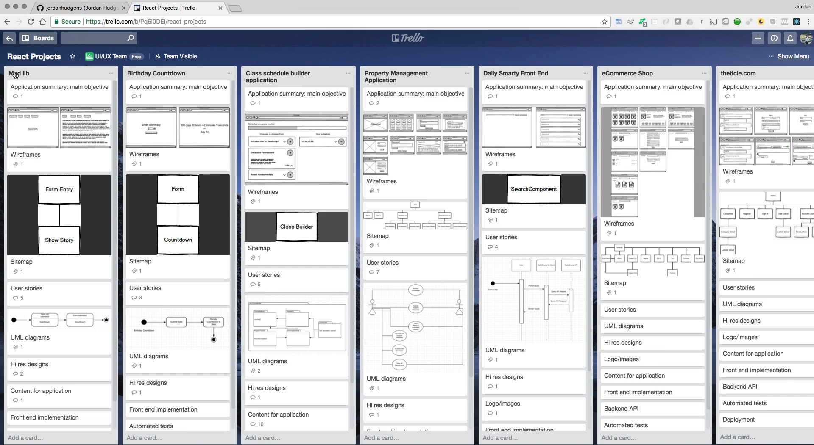
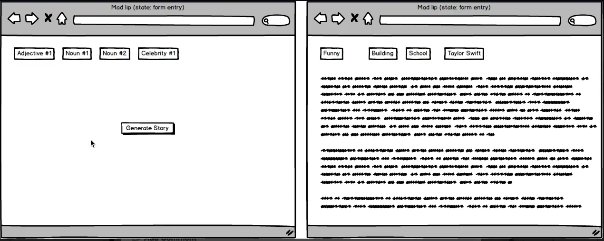
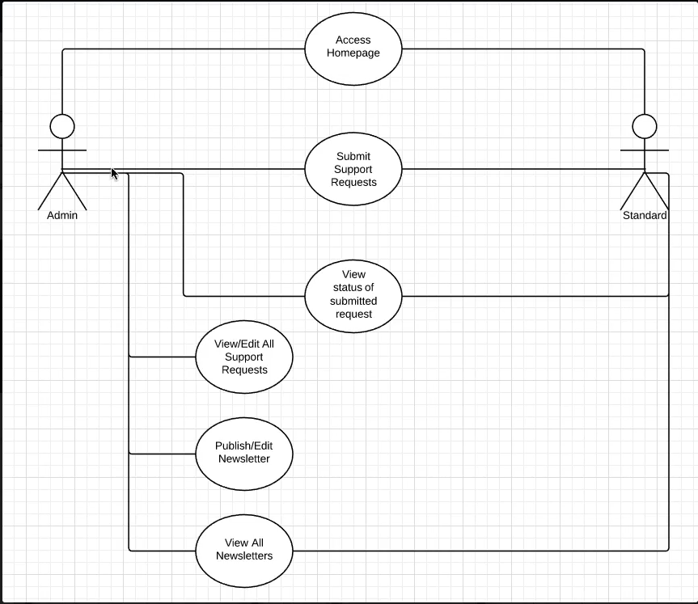
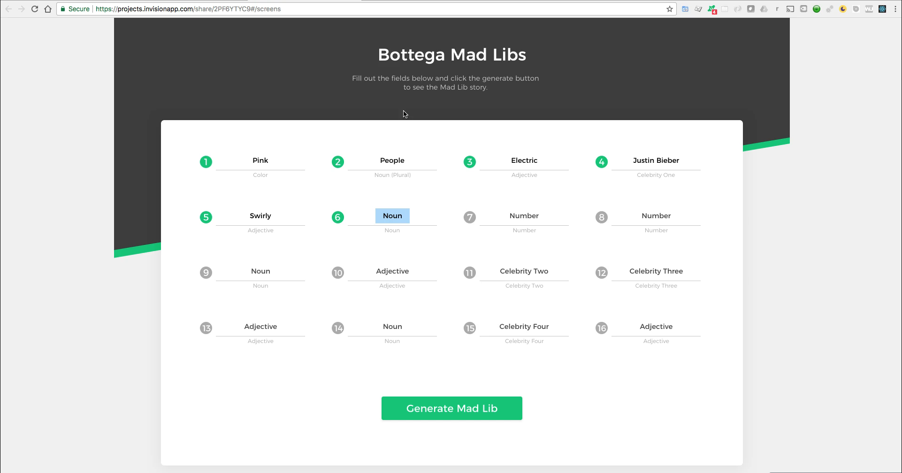
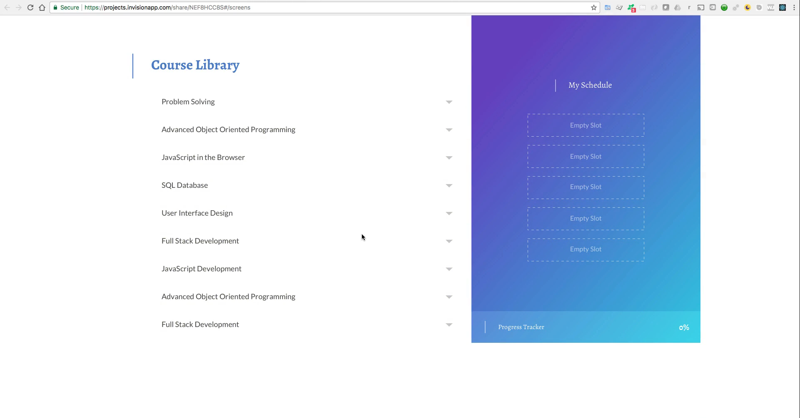
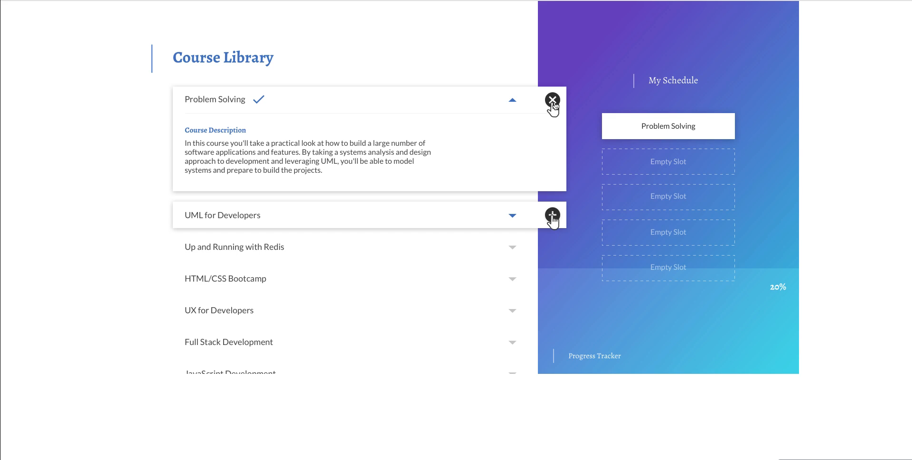
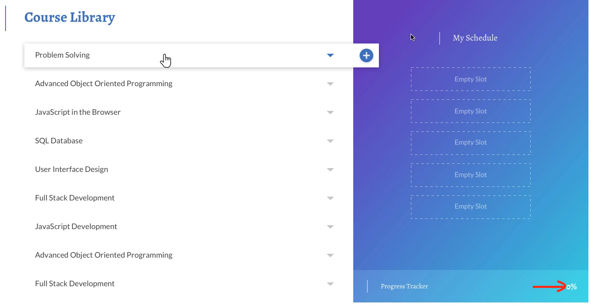

Summary: UI/UX development methodology for the React course

Systematic process for each React project:

https://devcamp.com/pt-full-stack-development-javascript-python-react/guide/how-to-go-through-the-react-course-material-ui-ux-workflow

Application summary - Clear main objective  
Wireframes - Low-fidelity designs, basic components  
Sitemap - Navigation/pages structure  
User Stories - Features the user should be able to perform  
UML diagrams - Use cases and system actors  
Hi-res designs - Complete professional designs (using Invision)  
Frontend implementation - React code  
Automated tests  
Deployment  

⚠️ Important points:

DO NOT write code until all planning is complete  
Professional methodology, not just a tutorial  
Professional designs for a real portfolio  
Objective: Learn to build ANY React project, not just follow tutorials  

Tools: Trello for organisation, Invision for prototypes.  
First project: Mad Lib application.

---

## Video Lesson Speech

So we're going to build out a number of different react applications and we're going to follow the identical approach from a UI and a UX perspective. 

Now if you went through my UI and UX course then this is going to look very familiar because it's exactly what I outlined there. And so what we're going to do is we're going to have a number of tasks that we complete and we're going to organize our process in a way that's very logical and it leads us to the most efficient development process possible. 

So right here I have a Trello board

 
and each one of these cards so mad lib, birthdate countdown, all the way through e-commerce shop and thetical.com right here what we have is a set of different tasks. So the very first project we're going to go with is Madlib. So Madlib has an application summary and this is what our main objective is. If I click on this I've written now a main objective which is to make it possible for users to enter a list of words and have the system auto populate a story with the user supplied words. If that doesn't make much sense that's fine that's just a brief summary you can come down and the next task was building out a wireframe.

So right here we have these wireframes

and so they're just browser pages where we have very high-level design components. We have some form inputs we have a button for submitting and then we can see that after a form has been filled out. It shows content. It's still very high-level but it gives us an idea of the process and now we know the components and the high-level types of things that are going to have to occur. 

Moving down, next we have a sitemap. Now this really only has a single page so it's going to not really have a lot of exciting things here. If we go and look at the property management system that we're going to build out the sitemap there is quite a bit more extensive as everything from a home page to newsletter's support request list and different pages like that. 

Continuing to move down next we're going to have User stories. This is a list of the core functionality that users should be able to have and I'm not going to go through it in detail because like I said the beginning this is going to be our process for every single project we build out. We're going to follow this pattern and we're going to see exactly what we need to do in order to properly build out the application and hopefully by the end of this you'll appreciate how much easier it is to build a application whether it's a small one or a large one. When you take the time in the beginning and you develop a process and a system that allows you to organize everything that you're going to build.

And so I want you to hopefully you really enjoy that part of it because one of the top questions that I get from students and from new developers and honestly even more experienced developers is they struggle with knowing where to start. And so this is exactly where to start with every application that you build out. And so we're going to go through this entire process we're not going to write a single line of code until we see exactly from A-Z what we need to create. And it's a very professional kind of approach to development. 

Moving down we're going to have UML diagrams. So if I come once again to the property management application right here you can see we have a uml diagram

where it shows all of the various use cases that actors and users are able to utilize in a system and we'll go through all of that in detail. 

Next, we have hi res designs as I've mentioned before I had one of the designers for Bottega build out an entire set of designs for every one of these applications and that is one of the things I'm the most excited about. And I think that everyone going through this course will hopefully really enjoy the fact that everything that you're going to be building was designed from a professional developer from a professional designer who this is all he does all day long is create some gorgeous designs. And so we're going to have access to that and so we're going to have designs just like this right here. Those is going to be the very first application that we build out which is a Madlib application. 

And so this is [Invision](https://www.invisionapp.com/) which is a tool that allows you to create prototypes and you can mimic all the behavior of a real application. And this makes it much easier and much more straightforward to understand exactly what we are going to build. This essentially gives us a clear finish line for when we know the application is going to have all the functionality that we want it to have. 

Just so you can see a few more that we're going to be building now. This design isn't quite done yet he's still putting some finishing touches on it but it's getting close and that's one I'm very excited about building which is the ability to build a class schedule generator. 

So you're going to be building this to where you can come and see a list of classes and then get more information on the classes and then start building out each one of the different items that you want on your class schedule list. 

If you notice we have some cool behavior here too where this background is going to dynamically change based on how close your syllabi is to being completed. 

So we're going to have some really fun projects and the design is going to take them to a whole nother level. We're not talking about basic templates or anything like that in this course we're going to have completely brand new designed applications that you're going to be able to use in your portfolio. So that is the hi res designs and then we have a few other elements here such as content for the application the front end implementation which we are going to do ourselves automated tests and then deployment.

So this is the process that I personally follow in every one of the projects that I work on and so I wanted to share that with you. I want to teach you more than just react. You could learn react all over the place. I want to teach you how to build professional grade applications in react and as great as it is to simply follow along with the tutorial. It is a very nice way to learn. My goal is to simply teach you how to build this set of projects. 

My goal is to be able to teach you how to build any project that you want in react. And so one of the best ways of doing that is showing you my own personal system and how I organize everything from the start of the idea. So the main objective of what we want this application to have all the way through each stage from wireframe all the way through deployment. 

So hopefully you're going to have a lot of fun in this course. I'm very excited about it! React is a powerful tool that allows you to build some pretty incredible dynamic applications and we're going to be following some pretty cool processes in order to do that.
