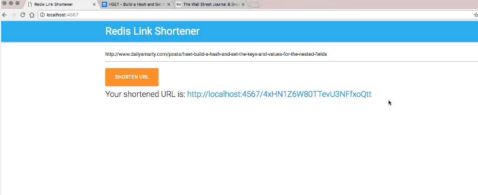
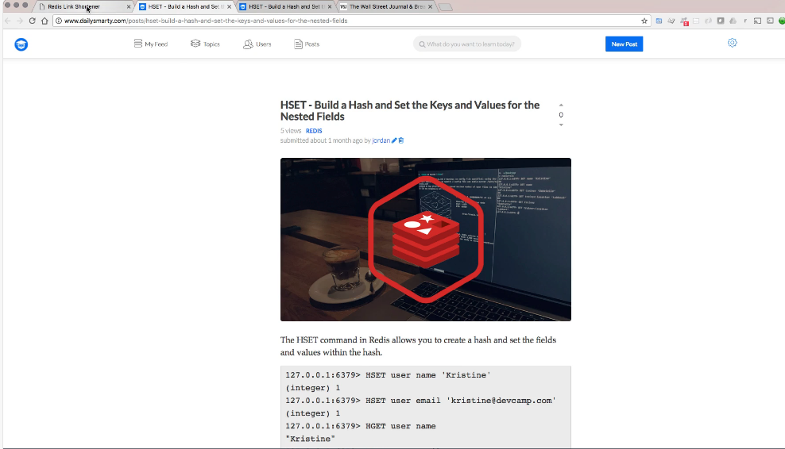
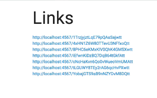

# 11-612    REDIS 12    Project Requirements for REDIS course

[Guide](https://devcamp.com/pt-full-stack-development-javascript-python-react/guide/project-requirements-redis-course)

## Video Lesson Speech

Welcome to the section of the course where we're going to walk through the requirements for this redis project. 

---

Now this is going to be a very different kind of project than many of the other types of courses you've gone through mainly because the database course is supposed to be completely agnostic from all programming languages. Because of that, it means that if you're going through this course and you're a C# developer then I want you to build this specific project in C#. If you're a Rails developer then I want you to build it in Rails. I'm going to build it in Sinatra which is a much smaller more lightweight version of rails. 

Whatever language is your specialty. That's what I want you to build this in. The solution is going to be quite a bit different as well because I can't go and create a solution for every single one of the programming languages that's out there. So I'm going to simply build it in Ruby's Sinatra, the reason why I picked that language out was because it's one of the most lightweight frameworks that's out there and the solution should be as close to just writing pure redis code as is humanly possible. That should hopefully be able to show the key components that are necessary. 

Now what I'm going to show is a redis link shortener and so that is going to be what you're going to build in this project. 

And so it's going to be very basic from a core functionality perspective. You're going to have a spot where you can type in a URL and then have it shortened. 

If I go and say copy this URL from dailysmarty and paste it in and click shorten URL, you can see where it created this shortened URL. Now sometimes it will be short sometimes it'll be longer than the actual URL the point is not to create the next bitly or tiny URL. The whole point is to learn how to work with redis. 

Right here we have a link, if I click on this you can see that now it takes me to the correct URL so that is working properly. 

If I come back and I get anotherURL and paste in the Wall Street Journal it creates an other URL and if I click on it it takes me to the Wall Street Journal. Now also if you go top to the right hand side where it says all links. This has all of the links that have been shortened. 

This is a pretty light weight kind of application. We are only going to have really two pages, you're going to have just this regular index page and then the page that shows all of the links and I don't care about how it looks and I don't care what language or framework you use. The entire point of this project is learning how to build something completely in redis. 

There are a number of different commands you're going to have to be able to implement in order to do this. You're going to have to search for keys, you're going to have to return a list of all of the keys and values, you're going to need to be able to figure out a way where you can perform some type of randomization algorithm so that you can change the URL.

If you notice when I paste this in you can see that this number and the set of characters here. This just doesn't come out of nowhere. There are a number of ways where you can randomize items and then you're going to take that value and then store it inside of redis and then you're going to have it be associated with whatever the value is and the value is the URL that we want to redirect the users to. 

So that is the redis project. Good luck with it and I will see you in the solution.

