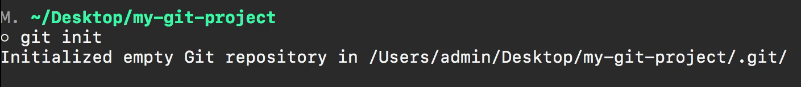
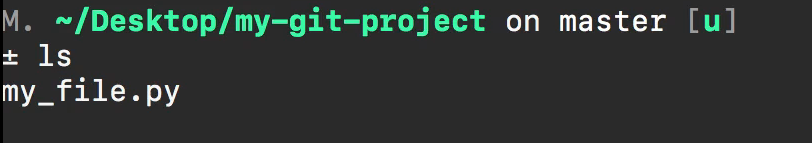
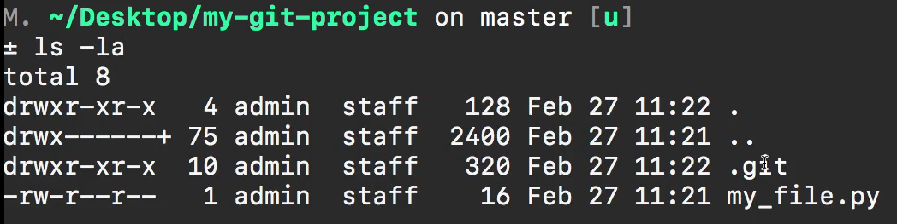
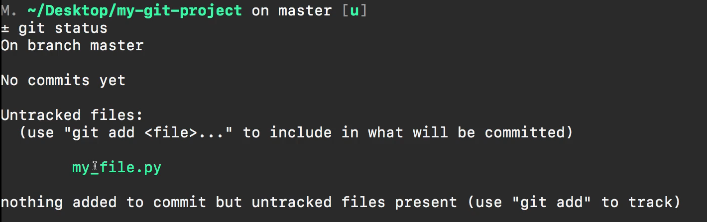
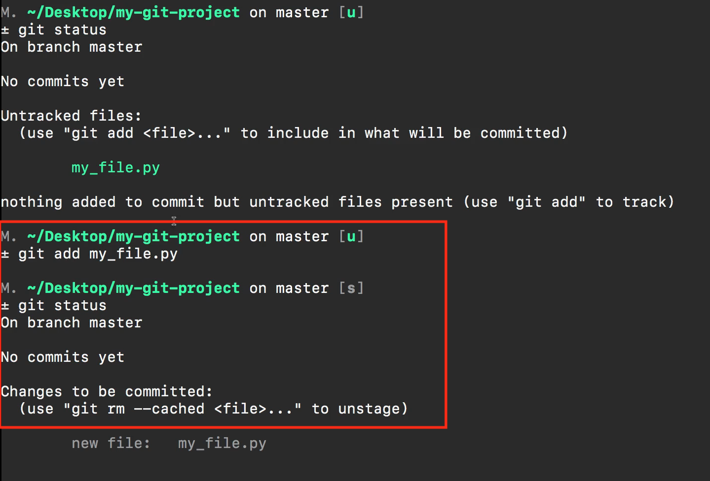
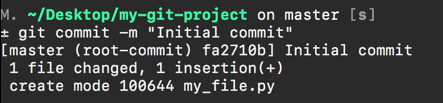
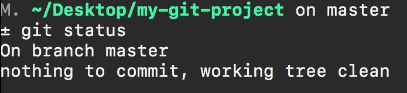

# MODULE 05-106:    Git (2)

## Creating a local repo

****

## Commands Summary

1. **Create project directory**
   
   ```bash
   mkdir project-name
   cd project-name
   ```

2. **Initialize Git repository**
   
   ```bash
   git init
   ```
   
   - Creates hidden `.git` directory (view with `ls -la`)

3. **Check repository status**
   
   ```bash
   git status
   ```

4. **Add files to staging**
   
   ```bash
   git add filename  # Specific file. one by one
   
   git add .         # All files
   ```

5. **Commit changes**
   
   ```js
   git commit -m "Initial commit"
   ```

6. **Push**
   
   ```bash
   git push
   ```

****

## Workflow Overview

1. Create project files

2. Initialize Git (`git init`)

3. Stage files (`git add`)

4. Commit changes (`git commit`)

****

## Visual Indicators

- `git status` shows:
  
  - Untracked files (red)
  
  - Staged files (green)
  
  - Clean working directory (no changes)

****

## Video lesson Speech

Now that you have git installed on your system and you also have a 
GitHub account, in this section we're going to go through the basics so 
we're going to walk through some of the most common commands and we're 
going to examine what a standard git workflow is and I'm going to be 
showing you the same type of workflow that I utilize in my own 
development projects.

****

In this very first guide, I'm going to show you how we can create a new project and the project type does not matter and that's something I want to reiterate git is universal it can be used with all kinds of programming languages and framework. So whether you're building out some type of Python Machine Learning Project, or you're building a Rails application, or React or Vue app, git can be used for all of those. 

I want this course and part of the goal with this course is to be able to be something that you can go through and then you can go and implement git into any project that you're working on. So I'm going to create a project here and you can follow along with any type of project that you want. I'm not going to make this course at all about programming languages so I'm just going to create a directory here. And if you're following along on windows and you're using a tool like power shell then you can use your own types of commands at the command prompt or in power shell.

I'm going to be using a Mac and the commands are similar but that's going to be the only thing that's different the git commands themselves are going to be identical but when it comes to doing things such as creating a directory or creating files that part is going to be a little bit different.

So here I'm going to say this is my-git-project 

```bash
mkdir my-git-project
```

and then I'm going to change into that. 

```bash
cd my-git-project
```

And right now it's empty there's nothing inside of this directory. And so I'm going to create a file here so in Mac you can say touch and then I'm just going to saying my file and I'll do an underscore here and let's make it a python file 

```bash
touch my_file.py
```

Then inside this file, I'm just going to put some very basic content. So here I'm just going to put a print statement that says 'Hi Git'. Like I said you can follow along with any programming language that you want any text editor or you could use Visual Studio code you could use Sublime Text. I'm using VIM right now just so you don't have to watch me switching between Windows. So the way that we can create a git repository is with the command 

```bash
git init
```

So git init is the start of the entire git process that is going to initialize a new repository inside of this directory. Now it's very important that you are located in the directory that you want to create the repository in. So if you are working on a rails app you want to be at the root of the application, if you're in a Python project like this one, you want to be at the root of that project. Right now, I am at the root so I can say git init run and it gives me the output and says initialized an empty git repository and then it shows me the path, I'm at the `/Users/admin/Desktop/my-git-project/.git/` and then it shows me this path right here. 



Now you can see that it has at the very end here it says .git and so what that means is at the root of my project if I type LS I don't see anything. 



However, because it has a dot in front of it this means that this directory is hidden and so I can type if I'm on a Mac `ls -la` (`ls -l` on Linux). And now you can see that we do have this .git directory 



and so if you're using a tool like Sublime Text or visual studio code or something you can turn on your hidden files and then you'll be able to see these and so that is all you have to do in order to create that repository. And so now if I type get status this is going to give me the status of the repository and so what it says is that I'm on branch master. We're going to talk about branches, later on, they're going to have their own section. 

 

It says I have no commits yet, this is because we haven't created any versions for our project. It says no comments and that's perfectly fine. And then it says that I have Untracked files so that same file that I created here where it says my_file.py what we need to do is we need to add this into the repository. Right now we just have an empty git repository and in order to create our first version, we need to tell it what we want that first version to look like. 

The way you can do that is you can say git add and there are a couple of ways that you can add files to a repository. So if you want to add all of the Untracked files and you want to add all of the changed files then you can just say `git add .` and then that is going to add them. You can also be specific so you can say git add and then pass in the path to whatever you want to and since I only have one file it doesn't matter they're both going to be the exact same so I can say git add my file. 

Now if I type in get status you can see that it no longer says untracked files. Now it says changes to be committed. 



Right here it says that it is no longer in this green and you may have different colors depending on your color scheme and your terminal but now it says that there is a new file. It knows about it so it's no longer untracked but it says that in order to add that. 

So in order to add this to the repository, we need to commit it and so that's what we're gonna do next. I'm going to say get git commit -m and what the M stands for his message. So we're saying that we're going to pass a message to it. And so here I'm just gonna say initial comment and make sure that if you're using double quotation marks at the beginning that you do the same at the end and then if I hit return it says that it worked. 



So if you get a message like this or it says Master root commit and don't worry about some of these numbers and these weird hashes all you need to see is that it says that we did do our initial comment so that worked. It shows us some stats as well so it says one file was changed and there is one inserted because we added a new file and it showed that it created the my_file.py there in the repository. 

Now if I type in git status you can see that we are all done 



so in review what we've done is we've created a new project, we initialized a new repository, and new git repository in that project, we were able to add the new file that we created for our project into the repository, then we were able to commit it. When we performed that commit step what we did is we created a version and we're going to look at that later on in the course. But that was a stage where we created the version and now that we did that, we're done. We have now successfully created our first commit our first version of our project and in the next guide, we're going to see how we can push this up to GitHub. 
