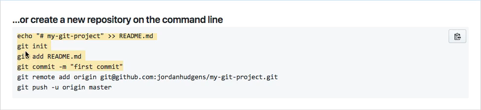
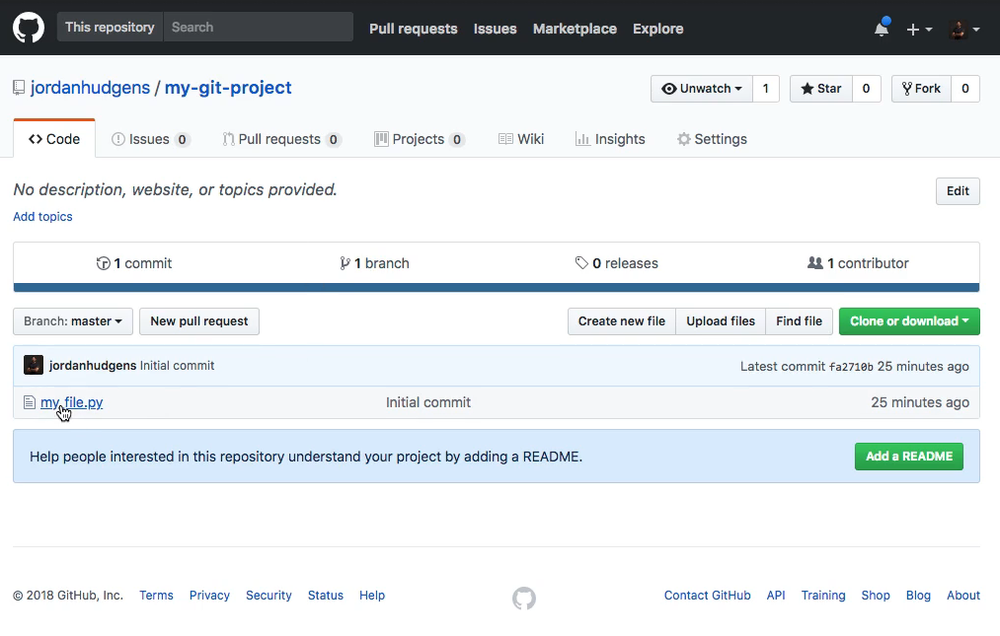

# MODULE 05-107:    Git (2)

Pushing a local repo
---

---

 Video lesson Speech

In the last guide, we saw how we could create a local git repository. 
And in this lesson we're going to see how we can push up that repository
 to GitHub.

****

Now if you're using GitLab or BitBucket that's perfectly fine. The commands are going to be very similar, they're just going to be located in different parts of the page. But if you're following along with GitHub then this is going to look very similar to what you go through as you're doing it yourself. 

I was very intentional with separating the last guide from this lesson and the reason is because there are a number of commands we're going to walk through that are going to allow us to connect our local repository with our remote one on github and I want you to see that the commands are actually git commands and so they're not specific to GitHub and that is a very important thing to understand whenever you're learning git is to understand where that differentiation line occurs in finding out when something is specific to git versus when it is something that specific to the hosting provider such as GitHub or GitLab or one of those. 

And so if you have your GitHub profile open or you're just anywhere on GitHub and logged in you should see a little plus sign in the top right corner.


You can click on it and then click on new repository 


that is going to bring up a dialog page where it asks you for the repository name. 


Now any name that you give it has to be something that is unique to your own set of repositories. So for my guide or my project, this is going to be my-git-project and I'm going to call it the same thing. But it's important to understand that they do not have to be named the same thing. I have plenty of repositories that are named differently than the applications that they're holding. But for this case I'm just going to use it and as long as there's no duplicate or you didn't put any invalid characters in you're going to get a green checkmark and you're good to go. 

Moving down I'm going to keep this public if for any reason you want your repositories to be private. You can click on private but if you do that remember you are going to have to pay for it if you're on GitHub. Now coming down a little further it asks if you want to initialize this repository with a readme do not check this because we're going to be doing this ourselves in a later guide. So all you have to do is click on Create repository and then it's going to create this for us on Github. 


Now that we have our repository created if you come up top you should see your username followed by the name of the project and there are some other tabs here and we'll talk about these later. Then down below you have a list of options and what these allow you to do is to quickly set up and connect your local repository with what you have here on Github and the easiest way of understanding this is you can think of what we have right now. 

So this my-git-project that we've created on GitHub you can think of it as a container. It is not the repository itself it is simply the visual representation of what we are actually going to push up to it which is the git repository and I keep on harping about what the differences are between git and GitHub and that comes from years of experience on students thinking that they were the same thing and so that's a reason why keep on mentioning it. 

Now coming down here with all these options. You can see that we have the ability to create a new repository straight from the command line. Now we already did this 



if you look at it you can see step by step they created a new file, they ran git init, they did get add, then they committed it and so in the last guide we did each one of those things we did those four steps so we've already done this part and then these last two steps are identical for the create a new repository on the command line option and for the push an existing repository from the command line option. 

```bash
git remote add origin git@github.com:username/project-name.git
git push -u origin master
```

I want to take apart before actually run these commands I want to take apart each one of these elements so you can see what they represent. To start off we have a git command and like I mentioned earlier what we have here and what the commands we are going to be running are not specific to Github. The only thing that is specific to them is the final part which is the URL that we're going to be pushing up. 

So right here it's just a traditional get command just like we ran git status, git add, git commit. This is a command and the next one is the word remote. And so what we're doing and the next two words remote add we are adding a remote. And so that means that our local repository right now. It just lives on our own computer what we want to do is to add a connection to a remote repository because that's what GitHub is going to function as it's going to function as our centralized repository so we're creating a connection here. 

So we're going to say git remote add origin and what origin represents is the named remote. There are going to be times where you are on larger projects and you need to have multiple remotes. You may have a remote for your GitHub repository you may have a remote for the repository that sits on a server somewhere you're going to have a number of them for my DevCamp application, I believe I have five or six different remotes. 

What origin does is this is the default name and it's the best practice name that you're going to use for whatever git hosting provider is going to be hosting the repository such as GitHub, GitLab, or bitbucket and so that's all we're doing is we're saying git remote add and name it origin and then we're just passing in the URL. 

Now the one thing to keep in mind depending on the protocol that you picked and what you have set up if you did not set up your SSH Keys then you need to come up here and select HTTPS. So if you click on that you see how it automatically changed the URL and it's no longer an SSH URL now it's HTTPS. Both of these work perfectly fine, the SSH ones like we mentioned a few guides back. That is what you can use if you've already added your SSH keys and I have so that is where I'm going to use. And then that will give me the full remote. 

Now you could technically just copy both of these lines to the clipboard but I want to have a full understanding of what they're doing. So let's do this one at a time. I'm going to come back to the terminal here and then paste this in. And that is all that we need to do. 


To test this out you can type git remote -v and now you can see that we have this named origin GitHub account. 


So we have this git remote connection so we have origin for git at GitHub if you're using HTTPS we'll have the HTTPS URL and then it has the full username and then the project.

The reason why you have two of them is because you need to be able to push to that remote repository so that's whenever you're making changes and you're pushing up those changes up to GitHub and then you also need the ability to fetch and so fetching is where -- say someone makes changes to your repository -- you want to bring those down to your local machine so you have two remotes one for pushing one for fetching.

So as long as you have those commands right here you have those listed out. Then you're gonna be good to go. Let's switch back and let's copy this last line and I'm going to paste it in but before I run it let's talk through it.

```bash
git push -u origin master
```

So once again we have another git command and then push and as you can see this is directly mapped to our remote where we can see that we push access. The reason why you have two of these is because there may be some users that you only want to have fetch access so say that you have some QA developer you don't want them to be able to push up any changes to the master branch but you do want them to be able to fetch the code and have it on their local machine so they can run it. So you have two remotes so that you can manage those permissions that way. 

Now here we're saying git push. So we want to push this up and then we are going to be passing this to the origin name so we have origin here and then the master branch. We're not going to talk about master until a little bit later on.

This means the main code that is used by the application it's the live code. Later on, when we talk about branches will see how master is your live code base and then you can have feature branches to be able to work on different features and other kinds of elements. But for right now just know you're always going to be working with the master branch in the next few guides and later on we'll talk about other ways to work with branches. 

But for right now you are pushing to the origin remote and you're pushing to the master branch. That's what each one of these commands mean, so if you hit return it may ask you for the passphrase for your key If you're using SSH. If you're using your HTTPS connection then it may ask you for your username, password and then hit return and it looks like everything is working. 


If you want to see what each one of these represent it counts all the objects so we have three elements and that worked. It's writing the objects and so it's taking all of the elements that we have on our local system on our local project and then is putting those in a protocol where they can be understood by GitHub. It's pushing to GitHub with this URL and then it has created the master branch on GitHub and then it is setting up tracking and so it's doing all of this for us automatically. 

Now if I come back here to GitHub I can either hit refresh or just click on the name. You're going to be able to see that we now have our code that was on our local machine is now live. 



Remember when we created this file my_file.py? You can see that our live code is now there so great job if you went through that! You now know how to create a repository on GitHub and then how to connect your local get repository with that remote.
