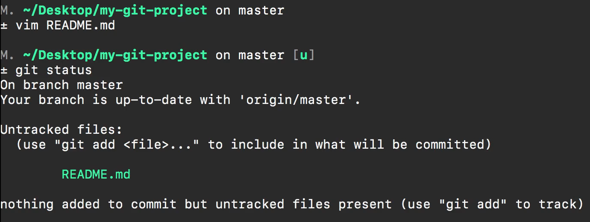
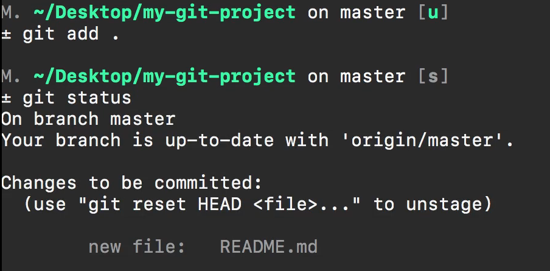
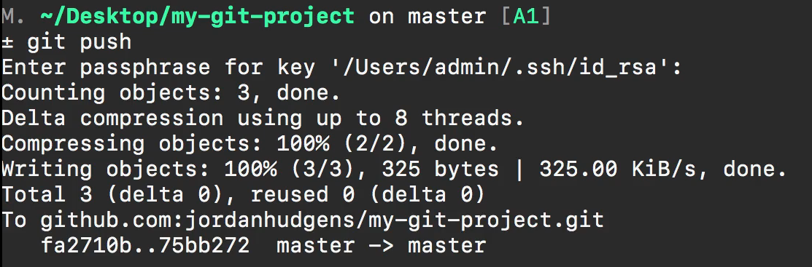
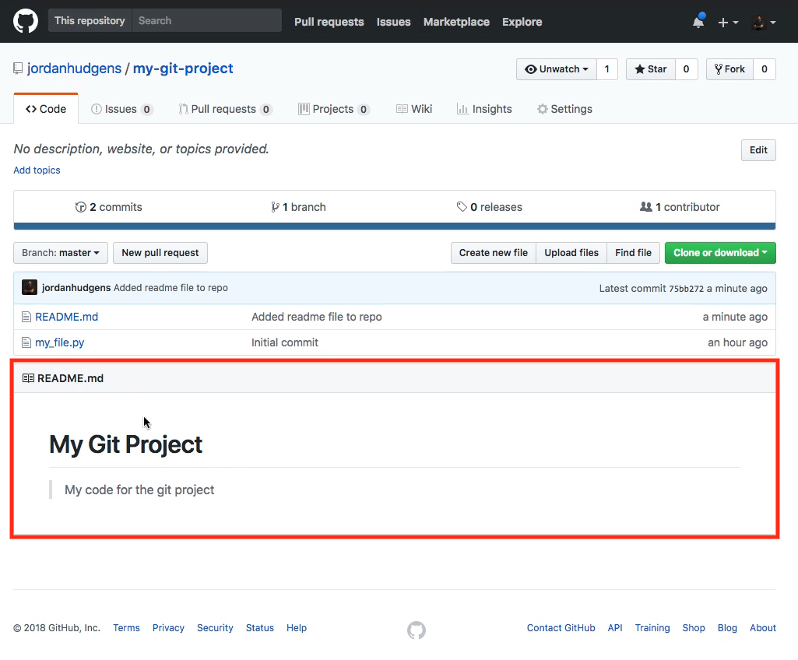

# MODULE 05-108:    Git (2)

## The Git workflow

---

---

## Video lesson Speech

So far in this section, we've created a local repository we've created a
 remote and then we've connected the two. And in this guide, I want to 
review an entire workflow because this is going to be what you're going 
to be doing over and over again and so I think it is good practice.

****

We're going to add a new file, in fact, we're going to create the ReadMe file, and then we are going to go through that same process of adding committing and then pushing up to this repository.  

So I'm going to open up the terminal and I'm going to create a new file. Now if you're following along using Sublime Text or vs code you can just create a new file however you want to. I'm going to use vim for it and so the structure for this create a file called README in all capital letters .md. Now the .md stands for markdown and Markdown is just a markup language that allows you to write and it gives some symbols that will be converted into HTML.

So if I want to have a heading I can start off with the hash(#) and say this is my git project and then down below I'm going to do a blockquote. So with the greater than sign(>) I'll just say my code for the project you can put anything you want. I just want to create a file. I'm going to save this and now if I type status you can see that we have a new untracked file.

So let's go through the same full process this time I'm gonna say git add and then a dot and that's going to add that new file. If I had more files that were added or changed it at all of them and just to verify that all worked I'll say git status everything is there it says we have changes that need to be committed 

Now I'll say git commit -m and say "Added readme file to repo" and now what I can do I don't have to do the full -u origin master. I can just say git push and the reason for that is because when we started and we said git push -u origin master. Those set up the defaults for the system, there is a reason why we have the names like Origin and master git assumes that those are going to be the default ones. 

If you do not choose and provide any other options when you're running git push so now you can just type git push. If you're using SSH it may ask you for your password and then push it up and it looks like everything there worked. 

So now let's go back switch into google chrome and if you hit refresh now you're going to see that we have a readme 

and whenever you have a read me in the root of your project in GitHub, GitHub assumes that you want it to be the readme for the entire project so it takes that file. And that's why it was important to name it exactly like how we did and it takes the markdown syntax and converts it into HTML just like we see right here and so now we have a nice looking readme for our entire project and we are able to go through that full add, commit, push workflow.
