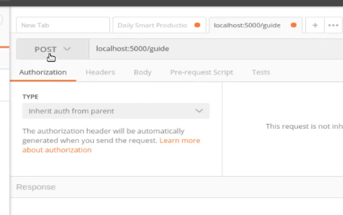
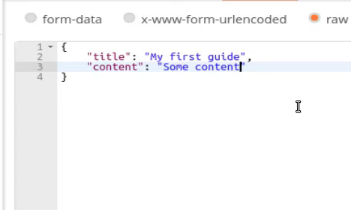
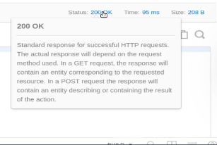

# MODULE 03 - 140: Python - Flask (4)

## How to Create a POST API Endpoint in Flask

****

## Video lesson Speech

So far in this section and for this project we built out a basic Flask 
application and we've created a database with a guide table. Now that we
 have over boilerplate code done we can actually start building out the 
fun part which is the API.

****

Now the very first thing that we want to do is to be able to start adding guides to this application. So I think that would make sense that that would be the first endpoint that we'd create. So I'm going to come down and let's do this right below guides_schema. I'm going to create our first endpoint.

**app.py**

```py
# Endpoint to create a new guide
@app.route('/guide', methods=["POST"])
def add_guide():
    title = request.json['title']
```

Now right now would be a very good time for you to be asking where in the world this request is coming from. And that's a great question because we haven't actually brought in the libraries that we need in order to work with it. So before we go any further let's do that. I'm going to come all the way up to the top and say where it says from Flask import Flask. 

**app.py**

```py
from flask import Flask, request, jsonify
```

Jsonify is going to be another module inside of Flask that allows us to work with JSON data. So let's come back down. So we have this `title = request.json['title']`.  So what this is going to do is, you can think of this kind of like a dictionary lookup in Python, where you're going to get this object and then you're going to be able to parse the same way that you would parse a python dictionary. 

So we're going to grab the value from the request of title and then we're going to store it in this variable and then next we're going to do the same thing for content. 

**app.py**

```py
# Endpoint to create a new guide
@app.route('/guide', methods=["POST"])
def add_guide():
    title = request.json['title']
    content = request.json['content']
```

And now that means we're going to have access to both the title and the content. And then after we performed our first request we'll walk through what this code is fully doing. So now that we have that let's create a new variable serving as a new guide and set this equal to our guide model and then inside of here we're instantiating a new guide. 

**app.py**

```py
# Endpoint to create a new guide
@app.route('/guide', methods=["POST"])
def add_guide():
    title = request.json['title']
    content = request.json['content']

    new_guide = Guide(title, content)
```

So we want to put in the title and then the content. So this is simply grabbing those values that we add here on lines 34, and 35 and then it's instantiating a new guide which is up there on line 13, that's the Guide class. And we're going to paste in the title and the content and store all of that inside of this new guide variable. 

Next, we're going to communicate with the database. So I'm going to use that database object that we created up top.

**app.py**

```py
# Endpoint to create a new guide
@app.route('/guide', methods=["POST"])
def add_guide():
    title = request.json['title']
    content = request.json['content']

    new_guide = Guide(title, content)

    db.session.add(new_guide)
    db.session.commit()
```

That is something that we get access to because we're working with SQLalchemy. So it is a method inside of SQLalchemy that says that we are opening up a new connection to the database and we want to save data inside of it. So that's what the commit function does. So now that we've committed it let's perform a query 

**app.py**

```py
# Endpoint to create a new guide
@app.route('/guide', methods=["POST"])
def add_guide():
    title = request.json['title']
    content = request.json['content']

    new_guide = Guide(title, content)

    db.session.add(new_guide)
    db.session.commit()

    guide = Guide.query
```

So once again this is something this is a function inside of equal alchemy. So I'm saying I want to query that table and I want to get the new guide's id. 

**app.py**

```py
# Endpoint to create a new guide
@app.route('/guide', methods=["POST"])
def add_guide():
    title = request.json['title']
    content = request.json['content']

    new_guide = Guide(title, content)

    db.session.add(new_guide)
    db.session.commit()

    guide = Guide.query.get(new_guide.id)

    return guide_schema.jsonify(guide)
```

Okay, that's a lot of code then let's see if this is all working. And we all sort also just verify that we didn't get anything weird there with the encoding. No, it's good. So now we have all of this running let's test it out. So first make sure you have `pipenv` running, and then say `python app.py`. I'm not getting any errors so that's a good sign. 

Now, let's come into Postman. You should already have Postman installed, and so our system is running on port 5000, so I can come up here to create a new tab, and let's call localhost. And right here we have `localhost:5000/guide` 



And then this is going to be a POST request. Our goal is to create a new guide and then we need to pass the data in. Now, this is going to show you where Postman is very helpful because instead of having to perform some weird curl code in order to pass in those values, you can click on body, then raw, and we want to change the data type to JSON because the this is a JSON API. 

Now inside of here, we're going to simply paste in some JSON. 



Okay, so this is the moment of truth. If everything that we did worked, we should get back is this object But it should also give us the ID, Along with these values. So let's just make sure it's calling `localhost:5000/guide`, everything there looks like it's working. We have raw and then we make sure that the server is running. So with all of that in place let's hit send and there you go. 

We now have it looks like that all worked properly. You can click on cookies you can see that it actually started a session. We can go on headers right here to see the different headers that sent back the content length the content type and where you can see we have JSON data. 

And so so far it looks like everything worked. And the other thing that you can see to test it out to make sure is right here if you got a status of 200 OK 



That means that it worked properly if you got some other type of message such as 404 or a 500. That means that there may have been a typo or you may have either in the URL or in the code itself. One other thing to look at if you come up here to headers then you can see that this is telling you that JSON was sent back to us. 

I didn't misspeak a little bit before I said Id was going to be returned but it's not. And that's because in our code in our schema we're only asking for the title and the contents, right here. That's why we only got those back and that's fine. I'm going to show you later on how we can make sure that I.D. is working. 

But great job if you went through that you now have the first part of a working API and you can call an application with code and create records in a database. So very nice work.  

## Source Code

- [Code at this stage](https://github.com/bottega-code-school/hello-Flask/tree/b2147866712998c8fbf7a0ae22035a82f5c73f38)
