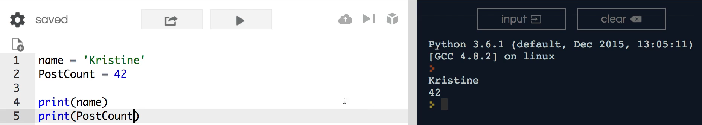
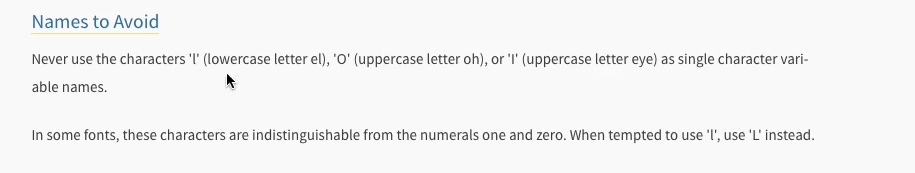

# MODULE 02 - 016:    Python - Case&Naming Styles

***

Continuing with our journey on Python variables I want to discuss something that's very important and it may not seem like the biggest deal right now but the further you go along on your python development journey you're going to discover that there are a number of standard conventions that the industry uses.

In this guide we will return to the two variables:

1. `name`

2. `post_count`

Name is self-explanatory because it is only one word.   

However, whenever you have a variable that has multiple words such as post count, the c**ommon convention is to put an underscore in between the words**. **(snake_case)   **

This is because another developer may look at your code or you could build a package for someone else to use.   

When doing so, you want to be able to use the standard conventions that other Python developers are using because, if not, it may look as so:

```python
PostCount = 42
```


Technically, this would work except this is an issue if you were to further pursue Python developing.   

This is because **the structure "PostCount" (PascalCase) is how Python class names are arranged causing confusion between variables and classes in your code**.   

Since other developers would read this as a class, they will also encounter a number of bugs having done so.

Next is a string not unique to Python, but included in every programming language. 

Snake case naming convention is when there is a variable with a collection of words and/or sentences.  

 An example of this
 would be: `a_long_sentence_with_words`, each word separated by an 
underscore.

Now, if you're coming from a language such as JavaScript, you will have to create a variable by saying `aLongSentenceWithWords`.
 This is called **Camel Case.**   

Both snake case and camel case declare variables that are used in similarity between JavaScript and Python.

The only k**ey difference is convention.** While using Python, you can 
expect that variables will be coded with underscores.   

These differences are not extraneous, but rather extremely important.   

To show this to you, I have placed this in the show notes.

### PEP 0008

This is called [PEP 8](https://www.python.org/dev/peps/pep-0008/#naming-conventions), the official style guide for Python code.  

As you will be able to see, this is an extensive style guide.   

There are several features including, but not limited to: 

* naming conventions

* how to build string quotes and whitespace

* what type of indentation to use between tabs and spaces

* all sorts of rules.

Throughout this entire course and the advanced course, all concepts will be built on in each module according to PEP 8 or [PEP 8](https://www.python.org/dev/peps/pep-0008/#naming-conventions) standards.

But ... **Just like any standard, there is ample flexibility.   **

**If you code strictly by following a single convention, you may lose the freedom to 
truly build applications.**   

My personal preference is to find standard conventions, then discover how to build my findings in their needed structure.   

With this route, I am able to experiment while also remaining in close alignment to the conventions.

If I click on naming conventions, it will go through a number of the different naming styles.   

To get an idea of what each represents, I recommend going through these. Not only does this show the correct ways of executing the naming styles, but it also shows the faulty ways of doing so.   

For example, I often look through students' files to find variable names with both capitalization and underscores between words.



I would highly recommend taking this advice to access the best practice early on. 

Another element worth mentioning is the letters that should never be used as a single character variable name. These include: 

* *lowercase "L"

* capital "O"

* capital "i".



The reason for this is that the lowercase "L" and uppercase "i" look nearly identical and the letter "O" can be mistaken for a zero.   

This confusion while looking back at your code or if another developer is utilizing it can easily be avoided if you follow the best practices around naming.

The most effective variable names are those that contain a proper amount of description. For example, post count is fairly self-explanatory as well as descriptive as it illustrates what the variable stores.  

- > Meanwhile, `a_long_sentence_with_words` is descriptive, 
  > however not when searching from a content perspective.

I am going to rid of this variable, however, I also want to inform you of another poor practice I encounter often. 

Many other tutorials include variable names that would never be considered in the industry. 

For example, if I wanted to add two variables together, I may name my 
variables "X" and "Y".  

Although there may be a select few times while building a high-level class or function that generic types of variables may seem best, large problems will arise if it isn't clear what "X" represents.  

 Had this been the case, I would have a difficult time attempting to track the type of value of "X" and how it is meant to be used.  

Many of these examples may not make sense right now because of the 8 line program.   

Even so, most programs are thousands or even tens of thousands of lines long making it especially challenging to understand what these types of variables represent.

So a better example would include num_one and num_two. 

This describes that they are numbers and they represent both one and two. With these, there should be multiples. Unlike the "X" and "Y" variables, I would be 
confident that I could treat these variables as numbers.

Later on, we will have to perform checks to ensure that these variables are numbers. This guide, however, focuses more on gaining exposure to good programming practices rather than actual coding.  

**The best way for naming variables is through providing an adequate description. **  

Another way to integrate description is through code comments, but I have often found that they are unnecessary or are seldom needed because of my efficiency in the descriptiveness of my variables.

One of my favorite programmers is a gentleman named **DHH**, a creator of the Ruby on Rails framework. He claims to keep a thesaurus on his desk because naming and finding the perfect description to do so  is so critical to him.  

 The weight that a talented developer puts on naming and different code constructs should give you an idea of how important these elements are. 

 Keep this in mind when building out any program.

## ## Resources

- [PEP 8 Style Guide](https://www.python.org/dev/peps/pep-0008/#naming-conventions)
