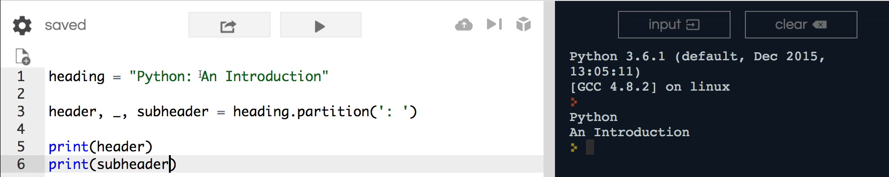
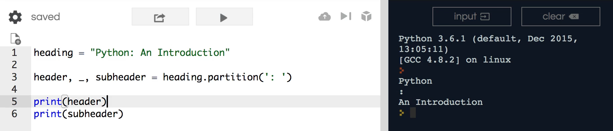
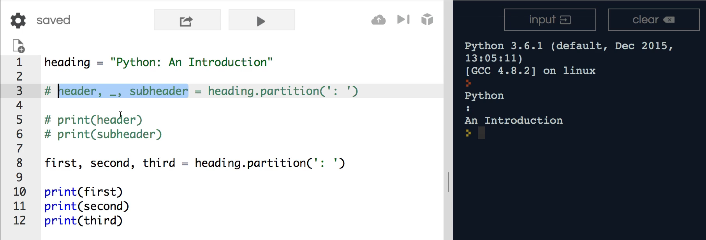
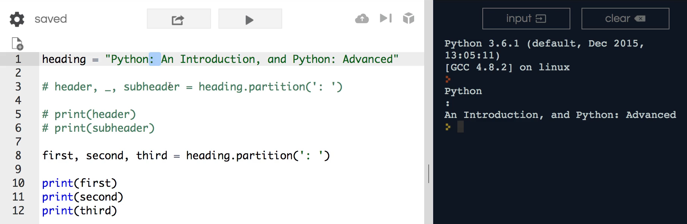

# MODULE 02 - 035: Python -  `.partition()`

---

## **Understanding `.partition()` in Python**

The `.partition()` method is a powerful tool for working with strings, allowing us to **split a string into three parts** based on a specified delimiter. This guide will show you how to use `.partition()` effectively and introduce the concept of **tuples and variable unpacking**.

Python strings are **immutable**, meaning they cannot be changed in place. Instead, `.partition()` returns a **tuple** containing three elements:

1. The part **before** the delimiter.
2. The **delimiter itself**.
3. The part **after** the delimiter.

---

## **1️⃣ Using `.partition()` to Split a String**

Consider this example:

```python
heading = "Python: An Introduction"

header, _, subheader = heading.partition(': ')
print(header)    # Output: 'Python'
print(subheader) # Output: 'An Introduction'
```

### **How does `.partition()` work?**

- It searches for `': '` in the string.
- It **splits** the string into three parts:
  1. `'Python'` (before the delimiter)
  2. `': '` (the delimiter itself)
  3. `'An Introduction'` (after the delimiter)
- We use **variable unpacking** to assign these parts to separate variables.
- The **underscore (`_`)** is a convention in Python, used to indicate a **throwaway variable** (i.e., something we don’t need).

✅ **Best Practice:** Use `_` for values you don’t plan to use to improve code readability.

---

## **2️⃣ `.partition()` Always Returns Three Elements**

Regardless of the string length, `.partition()` **always** returns three elements.

```python
heading = "Python: An Introduction, and Python: Advanced"

first, second, third = heading.partition(': ')
print(first)  # Output: 'Python'
print(second) # Output: ': '
print(third)  # Output: 'An Introduction, and Python: Advanced'
```

- Even if the delimiter appears **multiple times**, `.partition()` **only splits at the first occurrence**.
- The **remaining part** of the string is **not further split**.

✅ **Best Practice:** If you need multiple splits, consider using `.split()` instead.

---

## **3️⃣ Why Use `.partition()` Instead of `.split()`?**

| Method             | Returns                  | Behavior                                                                    |
| ------------------ | ------------------------ | --------------------------------------------------------------------------- |
| **`.partition()`** | Tuple (3 elements)       | Always returns exactly three parts: **before, delimiter, after**.           |
| **`.split()`**     | List (multiple elements) | Returns a list of substrings split **at all occurrences** of the delimiter. |

---

## **4️⃣ Real-World Use Cases for `.partition()`**

- **Extracting a main heading and subheading** (e.g., blog titles, article headers).
- **Parsing structured text** (e.g., splitting CSV headers, extracting parts of URLs).
- **Processing API responses** (e.g., cleaning up metadata returned by an API).

### **Example: Cleaning Up API Data**

```python
response = "Status: Success - Data Retrieved"
status, _, message = response.partition(': ')
print(status)  # Output: 'Status'
print(message) # Output: 'Success - Data Retrieved'
```

---

## **🔍 Summary: Key Takeaways**

| Feature                         | Behavior                                                           |
| ------------------------------- | ------------------------------------------------------------------ |
| **Immutable Strings**           | `.partition()` does not modify the original string.                |
| **Tuple Unpacking**             | Allows assigning each part to separate variables.                  |
| **Underscore (`_`) Convention** | Used for values that are not needed.                               |
| **First Occurrence Only**       | `.partition()` only splits at the first instance of the delimiter. |

---

## **📌 Python Documentation Reference**

🔗 **[str.partition(sep)](https://docs.python.org/3/library/stdtypes.html#str.partition)**

> Splits the string at the first occurrence of `sep` and returns a tuple containing the three parts.

***

## Video lesson speech

This is going to be a fun guide on how to work with strings and 
specifically how we can implement what is called the partition function 
because this is something that I've found is very helpful. It's also 
going to give us a little bit of an introduction on collections in 
Python. Now we have an entire section dedicated to collections so we're 
not going to go into them in detail but you're going to see how strings 
can be connected and how they can generate their own collections.

***

Right here we have a heading. So imagine that 
this is heading on a mobile app or on some type of front-end web site. 
We have three components I should say we can break this string into 
three components. We have a full heading right here. So we have the 
header of Python. Then we have this little colon separating the 
subheading. So we say Python an introduction.

Now if I wanted the ability to go and split this string up so that I 
could grab my main heading I could take away this component right here 
the colon and then the subheading and I could place those in variables 
to use them however I wanted. How would I do that? Well that is where 
the partition function comes in and it's pretty cool and it's also going
 to be able to give us a little preview of how to work with variables we
 want to use versus ones that are kind of considered throwaway variables
 and you'll see what that means here in a second.

So I'm going to come down and I'm going to give a list of 3 variables
 in a row. So I'm going to say header comma underscore comma and then 
subheader

```python
header, _, subheader =
```

If this syntax looks odd to you do not worry we're going to dissect 
each one of these elements to see what they represent and how we can use
 them. And what I'm gonna do is I'm going to assign this to our Heading 
and not header remember heading is our variable that's storing the 
string.

So say heading and then .partition and then partition takes an 
argument and what it is is it's the divider. The way that the partition 
function works in Python is it's going to look inside the string for 
whatever you pass in as the argument. So in this case we're passing in 
this colon and a space. And so once it finds that it then partitions the
 entire string and separates it into three elements and so it is going 
to take python and it is going to be the first element. Then the 
partition itself is going to be the second element and then everything 
after that is going to be the third. And the way that it works and this 
is a very cool little trick that Python gives you is whenever you call 
partition and you perform assignment like we're doing here. It actually 
returns what's called a tuple collection.

Don't worry if the word tuple sounds weird you will go into that in 
our collection section. But essentially what it's allowing us to do is 
it means that it's going to break what used to be a string which was one
 object into three objects. It's going to break it into the first the 
second and the third. And because of that, we can perform what's called 
variable deconstruction and so we can have the first element piped right
 into the header variable. The second one is going to go into this 
underscore and the third one is going to go into subheader.

Now this follows a very popular Python convention for whenever you 
have values that you do not want to use the best way to represent those 
is with an underscore. So this is not a required syntax it is simply a 
best practice in the Python community and so let's walk through what 
this is going to give us and make sure it works and then I'm going to 
circle back and show you some variations on that.

I'm going to say print header and then let's just say print 
subheader. Now if I hit return you can see it prints out python and an 
introduction.



So it effectively grabbed each one of those elements and sliced it 
into the new variables and you could technically you could even go print
 header and say underscore right here and it would give you your colon 
with the space right after it.



But what we do in Python is whenever you have some type of situation 
where it looks like this where we have some elements that we want. But 
then we may have some elements that we don't care about such as what 
we're trying to pull out so we don't want to care about this colon we 
don't want to worry about getting rid of it. We simply want to say that 
that existed in the string but we don't need it for everything we're 
going to do after that.

So we say that you're getting this in from some type of API and you 
need the ability to clean it up and pull out the contents that you want 
and leave the things you don't want partitions are a great way of doing 
it and other developers when they come in they look at your code or when
 you go back and you look at your program months or years later when you
 see this underscore you'll understand that it means that whatever gets 
piped into that value is a throwaway value. You do not care about it. 
You'll also see this later on when we talk about looping through 
collections when you have some type of value that you don't want to 
worry about. You know it's available inside the collection but you just 
want to ignore it.

Part of this is simply giving you an introduction for that. So if 
that part doesn't make practical sense on why you'd ever want a variable
 that you are not going to use it'll make sense once you get to more 
advanced topics because once you do get different elements such as 
machine learning and are going through complex API development you'll 
understand that there are times where you only want a subsection of the 
data that gets passed to you and using different processes like this. 
Help you visualize what data you want such as the header or the 
subheader and which elements you simply want to ignore.

Now once again this is simply a python convention. It is not a 
syntactic rule so let me copy this I'm going to comment this out and 
watch that. I can change these however I want so I could say first, 
second, third. And these are not special in any way. These are just 
variables you could call these anything that you want. But if I go 
second and then do one more and say third. If I print this out here now 
you'll see that it prints out everything exactly the same as before so 
there is nothing special with this kind of variable convention it simply
 is a python best practice.



The important component to remember whenever you're working with 
partition is that it breaks whatever you pass in. So what we have right 
here this kind of sentinel value with what we have with the colon and a 
space. It's good to pass that into the string it's going to try to find 
it and then it's going to return three elements. It does not matter how 
big the string is that you pass to partition.

Imagine that you had a situation like Python: An Introduction, and 
Python: Advanced. If we run this right now notice how we have two of 
these types of Colon space elements. If I hit return you'll see that we 
still get 3 elements back



we get the first one which is the first time that it found this Colon
 space and then it returns that and then it returned anything that was 
left in the string.

So if you did this on a huge API response where you've got say a 
chapter of a book back from an API and you looked for one value it would
 return the very first everything in front of that value and then return
 everything at the end. And so it's important to note that because when I
 first learned about partition I personally I tried to do it on a value 
where it didn't really make sense because I wanted more than 3 elements 
but partition only works exactly like how we have it here. So that is 
one of the big takeaways I want you to have but it is a very powerful 
very helpful tool and in the next guide we're going to go and we're 
going to extend this a little. We're going to look at a process that is 
similar to partition but gives us the ability to create groupings of 
values based on an entire set of strings instead of just one.

## Code

```python
heading = "Python: An Introduction, and Python: Advanced"

header, _, subheader = heading.partition(': ')
print(header)
print(subheader)
first, second, third = heading.partition(': ')
print(first)
print(second)
print(third)
```
