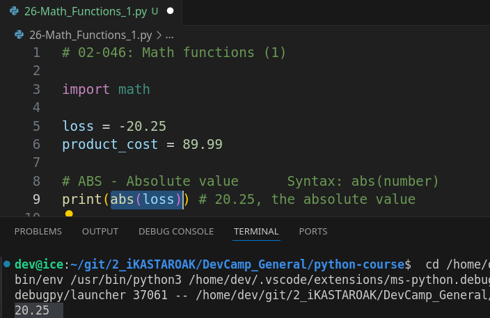
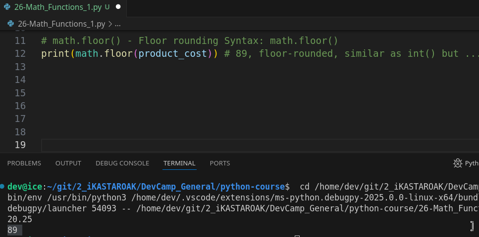
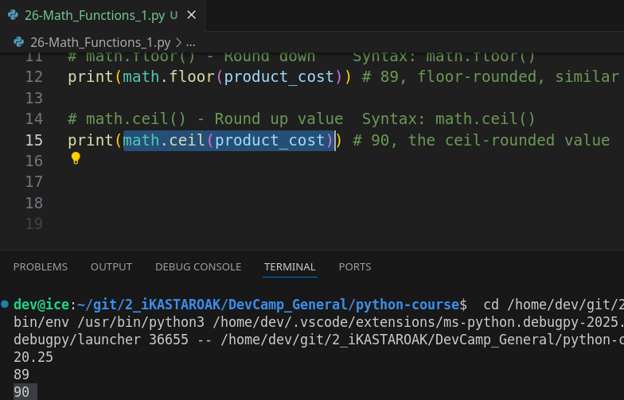
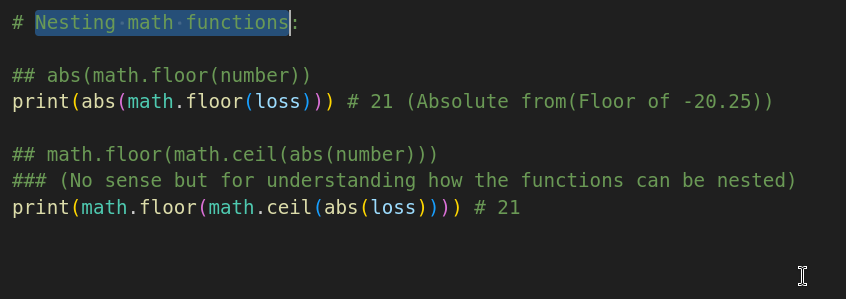
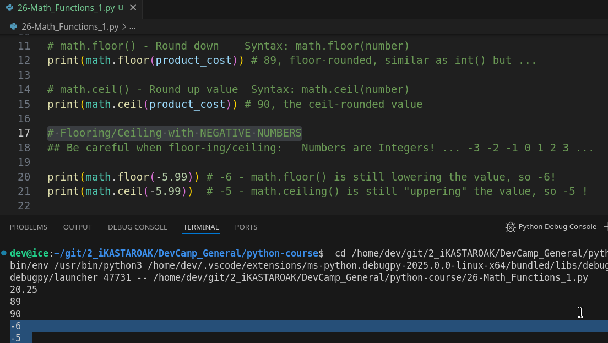
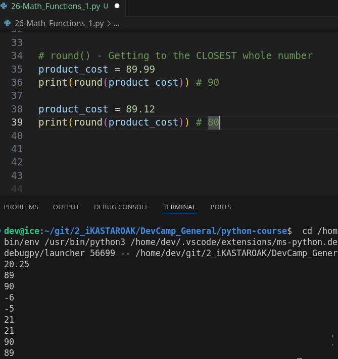
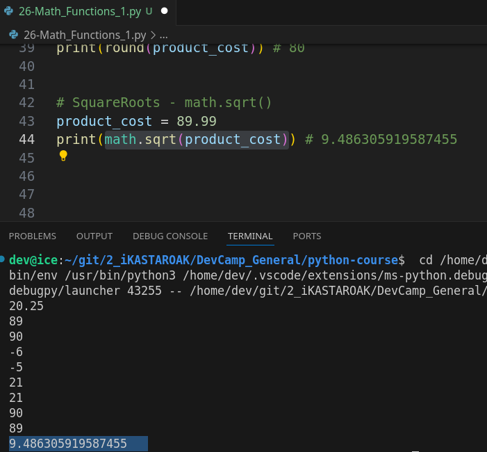
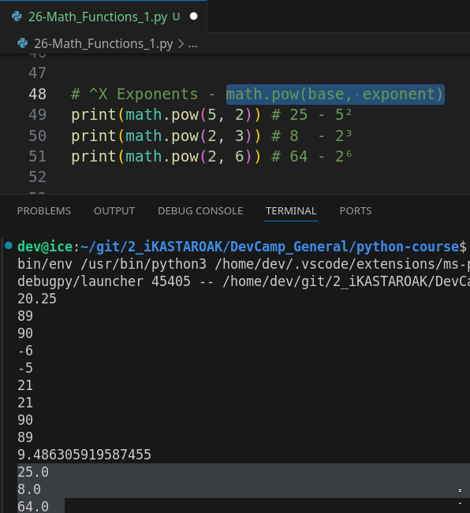
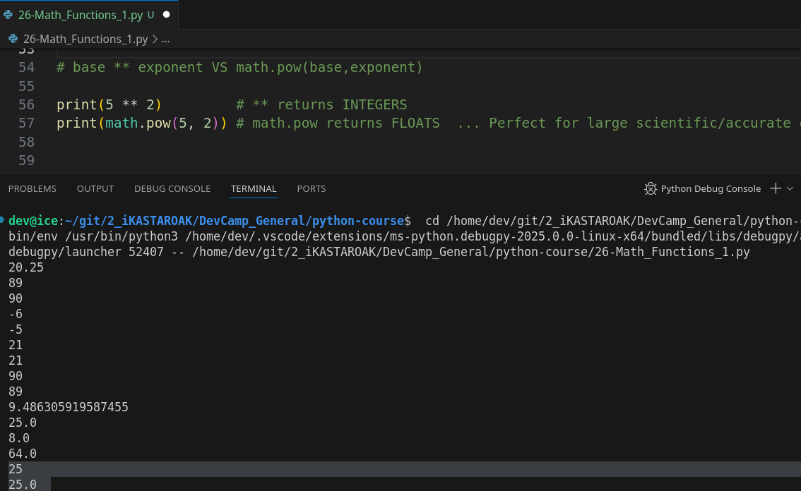

# MODULE 02 - 046: Python - Most Used Math Functions

---

## **Overview of Python's Most Used Math Functions**

Python provides a powerful `math` module that includes various mathematical functions used for **calculations, rounding, logarithms, trigonometry, and more**. Understanding these functions is essential for working with numerical data, scientific computing, and algorithm development.

✅ **Best Practice:** Always import the `math` module when working with mathematical operations beyond basic arithmetic.

```python
import math
```

***

### This guide mentions more mathematical functions *(logarithms, exponentials, trigonometrics and some constants as Pi, Tau, E, ...)* that have been introduced in the original guide. However, now is a good time to provide some information on these functions.

---

## **1️⃣ Basic Math Functions**

### **1. Absolute Value**

Returns the absolute (non-negative) value of a number.

```python
print(abs(-10))  # Output: 10
```

### **2. Power and Square Root**

✅ **Raising to Power:**

```python
print(math.pow(2, 3))  # Output: 8.0
print(2 ** 3)  # Equivalent output: 8
```

✅ **Square Root:**

```python
print(math.sqrt(25))  # Output: 5.0
```

---

## **2️⃣ Rounding Functions**

### **1. Floor & Ceiling**

- `math.floor(x)`: Rounds **down** to the nearest integer.
- `math.ceil(x)`: Rounds **up** to the nearest integer.

```python
print(math.floor(5.9))  # Output: 5
print(math.ceil(5.1))   # Output: 6
```

### **2. Rounding to Nearest Integer**

```python
print(round(3.14159, 2))  # Output: 3.14
```

---

## **3️⃣ Logarithms and Exponentials**

### **1. Exponential Function**

Computes , where is Euler's number (~2.718).

```python
print(math.exp(2))  # Output: 7.38905609893065
```

### **2. Natural Logarithm & Base 10 Logarithm**

```python
print(math.log(10))   # Natural log (base e) of 10
print(math.log10(100)) # Base 10 logarithm of 100
```

---

## **4️⃣ Trigonometric Functions**

### **1. Sine, Cosine, Tangent (Radians)**

```python
print(math.sin(math.pi / 2))  # Output: 1.0
print(math.cos(0))            # Output: 1.0
print(math.tan(math.pi / 4))  # Output: 1.0
```

📌 **Note:** These functions work with **radians**, not degrees.

✅ **Convert Degrees to Radians:**

```python
degrees = 90
radians = math.radians(degrees)
print(math.sin(radians))  # Output: 1.0
```

✅ **Convert Radians to Degrees:**

```python
radians = math.pi / 2
degrees = math.degrees(radians)
print(degrees)  # Output: 90.0
```

---

## **5️⃣ Constants in the `math` Module**

Python provides commonly used mathematical constants:

| Constant   | Value             |
| ---------- | ----------------- |
| `math.pi`  | 3.1415926535      |
| `math.e`   | 2.7182818284      |
| `math.tau` | 6.2831853071 (2π) |
| `math.inf` | Infinity          |

Example:

```python
print(math.pi)  # Output: 3.141592653589793
```

---

## **🔍 Summary: Key Takeaways**

| Function          | Purpose                    | Example                     |
| ----------------- | -------------------------- | --------------------------- |
| `abs(x)`          | Absolute value             | `abs(-10) → 10`             |
| `math.pow(x, y)`  | Power function             | `math.pow(2, 3) → 8.0`      |
| `math.sqrt(x)`    | Square root                | `math.sqrt(25) → 5.0`       |
| `math.floor(x)`   | Round down                 | `math.floor(5.9) → 5`       |
| `math.ceil(x)`    | Round up                   | `math.ceil(5.1) → 6`        |
| `round(x, n)`     | Round to n decimal places  | `round(3.14159, 2) → 3.14`  |
| `math.exp(x)`     | Exponential function       | `math.exp(2) → 7.389`       |
| `math.log(x)`     | Natural logarithm          | `math.log(10) → 2.302`      |
| `math.sin(x)`     | Sine function              | `math.sin(math.pi/2) → 1.0` |
| `math.radians(x)` | Convert degrees to radians | `math.radians(90) → 1.57`   |

---

## **📌 Python Documentation Reference**

🔗 **[Python `math` Module](https://docs.python.org/3/library/math.html)**  
🔗 **[Trigonometric Functions](https://docs.python.org/3/library/math.html#trigonometric-functions)**

***

## Video lesson Speech

So far in this section on Python numbers we've walked through how we can
 work with the various number types in python so how we can perform 
computations how we can view the data types.   

The order of operations and different elements like that.  

 And that is all very important foundational knowledge.

***

Now with all of that in place now we want to show you a glimpse into the full set of functions that are available to the number data type inside a python.   

And so what we have here is going to be a look at how we can automate a number of the processes that we've talked about and how we can have helpful processes called on numbers. 
And so the very first thing I'm going to do at the very top is I'm going to import the math library now Python is famous for working very well on mathematical calculations and part of it is due to having a very big math library where you can have all these great functions and we're going to walk through some of the most popular ones that are out there.

I've created two variables.  

 One is a negative called loss and it's -20.25. So this is a floating-point number that's negative and the next one's a floating-point number called product_cost at 89.99.   

And we're going to walk through a number of various functions that you may find 
helpful when working with numbers in python.   


## abs()    Absolute value

So the first one I'm going to put all these in print statements is abs which stands for the 
absolute value of.

So you say ABS loss and what it's going to do is it's going to take the absolute value of loss and if your math is a little bit rusty then absolute value that's going to do is it's going to take just the pure value and it's going to remove this negative sign right here.   

So now if I run this you can see the value is 20.25



So that is simply available to the number class inside a python and if you want to test it out if you delete or just remove or comment out.   


What we had there on line 1 you'll see that that still works.  

 So the math library is not needed for absolute value, that is in the core Python library.


## math.floor()

Now let's go with one that does need it so I'm going to say right here math and that's because we're importing the math library.   

So I'm going to say **math.floor** and then call in product cost.   

So now let me run this and you can see that the value is 89.   



And so what we have here at the product cost is it looked at it, returned an integer, and it picked the floor of this product cost float.   

Technically you also could just call `int` on this as we've covered before.   

So if I just call int on product cost. This gives us the same exact value.

Now one reason why you may not want to do that is because math.floor very clearly shows your intention.   

When it comes to programming one of the most important elements is not just making sure that your program works properly but it's also being very explicit on your intentions as you're coding.   

So if you want the lower bottoms if you want the floor value of this product cost variable here.  

 When you say math floor when you're reading this later on or if someone else is reading it they're going to understand that you wanted the lower value the rounded down lower value of product cost.  

 If you just use int even though the value would have been the same your intention isn't as clear because when I see the word int when I see that function call.  

 My first thought is that whoever the developer was even if it was just me is that the intention was to convert the value to an int.

Now **it has a side effect** :

>     of also giving you the floor value of that `int` because it takes away any floating-point numbers.

However, my intention with that wouldn't be clear.   

## math.ceil() - Round up value

Where right here it's very explicit.   

I want the rounded down lower version of that and the other issue with it is we can do the opposite.  

 So math also has a contrapositive called ceil which is short for ceiling and so now if I 
run this you'll see that we get 90.



Ceiling is going to give us the rounded up value.  

 So if I say 89.12 you can see it still returns 90 it always is going to round up to the 
next whole number and it's going to return an integer as you can see 
right here.


## Nesting functions

### Combining math.floor() + math.ceil()



Now the other thing you can do that's pretty cool is you can combine these.   

So say that I'd come here and I want to get the absolute value of loss but I also want the floor.  

 So you saw the absolute value of loss returns 20.25.  

 But I can say math floor and wrap that and parens and now if I run this I get 20.25 rounded in this case down which technically looks like it's wrong right? because it's 21. 


This looks like the ceiling value.

However, what you have to realize is that math floor is being called before the absolute value.  

 So let's do this let's take it in a couple of steps here.   

## Using negative numbers

So if I come here and I remove the absolute value call and run at it gives us negative 21 because the first value is -20.25.  

 So we're actually going in the opposite direction.   

And just so that you believe me. Let's do it even without that let's just do loss by itself. 


So loss by itself is going to return -20.25



So when we call `floor` on it it actually is going to give the opposite as if it were a positive number so -21 is the floor value because it is lower for a negative number.   

And the whole point on why I wanted you to see that was so that you could see the way the priority works.   

So if I take it back to having the absolute value in there.   

The way it works is math floor on loss is what would be called first then the absolute value would be called on that.   

That's the reason why if you run that you get 21 that's something that's important to know whenever you are nesting functions like that.

## round()

Moving down let's go with another one so far we've covered absolute value for ceiling and then we've seen how we can combine those and the next one we're going to do is round.  

 So this is when you simply want to round to the nearest whole number so I can say round here and then let's pass in the product cost.   

So right now it's at 89.99 If I run this it's 90.

Now if I change this back to 89.12 it's 89.



So if you are curious about how you can get to the closest whole number then round is a nice way to do that.   

So we only have two more that we're going to cover.  

 They are square root and then we're going to work with exponents.   


## .sqrt() -  Square Roots

So I'm going to copy that. And now instead of `round` I'm going to say math.sqrt and that's how you spell square root in the function. S Q R T and now if I run this we get a floating-point number of 9.48 and then a string of values



So that is how you can quickly get the square root which is an incredibly helpful little function that I've used a number of times.


## Power Roots -  math.pow(a, b)

Now the very last one we're going to do is called pow.   

And so I can say math.pow and then it takes two arguments.  

 And so if I do five comma two and print this out it's 25 because it's going to be five squared.

```python
print(math.pow(5, 2)) #25.0
```

Now, this is the equivalent as you may have noticed to simply doing this because we have our exponent operator right here.   

And if I run that I get the exact same number.



### "base ** exponent"   VS   math.pow(base, exponent)

If you're curious about why you'd want to use one versus the other:

**The answer is in the output. **



1. math.pow(b, e) returns **float-point numbers.**

2. b ** e returns **Integers.**

Do you notice how we get a floating-point number when we use math.pow and when we simply use the operator the exponent operator we get an integer back.   

And so what that means is if you go through the math library and you look at the pow function you're going to see that it is **much more complex and much more scientifically 
accurate**.   

So if you're using exponents in large scientific calculations then you're going to want to use math POW versus if you just want a simple exponent you can use the basic exponent operator just like we have right here.

***

So review those are some very common and popular functions that 
include are included in the math library and in the standard number 
class in Python.

## Code

```python
# 02-046: Math functions (1)

import math

loss = -20.25
product_cost = 89.99

# ABS - Absolute value          Syntax: abs(number)
print(abs(loss)) # 20.25, the absolute value

# math.floor() - Round down    Syntax: math.floor(number)
print(math.floor(product_cost)) # 89, floor-rounded, similar as int() but ...

# math.ceil() - Round up value  Syntax: math.ceil(number)
print(math.ceil(product_cost)) # 90, the ceil-rounded value

# Flooring/Ceiling with NEGATIVE NUMBERS
## Be careful when floor-ing/ceiling:   It returns an Integer.
## Numbers are ... Whole Numbers! ... -3 -2 -1 0 1 2 3 ...

print(math.floor(-5.99)) # -6 - math.floor() is still lowering the value, so -6!
print(math.ceil(-5.99))  # -5 - math.ceiling() is still "uppering" the value, so -5 !


# Nesting math functions:
## abs(math.floor(number))
print(abs(math.floor(loss))) # 21 (Absolute from(Floor of -20.25))

## math.floor(math.ceil(abs(number)))
### (No sense but for understanding how the functions can be nested)
print(math.floor(math.ceil(abs(loss)))) # 21


# round() - Getting to the CLOSEST whole number
product_cost = 89.99        
print(round(product_cost)) # 90

product_cost = 89.12
print(round(product_cost)) # 80


# SquareRoots - math.sqrt()
product_cost = 89.99
print(math.sqrt(product_cost)) # 9.486305919587455


# PowerRoots - math.pow(base, exponent)
print(math.pow(5, 2)) # 25 - 5²
print(math.pow(2, 3)) # 8  - 2³
print(math.pow(2, 6)) # 64 - 2⁶


# base ** exponent VS math.pow(base,exponent)

print(5 ** 2)         # ** returns INTEGERS
print(math.pow(5, 2)) # math.pow returns FLOATS  ... Perfect for large scientific/accurate calculations 


# Extended functions:

## Exponentials     math.exp(exponential)
print(math.exp(2)) # 7.38905609893065

## Simple Logarithm
print(math.log(10)) # 2.302585092994046

## Base10 Logarithm
print(math.log10(100)) # 2.0 (integer)
print(math.log10(1000)) # 3

# Constants

## Pi
print(math.pi) # 3.141592653589793

## Tau
print(math.tau) # 6.283185307179586

## Euler
print(math.e) # 2.718281828459045

## Infinite
print(math.inf) # inf


# Trigonometrics

## Sine
print(math.sin(math.pi / 2)) # 1

## Cosine
print(math.cos(0)) # 1

## Tangent
print(math.pi / 4) # 0.7853981633974483
```


