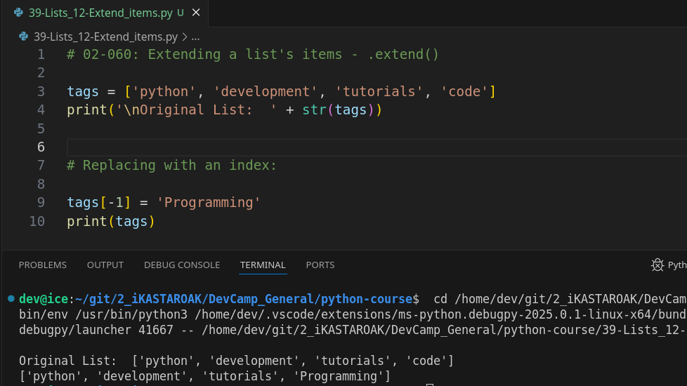
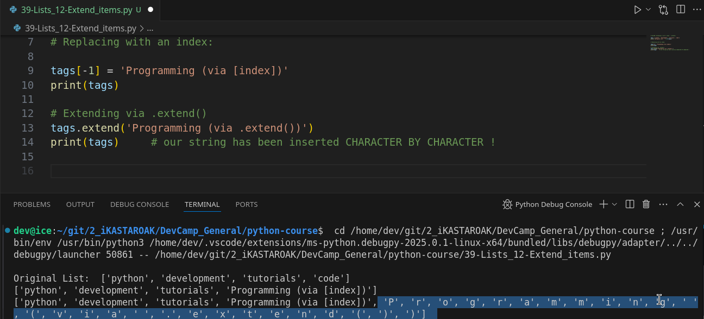
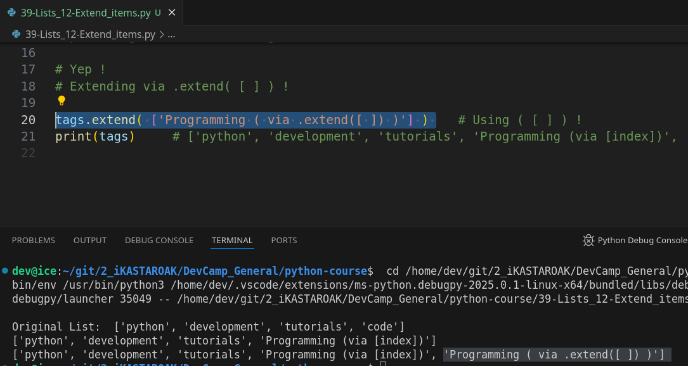

# MODULE 02 - 060: Python - Extending a list - `.extend()'`


****

## Video lesson Speech

In this lesson on Python lists, we're going to see how we can add on to a
 preexisting list and add additional elements to the end of that list. 
Now there are a number of ways to do this and we're going to walk 
through some different variations. The first few we're going to look at 
are going to make the changes in place. So these are going to be similar
 to when we use the sort function and we rearrange the items inside of 
the preexisting lists.  

****

I'm going to show how we can make changes to that old list but, then, I'm also going to show you how you can simply copy the list and then add onto it and store it in a new variable.  

 This is going to be a task that you're going to be doing pretty regularly.   


Many algorithms when you are iterating over a list make you go and add new elements to the end as you're looping through it.  

 And so this is going to be a very important skill to learn and also to understand some of the key differences between doing it place versus creating a new list with a copy.

So, **the very first thing I want to show you and I'm going to add little comments that say either `YEP` or `NOPE` because I'm going to show you the right way of doing things and then the wrong way.**

And the main reason for that is because **even though you may think that you have a 
solution that's working,  it may not catch all of the edge cases or you may be missing a very important criteria**.

And so I want to show you a good variation so you can see the right way to do something versus the wrong way.   

Now, if you think that going back to our concept of slices and range as if you think that we could perform something like this where I get say `tags` and then `[ -1 ]`  
because, remember this is going to go to the very end of the list,  and say that I want to add programming to the end of the list. .... 

... Well, let's see whatthis does print out tags and you'll see that this seems like it worked.   


And this is where **it would get tricky** and a real application.   

You may think that you're adding onto the list but if you go and look at our initial tags you may notice that all we did was **we performed an override** on that last element.   

**It didn't add into it, it simply replaced 'code' with 'programming'.**



So it's a very important thing to keep in mind, I'm going to comment that out.

****

## .extend() - First approach to add an item into a list

Let's talk about how we can actually add on to the list.   

I'm going to say `tags.extend `, so this is a function that we can call on a list and **there are two ways that you can call this function** ( and it's not to say that one is the right way to do it and one is the wrong way ) and **both will work**.   

But, depending on your goals you're going to have to understand the difference.   

So, if I say extend and I pass in let's just copy `Programming` from right here, let's see exactly what is going to happen.  

 I run this and it worked it didn't give us an error but look at what it did.



What extend does is it actually spreads out each one of the elements that are given to it.   

 **In this case, it took each one of these string  elements and treated it like its own character.**

What we ended up with was code followed by a string of the letter `P` followed by `r`, `o`, etcetera.  

 Now, this may be what you want to do however it rarely is for me.  

**Typically what I want to do is simply add an entirely new element** and so the way that we can do that is by wrapping the string in the list syntax.

So, if I wrap this as a list extend is going to treat this as a single  element.   

Now if I run this you can see we have `Python`,  `development`, `tutorials`, `code` and then `programming`.



And, typically whenever you're wanting to add onto a list this option on line starting with `tags.extend( [ ] )` is going to be one of the most common processes that you're going to be working with.   

Simply make sure that you remember to wrap it in its own element.   

It doesn't have to be a list if you want to.  

 Once you start learning about dictionaries and tuples and those kinds of 
elements that all can be added onto a list you can add any of them.   

But, in this case, I want to simply add its own one single element.   

And so that is a very important key to know. So that's one way.

****


And as you notice we're not saving this into a new item. So if I go 
and do something such as new_tags copy this and print it out. I want you
 to think about what is going to happen here and the hint I will give 
you is if you remember back to the process on what the sort function 
returned extend has the exact same behavior. So if I run this it's 
actually going to say none. And the reason for that is the extend 
changes tags in place. It does not return a new value. So if we try to 
store this inside of a new variable like this it simply is not going to 
work it functions very similar to how the sort function works in that 
case.

So how can we change that behavior? How can we if we want to store 
all of these items we want to take our first array or first list of tags
 and then add a new one to the end. How can we do that?

Well, we're not going to actually use the extend function extend is 
what you use when you want to add to a preexisting list. But what we're 
going to do is add and create a new one. So here I'm going to say 
new_tags set this equal to tag's and then add our new elements so here 
we have programming and we do have to wrap it inside of a list syntax 
just like this.

And now if I run this you can see we now have our new list and it has
 the combined elements of Python development tutorials in code and then 
it added to the end programming.


Now once again a very important thing to understand is how python 
works with combining data types. If you're coming from other languages 
that might be a little bit more simple on the syntax or is less 
forgiving on the syntax perspective you may think you'd be able to do 
this where you could simply tack on this element into tags but this is 
going to give you an error because you can't combine a string with a 
list.


So you simply have to wrap that inside of that list square bracket 
syntax and then you can add it onto tags just like we did. And now that 
works.


And just to see why you would do that. Typically whenever you're 
following this kind of process it's because you do not want to change 
the original values so you want to keep this list intact. So if anyone 
else wants to use it and they don't want to have the new elements that 
you're adding then this is the process you can use. Because now if I run
 this you can see right here that we have two different printouts we 
have the first one of the new_tags. This contains five elements and the 
second one is our preexisting tag list right here which still has 4.


So the second way is not in place and it allows you to tack on 
different elements and you could put as many as you want in here and it 
is not going to alter this first one. And from a best practice 
perspective usually, you're going to want to go with the second 
approach. However, if you do have a process and you do have some links 
to that nothing else in the program relies on and you can alter however 
you need then extend can be a great function to work with.

****

## Code

```python
tags = ['python', 'development', 'tutorials', 'code']

# Nope

tags[-1] = 'Programming'

# In Place

tags.extend('Programming')
tags.extend(['Programming'])

# New List

new_tags = tags + ['Programming']
print(new_tags)
print(tags)
```
